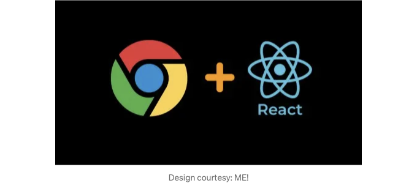
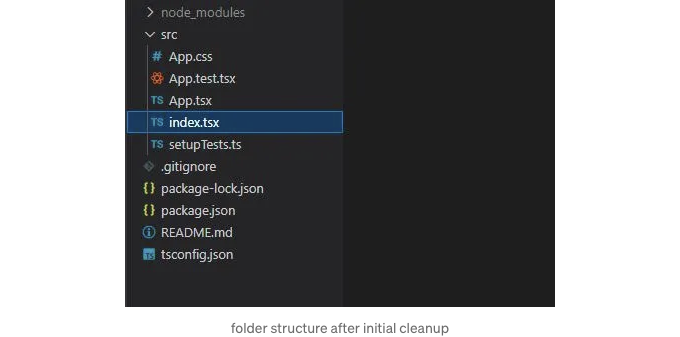
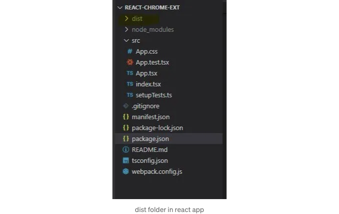
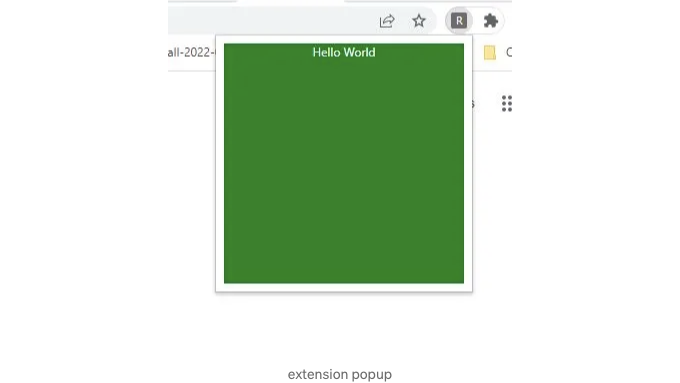

```markdown


크롬 익스텐션을 TypeScript를 사용하여 빌드하고 Webpack으로 번들링된 React 앱으로 만드는 것은 현대적인 브라우저 익스텐션을 만드는 좋은 방법입니다. 이 블로그에서는 npx create-react-app 템플릿을 사용하여 TypeScript로 크롬 익스텐션을 만드는 과정을 안내하고 Webpack을 사용하여 앱을 번들링하는 방법을 설명하겠습니다. 또한 Manifest V3의 최신 버전을 사용할 것입니다.

GitHub 저장소

다소 조급한 기분인가요? 바로 GitHub 저장소로 이동하세요. 도움이 되었다면 꼭 별표를 남겨 주세요.
```

<!-- ui-log 수평형 -->
<ins class="adsbygoogle"
  style="display:block"
  data-ad-client="ca-pub-4877378276818686"
  data-ad-slot="9743150776"
  data-ad-format="auto"
  data-full-width-responsive="true"></ins>
<component is="script">
(adsbygoogle = window.adsbygoogle || []).push({});
</component>

- https://github.com/Harshita-mindfire/react-chrome-extension

준비물

개발 프로세스에 착수하기 전에 React 및 해당 핵심 개념에 대한 기본적인 이해가 필요합니다. 또한 JavaScript와 HTML에 대한 기본적인 이해도 필요합니다.

게다가, 다음 도구가 필요합니다:

<!-- ui-log 수평형 -->
<ins class="adsbygoogle"
  style="display:block"
  data-ad-client="ca-pub-4877378276818686"
  data-ad-slot="9743150776"
  data-ad-format="auto"
  data-full-width-responsive="true"></ins>
<component is="script">
(adsbygoogle = window.adsbygoogle || []).push({});
</component>

- 구글 크롬
- Visual Studio Code 또는 다른 코드 편집기
- Node.js 및 npm (Node Package Manager)

# 단계 1: React 앱 만들기

시작하려면 새로운 TypeScript React 프로젝트를 생성해야 합니다. 터미널이나 명령 프롬프트를 열고 다음 명령을 실행합니다. 이렇게 하면 필요한 모든 종속 항목이 있는 새로운 React 프로젝트가 만들어집니다. 새로 생성된 프로젝트 폴더로 이동합니다:

```js
npx create-react-app react-chrome-ext --template typescript
cd react-chrome-ext
```

<!-- ui-log 수평형 -->
<ins class="adsbygoogle"
  style="display:block"
  data-ad-client="ca-pub-4877378276818686"
  data-ad-slot="9743150776"
  data-ad-format="auto"
  data-full-width-responsive="true"></ins>
<component is="script">
(adsbygoogle = window.adsbygoogle || []).push({});
</component>

지금 필요하지 않은 파일을 삭제해 봅시다. 삭제 후에 폴더 구조가 이렇게 되도록 해보세요:



App.tsx를 간단한 Hello World 컴포넌트로 업데이트해 봅시다.

```js
function App() {
  return (
    <div className="App">
      Hello World
    </div>
  );
}

export default App;
```

<!-- ui-log 수평형 -->
<ins class="adsbygoogle"
  style="display:block"
  data-ad-client="ca-pub-4877378276818686"
  data-ad-slot="9743150776"
  data-ad-format="auto"
  data-full-width-responsive="true"></ins>
<component is="script">
(adsbygoogle = window.adsbygoogle || []).push({});
</component>

이제 index.tsx를 수정하여 DOM에서 루트 요소를 생성하고 앱을 추가해봅시다.

```js
import React from 'react';
import ReactDOM from 'react-dom/client';
import App from './App';

const root = document.createElement("div")
root.className = "container"
document.body.appendChild(root)
const rootDiv = ReactDOM.createRoot(root);
rootDiv.render(
  <React.StrictMode>
    <App />
  </React.StrictMode>
);
```

그리고 App.css에 매우 간단한 CSS를 추가해봅시다:

```js
.App {
    color: white;
    text-align: center;
}

.container {
    width: 15rem;
    height: 15rem;
    background-color: green;

}
```

<!-- ui-log 수평형 -->
<ins class="adsbygoogle"
  style="display:block"
  data-ad-client="ca-pub-4877378276818686"
  data-ad-slot="9743150776"
  data-ad-format="auto"
  data-full-width-responsive="true"></ins>
<component is="script">
(adsbygoogle = window.adsbygoogle || []).push({});
</component>

# 단계 2: 웹팩 추가

다음으로, React 앱을 번들링하기 위해 필요한 종속성을 설치해야 합니다. 터미널에서 다음 명령어를 실행하세요:

```js
npm install --save-dev webpack webpack-cli copy-webpack-plugin css-loader ts-loader html-webpack-plugin ts-node
```

웹팩 구성 업데이트

<!-- ui-log 수평형 -->
<ins class="adsbygoogle"
  style="display:block"
  data-ad-client="ca-pub-4877378276818686"
  data-ad-slot="9743150776"
  data-ad-format="auto"
  data-full-width-responsive="true"></ins>
<component is="script">
(adsbygoogle = window.adsbygoogle || []).push({});
</component>

기본적으로 create-react-app 템플릿은 Webpack 구성 파일을 제공하지 않기 때문에 직접 만들어야 합니다. 프로젝트의 루트 디렉토리에 webpack.config.js라는 새 파일을 생성하고 다음 코드를 추가해주세요:

```js
const path = require("path");
const HTMLPlugin = require("html-webpack-plugin");
const CopyPlugin = require("copy-webpack-plugin")

module.exports = {
    entry: {
        index: "./src/index.tsx"
    },
    mode: "production",
    module: {
        rules: [
            {
              test: /\.tsx?$/,
               use: [
                 {
                  loader: "ts-loader",
                   options: {
                     compilerOptions: { noEmit: false },
                    }
                  }],
               exclude: /node_modules/,
            },
            {
              exclude: /node_modules/,
              test: /\.css$/i,
               use: [
                  "style-loader",
                  "css-loader"
               ]
            },
        ],
    },
    plugins: [
        new CopyPlugin({
            patterns: [
                { from: "manifest.json", to: "../manifest.json" },
            ],
        }),
        ...getHtmlPlugins(["index"]),
    ],
    resolve: {
        extensions: [".tsx", ".ts", ".js"],
    },
    output: {
        path: path.join(__dirname, "dist/js"),
        filename: "[name].js",
    },
};

function getHtmlPlugins(chunks) {
    return chunks.map(
        (chunk) =>
            new HTMLPlugin({
                title: "React extension",
                filename: `${chunk}.html`,
                chunks: [chunk],
            })
    );
}
```

이 구성 파일은 앱의 진입점(즉, index.tsx 파일), 출력 파일 이름, TypeScript로더, 스타일 로더 및 출력 디렉토리를 정의합니다.
이제 webpack을 구성했으니, package.json 파일을 업데이트하여 다음 스크립트를 추가해주세요:

```js
  "scripts": {
    "build": "webpack --config webpack.config.js",
    "watch": "webpack -w --config webpack.config.js"
  }
```

<!-- ui-log 수평형 -->
<ins class="adsbygoogle"
  style="display:block"
  data-ad-client="ca-pub-4877378276818686"
  data-ad-slot="9743150776"
  data-ad-format="auto"
  data-full-width-responsive="true"></ins>
<component is="script">
(adsbygoogle = window.adsbygoogle || []).push({});
</component>

이 스크립트를 사용하면 npm run build 명령어를 사용하여 확장 프로그램을 빌드하거나 npm run watch 명령어를 사용하여 웹팩을 감시 모드로 실행할 수 있습니다.

# 단계 3: Manifest 파일 추가하기

Manifest 파일은 Chrome 확장 프로그램의 메타데이터와 권한을 정의하는 데 사용됩니다. 프로젝트의 루트 디렉토리에 manifest.json이라는 새 파일을 만들고 다음 코드를 추가하세요:

```js
{
    "version": "1.0.0",
    "manifest_version": 3,
    "name": "React Chrome Extension",
    "description": "React와 TypeScript로 만든 Chrome 확장 프로그램입니다.",
    "action": {
        "default_popup": "js/index.html",
        "default_title": "React Chrome Extension"
    }
}
```

<!-- ui-log 수평형 -->
<ins class="adsbygoogle"
  style="display:block"
  data-ad-client="ca-pub-4877378276818686"
  data-ad-slot="9743150776"
  data-ad-format="auto"
  data-full-width-responsive="true"></ins>
<component is="script">
(adsbygoogle = window.adsbygoogle || []).push({});
</component>

이 매니페스트 파일은 확장 프로그램의 이름, 버전, 설명을 지정합니다. 또한 팝업 창을 정의합니다.

# 단계 4: 앱 빌드하기

마지막으로 터미널에서 `npm run build` 명령을 실행하여 확장 프로그램을 빌드하세요. 스크립트가 완료되면 새로운 `/dist` 폴더가 앱의 루트에 생성됩니다:



<!-- ui-log 수평형 -->
<ins class="adsbygoogle"
  style="display:block"
  data-ad-client="ca-pub-4877378276818686"
  data-ad-slot="9743150776"
  data-ad-format="auto"
  data-full-width-responsive="true"></ins>
<component is="script">
(adsbygoogle = window.adsbygoogle || []).push({});
</component>

# 단계 5: 확장 프로그램 로드

- Chrome에서 확장 프로그램을 로드하려면 Chrome을 열고 주소 표시줄에 chrome://extensions를 입력하여 확장 프로그램 페이지로 이동하십시오. 그런 다음 "압축 해제된 확장 프로그램을 로드" 버튼을 클릭하고 프로젝트의 dist 디렉토리를 선택하십시오.
- 확장 프로그램을 테스트하려면 확장 프로그램 페이지를 다시로드하고 확장 프로그램 아이콘을 클릭하십시오.



# 결론

<!-- ui-log 수평형 -->
<ins class="adsbygoogle"
  style="display:block"
  data-ad-client="ca-pub-4877378276818686"
  data-ad-slot="9743150776"
  data-ad-format="auto"
  data-full-width-responsive="true"></ins>
<component is="script">
(adsbygoogle = window.adsbygoogle || []).push({});
</component>

그게 다야! TypeScript와 Webpack을 사용하여 간단한 "Hello World" 크롬 확장 프로그램을 만들었어요. 여기서부터는 크롬 확장 프로그램 API를 탐험하고 더 복잡한 확장 프로그램을 만들어 볼 수 있어요. 제 블로그가 React로 크롬 확장 프로그램을 만들기를 시작하는 데 도움이 되었으면 좋겠어요.