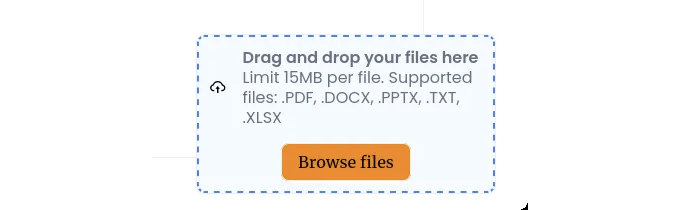

현재의 디지털 세계에서 파일과 이미지를 업로드하는 것은 모든 애플리케이션의 중요한 기능입니다.

사진 공유 앱, 문서 관리 시스템 또는 동적 생성 콘텐츠가 포함된 모든 애플리케이션을 구축 중이신 경우, 원활하고 사용자 친화적인 파일 업로드 메커니즘이 필수적입니다. 드래그 앤 드롭 기능을 통해 사용자는 파일 탐색기에서 파일을 드래그하여 지정된 영역으로 끌어다 놓음으로써 손쉽게 파일을 앱에 추가할 수 있습니다.

이 글에서는 웹 앱에 드래그 앤 드롭 컴포넌트를 구현하는 방법을 배웁니다. 또한 사용자가 파일을 놓는 것을 다른 컴포넌트에 props를 사용하여 전달하는 방법도 배우게 됩니다 (자식에서 부모로).

<!-- ui-log 수평형 -->
<ins class="adsbygoogle"
  style="display:block"
  data-ad-client="ca-pub-4877378276818686"
  data-ad-slot="9743150776"
  data-ad-format="auto"
  data-full-width-responsive="true"></ins>
<component is="script">
(adsbygoogle = window.adsbygoogle || []).push({});
</component>

# 목차

- 준비물
- 드래그 앤 드롭(Drag-and-drop)이란 무엇인가
- ReactJS에서 드래그 앤 드롭이 어떻게 작동하는가
- ReactJS에서 드래그 앤 드롭 컴포넌트 만들기
- 결론

# 준비물

React JSX에 대한 지식
useState와 같은 React hooks에 대한 지식
어떻게 props이 전달되는지에 대한 이해
코딩 환경!
이미 실행 중인 ReactJS 프로젝트!

<!-- ui-log 수평형 -->
<ins class="adsbygoogle"
  style="display:block"
  data-ad-client="ca-pub-4877378276818686"
  data-ad-slot="9743150776"
  data-ad-format="auto"
  data-full-width-responsive="true"></ins>
<component is="script">
(adsbygoogle = window.adsbygoogle || []).push({});
</component>

# 드래그 앤 드롭이란 무엇인가요?

드래그 앤 드롭은 현대 시스템에서 제공되는 편리한 기능입니다. 이 기능을 통해 사용자는 쉽게 파일, 텍스트 또는 이미지를 한 창에서 다른 창으로 이동할 수 있습니다. 이 기능은 많은 시스템에서 기본적으로 제공되지만 웹 애플리케이션에서도 큰 성공을 거뒀습니다.

# React에서 드래그 앤 드롭은 어떻게 작동하나요?

드래그 앤 드롭은 사용자가 마우스 커서로 아이템을 클릭하고, 들고, 그리고 이동시킨 다음 원하는 위치에 놓아놓는 것으로 데이터나 객체를 한 위치에서 다른 위치로 이동시킬 수 있는 사용자 인터페이스 상호작용입니다. 이 상호작용은 주로 목록 항목을 재배열하거나 파일을 폴더 사이에서 이동하는 등의 작업에 사용됩니다. 여기에 보통 드래그 앤 드롭이 작동하는 방식이 있습니다:

<!-- ui-log 수평형 -->
<ins class="adsbygoogle"
  style="display:block"
  data-ad-client="ca-pub-4877378276818686"
  data-ad-slot="9743150776"
  data-ad-format="auto"
  data-full-width-responsive="true"></ins>
<component is="script">
(adsbygoogle = window.adsbygoogle || []).push({});
</component>

- 시작: 드래그 앤 드롭 상호작용은 사용자가 웹 응용 프로그램의 파일, 이미지 또는 요소와 같은 드래그 가능한 항목을 클릭하고 마우스 버튼을 클릭하여 들고 있을 때 시작됩니다. 이 단계에서 드래그하는 항목을 '드래그 소스'라고합니다.
- 드래깅: 사용자가 마우스 버튼을 누른 채로 커서를 이동하면 드래그 된 항목이 커서의 움직임을 따라 이동합니다. 이렇게하면 화면을 통해 항목이 이동되는 시각적 효과가 생성됩니다.
- 드롭 타겟: 드래그 앤 드롭 작업을 완료하려면 사용자가 유효한 '드롭 타겟' 위로 커서를 이동합니다. 드롭 타겟은 일반적으로 드롭된 항목을 수락할 수있는 영역 또는 요소입니다. 예를 들어 파일 브라우저의 폴더이거나 웹 응용 프로그램에서 항목을 배치해야하는 특정 위치가 될 수 있습니다.
- 피드백: 커서가 드롭 타겟 위에 위치할 때, 드롭 타겟은 종종 드래그된 항목을 수락할 수 있다는 것을 나타내는 시각적 피드백을 제공합니다. 이 피드백에는 강조 표시, 애니메이션 또는 기타 시각적 신호가 포함될 수 있습니다.
- 릴리스: 항목을 드롭하려면 사용자가 마우스 버튼을 놓습니다. 이 시점에서 시스템 또는 애플리케이션이 드롭 이벤트를 감지하고 처리합니다.
- 드롭 처리: 시스템 또는 애플리케이션이 드롭 이벤트에 응답합니다. 일반적으로 이는 항목을 새 위치로 이동하거나 복사하는 것(파일 관리의 경우)이나 특정 작업(웹 응용 프로그램의 경우)을 트리거하는 것을 포함합니다.

# ReactJS에서 드래그 앤 드롭 컴포넌트 생성

DragNDrop 컴포넌트와 해당 CSS 파일을 생성하려면 프로젝트 폴더로 이동하여 DragNDrop.jsx와 drag-drop.css라는 두 개의 새 파일을 만듭니다. 이 문서는 이미 ReactJS 프로젝트가 설정되어 있다고 가정하므로 새 프로젝트를 만드는 방법에 대해 다루지 않겠습니다.

아래 CSS 코드를 복사하여 새로 만든 CSS 파일에 붙여넣으세요.

<!-- ui-log 수평형 -->
<ins class="adsbygoogle"
  style="display:block"
  data-ad-client="ca-pub-4877378276818686"
  data-ad-slot="9743150776"
  data-ad-format="auto"
  data-full-width-responsive="true"></ins>
<component is="script">
(adsbygoogle = window.adsbygoogle || []).push({});
</component>

```js
.drag-drop {
  background: #fff;
  border: 1px solid var(--border-color);
  border-radius: 8px;
}
.document-uploader {
  border: 2px dashed #4282fe;
  background-color: #f4fbff;
  padding: 10px;
  display: flex;
  flex-direction: column;
  align-items: center;
  justify-content: center;
  position: relative;
  border-radius: 8px;
  cursor: pointer;

  &.active {
    border-color: #6dc24b;
  }

  .upload-info {
    display: flex;
    align-items: center;
    margin-bottom: 1rem;

    svg {
      font-size: 36px;
      margin-right: 1rem;
    }

    div {
      p {
        margin: 0;
        font-size: 16px;
      }

      p:first-child {
        font-weight: bold;
      }
    }
  }

  .file-list {
    display: flex;
    flex-direction: column;
    gap: 0.5rem;
    width: 100%;
    height: 30vh;
    &__container {
      width: 100%;
      height: 100%;
      overflow: auto;
    }
  }

  .file-item {
    display: flex;
    justify-content: space-between;
    align-items: center;
    padding: 0.5rem;
    border: 1px solid var(--border-color);
    border-radius: 8px;

    .file-info {
      display: flex;
      flex-direction: column;
      gap: 0.25rem;
      flex: 1;

      p {
        margin: 0;
        font-size: 14px;
        color: #333;
      }
    }

    .file-actions {
      cursor: pointer;

      svg {
        font-size: 18px;
        color: #888;
      }

      &:hover {
        svg {
          color: #d44;
        }
      }
    }
  }

  .browse-btn {
    display: flex;
    align-items: center;
    justify-content: center;
    padding: 0.5rem 1rem;
    border: 1px solid var(--border-color);
    border-radius: 8px;
    cursor: pointer;
    background-color: var(--primary-color);
    &:hover {
      background-color: transparent;
    }
  }

  .success-file {
    display: flex;
    align-items: center;
    color: #6dc24b;

    p {
      margin: 0;
      font-size: 14px;
      font-weight: bold;
    }
  }

  input[type="file"] {
    display: none;
  }
}
```

애플리케이션 스킨에 맞게 스타일을 사용자 정의해야 합니다.

그런 다음, jsx 파일을 열고 아래 코드를 붙여 넣으세요.

```js
import React, { useEffect, useState } from "react";
import { AiOutlineCheckCircle, AiOutlineCloudUpload } from "react-icons/ai";
import { MdClear } from "react-icons/md";
import "./drag-drop.css";
```

<!-- ui-log 수평형 -->
<ins class="adsbygoogle"
  style="display:block"
  data-ad-client="ca-pub-4877378276818686"
  data-ad-slot="9743150776"
  data-ad-format="auto"
  data-full-width-responsive="true"></ins>
<component is="script">
(adsbygoogle = window.adsbygoogle || []).push({});
</component>

위의 코드 스니펫에서는 리액트 훅, 아이콘 및 스타일시트와 같은 모든 필요한 파일을 가져와서 시작합니다.

```js
const DragNdrop = ({
  onFilesSelected,
  width,
  height,
}) => {
  const [files, setFiles] = useState([]);

const handleDrop = (event) => {
    event.preventDefault();
    const droppedFiles = event.dataTransfer.files;
    if (droppedFiles.length > 0) {
      const newFiles = Array.from(droppedFiles);
      setFiles((prevFiles) => [...prevFiles, ...newFiles]);
    }
  };
```

이 컴포넌트의 다양성을 향상시키기 위해 파일을 이 컴포넌트에서 다른 필요한 컴포넌트로 전달할 수 있습니다. 또한 사용자는이 컴포넌트의 크기를 사용자 정의할 수 있습니다. 이를 위해 사용자가 드롭한 파일을 저장하는 단일 useState 훅을 생성해야합니다.

이러한 드롭된 파일을 캡처하려면 handleDrop이라는 이름의 함수를 만듭니다. 이 함수는 드롭된 파일을 캡처하고 저장합니다. 전통적인 폼 요소는 폼 변경 시 페이지를 새로 고침하므로 이를 피하기 위해 이벤트 매개변수에 prevent 메서드를 호출합니다. 파일이 드롭되면 event.dataTransfer.files 메서드를 사용하여 해당 파일에 액세스 할 수 있습니다. 이 수신되는 객체를 array.from ()을 사용하여 배열로 변환합니다. 마지막으로이 새 파일 배열로 상태를 업데이트합니다.

<!-- ui-log 수평형 -->
<ins class="adsbygoogle"
  style="display:block"
  data-ad-client="ca-pub-4877378276818686"
  data-ad-slot="9743150776"
  data-ad-format="auto"
  data-full-width-responsive="true"></ins>
<component is="script">
(adsbygoogle = window.adsbygoogle || []).push({});
</component>

위의 코드 스니펫은 두 개의 함수를 선언합니다. 첫 번째 함수는 파일 목록에서 주어진 파일을 제거하고, 두 번째 함수는 파일 변경이 있는 경우 새 파일로 프롭을 업데이트합니다.

```js
  return (
    <section className="drag-drop" style={ width: width, height: height }>
      <div
        className={`document-uploader ${
          files.length > 0 ? "upload-box active" : "upload-box"
        }`}
        onDrop={handleDrop}
        onDragOver={(event) => event.preventDefault()}
      >
        <>
          <div className="upload-info">
            <AiOutlineCloudUpload />
            <div>
              <p>여기에 파일을 끌어다 놓거나 여기를 클릭하세요</p>
              <p>
               지원되는 파일 형식: .JPG, .PNG, .JPEEG, .PDF, .DOCX, .PPTX, .TXT,
                .XLSX
              </p>
            </div>
          </div>

        {files.length > 0 && (
          <div className="file-list">
            <div className="file-list__container">
              {files.map((file, index) => (
                <div className="file-item" key={index}>
                  <div className="file-info">
                    <p>{file.name}</p>
                    {/* <p>{file.type}</p> */}
                  </div>
                  <div className="file-actions">
                    <MdClear onClick={() => handleRemoveFile(index)} />
                  </div>
                </div>
              ))}
            </div>
          </div>
        )}
      </div>
    </section>
  );
};

export default DragNdrop;
```

위의 함수들을 사용하려면 각 HTML div 요소에 onDrop, onDrag 등의 속성이 있습니다. 이러한 속성들은 마우스 포인터에서의 드래깅 이벤트를 감지합니다. 우리는 HTML의 onDrop 속성에 handleDrop 함수를 전달하여 드롭된 파일을 캐치합니다.

<!-- ui-log 수평형 -->
<ins class="adsbygoogle"
  style="display:block"
  data-ad-client="ca-pub-4877378276818686"
  data-ad-slot="9743150776"
  data-ad-format="auto"
  data-full-width-responsive="true"></ins>
<component is="script">
(adsbygoogle = window.adsbygoogle || []).push({});
</component>

위의 함수들을 사용하면 드래그 앤 드롭 컴포넌트가 준비됐어요. 하지만, 더 있어요! 사용자에게 파일을 드래그 앤 드롭할 수 있는 기능은 선택 사항이에요. 언제든지 파일을 수동으로 선택할 수 있는 버튼이 있어요. 그렇다면, 코드를 업데이트해야 해요;

```js
  const handleFileChange = (event) => {
    const selectedFiles = event.target.files;
    if (selectedFiles && selectedFiles.length > 0) {
      const newFiles = Array.from(selectedFiles);
      setFiles((prevFiles) => [...prevFiles, ...newFiles]);
    }
  };
```

이 코드 스니펫에서 우리는 HTML 입력 요소에 파일을 다루는 함수를 선언하고 있어요. 우리의 handleDrop 함수와 비슷하게, target.files에서의 변화를 감지하고 있어요. 선택한 새 파일로 상태를 업데이트하고 있어요. 마지막으로 JSX 입력 요소를 반환하고, handleFileChange 함수를 연결하고 있어요.

```js
 return (
    <section className="drag-drop" style={ width: width, height: height }>

      // 다른 JSX

          <input
            type="file"
            hidden
            id="browse"
            onChange={handleFileChange}
            accept=".png, .jpg, .jpeg .pdf,.docx,.pptx,.txt,.xlsx"
            multiple
          />
          <label htmlFor="browse" className="browse-btn">
            Browse files
          </label>
        </>

    // 다른 JSX
      </div>
    </section>
  );
```

<!-- ui-log 수평형 -->
<ins class="adsbygoogle"
  style="display:block"
  data-ad-client="ca-pub-4877378276818686"
  data-ad-slot="9743150776"
  data-ad-format="auto"
  data-full-width-responsive="true"></ins>
<component is="script">
(adsbygoogle = window.adsbygoogle || []).push({});
</component>

아래에 전체 컴포넌트 코드가 있어요

```js
import React, { useEffect, useState } from "react";
import { AiOutlineCheckCircle, AiOutlineCloudUpload } from "react-icons/ai";
import { MdClear } from "react-icons/md";
import "./drag-drop.css";

const DragNdrop = ({
  onFilesSelected,
  width,
  height,
}) => {
  const [files, setFiles] = useState<File[]>([]);

  const handleFileChange = (event) => {
    const selectedFiles = event.target.files;
    if (selectedFiles && selectedFiles.length > 0) {
      const newFiles = Array.from(selectedFiles);
      setFiles((prevFiles) => [...prevFiles, ...newFiles]);
    }
  };
  const handleDrop = (event) => {
    event.preventDefault();
    const droppedFiles = event.dataTransfer.files;
    if (droppedFiles.length > 0) {
      const newFiles = Array.from(droppedFiles);
      setFiles((prevFiles) => [...prevFiles, ...newFiles]);
    }
  };

  const handleRemoveFile = (index: number) => {
    setFiles((prevFiles) => prevFiles.filter((_, i) => i !== index));
  };

  useEffect(() => {
    onFilesSelected(files);
  }, [files, onFilesSelected]);

  return (
    <section className="drag-drop" style={width: width, height: height}>
      <div
        className={`document-uploader ${
          files.length > 0 ? "upload-box active" : "upload-box"
        }`}
        onDrop={handleDrop}
        onDragOver={(event) => event.preventDefault()}
      >
        <>
          <div className="upload-info">
            <AiOutlineCloudUpload />
            <div>
              <p>Drag and drop your files here</p>
              <p>
                Limit 15MB per file. Supported files: .PDF, .DOCX, .PPTX, .TXT,
                .XLSX
              </p>
            </div>
          </div>
          <input
            type="file"
            hidden
            id="browse"
            onChange={handleFileChange}
            accept=".pdf,.docx,.pptx,.txt,.xlsx"
            multiple
          />
          <label htmlFor="browse" className="browse-btn">
            Browse files
          </label>
        </>

        {files.length > 0 && (
          <div className="file-list">
            <div className="file-list__container">
              {files.map((file, index) => (
                <div className="file-item" key={index}>
                  <div className="file-info">
                    <p>{file.name}</p>
                    {/* <p>{file.type}</p> */}
                  </div>
                  <div className="file-actions">
                    <MdClear onClick={() => handleRemoveFile(index)} />
                  </div>
                </div>
              ))}
            </div>
          </div>
        )}

        {files.length > 0 && (
          <div className="success-file">
            <AiOutlineCheckCircle
              style={color: "#6DC24B", marginRight: 1}
            />
            <p>{files.length} file(s) selected</p>
          </div>
        )}
      </div>
    </section>
  );
};

export default DragNdrop;
```

# 다른 컴포넌트에서 드래그 앤 드롭 컴포넌트 사용하기

React의 아름다움은 컴포넌트 재사용과 모듈성을 가능하게 한다는 점이에요. 이것은 코드베이스를 깨끗하게 유지하고 중복을 피하는 데 도움이 됩니다.

<!-- ui-log 수평형 -->
<ins class="adsbygoogle"
  style="display:block"
  data-ad-client="ca-pub-4877378276818686"
  data-ad-slot="9743150776"
  data-ad-format="auto"
  data-full-width-responsive="true"></ins>
<component is="script">
(adsbygoogle = window.adsbygoogle || []).push({});
</component>

```js
import DragNdrop from "@/components/DragNdrop";

function App () {
const [files, setFiles] = useState([]);
return (
    <div className='section'>
    // other jsx
     <DragNdrop onFilesSelected={setFiles} width="300px" height='400px'/>
    // other jsx
    </div>
  )
}

export default App;
```

만약 위의 코드 조각을 올바르게 따르셨면 아래 결과가 유사할 것입니다!



# 결론

<!-- ui-log 수평형 -->
<ins class="adsbygoogle"
  style="display:block"
  data-ad-client="ca-pub-4877378276818686"
  data-ad-slot="9743150776"
  data-ad-format="auto"
  data-full-width-responsive="true"></ins>
<component is="script">
(adsbygoogle = window.adsbygoogle || []).push({});
</component>

결론적으로, 드래그 앤 드롭 기능을 통해 웹 애플리케이션에서 파일을 쉽게 업로드할 수 있으며, 이를 통해 사용자들은 목표를 더 빨리 달성할 수 있고 사용자 경험에 좋은 인상을 줄 수 있습니다. 게다가, 이는 더 직관적이고 사용자 친화적인 인터페이스를 제공하여 사용자 경험을 향상시킵니다.

자, 여기까지입니다! 피드백은 댓글 섹션에 남겨주세요!