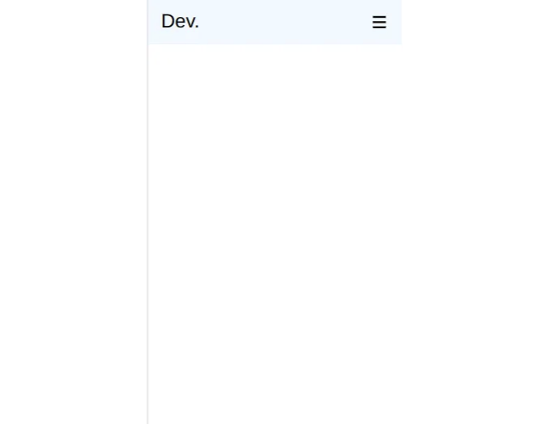
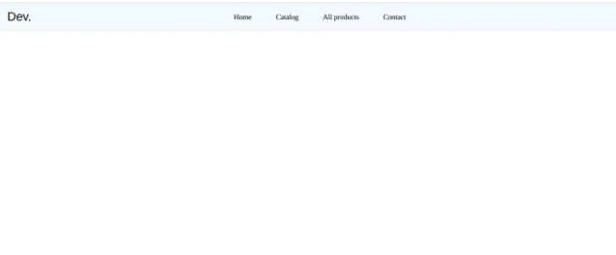
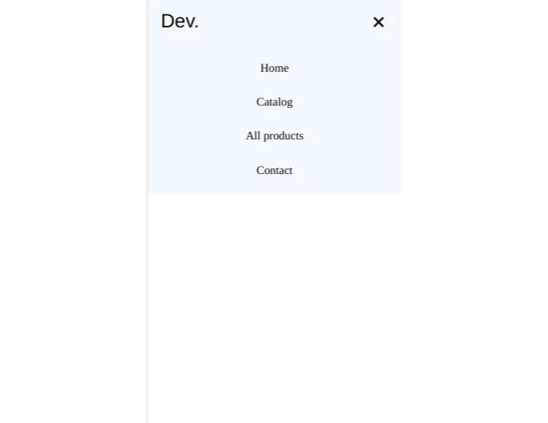

React 애플리케이션에 반응형 네비바를 추가하려고 하는가요? 그렇다면, 당신은 올바른 곳에 계셔요! 이 블로그에서는 제공된 코드를 사용하여 React에서 반응형 네비바를 구축하는 과정을 안내해 드리겠습니다.

시작하기 전에, 이것이 제 첫 블로그이기 때문에, 이와 같은 블로그를 더 보고 싶다면 댓글로 알려 주시기 바랍니다.

그럼, 바로 시작해 볼까요!

<!-- ui-log 수평형 -->
<ins class="adsbygoogle"
  style="display:block"
  data-ad-client="ca-pub-4877378276818686"
  data-ad-slot="9743150776"
  data-ad-format="auto"
  data-full-width-responsive="true"></ins>
<component is="script">
(adsbygoogle = window.adsbygoogle || []).push({});
</component>

스텝 1: React 애플리케이션 설정하기

먼저, 아직 React 애플리케이션을 설정하지 않았다면 설정해야 합니다. create-react-app이나 익숙한 다른 유사한 도구를 사용하여 설정할 수 있습니다.

스텝 2: 네비게이션 바 컴포넌트 생성하기

React에서는 애플리케이션 전반에 걸쳐 사용할 수 있는 재사용 가능한 컴포넌트를 만들 수 있습니다. 네비게이션 바 컴포넌트를 만들기 위해 "src" 디렉토리에 "Navbar.jsx"라는 새 파일을 생성하세요.

<!-- ui-log 수평형 -->
<ins class="adsbygoogle"
  style="display:block"
  data-ad-client="ca-pub-4877378276818686"
  data-ad-slot="9743150776"
  data-ad-format="auto"
  data-full-width-responsive="true"></ins>
<component is="script">
(adsbygoogle = window.adsbygoogle || []).push({});
</component>

다음으로 Navbar.jsx 파일에 다음 코드를 추가하겠습니다:

```js
import { useState } from 'react'
import styles from './Navbar.module.css';
```

```js
function Navbar() {
  // 상태 추가
  const [isActive, setIsActive] = useState(false);
  // active 클래스 추가
  const toggleActiveClass = () => {
    setIsActive(!isActive);
  };
  // active 클래스를 제거하는 정리 함수
  const removeActive = () => {
    setIsActive(false)
  }
  return (
    <div className="App">
      <header className="App-header">
        <nav className={`${styles.navbar}`}>
          {/* 로고 */}
          <a href='#home' className={`${styles.logo}`}>Dev.</a>
          <ul className={`${styles.navMenu} ${isActive ? styles.active : ''}`}>
            <li onClick={removeActive}>
              <a href='#home' className={`${styles.navLink}`}>Home</a>
            </li>
            <li onClick={removeActive}>
              <a href='#home' className={`${styles.navLink}`}>Catalog</a>
            </li>
            <li onClick={removeActive}>
              <a href='#home' className={`${styles.navLink}`}>All products</a>
            </li>
            <li onClick={removeActive}>
              <a href='#home' className={`${styles.navLink}`}>Contact</a>
            </li>
          </ul>
          <div className={`${styles.hamburger} ${isActive ? styles.active : ''}`} onClick={toggleActiveClass}>
            <span className={`${styles.bar}`}></span>
            <span className={`${styles.bar}`}></span>
            <span className={`${styles.bar}`}></span>
          </div>
        </nav>
      </header>
    </div>
  );
}
export default Navbar;
```

useState 훅을 사용하여 isActive라는 상태 변수를 만듭니다. 처음에는 false로 설정됩니다. 이 상태 변수는 내비게이션 메뉴 및 햄버거 아이콘을 클릭할 때 active 클래스를 토글하는 데 사용됩니다.

<!-- ui-log 수평형 -->
<ins class="adsbygoogle"
  style="display:block"
  data-ad-client="ca-pub-4877378276818686"
  data-ad-slot="9743150776"
  data-ad-format="auto"
  data-full-width-responsive="true"></ins>
<component is="script">
(adsbygoogle = window.adsbygoogle || []).push({});
</component>

toggleActiveClass 함수는 햄버거 아이콘이 클릭될 때 isActive 상태 변수를 토글합니다. removeActive 함수는 네비게이션 링크 중 하나를 클릭했을 때 isActive 상태 변수를 false로 설정합니다.

네비게이션 메뉴는 웹사이트의 각 페이지로 연결된 링크가 있는 순서 없는 목록입니다. 각 링크는 목록 항목 태그로 감싸져 있으며, 클릭할 때마다 removeActive 함수가 호출되어 네비게이션 메뉴와 햄버거 아이콘에서 활성 클래스를 제거합니다.

단계 3: 네비게이션바에 CSS 스타일링 추가하기

네비게이션바를 스타일링하기 위해 Navbar.module.css 라는 CSS 모듈 파일을 생성하고 Navbar.jsx에서 import합니다. 다음과 같이 import styles from ‘./Navbar.module.css’ 코드를 사용하세요. 해당 파일의 코드는 다음과 같습니다:

<!-- ui-log 수평형 -->
<ins class="adsbygoogle"
  style="display:block"
  data-ad-client="ca-pub-4877378276818686"
  data-ad-slot="9743150776"
  data-ad-format="auto"
  data-full-width-responsive="true"></ins>
<component is="script">
(adsbygoogle = window.adsbygoogle || []).push({});
</component>

```js
/* 기본 스타일 고정 */
```

```js
* {
    padding: 0;
    margin: 0;
    box-sizing: border-box;
  }
  
  ul {
    list-style: none;
  }
  
  a {
    text-decoration: none;
    color: black;
    font-size: 18px;
  }
  
  /* 네비게이션 바 */
  .navbar {
    background-color: aliceblue;
    padding: 10px 20px;
    display: flex;
    justify-content: space-between;
    align-items: center;
    gap: 40px;
    min-height: 70px;
  }
  
  /* 로고 */
  .logo {
    font-size: 30px;
    font-family: Arial, Helvetica, sans-serif;
  }
  
  /* ul */
  .navMenu {
    display: flex;
    justify-content: space-between;
    align-items: center;
    gap: 60px;
  }
  
  /* 미디어 쿼리 */
  
  @media screen and (max-width: 780px){
    
    /* 햄버거 아이콘 */
    .hamburger {
      display: block;
      cursor: pointer;
    }
  
    .bar {
          background-color: #120f0b;
          width: 20px;
          height: 3px;
          display: block;
          margin: 5px;
          -webkit-transition: 0.3s ease-in-out;
          transition: 0.3s ease-in-out;
      }
  
    /* 바에 active 클래스 추가 */
    .hamburger.active .bar:nth-child(2){
      opacity: 0;
    }
    .hamburger.active .bar:nth-child(1){
      transform: translateY(8px) rotate(45deg);
    }
    .hamburger.active .bar:nth-child(3){
      transform: translateY(-8px) rotate(-45deg);
    }
  
    /* 네비게이션 메뉴 */
    .navMenu{
      position: absolute;
      flex-direction: column;
      gap: 0;
      top: 70px;
      left: -100%;
      text-align: start;
      width: 100%;
      transition: 0.7s ease-in-out;
      background-color: aliceblue;
      padding: 10px;
    }
  
    .navMenu.active{
      left: 0;
    }
  
    .navMenu li {
      margin: 16px 0;
    }
  }
/
```

이 코드는 웹페이지 내비게이션 바의 기본 스타일을 정의합니다. 처음 몇 줄은 모든 패딩과 여백을 제거하고 박스 모델(box-sizing)을 border-box로 설정하여 요소의 전체 폭과 높이에 테두리와 패딩이 포함되도록 합니다.

그 다음 코드는 네비게이션 바 링크를 포함하는 순서 없는 목록(ul) 요소의 스타일을 정의합니다. 기본 목록 스타일을 제거하고 네비게이션 바의 모든 링크(a)에 대해 텍스트 효과를 제거하고 색상을 검정색으로, 폰트 크기를 18px로 설정합니다.```

<!-- ui-log 수평형 -->
<ins class="adsbygoogle"
  style="display:block"
  data-ad-client="ca-pub-4877378276818686"
  data-ad-slot="9743150776"
  data-ad-format="auto"
  data-full-width-responsive="true"></ins>
<component is="script">
(adsbygoogle = window.adsbygoogle || []).push({});
</component>

`.navbar` 클래스는 네브바 컨테이너의 배경색, 안쪽 여백 및 레이아웃을 정의합니다. 요소들 간의 가로 간격을 40px로 설정하고 `min-height` 속성을 70px로 설정하여 수직으로 요소들을 가운데 정렬하는데 flexbox를 사용합니다.

`.logo` 클래스는 네브바 로고의 글꼴 크기와 글꼴을 설정합니다.

`.navMenu` 클래스는 네브바 링크의 레이아웃과 간격을 정의합니다. `display` 속성을 flex로 설정하고 `justify-content` 및 `gap` 속성을 사용하여 링크들을 고르게 간격을 띄웁니다.

그런 다음 코드는 작은 화면 크기에 맞게 네브바를 조정하는 미디어 쿼리를 정의합니다. 화면 폭이 780px 미만이면, `.hamburger` 클래스는 `display`를 `block`으로 설정하고 `cursor`를 `pointer`로 설정하며, `.bar` 클래스는 메뉴 아이콘을 나타내는 세 개의 수평 막대에 대한 스타일을 정의합니다. 코드는 활성화된 햄버거 메뉴일 때 막대의 위치와 회전을 설정하기 위해 `nth-child` 선택자를 사용합니다.

<!-- ui-log 수평형 -->
<ins class="adsbygoogle"
  style="display:block"
  data-ad-client="ca-pub-4877378276818686"
  data-ad-slot="9743150776"
  data-ad-format="auto"
  data-full-width-responsive="true"></ins>
<component is="script">
(adsbygoogle = window.adsbygoogle || []).push({});
</component>

**.navMenu** 클래스는 햄버거 메뉴가 활성화될 때 링크들의 레이아웃을 조정하는 데 사용됩니다. **position** 속성을 사용하여 메뉴를 네비게이션 바 아래에 나타나도록 설정하고, **left** 속성을 -100%로 설정하여 숨깁니다. 메뉴가 활성화되면 **left** 속성이 0으로 설정되어 메뉴가 나타납니다. 마지막으로, **.navMenu li** 클래스는 메뉴의 각 링크에 대한 여백을 설정합니다.

아래는 최종 모습입니다:





<!-- ui-log 수평형 -->
<ins class="adsbygoogle"
  style="display:block"
  data-ad-client="ca-pub-4877378276818686"
  data-ad-slot="9743150776"
  data-ad-format="auto"
  data-full-width-responsive="true"></ins>
<component is="script">
(adsbygoogle = window.adsbygoogle || []).push({});
</component>



지금까지입니다! 이 튜토리얼이 React에서 자체 반응형 네비게이션 바를 만드는 데 도움이 되었으면 좋겠네요.

질문, 피드백 또는 제안 사항이 있으면 아래에 댓글을 남겨주세요.

또한, 이 프로젝트의 전체 코드를 확인하고 싶다면 GitHub에서 찾을 수 있습니다.

<!-- ui-log 수평형 -->
<ins class="adsbygoogle"
  style="display:block"
  data-ad-client="ca-pub-4877378276818686"
  data-ad-slot="9743150776"
  data-ad-format="auto"
  data-full-width-responsive="true"></ins>
<component is="script">
(adsbygoogle = window.adsbygoogle || []).push({});
</component>

제 LinkedIn이나 Twitter로 연락하셔도 좋아요.

읽어 주셔서 감사합니다! 행복한 코딩 되세요!