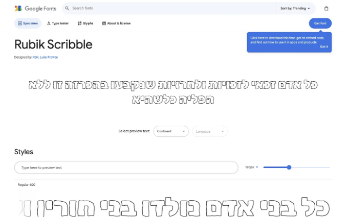
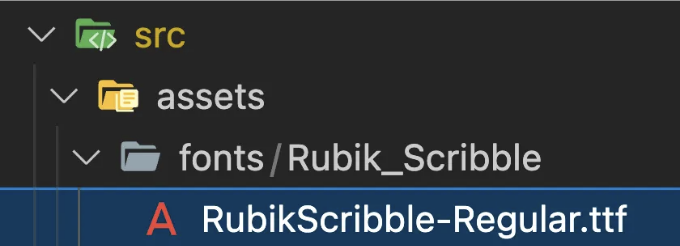
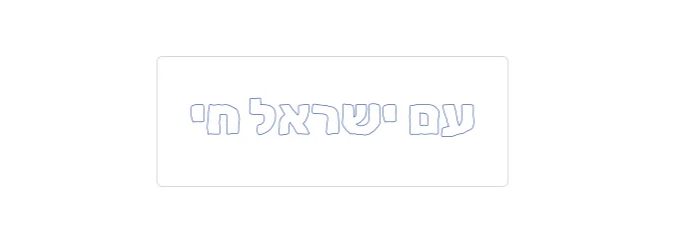
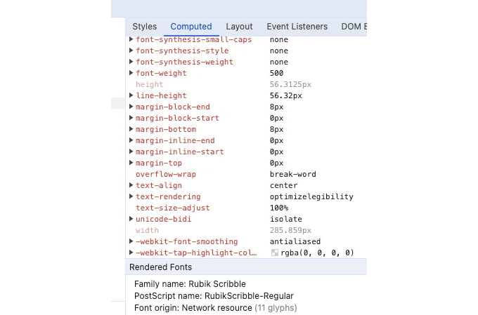

Vite를 처음 사용할 때 사용자 정의 글꼴 통합과 같은 간단한 작업을 수행하는 데 학습 곡선을 만났어요. 전체 스택 개발자가 되기 위한 여정에서 상세한 설명서, 자습서 및 코드 예제에 익숙해졌어요. 그러나 Vite 개발자 커뮤니티는 아직 이 영역에서 많은 콘텐츠를 제공하지 않았어요. 그래서 여러분 중에서 여정을 시작하시는 분들을 위해 이 튜토리얼이 유용하길 바라요.

비디오 자습서를 선호하는 분들을 위해 매우 유익한 유튜브 비디오를 발견했어요. 그러나 기존 텍스트 형식을 선호하는 분들을 위해 함께 알아보겠습니다.

- 폰트 폴더 생성: 아직 "fonts" 폴더가 없다면 만드세요.

<!-- ui-log 수평형 -->
<ins class="adsbygoogle"
  style="display:block"
  data-ad-client="ca-pub-4877378276818686"
  data-ad-slot="9743150776"
  data-ad-format="auto"
  data-full-width-responsive="true"></ins>
<component is="script">
(adsbygoogle = window.adsbygoogle || []).push({});
</component>

```js
mkdir src/assets/fonts
```

이 데모에서는 구글 폰트의 아름다운 히브리어 Rubik Scribble 폰트를 사용할 것입니다.



폰트 파일을 폰트 폴더에 추가하기

<!-- ui-log 수평형 -->
<ins class="adsbygoogle"
  style="display:block"
  data-ad-client="ca-pub-4877378276818686"
  data-ad-slot="9743150776"
  data-ad-format="auto"
  data-full-width-responsive="true"></ins>
<component is="script">
(adsbygoogle = window.adsbygoogle || []).push({});
</component>

```markdown


Mozilla의 문서에서 설명했듯이, @font-face CSS at-rule은 텍스트를 표시할 사용자 정의 폰트를 지정합니다. 이는 원격 서버에서 또는 사용자의 컴퓨터에 로컬로 설치된 폰트에서 로드할 수 있습니다.

Mozilla 문서에서 설명한대로, @font-face CSS at-rule은 텍스트를 표시하는 데 사용할 사용자 지정 폰트를 지정합니다.

폰트는 원격 서버에서 또는 사용자의 컴퓨터에 로컬로 설치된 폰트에서 로드할 수 있습니다.
```

<!-- ui-log 수평형 -->
<ins class="adsbygoogle"
  style="display:block"
  data-ad-client="ca-pub-4877378276818686"
  data-ad-slot="9743150776"
  data-ad-format="auto"
  data-full-width-responsive="true"></ins>
<component is="script">
(adsbygoogle = window.adsbygoogle || []).push({});
</component>

그래서 우리는 이제 그것을 할 것입니다.

index.css 파일에 다음 코드를 추가하세요:

```css
@font-face{
  font-family: "RubikScribble";
  src: local("RubikScribble-Regular"),
  url('./assets/fonts/Rubik_Scribble/RubikScribble-Regular.ttf') 
}
```

<!-- ui-log 수평형 -->
<ins class="adsbygoogle"
  style="display:block"
  data-ad-client="ca-pub-4877378276818686"
  data-ad-slot="9743150776"
  data-ad-format="auto"
  data-full-width-responsive="true"></ins>
<component is="script">
(adsbygoogle = window.adsbygoogle || []).push({});
</component>

양식: url()과 local() 둘을 함께 사용하여, 사용자의 기기에 폰트가 없을 경우 폰트 복사본을 다운로드하고, 설치된 폰트가 있는 경우 그것을 사용합니다.

폰트 사용하기: Vite가 서빙 및 캐싱을 자동으로 처리할 수 있도록 폰트 파일을 가져오고, 다른 폰트처럼 폰트 패밀리 이름을 사용하세요. 이전 단계의 CSS 파일도 프로젝트 어딘가에 가져와야 합니다.

```js
import "./index.css";
import "./assets/fonts/Rubik_Scribble/RubikScribble-Regular.ttf";

<h1 style={ color: "#1139b9", fontFamily: "RubikScribble" }>
  עם ישראל חי
</h1>
```

위 단계에 따라 진행했다면, 이와 같은 결과가 나타날 것입니다.

<!-- ui-log 수평형 -->
<ins class="adsbygoogle"
  style="display:block"
  data-ad-client="ca-pub-4877378276818686"
  data-ad-slot="9743150776"
  data-ad-format="auto"
  data-full-width-responsive="true"></ins>
<component is="script">
(adsbygoogle = window.adsbygoogle || []).push({});
</component>



확인 사용법: 여러 폰트로 작업할 때 새 폰트가 실제로 사용되고 있는지 확인하기 어려울 수 있습니다. 확인하려면 '요소 검사' 기능을 사용할 수 있습니다. 예를 들어 Chrome DevTools에서는 h1 요소를 선택한 후 "Computed" 탭을 클릭하여 아래로 스크롤하고 렌더링된 폰트를 확인할 수 있습니다.



이것으로 Vite 프로젝트에 사용자 정의 폰트를 성공적으로 추가했습니다.