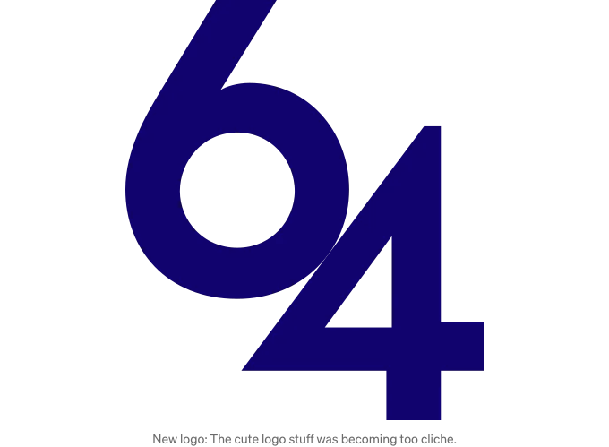

IDB는 래퍼 라이브러리를 사용하여 더 쉽게 사용할 수있게 되는 기술입니다. 그 중 가장 큰 제한 중 하나는 불변 스키마로 인해 버전을 강제하는 것입니다. DB64가 버전 제한을 피하는 방법에 대해 알아봅시다.

나는 DB64를 만들었어요. 이것은 IndexedDB를 사용하기가 조금 덜 지독하게 만들어 주는 작은 래퍼 래퍼입니다. 예를 들어,

- DB와 Store를 만듭니다 (테이블처럼)
- 특정 DB의 스토어 사용 (SQL의 SELECT * FROM db_name.table_name;와 유사)
- 항목 설정 및 가져 오기
- 예외 처리 (예 : 누군가가 캐시를 지우면 어떻게 할까요?) 스토리지 제거 및 데이터 무효화를 용이하게하기 위해 has 메서드가 도입되었습니다.

<!-- ui-log 수평형 -->
<ins class="adsbygoogle"
  style="display:block"
  data-ad-client="ca-pub-4877378276818686"
  data-ad-slot="9743150776"
  data-ad-format="auto"
  data-full-width-responsive="true"></ins>
<component is="script">
(adsbygoogle = window.adsbygoogle || []).push({});
</component>

로컬 저장소는 데이터 무효화 및 저장 공간 제거 위험을 가지고 있지만 API의 한정된 간소화 때문에 종종 무시됩니다.

버전 0.8.5는 누락된 스토어를 새 스토어를 포함하여 다시 생성할 수 있는 기능을 소개했습니다.

버전 관리를 제거하면 버전 관리가 해결하려고 했던 불편한 방식으로 문제를 해결하는 것이 중요합니다.

## IndexedDB에는 스토어를 삭제하거나 추가할 수 없습니다.

<!-- ui-log 수평형 -->
<ins class="adsbygoogle"
  style="display:block"
  data-ad-client="ca-pub-4877378276818686"
  data-ad-slot="9743150776"
  data-ad-format="auto"
  data-full-width-responsive="true"></ins>
<component is="script">
(adsbygoogle = window.adsbygoogle || []).push({});
</component>

따라서 DB64에서는 스토어를 지울 수도 있고 데이터베이스를 삭제할 수도 있지만 "스키마 변경 버전 관련 요구 사항"으로 인해 새 스토어를 추가하거나 스토어를 삭제할 수는 없습니다.


IDB 세계에 정통하다면 "새 버전을 생성하고 setVersion을 설정하는 방법은 왜 안 될까?"라고 생각할 수 있습니다.

IDB에서는 결코 "그냥"이란 게 없어요. 게다가 IDB는 시간이 지남에 따라 누적됩니다. 스냅샷을 사용하거나 Git과 유사한 DAG 알고리즘을 사용한다고 가정해도, 대부분의 웹 사용자가 버전 관리를 요청한 적이 없는 상태에서는 여전히 과도한 방법일 수 있습니다.

<!-- ui-log 수평형 -->
<ins class="adsbygoogle"
  style="display:block"
  data-ad-client="ca-pub-4877378276818686"
  data-ad-slot="9743150776"
  data-ad-format="auto"
  data-full-width-responsive="true"></ins>
<component is="script">
(adsbygoogle = window.adsbygoogle || []).push({});
</component>

## 실용적인 해결책

0.9.x 릴리즈에서 DB64는 버전 관리 없이 상점을 추가하거나 삭제할 수 있는 기능을 도입할 것입니다. 이 과정은 간단히 다음과 같이 수행됩니다:

- 새로운 빈 스키마를 정의합니다.
- 기존 스키마에서 데이터를 복사합니다.
- 기존 스키마를 삭제합니다.
- 추가 또는 삭제된 객체 스토어를 포함한 새로운 스키마를 생성합니다.

이것은 기술적인 걸작은 아니고, 말 그대로 간단한 아이디어입니다.

<!-- ui-log 수평형 -->
<ins class="adsbygoogle"
  style="display:block"
  data-ad-client="ca-pub-4877378276818686"
  data-ad-slot="9743150776"
  data-ad-format="auto"
  data-full-width-responsive="true"></ins>
<component is="script">
(adsbygoogle = window.adsbygoogle || []).push({});
</component>

이것은 멀지 않았습니다. LocalStorage는 JSON이나 일반 문자열로 직렬화 및 역직렬화를 필요로 하기 때문에 가능할 수 있습니다. 이로 인해 인간 오류가 발생할 가능성이 높아질 수도 있습니다.

IndexedDB와 DB64을 사용하면 한 데이터베이스가 삭제될 때 다른 데이터베이스가 정상적으로 작동을 계속할 수 있습니다.

그러나 LocalStorage의 경우 해당 시나리오에서 데이터가 한꺼번에 모두 손실됩니다. 따라서 예를 들어 8개의 HTTP 요청을 다시 채우기 위해서 데이터를 재구성해야 하는 경우, 다른 효율성 문제와 잠재적인 실패 지점이 추가됩니다. (이제 어떤 요청이 실패하거나 부분적으로 실패했는지 고려해야 합니다).

이 다가오는 기능 이후로, DB64는 IndexedDB의 유틸리티 측면과 IDBCursor을 묶는 것을 탐색하게 되어, 더 고급 작업을 수행할 때 DB64과 IndexedDB를 모두 사용할 필요가 없게 될 것입니다.

<!-- ui-log 수평형 -->
<ins class="adsbygoogle"
  style="display:block"
  data-ad-client="ca-pub-4877378276818686"
  data-ad-slot="9743150776"
  data-ad-format="auto"
  data-full-width-responsive="true"></ins>
<component is="script">
(adsbygoogle = window.adsbygoogle || []).push({});
</component>

```markdown

```