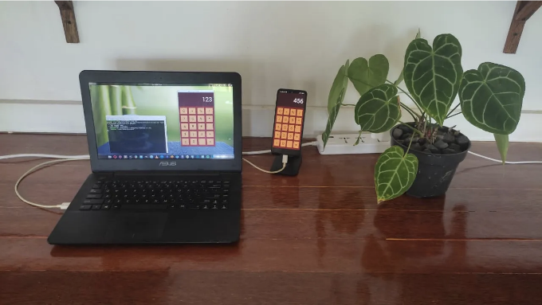

지난 몇 주 동안 Rust를 배우는 데 시간을 투자했습니다. Rust가 고성능 응용 프로그램을 구축하는 데 가지는 잠재력과 동시에 고수준 추상화에 매료되었습니다. 웹과 React 세계에서 왔기 때문에 Rust의 UI 프로그래밍 측면의 가능성을 탐험하기로 결정했습니다. 이 탐구의 결과물은 React에서 영감을 받은 실험적인 프레임워크인 Appy입니다. 이 프레임워크는 Rust의 성능 능력을 활용하여 OpenGL을 사용해 컴포넌트를 직접 렌더링합니다.

이 프레임워크는 여전히 초기 단계에 있으며 실험으로 이해해야 합니다. 그러나 지금까지 배운 것을 공유하고 Rust가 UI 프로그래밍을 위한 가능성에 대한 대화를 시작하는 데 흥분을 느낍니다.

Appy는 Rust, RSX, OpenGL 및 Simple DirectMedia Layer (SDL) 라이브러리에 의존하여 그래픽을 렌더링합니다. SDL은 크로스 플랫폼 기능을 제공하므로 Appy로 구축된 응용 프로그램은 여러 플랫폼에 배포될 수 있습니다. 그러나 현재 Android 및 데스크톱 버전의 배포 툴만 완전히 운영 중입니다. 그렇다고 해도 iOS 또는 wasm 도구 체인을 추가하는 것은 간단한 프로세스여야 합니다.

<!-- ui-log 수평형 -->
<ins class="adsbygoogle"
  style="display:block"
  data-ad-client="ca-pub-4877378276818686"
  data-ad-slot="9743150776"
  data-ad-format="auto"
  data-full-width-responsive="true"></ins>
<component is="script">
(adsbygoogle = window.adsbygoogle || []).push({});
</component>

## 안녕, 세상아!

리액트에 익숙하다면 Appy의 구문을 알아볼 수 있을 겁니다. 이를 통해 HTML 또는 XML 같은 코드를 작성할 수 있습니다. 다음은 "Hello World" 애플리케이션입니다:

```js
use appy::{*};

#[main_window]
pub fn app() -> Elements {
    apx!{
        <bg col=0x800000/>
        <text text="Hello World".to_string() align=Align::Center/>
    }
}
```

그러나 리액트와 달리, Appy는 UI 업데이트를 관리하기 위해 가상 DOM을 사용하지 않습니다. 대신 Appy는 OpenGL를 사용하여 구성 요소를 직접 렌더링합니다. 이 접근 방식은 DOM이나 그를 업데이트하는 필요가 없어지므로 전통적인 UI 프레임워크보다 빠르고 효율적인 성능 이점을 제공하는 보다 가벼우며 빠르며 효율적인 프레임워크를 선사합니다.

<!-- ui-log 수평형 -->
<ins class="adsbygoogle"
  style="display:block"
  data-ad-client="ca-pub-4877378276818686"
  data-ad-slot="9743150776"
  data-ad-format="auto"
  data-full-width-responsive="true"></ins>
<component is="script">
(adsbygoogle = window.adsbygoogle || []).push({});
</component>

## 훅

Appy에서는 React 훅의 개념이 여전히 존재합니다. 훅은 클래스 컴포넌트를 사용하지 않고 함수형 컴포넌트에서 상태 및 기타 React 기능을 사용하는 방법입니다. Appy에서는 Rust 클로저를 사용한 유사한 접근 방식을 사용합니다.

예를 들어, 사용자 입력에 기반하여 상태를 업데이트해야 하는 컴포넌트가 있다고 가정해보겠습니다. 업데이트를 처리하는 Rust 클로저를 만들고 해당 클로저를 컴포넌트에 속성으로 전달할 수 있습니다. 사용자 입력이 발생하면 클로저가 호출되어 컴포넌트의 상태가 업데이트됩니다. 예를 들면:

```js
use appy::{*};

#[main_window]
pub fn app()->Elements {
    let (v,set_v)=use_state(||1);
    let on_button_click=cb_with_clone!([v,set_v],move||{
        set_v(*v+1);
    });

    let s=format!("Hello: {}",*v);

    apx!{
        <blk top=Pc(25.0) height=Pc(25.0)>
            <text text=s.to_string() align=Align::Center size=Pc(100.0)/>
        </blk>
        <blk top=Pc(50.0) height=Pc(20.0) width=Pc(25.0)>
            <bg col=0x808080/>
            <text text="+1".to_string() align=Align::Center size=Pc(100.0)/>
            <interaction on_click=on_button_click/>
        </blk>
     }
}
```

<!-- ui-log 수평형 -->
<ins class="adsbygoogle"
  style="display:block"
  data-ad-client="ca-pub-4877378276818686"
  data-ad-slot="9743150776"
  data-ad-format="auto"
  data-full-width-responsive="true"></ins>
<component is="script">
(adsbygoogle = window.adsbygoogle || []).push({});
</component>

## 배포

실험의 일환으로 배포 도구도 만들었어요. 안드로이드에 Appy 앱을 배포하는 것은 하나의 명령어를 실행하는 간단한 프로세스에요. 온라인 튜토리얼을 참고하여 SDL을 안드로이드에서 사용하는 방법을 배웠어요. 파일을 번갈아가며 복사하고 Android Studio를 열어 프로젝트를 빌드하는 여러 단계를 거치면서 꽤나 많은 시간이 소요되었어요. 나는 이 프로세스를 자동화하여 프로젝트를 시작할 때 겪는 장벽을 줄이고 더 효율적으로 만들었어요.

## 결론

Appy의 코드는 GitHub에서 확인할 수 있고, 몇 가지 예제도 제공됩니다. 그 중 하나는 간단한 계산기이며, 이 프레임워크를 사용하는 데 어떤 느낌인지 알아보기 위해 만들었어요.

<!-- ui-log 수평형 -->
<ins class="adsbygoogle"
  style="display:block"
  data-ad-client="ca-pub-4877378276818686"
  data-ad-slot="9743150776"
  data-ad-format="auto"
  data-full-width-responsive="true"></ins>
<component is="script">
(adsbygoogle = window.adsbygoogle || []).push({});
</component>

Appy를 사용하는 작업 흐름을 매우 즐겁게 느꼈습니다. 함수형 스타일로 코드를 작성할 수 있으면서도 가상 DOM을 다룰 필요 없이 네이티브 성능을 얻을 수 있다는 것은 상쾌했습니다. Rust 클로저를 사용해 상태 업데이트 및 기타 이벤트를 처리하는 것이 자연스럽고 직관적으로 느껴졌어요.

Appy가 여전히 실험 단계에 있지만, 저는 Rust 개발자를 위한 크로스 플랫폼 UI 프레임워크로 잠재력이 있다고 생각해요. 비즈니스 및 생산성 앱에 SDL 및 OpenGL을 활용할 수 있는 능력은 성능과 개발자 생산성 측면에서 게임 체인저가 될 수 있을 거라고 생각해요.

Appy 작업을 계속 진행하고 Rust에서 선언적 UI 프로그래밍의 가능성을 탐색하는 것에 흥분합니다. 시도해보거나 기여하고 싶다면 GitHub에서 코드를 확인하고 대화에 참여해 주세요.

여기까지 오신 분이라면, 제가 현재 흥미로운 프로젝트에 기여할 수 있는 직업 기회를 찾고 있음을 언급하고 싶습니다. 혹시 Appy를 활용하고 발전시킬 수 있는 프로젝트가 있다면? 아니면 다른 흥미로운 것이라도.

<!-- ui-log 수평형 -->
<ins class="adsbygoogle"
  style="display:block"
  data-ad-client="ca-pub-4877378276818686"
  data-ad-slot="9743150776"
  data-ad-format="auto"
  data-full-width-responsive="true"></ins>
<component is="script">
(adsbygoogle = window.adsbygoogle || []).push({});
</component>

r/rust와 Rust 포럼에서 토론해보세요.

## 2023년 4월 8일 업데이트

와우, 좋은 응답 감사합니다! 이 프로젝트를 계속 진행하고 어떤 결론에 이를지 알 수 없겠지만 일단 계속해서 작업할 예정입니다. 제가 buymeacoffee.com에 페이지를 만들었는데, 작업이 진행됨에 따라 업데이트를 게시할 예정입니다. 거기서 첫 주간 업데이트도 올렸어요.

## 참고 자료 및 링크

<!-- ui-log 수평형 -->
<ins class="adsbygoogle"
  style="display:block"
  data-ad-client="ca-pub-4877378276818686"
  data-ad-slot="9743150776"
  data-ad-format="auto"
  data-full-width-responsive="true"></ins>
<component is="script">
(adsbygoogle = window.adsbygoogle || []).push({});
</component>

- 깃허브에 있는 소스 코드를 확인해보세요. 몇 가지 예제와 빌드 방법에 대한 설명이 포함되어 있어요.
- Rust와 SDL을 사용하여 안드로이드 앱을 빌드하는 튜토리얼이 있어요. 제 배포 도구가 이 프로세스를 자동화해줘요.
- Yew는 React처럼 브라우저의 DOM으로 렌더링하는 Rust 프레임워크예요. RSX도 사용해요.
- Xilem과 Druid는 Rust용 반응형 GUI 프레임워크이지만 RSX, SDL 및 OpenGL과 다른 기술을 사용해요.