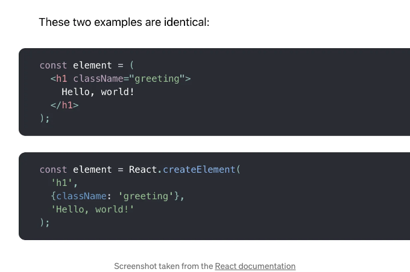

## 왜 안 되겠어요?!

웹 표준은 아니지만 웹 컴포넌트가 좀 더 대세가 되고 있지만, JSX는 React와 함께 등장하여 HTML과 JavaScript를 함께 작성하는 것을 간단하게 만드는 놀라운 기술입니다.

하지만, 이게 정확히 어떻게 작동하는 걸까요? 맞아요, React 컴포넌트에서 JSX를 반환할 수는 있지만, 우리는 그것이 표준 JavaScript가 아니라는 걸 다 알고 있어요. 그렇다면 이것이 정확히 어떻게 작동하는 걸까요? 이 일에 어떤 마법이 숨어 있을까요?

<!-- ui-log 수평형 -->
<ins class="adsbygoogle"
  style="display:block"
  data-ad-client="ca-pub-4877378276818686"
  data-ad-slot="9743150776"
  data-ad-format="auto"
  data-full-width-responsive="true"></ins>
<component is="script">
(adsbygoogle = window.adsbygoogle || []).push({});
</component>

나는 기술이 "그저 작동하는" 것을 정말 좋아해요. 하지만 그게 내 일에 영향을 미치면, 최대한 이해하려 노력해요. 그 방법 중 하나는 그것이 어떻게 작동하는지 역공학을 시도하고 그의 버전을 직접 작성하는 것이에요.
이 과정을 통해 많은 것을 배울 수 있어요!

그래서 이 글에서는 JSX 파서의 버전을 작성하는 방법을 보여드릴 거예요. JSX "구성 요소"를 실제로 유효한 HTML을 반환하는 JavaScript로 변환하는 일을 할 수 있는 파서를 만드는 방법을 알려 드릴 거에요.

시작해 봅시다!

<!-- ui-log 수평형 -->
<ins class="adsbygoogle"
  style="display:block"
  data-ad-client="ca-pub-4877378276818686"
  data-ad-slot="9743150776"
  data-ad-format="auto"
  data-full-width-responsive="true"></ins>
<component is="script">
(adsbygoogle = window.adsbygoogle || []).push({});
</component>

# JSX를 파싱할 것입니다

결국 시작해 봅시다, 파싱할 JSX 파일을 살펴봅시다.

만약 React로 이를 작성한다면 다음과 같이 될 것입니다:

솔직히 말해서, 변하는 부분은 초기 가져오기(import)일 뿐이며, JSX를 작성하려면 왜 React를 가져와야 하는지 실제로 볼 수 있게 될 것입니다.

<!-- ui-log 수평형 -->
<ins class="adsbygoogle"
  style="display:block"
  data-ad-client="ca-pub-4877378276818686"
  data-ad-slot="9743150776"
  data-ad-format="auto"
  data-full-width-responsive="true"></ins>
<component is="script">
(adsbygoogle = window.adsbygoogle || []).push({});
</component>

파싱 자체는 조금 일이 드는데, 그 뒤에 숨겨진 로직은 실제로 아주 간단해요. Rect의 문서를 살펴보면 JSX를 파싱한 결과를 보여줄 거예요.

JSX 요소를 React.createElement 호출로 변환하고 있다는 점을 주목해보세요. 네, 그래요! 그래서 직접적으로 사용하진 않더라도 React를 import해야 하는 거죠. 파싱이 끝나고 나면 만들어진 JavaScript 코드에서는 React가 사용될 거에요.

이제 그 미스터리를 해결했으니, 계속 진행해봅시다.

<!-- ui-log 수평형 -->
<ins class="adsbygoogle"
  style="display:block"
  data-ad-client="ca-pub-4877378276818686"
  data-ad-slot="9743150776"
  data-ad-format="auto"
  data-full-width-responsive="true"></ins>
<component is="script">
(adsbygoogle = window.adsbygoogle || []).push({});
</component>

메소드의 첫 번째 속성은 생성할 요소의 태그 이름입니다. 두 번째 속성은 생성되는 요소와 관련된 모든 속성을 포함한 객체이며, 마지막으로 나머지 속성들(하나 이상 존재할 수 있음)은 이 요소의 직계 자식 요소가 될 것입니다(일반 텍스트 또는 다른 요소일 수 있음).

그런 다음, 여기에 대한 도전 과제는 다음과 같습니다:

- JavaScript 내부의 JSX를 캡처합니다.
- 이를 쿼리 및 탐색할 수 있는 트리 구조로 파싱합니다.
- 해당 구조를 JavaScript 코드(텍스트)로 번역하여 JSX 대신에 작성됩니다.
- 3단계의 출력물을 .js 확장자를 가진 파일로 디스크에 저장합니다.

코딩해봅시다!

<!-- ui-log 수평형 -->
<ins class="adsbygoogle"
  style="display:block"
  data-ad-client="ca-pub-4877378276818686"
  data-ad-slot="9743150776"
  data-ad-format="auto"
  data-full-width-responsive="true"></ins>
<component is="script">
(adsbygoogle = window.adsbygoogle || []).push({});
</component>

# 컴포넌트에서 JSX 추출 및 구문 분석

첫 번째 단계는 컴포넌트에서 JSX를 어떤 방식으로든 추출하고 트리 구조로 구문 분석하는 것입니다.

사실, 이 두 단계는 있지만, 함께 진행하겠습니다.

우선 해야 할 일은 JSX 파일을 읽은 다음 정규 표현식을 사용하여 JSX 코드를 캡처하는 것입니다. (네, 이 글 전체에서 몇 가지 정규 표현식을 사용할 것입니다.)

<!-- ui-log 수평형 -->
<ins class="adsbygoogle"
  style="display:block"
  data-ad-client="ca-pub-4877378276818686"
  data-ad-slot="9743150776"
  data-ad-format="auto"
  data-full-width-responsive="true"></ins>
<component is="script">
(adsbygoogle = window.adsbygoogle || []).push({});
</component>

이제 이를 통해 HTML 파서를 사용하여 이해할 수 있습니다.

우리가 여기서 할 수 있는 이유를 염두에 두세요. 우리가 신경 써야 할 것은 구조뿐이며 JSX의 실제 기능은 아닙니다. 따라서 파일을 읽기 위해 Node의 fs 모듈과 node-html-parser 패키지를 사용할 것입니다.

이 함수는 다음과 같이 생겼습니다:

이 함수는 (...) 함수 부분 내의 첫 번째 컴포넌트의 여는 태그를 찾기 위해 RegExp를 사용합니다. 10번째 줄에서는 우리의 JSX의 루트 엘리먼트가 될 첫 번째 자식인 루트 엘리먼트를 반환하는 parse 함수를 호출합니다 (우리의 경우, wrapping div입니다).

<!-- ui-log 수평형 -->
<ins class="adsbygoogle"
  style="display:block"
  data-ad-client="ca-pub-4877378276818686"
  data-ad-slot="9743150776"
  data-ad-format="auto"
  data-full-width-responsive="true"></ins>
<component is="script">
(adsbygoogle = window.adsbygoogle || []).push({});
</component>

이제 트리 모양 구조가 있다면, 코드로 번역해 봅시다. 그러기 위해 translate 함수를 호출할 겁니다.

# HTML을 JS 코드로 번역하기

우리가 트리 모양 구조에서 상당히 제한된 깊이를 다루고 있기 때문에, 이 트리를 순회하기 위해 안전하게 재귀를 사용할 겁니다.

여기 함수가 어떻게 생겼는지 알아봅시다. 나중에 분석해 봅시다:

<!-- ui-log 수평형 -->
<ins class="adsbygoogle"
  style="display:block"
  data-ad-client="ca-pub-4877378276818686"
  data-ad-slot="9743150776"
  data-ad-format="auto"
  data-full-width-responsive="true"></ins>
<component is="script">
(adsbygoogle = window.adsbygoogle || []).push({});
</component>

먼저 모든 자식 요소를 검토하고 해당 요소에 대해 번역 함수를 호출합니다. 자식 요소가 비어있으면 해당 호출은 null을 반환하고 7번 줄에서 해당 결과를 걸러냅니다.

자식 요소를 처리했다면, 9번 줄을 살펴봅시다. 여기서는 노드의 유형에 대한 빠른 검증을 수행합니다. 유형이 3이면 이는 텍스트 노드를 의미하며, 특별한 말로는 "텍스트만"을 의미합니다. 따라서 구문 분석된 텍스트를 반환합니다.

왜 parseText 함수를 호출하는 걸까요? 텍스트 노드 내부에서도 { ... } 형식의 JSX 표현을 찾아야 하기 때문입니다. 따라서 이 함수는 필요한 경우 반환된 문자열을 확인하고 적절하게 변경합니다.

그 후, 즉 텍스트 노드를 다루는 것이 아니라면, 태그 이름(14번 줄)을 얻고 속성을 구문 분석합니다(16번 줄). 속성을 구문 분석한다는 것은 해당 원시 문자열을 적절한 JSON으로 변환하는 작업을 의미합니다.

<!-- ui-log 수평형 -->
<ins class="adsbygoogle"
  style="display:block"
  data-ad-client="ca-pub-4877378276818686"
  data-ad-slot="9743150776"
  data-ad-format="auto"
  data-full-width-responsive="true"></ins>
<component is="script">
(adsbygoogle = window.adsbygoogle || []).push({});
</component>

마침내, 생성하고자 하는 코드 라인을 반환할 것입니다 (즉, 적절한 매개변수를 사용하여 createElement를 호출하는 부분). 이것이 18번 라인에서 발생하는 일입니다.

우리가 코드를 작성 중이라는 것을 기억하세요. 실제로 실행하지는 않습니다. 그래서 모든 것이 문자열 안에 있습니다.

마지막으로, 이 함수에 대해 주목해야 할 마지막 세부 사항은 생성된 코드가 MyLib 모듈에서 createElement 메서드를 호출한다는 것입니다. 이것이 JSX 파일 내에서 `./MyLib.js’로부터 import * as MyLib를 한 이유입니다.

이제 텍스트 노드와 각 요소의 속성 객체 내에서 JSX 표현식을 대체하기 위해 문자열을 다루기 시작해야 합니다.

<!-- ui-log 수평형 -->
<ins class="adsbygoogle"
  style="display:block"
  data-ad-client="ca-pub-4877378276818686"
  data-ad-slot="9743150776"
  data-ad-format="auto"
  data-full-width-responsive="true"></ins>
<component is="script">
(adsbygoogle = window.adsbygoogle || []).push({});
</component>

위 글을 좋아하셨나요? 제 무료 뉴스레터를 구독해보세요. IT 산업에서 20년 간의 지혜를 모두와 공유할게요. "The Rambling of an old developer"에 가입해주세요!

# 표현식 구문 분석

이 구현에서 지원하는 JSX 표현식의 유형은 가장 쉬운 것입니다. 예제에서 보는 것처럼 이러한 표현식 안에 JS 변수를 추가할 수 있고, 최종 출력물에는 그대로 변수로 유지됩니다.

이 작업을 수행하는 함수들은 다음과 같습니다:

<!-- ui-log 수평형 -->
<ins class="adsbygoogle"
  style="display:block"
  data-ad-client="ca-pub-4877378276818686"
  data-ad-slot="9743150776"
  data-ad-format="auto"
  data-full-width-responsive="true"></ins>
<component is="script">
(adsbygoogle = window.adsbygoogle || []).push({});
</component>

우리가 보간(즉, 중괄호 안에 변수가 있는 경우)을 가지고 있다면 replaceInterpolation 함수를 호출합니다. 이 함수는 모든 일치하는 보간을 확인하고 적절히 형식화된 문자열로 대체합니다 (JS 파일에 작성될 때 변수 이름을 남긴 상태로 변환됩니다).

우리는 이러한 함수를 속성 객체와 함께 사용합니다. JS 코드를 반환할 때 JSON.stringify 메서드를 사용하기 때문에 해당 함수는 모든 값을 문자열로 변환합니다 (거의 모든 값이지만 우리가 단일 변수로 정의한 것들은 확실히 문자열로 변환됩니다). 그래서 대신 stringify 메서드가 반환한 문자열을 파싱하고 보간된 변수를 적절히 대체할 것입니다.

여기서 getAttrs 함수를 확인하여 작업 방식을 이해할 수 있습니다.

이제 JSX 파일을 파싱한 결과 코드를 살펴보겠습니다.

<!-- ui-log 수평형 -->
<ins class="adsbygoogle"
  style="display:block"
  data-ad-client="ca-pub-4877378276818686"
  data-ad-slot="9743150776"
  data-ad-format="auto"
  data-full-width-responsive="true"></ins>
<component is="script">
(adsbygoogle = window.adsbygoogle || []).push({});
</component>

# 자바스크립트 코드

제 어리버리한 JSX 코드를 읽고 구문 분석하면 다음과 같은 결과가 나옵니다:

이 코드에서 흥미로운 부분은 createElement로 생성된 호출입니다. JSX 파일에서 내 보간된 변수를 참조하고 중첩된 것을 볼 수 있습니다.

이 코드를 실행하면 출력은 다음과 같을 것입니다:

<!-- ui-log 수평형 -->
<ins class="adsbygoogle"
  style="display:block"
  data-ad-client="ca-pub-4877378276818686"
  data-ad-slot="9743150776"
  data-ad-format="auto"
  data-full-width-responsive="true"></ins>
<component is="script">
(adsbygoogle = window.adsbygoogle || []).push({});
</component>

하지만 마지막 질문은 아직 답이 없습니다: createElement 메서드는 어떻게 구현되었을까요? 음, 제가 간단한 버전을 가지고 있습니다:

기본적으로, 태그 값을 가지는 래퍼 엘리먼트를 생성하고, 해당 엘리먼트의 속성을 추가한 후, 자식 요소들의 목록을 확인하며 (추가된 모든 속성이 포함된 'rest' 속성입니다), 이 프로세스 중에 간단히 이 값을 문자열로 반환합니다 (line 9).

그리고 이게 전부입니다, 마법이 드러났어요!

JSX는 제가 좋아하는 기술 중 하나이며, JS 파일 내부에서 HTML을 작업하고 생성하는 것을 확실히 간단하게 만들어줍니다.

<!-- ui-log 수평형 -->
<ins class="adsbygoogle"
  style="display:block"
  data-ad-client="ca-pub-4877378276818686"
  data-ad-slot="9743150776"
  data-ad-format="auto"
  data-full-width-responsive="true"></ins>
<component is="script">
(adsbygoogle = window.adsbygoogle || []).push({});
</component>

물론 createElement 메서드를 직접 사용하여 코드를 작성할 수 있지만, 복잡한 애플리케이션에 대해서는 쉽지 않을 뿐만 아니라 깔끔하게 보이지도 않을 것입니다.

이 프로젝트의 전체 소스 코드를 보고 싶다면 여기를 확인할 수 있습니다. 궁금한 점이 있다면 댓글을 남겨주세요. 함께 논의해봐요!

# 레고처럼 재사용 가능한 컴포넌트로 앱 만들기

 

<!-- ui-log 수평형 -->
<ins class="adsbygoogle"
  style="display:block"
  data-ad-client="ca-pub-4877378276818686"
  data-ad-slot="9743150776"
  data-ad-format="auto"
  data-full-width-responsive="true"></ins>
<component is="script">
(adsbygoogle = window.adsbygoogle || []).push({});
</component>

Bit의 오픈 소스 도구는 25만 명 이상의 개발자들이 컴포넌트로 앱을 만드는 데 도움을 줍니다.

어떤 UI, 기능 또는 페이지라도 재사용 가능한 컴포넌트로 변환하고 응용 프로그램 간에 공유하세요. 협업하고 더 빠르게 빌드하는 것이 더 쉽습니다.

→ 더 알아보기

앱을 컴포넌트로 분할하여 앱 개발이 더 쉬워지고, 원하는 워크플로우에 대해 최상의 경험을 즐기세요:

<!-- ui-log 수평형 -->
<ins class="adsbygoogle"
  style="display:block"
  data-ad-client="ca-pub-4877378276818686"
  data-ad-slot="9743150776"
  data-ad-format="auto"
  data-full-width-responsive="true"></ins>
<component is="script">
(adsbygoogle = window.adsbygoogle || []).push({});
</component>

## → 마이크로 프론트엔드

## → 디자인 시스템

## → 코드 공유 및 재사용

## → Monorepo

<!-- ui-log 수평형 -->
<ins class="adsbygoogle"
  style="display:block"
  data-ad-client="ca-pub-4877378276818686"
  data-ad-slot="9743150776"
  data-ad-format="auto"
  data-full-width-responsive="true"></ins>
<component is="script">
(adsbygoogle = window.adsbygoogle || []).push({});
</component>

# 더 알아보기