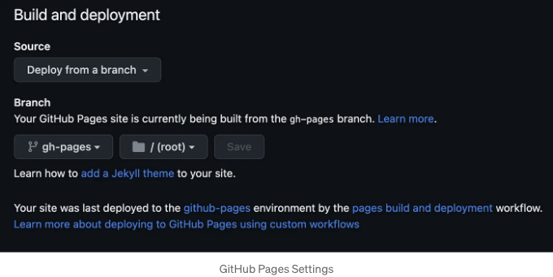

무료 호스팅 플랫폼을 찾고 계신가요? 귀하의 Vite 앱을 배포하려면 GitHub Pages를 사용해보세요!

GitHub Pages에 Vite 앱을 배포하는 방법을 5가지 간단한 단계로 알려드릴게요.


# 단계 1: Git 저장소 초기화

<!-- ui-log 수평형 -->
<ins class="adsbygoogle"
  style="display:block"
  data-ad-client="ca-pub-4877378276818686"
  data-ad-slot="9743150776"
  data-ad-format="auto"
  data-full-width-responsive="true"></ins>
<component is="script">
(adsbygoogle = window.adsbygoogle || []).push({});
</component>

친구야, Vite 앱에서 깃 레포지토리를 초기화하고 기존 코드를 GitHub의 원격 레포지토리로 푸시하는 명령을 실행해보세요.

```js
$ git init
$ git add .
$ git commit -m "initial-commit"
$ git branch -M main
$ git remote add origin http://github.com/{username}/{repo-name}.git
$ git push -u origin main
```

# 단계 2: vite.config.js 업데이트

이 파일에 baseURL을 추가하려면 base를 "/{repo-name}/"로 설정하세요. 예를 들어, 레포지토리의 이름이 book-landing-page인 경우, baseURL을 이렇게 설정하세요:

<!-- ui-log 수평형 -->
<ins class="adsbygoogle"
  style="display:block"
  data-ad-client="ca-pub-4877378276818686"
  data-ad-slot="9743150776"
  data-ad-format="auto"
  data-full-width-responsive="true"></ins>
<component is="script">
(adsbygoogle = window.adsbygoogle || []).push({});
</component>

```js
import { defineConfig } from 'vite'
import react from '@vitejs/plugin-react'

// https://vitejs.dev/config/
export default defineConfig({
  plugins: [react()],
  base: "/book-landing-page/"
})
```

# 단계 3: gh-pages 설치

gh-pages 패키지를 개발 의존성으로 설치합니다.

```js
npm install gh-pages --save-dev
```

<!-- ui-log 수평형 -->
<ins class="adsbygoogle"
  style="display:block"
  data-ad-client="ca-pub-4877378276818686"
  data-ad-slot="9743150776"
  data-ad-format="auto"
  data-full-width-responsive="true"></ins>
<component is="script">
(adsbygoogle = window.adsbygoogle || []).push({});
</component>

# 단계 4: package.json 업데이트하기

다음과 같이 predeploy 및 deploy 스크립트를 사용하여 package.json을 업데이트하십시오.

```js
"scripts": {
    "predeploy" : "npm run build",
    "deploy" : "gh-pages -d dist",
    ...
}
```

package.json에서 homepage을 설정하여 완전한 웹사이트 URL을 추가하십시오.

<!-- ui-log 수평형 -->
<ins class="adsbygoogle"
  style="display:block"
  data-ad-client="ca-pub-4877378276818686"
  data-ad-slot="9743150776"
  data-ad-format="auto"
  data-full-width-responsive="true"></ins>
<component is="script">
(adsbygoogle = window.adsbygoogle || []).push({});
</component>

```js
"homepage": "https://{username}.github.io/{repo-name}/"
```

따라서, 업데이트된 package.json은 다음과 같이 보일 것입니다:

```js
{
  "name": "book-product",
  "private": true,
  "version": "0.0.0",
  "homepage": "https://aishwaryaparab.github.io/book-landing-page/",
  "type": "module",
  "scripts": {
    "predeploy" : "npm run build",
    "deploy" : "gh-pages -d dist",
    "dev": "vite",
    "build": "vite build",
    ...
}
```

# 단계 5: 배포 실행```

<!-- ui-log 수평형 -->
<ins class="adsbygoogle"
  style="display:block"
  data-ad-client="ca-pub-4877378276818686"
  data-ad-slot="9743150776"
  data-ad-format="auto"
  data-full-width-responsive="true"></ins>
<component is="script">
(adsbygoogle = window.adsbygoogle || []).push({});
</component>

여기까지 오셨네요! 거의 다 왔어요. 마지막 명령어를 실행해주세요:

```js
npm run deploy
```

그러면 끝이에요!

하지만 마지막 한 가지만 더 해야 해요!

<!-- ui-log 수평형 -->
<ins class="adsbygoogle"
  style="display:block"
  data-ad-client="ca-pub-4877378276818686"
  data-ad-slot="9743150776"
  data-ad-format="auto"
  data-full-width-responsive="true"></ins>
<component is="script">
(adsbygoogle = window.adsbygoogle || []).push({});
</component>

깃허브의 원격 저장소로 이동하여 `Settings -> Pages` 메뉴로 이동하세요. 소스를 "브랜치에서 배포"로 선택하고 브랜치를 "gh-pages"로 설정하세요.



깃허브 페이지를 통해 사용자 정의 도메인을 설정할 수도 있어요. 🙌

조금 기다려 주시고 몇 분 후에 https://{사용자이름}.github.io/{저장소 이름}/ 에서 사이트를 확인할 수 있을 거예요.

<!-- ui-log 수평형 -->
<ins class="adsbygoogle"
  style="display:block"
  data-ad-client="ca-pub-4877378276818686"
  data-ad-slot="9743150776"
  data-ad-format="auto"
  data-full-width-responsive="true"></ins>
<component is="script">
(adsbygoogle = window.adsbygoogle || []).push({});
</component>

축하합니다!! 귀하의 사이트가 인터넷에서 볼 준비가 되었습니다. 모든 개발 노력이 보람 있었군요. 🤩

도움이 되었기를 바랍니다. 다음에 만나요! 👋

즐거운 학습되세요! ✨