웹사이트를 출시하려고 할 때 다양한 호스팅 옵션으로 인해 압도되었나요? 걱정하지 마세요 — 이 안내서가 여러분을 도와 호스팅 프로세스를 간소화하고 웹사이트를 쉽고 빠르게 온라인으로 구축할 수 있는 해결책을 소개해 드립니다. 시작해 봅시다!

## 목차

— Google Cloud Run을 선택하는 이유
— Next.js를 선택하는 이유
— 새로운 Next.js 앱 생성하기
— Dockerfile
— 코드 GitHub에 저장하기
— Cloud Run 서비스 설정하기
— 사용자 지정 도메인 이름 사용하기

## Google Cloud Run을 선택하는 이유?

<!-- ui-log 수평형 -->
<ins class="adsbygoogle"
  style="display:block"
  data-ad-client="ca-pub-4877378276818686"
  data-ad-slot="9743150776"
  data-ad-format="auto"
  data-full-width-responsive="true"></ins>
<component is="script">
(adsbygoogle = window.adsbygoogle || []).push({});
</component>

Google Cloud Run은 새로운 웹사이트를 빠르게 배포하는 데 탁월한 솔루션입니다. 기존 서버 기반 호스팅에 비해 많은 이점이 있어요. 여러분을 위한 몇 가지 장점을 소개해 드리겠습니다.

- 매월 200만 건의 무료 요청을 받을 수 있어요. 네, 정확히 읽으셨어요. 제가 이 솔루션을 사용하여 여러 웹사이트를 호스팅 중인데, 아직까지 한 푼도 내지 않았습니다.
- Out-of-the-box 오토스케일링 — 쿠버네티스에 익숙하시다면 비슷한 개념인데요. 사이트에 접속하는 사용자가 많아지면, 더 많은 pod가 시작되어 사용자들에게 저하된 서비스를 제공하지 않고 사이트가 항상 빠릅니다.
- 무료 사전 구성된 SSL — 서버에 수동으로 SSH로 들어가서 SSL 인증서를 구성해야 했던 시대는 지났어요. 예전에 Let’s Encrypt와 같은 도구를 사용하여 이것을 수동으로 NGINX 서버에 구성해야 했다면, 더 이상 걱정하지 마세요. 설정이 필요 없고 그냥 작동돼요.
- 자동화된 배포 — 깃의 메인 브랜치에 코드를 병합하기만 하면 새 빌드가 자동으로 트리거되어 애플리케이션이 몇 분 내에 배포됩니다! Google Cloud Run은 내부적으로 Cloud Build라는 다른 서비스를 사용하여 애플리케이션을 빌드하고 배포하는 완전히 관리되는 CI/CD 플랫폼을 사용합니다.

이 외에도 많은 장점이 있지만, 이것들만 몇 가지 소개해 드렸어요! 모든 제공 기능을 확인하려면 여기를 방문해 주세요: https://cloud.google.com/run

## 왜 Next.js를 사용해야 할까요?

<!-- ui-log 수평형 -->
<ins class="adsbygoogle"
  style="display:block"
  data-ad-client="ca-pub-4877378276818686"
  data-ad-slot="9743150776"
  data-ad-format="auto"
  data-full-width-responsive="true"></ins>
<component is="script">
(adsbygoogle = window.adsbygoogle || []).push({});
</component>

Next.js는 현재 웹에서 가장 빠르게 성장하고 있는 Framework 중 하나로, 특히 특별히 매력적인 기능이 몇 가지 있습니다! 여기에 이 Framework을 특별하게 만드는 몇 가지 이유가 있습니다:

- 서버 측 렌더링 — 이 부분은 큰 장점 중 하나인데, 특히 검색 엔진에 사이트를 등록하거나 소셜 미디어 플랫폼에서 공유 가능한 링크를 원하는 경우에 유용합니다. 서버 측에서 페이지를 렌더링하므로 검색 엔진과 같은 것들이 페이지 내용을 크롤링 및 인덱싱할 수 있어 SEO 목적에 매우 유익합니다.
- 파일 기반 라우팅 — 일반적으로 React에서는 라우팅 로직을 포함하는 단일 파일이 있었으며 이 파일을 탐색하는 것이 항상 조금은 복잡했습니다. Next.js에서는 폴더로 처리하며, 폴더 이름이 경로가 됩니다. 이는 모든 것을 정리하고 쉽게 탐색할 수 있도록 해주며 매우 강력한 도구를 제공합니다.
- CSS 모듈 — 스타일을 지역적으로 제한하고 각 rule에 대해 고유한 클래스명을 생성합니다. 이는 코드베이스를 깔끔하게 유지하고 요소를 매우 쉽게 찾을 수 있도록 해줍니다. 또한 Tailwind CSS와 같은 도구와 함께 이를 사용하여 더욱 강력하게 만들 수 있습니다!

Next.js를 프론트엔드 Framework로 선택해야 하는 다른 이유들이 많이 있으며, 이 문서를 통해 어떤 점을 기대할 수 있는지 알아보는 것이 좋습니다. 이 문서는 특정하게는 Next.js와 Google Cloud Run에 관한 내용이지만, 이 기본 아이디어는 원하는 프레임워크에서 거의 모두 사용할 수 있습니다!

## 새 Next.js 앱 생성

<!-- ui-log 수평형 -->
<ins class="adsbygoogle"
  style="display:block"
  data-ad-client="ca-pub-4877378276818686"
  data-ad-slot="9743150776"
  data-ad-format="auto"
  data-full-width-responsive="true"></ins>
<component is="script">
(adsbygoogle = window.adsbygoogle || []).push({});
</component>

시작해 봅시다! 새 Next.js 애플리케이션을 만들어 보겠습니다. 본 안내서에서는 이미 Node.js, Git, 그리고 VSCode와 같은 코드 편집기가 설치되어 있는 개발 환경을 가정합니다.

먼저, 편집기와 터미널을 열어주세요. 그런 다음 작업하고 싶은 디렉토리로 이동하세요. 저는 Mac에서 Sites 디렉토리에서 작업할 것이기 때문에 cd ~/Sites 명령어를 사용합니다. 여기에 도착하면 다음 명령어를 실행하세요. 해당 명령어는 Next.js 홈페이지에서 찾을 수 있습니다.

```js
npx create-next-app@latest
```

이 명령어는 새 애플리케이션을 위한 단계별 구성기를 엽니다. 옵션을 순서대로 따라가면 애플리케이션이 생성됩니다. 이 데모에서 제 애플리케이션의 이름을 "cloud-run-nextjs"로 지었습니다.

<!-- ui-log 수평형 -->
<ins class="adsbygoogle"
  style="display:block"
  data-ad-client="ca-pub-4877378276818686"
  data-ad-slot="9743150776"
  data-ad-format="auto"
  data-full-width-responsive="true"></ins>
<component is="script">
(adsbygoogle = window.adsbygoogle || []).push({});
</component>

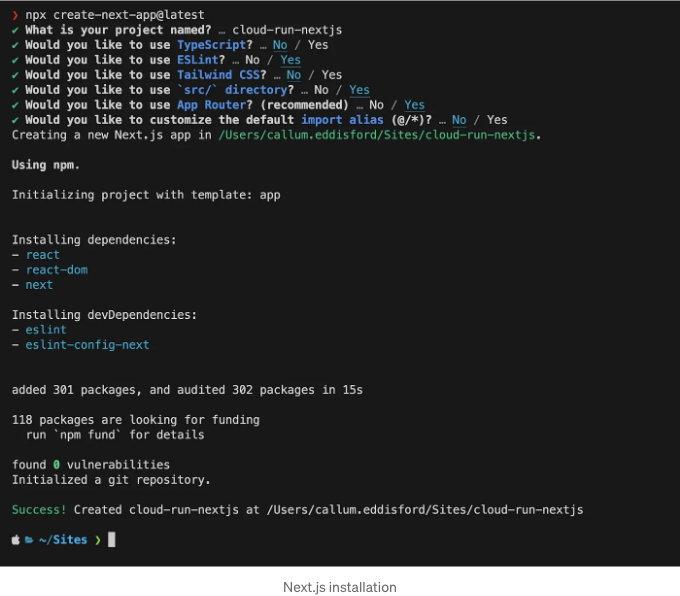

애플리케이션이 생성되면 코드 에디터에서 새로 생성된 디렉토리를 열고 디렉토리 구조가 다음과 같아야합니다:

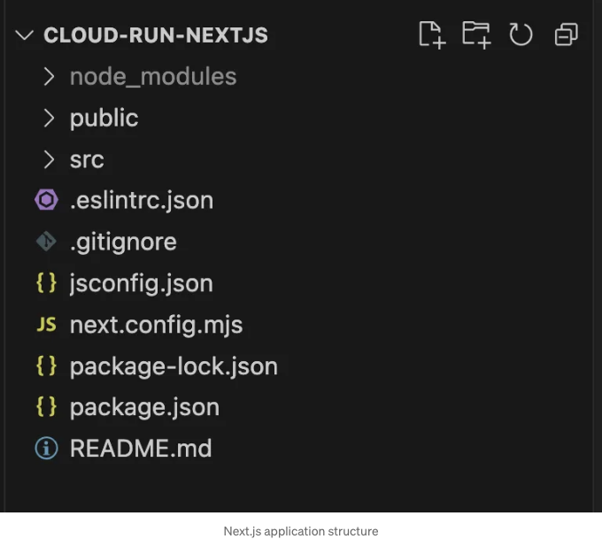

애플리케이션 설정에 대해서는 이게 전부입니다! 로컬에서 애플리케이션을 시작하려면 다음 명령을 실행하면 됩니다:

<!-- ui-log 수평형 -->
<ins class="adsbygoogle"
  style="display:block"
  data-ad-client="ca-pub-4877378276818686"
  data-ad-slot="9743150776"
  data-ad-format="auto"
  data-full-width-responsive="true"></ins>
<component is="script">
(adsbygoogle = window.adsbygoogle || []).push({});
</component>

```js
npm run dev
```

지금 애플리케이션이 3000 포트에서 시작되었습니다. 브라우저에서 http://localhost:3000을 방문하면 Next.js 랜딩 페이지가 표시됩니다.

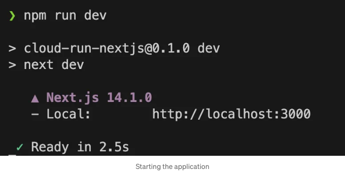

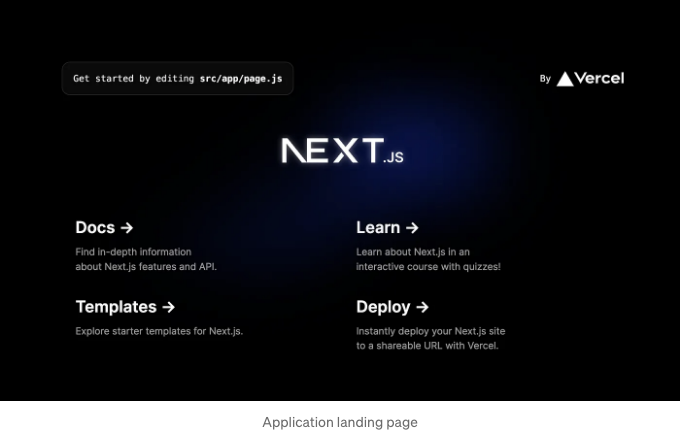
```

<!-- ui-log 수평형 -->
<ins class="adsbygoogle"
  style="display:block"
  data-ad-client="ca-pub-4877378276818686"
  data-ad-slot="9743150776"
  data-ad-format="auto"
  data-full-width-responsive="true"></ins>
<component is="script">
(adsbygoogle = window.adsbygoogle || []).push({});
</component>

이제 Next.js를 시작할 준비가 모두 끝났어요! 이제 여러분의 사이트를 구축할 수 있어요!

## Dockerfile

Dockerfile은 클라우드 런에서 사이트를 실행하는 데 사용될 이미지를 조립하는 모든 명령을 포함하는 텍스트 문서입니다.

프로젝트 디렉토리의 루트에 "Dockerfile"이라는 새 파일을 생성해보세요. 여기에는 좋은 시작점으로 사용할 수 있는 예시 Dockerfile이 있습니다:

<!-- ui-log 수평형 -->
<ins class="adsbygoogle"
  style="display:block"
  data-ad-client="ca-pub-4877378276818686"
  data-ad-slot="9743150776"
  data-ad-format="auto"
  data-full-width-responsive="true"></ins>
<component is="script">
(adsbygoogle = window.adsbygoogle || []).push({});
</component>

```js
FROM node:18-alpine AS base

FROM base AS deps
RUN apk add --no-cache libc6-compat
WORKDIR /app

COPY package*.json ./
RUN npm ci

FROM base AS builder
WORKDIR /app
COPY --from=deps /app/node_modules ./node_modules
COPY . .

ENV NEXT_TELEMETRY_DISABLED 1

RUN npm run build

FROM base AS runner
WORKDIR /app

ENV NODE_ENV production
ENV NEXT_TELEMETRY_DISABLED 1

RUN addgroup --system --gid 1001 nodejs
RUN adduser --system --uid 1001 nextjs

COPY --from=builder /app/public ./public
COPY --from=builder --chown=nextjs:nodejs /app/.next ./.next
COPY --from=builder /app/node_modules ./node_modules
COPY --from=builder /app/package.json ./package.json

USER nextjs

EXPOSE 3000

ENV PORT 3000

CMD ["npm", "start"]
```

여기에 모두 있어야 할 것 같아요!

## GitHub에 코드 저장하기

GitHub로 이동해서 새 저장소를 만들어 주세요:

<!-- ui-log 수평형 -->
<ins class="adsbygoogle"
  style="display:block"
  data-ad-client="ca-pub-4877378276818686"
  data-ad-slot="9743150776"
  data-ad-format="auto"
  data-full-width-responsive="true"></ins>
<component is="script">
(adsbygoogle = window.adsbygoogle || []).push({});
</component>

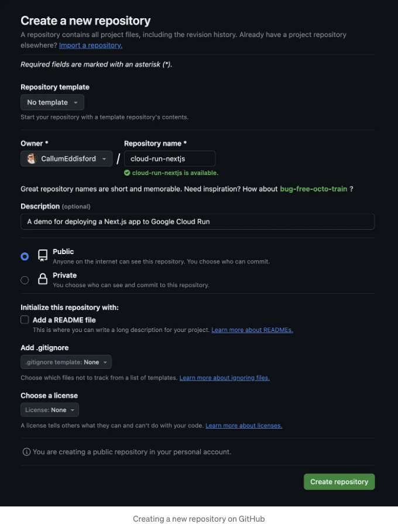

양식을 작성하고 나면 “저장소 만들기”를 클릭하여 다음 페이지에서 코드를 올리는 명령을 제공받을 것입니다:

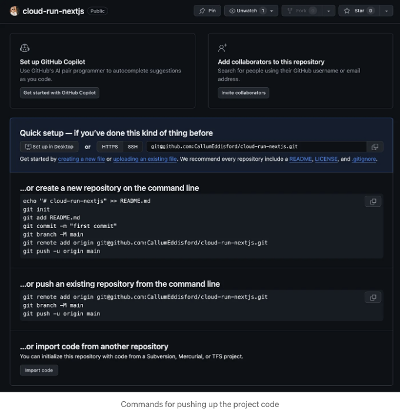

이 페이지에서 "...또는 명령 줄에서 기존 저장소를 푸시" 블록에서 명령을 복사하고, 프로젝트 내부에서 열려 있는 터미널에 명령을 붙여넣기한 후 Enter를 눌러주세요. 발생할 수 있는 프롬프트에 따라 “yes”를 입력하여 예를 들면 GitHub의 지문을 알려진 호스트에 추가해야 했습니다.

<!-- ui-log 수평형 -->
<ins class="adsbygoogle"
  style="display:block"
  data-ad-client="ca-pub-4877378276818686"
  data-ad-slot="9743150776"
  data-ad-format="auto"
  data-full-width-responsive="true"></ins>
<component is="script">
(adsbygoogle = window.adsbygoogle || []).push({});
</component>

작업을 완료하면 코드를 GitHub에 업로드해야 해요:

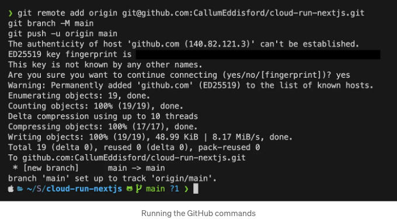

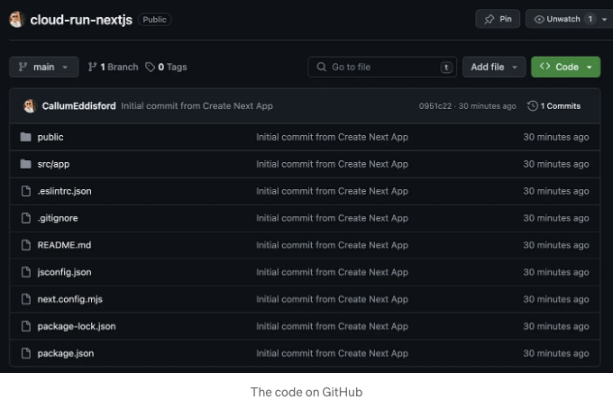

요렇게해서 더 이상 필요한 것들은 없고, 이제 Cloud Run에 애플리케이션을 배포할 준비가 됐어요!

<!-- ui-log 수평형 -->
<ins class="adsbygoogle"
  style="display:block"
  data-ad-client="ca-pub-4877378276818686"
  data-ad-slot="9743150776"
  data-ad-format="auto"
  data-full-width-responsive="true"></ins>
<component is="script">
(adsbygoogle = window.adsbygoogle || []).push({});
</component>

## 클라우드 런 서비스 설정하기

Google Cloud 콘솔로 이동하세요 (아직 계정이 없다면 새로 만드세요). 대시보드에 접속한 후, 주요 네비게이션 메뉴에서 Cloud Run을 찾거나 페이지 상단의 검색 상자에서 검색하여 이동하세요.

이동한 후, 페이지 상단에 있는 "서비스 만들기" 버튼을 눌러주세요:

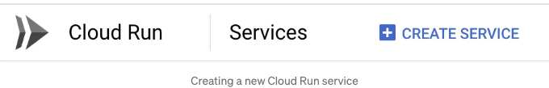

<!-- ui-log 수평형 -->
<ins class="adsbygoogle"
  style="display:block"
  data-ad-client="ca-pub-4877378276818686"
  data-ad-slot="9743150776"
  data-ad-format="auto"
  data-full-width-responsive="true"></ins>
<component is="script">
(adsbygoogle = window.adsbygoogle || []).push({});
</component>

새로운 서비스를 만들기 위한 폼 페이지에 도착하면, "소스 저장소에서 새 버전을 지속적으로 배포"하는 라디오 버튼을 선택한 후 "Cloud Build와 설정" 버튼을 눌러주세요.

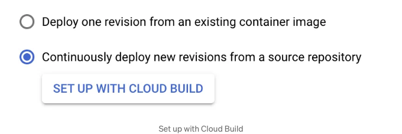

그러면 GitHub 계정과 Google Cloud를 연결할 수 있는 새로운 창이 열립니다. 그 창에서 단계에 따라 진행하여 선택한 새 저장소를 목록에서 선택해주세요.

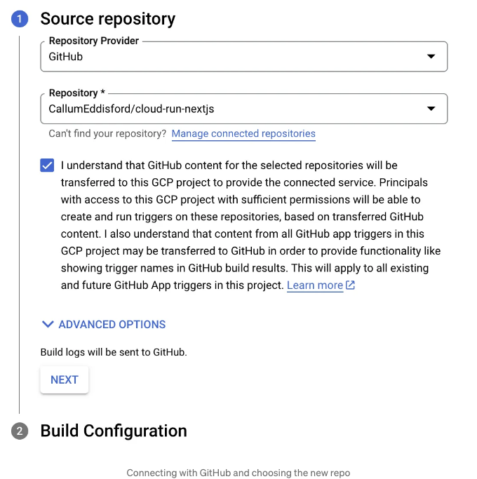

<!-- ui-log 수평형 -->
<ins class="adsbygoogle"
  style="display:block"
  data-ad-client="ca-pub-4877378276818686"
  data-ad-slot="9743150776"
  data-ad-format="auto"
  data-full-width-responsive="true"></ins>
<component is="script">
(adsbygoogle = window.adsbygoogle || []).push({});
</component>

다음을 눌러 Build Configuration 설정으로 이동하세요. 브랜치 필드를 GitHub의 메인 브랜치 이름과 일치하도록 설정해주세요 (만약 이 안내를 따르셨다면, 모든 것이 기본적으로 "main"으로 설정되어 있을 것입니다). 그런 다음 "Build Type" 옵션에서 "Dockerfile"을 선택하고 "소스 위치"를 Dockerfile의 이름과 일치하도록 설정해주세요 (한 번 더 말씀드리지만, 이 안내를 따르셨다면 "Dockerfile"로 자동 설정되어 있어야 합니다).

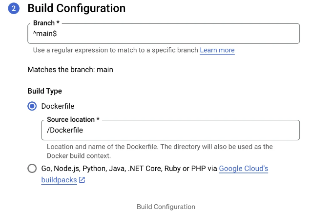

저장을 누른 다음, 새로운 Cloud Run 서비스의 나머지 옵션 설정을 시작할 수 있습니다. 메인 서비스 생성 양식으로 돌아가면 서비스 이름이 이제 레포 이름으로 채워져 있을 것이며, 이를 원하는대로 변경할 수도 있습니다!

지역을 원하는 대로 설정해주세요, 제안으로는 본인 또는 대상 청중에게 가장 가까운 지역을 선택하는 것이 좋을 것입니다. "Authentication" 설정 아래 나머지 옵션은 기본값으로 남겨두셔도 되지만, 서비스가 오픈 인터넷을 통해 액세스되도록 하려면 "인증" 설정에서 "인증되지 않은 호출 허용"을 선택해주세요.

<!-- ui-log 수평형 -->
<ins class="adsbygoogle"
  style="display:block"
  data-ad-client="ca-pub-4877378276818686"
  data-ad-slot="9743150776"
  data-ad-format="auto"
  data-full-width-responsive="true"></ins>
<component is="script">
(adsbygoogle = window.adsbygoogle || []).push({});
</component>

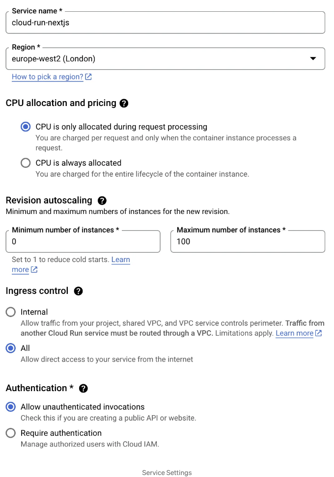

작업을 완료하면 "컨테이너, 볼륨, 네트워킹, 보안" 서랍을 엽니다. 여기서 지금 변경해야 할 유일한 것은 "컨테이너 포트" 옵션입니다. 기본값은 "8080"으로 설정되어 있으므로 이를 3000으로 변경해야 합니다. 프로젝트 설정할 때 기억하실 것처럼 개발 환경을 시작할 때는 3000이었으며 Dockerfile 하단에서 컨테이너에서 포트 3000을 노출했습니다.

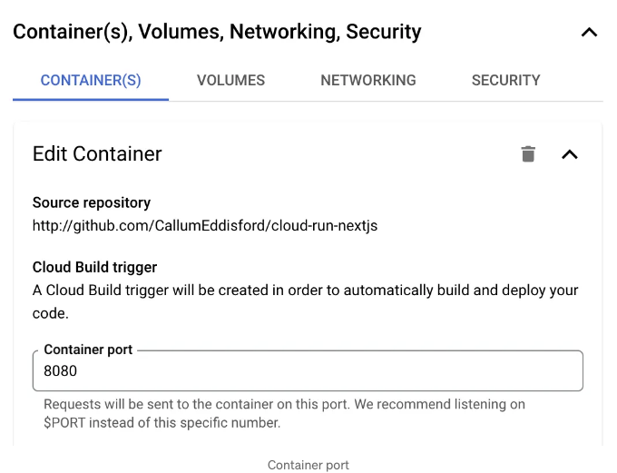

이후 "생성" 버튼을 누르면 준비됐습니다! 🚀 🌕

<!-- ui-log 수평형 -->
<ins class="adsbygoogle"
  style="display:block"
  data-ad-client="ca-pub-4877378276818686"
  data-ad-slot="9743150776"
  data-ad-format="auto"
  data-full-width-responsive="true"></ins>
<component is="script">
(adsbygoogle = window.adsbygoogle || []).push({});
</component>

서비스가 생성되면 자동으로 새로운 서비스의 수정 탭으로 이동됩니다. 본 지점에서 메인 브랜치로 커밋할 때마다 이 목록에 새로운 수정이 표시되며, 필요한 경우 이전 수정으로 빠르게 트래픽을 전환할 수 있습니다.

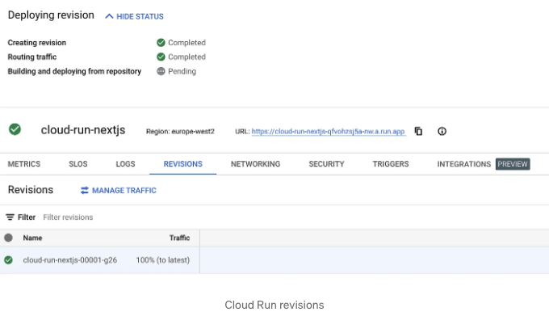

초기적으로 "저장소로부터 빌드 및 배포" 단계가 "보류 중"으로 설정된 것을 볼 수 있습니다. 이는 클라우드 빌드가 이미지를 빌드하고 한 번 완료되면 웹사이트가 이 화면에 제공된 URL에서 라이브 상태가 될 것이기 때문입니다. 빌드 진행 상황을 확인하려면 내비게이션 바에서 클라우드 빌드를 찾아보거나 Google Cloud 상단 메뉴에서 검색해보세요.

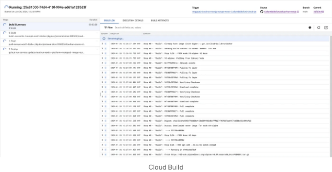

<!-- ui-log 수평형 -->
<ins class="adsbygoogle"
  style="display:block"
  data-ad-client="ca-pub-4877378276818686"
  data-ad-slot="9743150776"
  data-ad-format="auto"
  data-full-width-responsive="true"></ins>
<component is="script">
(adsbygoogle = window.adsbygoogle || []).push({});
</component>

한 번 수정 사항이 빌드되고 배포되면, 클라우드 런 서비스의 "revisions" 탭 아래에 새로운 리비전이 표시됩니다. 그리고 클라우드 런 서비스에서 제공하는 URL을 통해 Next.js 애플리케이션에 액세스할 수 있게 될 거에요.

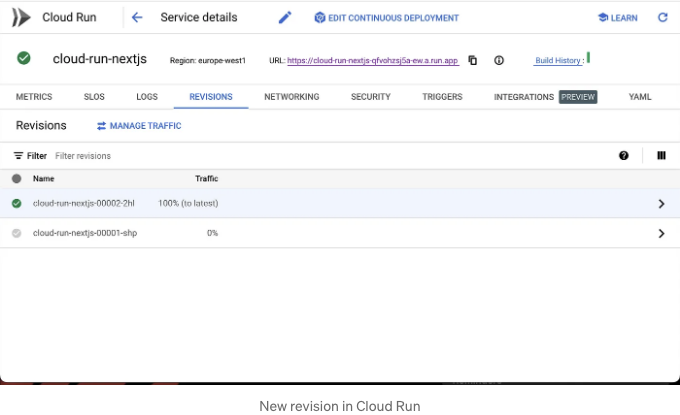

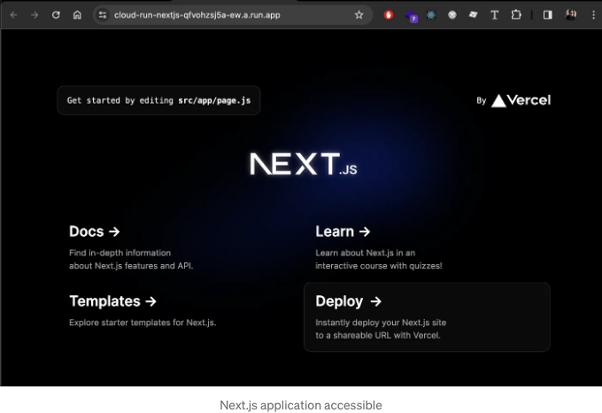

## 사용자 정의 도메인 이름 사용하기

<!-- ui-log 수평형 -->
<ins class="adsbygoogle"
  style="display:block"
  data-ad-client="ca-pub-4877378276818686"
  data-ad-slot="9743150776"
  data-ad-format="auto"
  data-full-width-responsive="true"></ins>
<component is="script">
(adsbygoogle = window.adsbygoogle || []).push({});
</component>

만약 여러분이 여기까지 오셨다면, 아마 마지막으로 할 일은 자신만의 사용자 정의 도메인 이름을 연동하는 것이겠죠. 이 작업을 하려면 구글 클라우드의 Cloud Run 홈페이지로 이동한 다음 상단 내비게이션 바에서 "사용자 정의 도메인 관리"를 누르신 후 다음 페이지에서 "매핑 추가"를 누르세요.

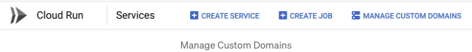

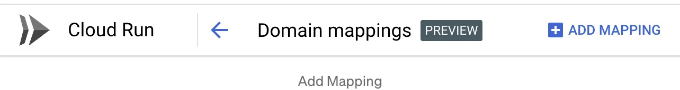

"사용자 정의 도메인 추가" 창이 나타나면, 새로운 서비스를 매핑할 도메인을 선택한 다음, "Cloud Run 도메인 매핑" 옵션을 선택하세요.

<!-- ui-log 수평형 -->
<ins class="adsbygoogle"
  style="display:block"
  data-ad-client="ca-pub-4877378276818686"
  data-ad-slot="9743150776"
  data-ad-format="auto"
  data-full-width-responsive="true"></ins>
<component is="script">
(adsbygoogle = window.adsbygoogle || []).push({});
</component>


새 모달이 열릴 것입니다. 목록에서 도메인을 선택하십시오 (참고: 구글 계정에 추가하기 위해서는 해당 도메인이 확인되어야 합니다. 이는 드롭다운에서 "새 도메인 확인하기..."를 선택하여 수행할 수 있습니다).

이 예시에서는 서브도메인에 사이트를 설정하겠지만, 원한다면 베이스 도메인에도 설정할 수 있습니다:


<!-- ui-log 수평형 -->
<ins class="adsbygoogle"
  style="display:block"
  data-ad-client="ca-pub-4877378276818686"
  data-ad-slot="9743150776"
  data-ad-format="auto"
  data-full-width-responsive="true"></ins>
<component is="script">
(adsbygoogle = window.adsbygoogle || []).push({});
</component>

계속 버튼을 누르면 도메인 등록기 사이트에서 업데이트해야 할 DNS 레코드가 표시됩니다.

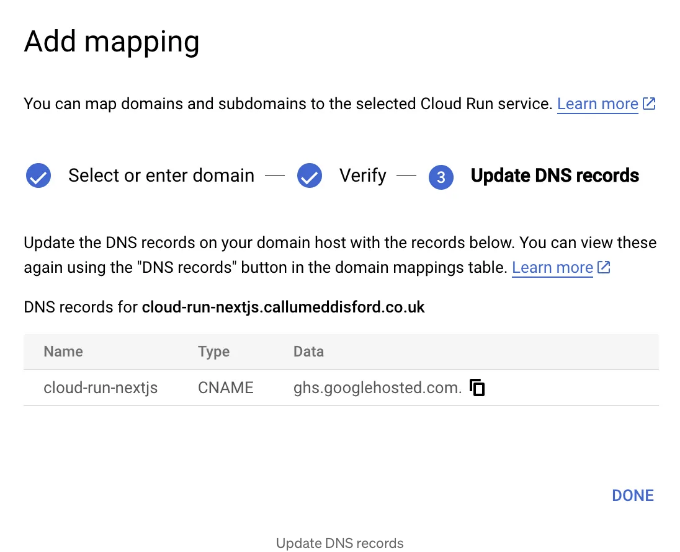

DNS 레코드를 추가하는 방법은 등록기마다 다를 수 있지만, 결국 프로세스는 동일합니다. 제 경우에는 다음과 같이 보입니다:

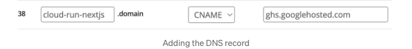

<!-- ui-log 수평형 -->
<ins class="adsbygoogle"
  style="display:block"
  data-ad-client="ca-pub-4877378276818686"
  data-ad-slot="9743150776"
  data-ad-format="auto"
  data-full-width-responsive="true"></ins>
<component is="script">
(adsbygoogle = window.adsbygoogle || []).push({});
</component>

구글 클라우드에서 제공된 값과 일치하는 것을 확인할 수 있습니다. 때로는 DNS 레코드가 적용되는 데 시간이 걸릴 수 있으니, 시간이 지난 후에 사이트를 다시 확인하면 사이트가 작동 중일 것입니다!

이 데모가 작동 중인 링크는 다음과 같습니다: https://cloud-run-nextjs.callumeddisford.co.uk

이 데모에 사용된 저장소 링크는 다음과 같습니다: https://github.com/CallumEddisford/cloud-run-nextjs

이 가이드를 즐기셨기를 바라며, 모든 것이 원활하게 진행되었기를 희망합니다!

<!-- ui-log 수평형 -->
<ins class="adsbygoogle"
  style="display:block"
  data-ad-client="ca-pub-4877378276818686"
  data-ad-slot="9743150776"
  data-ad-format="auto"
  data-full-width-responsive="true"></ins>
<component is="script">
(adsbygoogle = window.adsbygoogle || []).push({});
</component>

재밌게 개발해보세요! 🎉