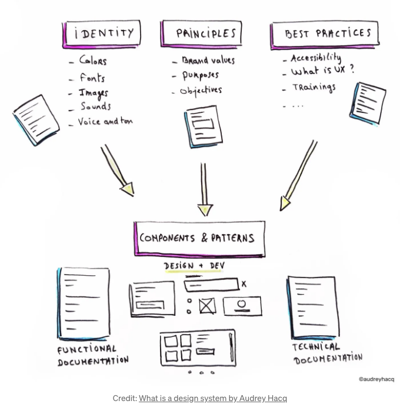

요즘에는 디지털 공간에서 일하는 대부분의 전문가들이 디자인 시스템에 익숙합니다. 혹시 디자인 시스템이 무엇인지 궁금하다면?

디자인 시스템은 조직의 정체성을 구축하기 위해 구성 요소와 패턴을 안내하는 지침, 원칙 및 모범 사례가 포함된 포털입니다. 다음과 같은 내용이 포함되어 있습니다:

- 시각적 정체성: 브랜드 색상, 이미지, 타이포그래피...
- 원칙: 음성과 어조, 브랜드 가치, 목표...
- 모범 사례: 접근성, 사용자 경험, 교육 자료...
- 구성 요소와 패턴: 디지털 제품의 기본 구성 요소

어떻게 보이시나요? :)

<!-- ui-log 수평형 -->
<ins class="adsbygoogle"
  style="display:block"
  data-ad-client="ca-pub-4877378276818686"
  data-ad-slot="9743150776"
  data-ad-format="auto"
  data-full-width-responsive="true"></ins>
<component is="script">
(adsbygoogle = window.adsbygoogle || []).push({});
</component>

만약 디자인 시스템에 대해 좀 더 알고 싶다면, Audrey Hacq가 쓴 아주 좋은 글을 읽어보세요. 디자인 시스템이 무엇인지 설명하고 있어요.

다양한 조직이 자신들의 디지털 공간을 구축하기 위해 사용하는 몇 가지 디자인 시스템이 있습니다:

## 기업 부문:

<!-- ui-log 수평형 -->
<ins class="adsbygoogle"
  style="display:block"
  data-ad-client="ca-pub-4877378276818686"
  data-ad-slot="9743150776"
  data-ad-format="auto"
  data-full-width-responsive="true"></ins>
<component is="script">
(adsbygoogle = window.adsbygoogle || []).push({});
</component>

- Adobe — Spectrum
- Google- Material Design
- Saleforce- Lightning Design System
- Audi — UI
- Apple — Human Interface Guidelines
- Shopify — Polaris
- Microsoft — Fluent
- BBC — Global Experience Language (GEL)
- Atlassian Design System

## 공공 부문:

- Gov.uk — Design System
- Australian Government — Design System
- U.S. Web Design System (USWDS)
- NSW — Government
- Canada Post- Mercury
- Government of Canada

이 외에도 많은 우수한 디자인 시스템이 있습니다.

<!-- ui-log 수평형 -->
<ins class="adsbygoogle"
  style="display:block"
  data-ad-client="ca-pub-4877378276818686"
  data-ad-slot="9743150776"
  data-ad-format="auto"
  data-full-width-responsive="true"></ins>
<component is="script">
(adsbygoogle = window.adsbygoogle || []).push({});
</component>

# 컴포넌트 및 패턴

컴포넌트를 그룹화하는 다양한 방법에 대해 이야기하기 전에 컴포넌트가 무엇인지, 그리고 패턴과는 어떻게 다른지 명확히 해보겠습니다. 이렇게 함으로써 다양한 조직에서 이들을 다르게 사용하는 것에 대해 이해할 수 있습니다.

컴포넌트는 디지털 공간의 기본 구성 요소를 형성하는 재사용 가능한 UI 요소입니다. 예를 들어, 배너, 버튼, 체크박스, 스피너, 툴팁 등이 있습니다.

패턴은 공통 사용자 문제를 해결하는 반복 가능한 재사용 가능한 컴포넌트의 조합입니다. 예를 들어, Adobe가 지적한 '카드'는 카드 컨테이너, 미리보기(이미지/일러스트), 아바타 또는 로고, 액션 메뉴, 푸터 등으로 구성되어 있습니다.

<!-- ui-log 수평형 -->
<ins class="adsbygoogle"
  style="display:block"
  data-ad-client="ca-pub-4877378276818686"
  data-ad-slot="9743150776"
  data-ad-format="auto"
  data-full-width-responsive="true"></ins>
<component is="script">
(adsbygoogle = window.adsbygoogle || []).push({});
</component>

디자인 시스템에는 각 조직마다 독특하게 만드는 다양한 정보가 많이 있지만, 컴포넌트들은 그것의 중요한 부분입니다. 그것에 대해 오늘은 이야기할 거예요. 커피를 들고 오세요, 제가 보여줄게요:

- 각각의 장단점을 고려하여 컴포넌트를 그룹화하는 다양한 방법
- 그룹의 명칭 지정

매일 이러한 시스템을 사용해야 하는 UX/ 제품 디자이너의 관점에서 전달합니다.

# 컴포넌트 그룹화

<!-- ui-log 수평형 -->
<ins class="adsbygoogle"
  style="display:block"
  data-ad-client="ca-pub-4877378276818686"
  data-ad-slot="9743150776"
  data-ad-format="auto"
  data-full-width-responsive="true"></ins>
<component is="script">
(adsbygoogle = window.adsbygoogle || []).push({});
</component>

디지털 공간에서 규모에 따라 조직은 10개에서 100개 이상의 컴포넌트 라이브러리를 포함할 수 있습니다. 이러한 컴포넌트를 그룹화하는 세 가지 일반적인 방법은 다음과 같습니다:

- 알파벳순
- 복잡도 기반 그룹화
- 기능 그룹화

## 1. 알파벳순

컴포넌트를 알파벳순으로 나열하는 것이 가장 간단한 방법입니다. 이는 기술적으로 컴포넌트를 "그룹화"하는 것은 아니지만, 자주 볼 수 있어 언급할 가치가 있습니다.

<!-- ui-log 수평형 -->
<ins class="adsbygoogle"
  style="display:block"
  data-ad-client="ca-pub-4877378276818686"
  data-ad-slot="9743150776"
  data-ad-format="auto"
  data-full-width-responsive="true"></ins>
<component is="script">
(adsbygoogle = window.adsbygoogle || []).push({});
</component>

**이점:**

a. 디자인 시스템 게이트키퍼 및 자주 사용하는 사용자에게는 바보같이 명확한 알파벳 순서로 된 간단한 목록입니다.

b. 확장이 쉽습니다.

<!-- ui-log 수평형 -->
<ins class="adsbygoogle"
  style="display:block"
  data-ad-client="ca-pub-4877378276818686"
  data-ad-slot="9743150776"
  data-ad-format="auto"
  data-full-width-responsive="true"></ins>
<component is="script">
(adsbygoogle = window.adsbygoogle || []).push({});
</component>

장점:

- 라이브러리의 구성을 간단하게 유지합니다.
- 컴포넌트를 찾기 쉽게 만들어줍니다.

단점:

- 무엇을 찾고 있는지 알아야 합니다.

<!-- ui-log 수평형 -->
<ins class="adsbygoogle"
  style="display:block"
  data-ad-client="ca-pub-4877378276818686"
  data-ad-slot="9743150776"
  data-ad-format="auto"
  data-full-width-responsive="true"></ins>
<component is="script">
(adsbygoogle = window.adsbygoogle || []).push({});
</component>

b. 각 구성 요소의 명명에 익숙해져야 합니다.

c. 귀하의 조직에 새로 합류한 회원에게는 악몽일 수 있습니다.

d. 다른 솔루션을 찾기 위한 발견 가능성이 최적이 아닙니다.

찾을 수 있는 것과 발견할 수 있는 것은 서로 다릅니다. 이 훌륭한 기사를 통해 그에 대해 더 알아보세요. - Sumeet

<!-- ui-log 수평형 -->
<ins class="adsbygoogle"
  style="display:block"
  data-ad-client="ca-pub-4877378276818686"
  data-ad-slot="9743150776"
  data-ad-format="auto"
  data-full-width-responsive="true"></ins>
<component is="script">
(adsbygoogle = window.adsbygoogle || []).push({});
</component>

## 2. 복잡성에 기반한 그룹화

이 방법은 구성 요소를 더 작고 식별 가능한 부분으로 분해할 수 있는 능력에 따라 그룹화하는 것을 의미합니다. 이 방법론은 Brad Frost가 쓴 책 Atomic Design에서 제안한 것입니다. 이 방법은 이 책에서 언급된 중첩된 분류법의 프레임워크에 기반을 두고 있습니다.

장점:

<!-- ui-log 수평형 -->
<ins class="adsbygoogle"
  style="display:block"
  data-ad-client="ca-pub-4877378276818686"
  data-ad-slot="9743150776"
  data-ad-format="auto"
  data-full-width-responsive="true"></ins>
<component is="script">
(adsbygoogle = window.adsbygoogle || []).push({});
</component>

a. 세워진 규칙과 엄격한 통제가 이미 갖춰진 성숙한 디자인 시스템 및 디자인 시스템 팀에게 탁월한 효과를 발휘합니다.

b. 원자 수준 항목을 조합하여 분자 및 유기체 수준 구성 요소를 형성하는 창의적 유연성에 대한 우수한 선택지입니다. 따라서 매우 엄격한 규칙으로 관리되어야 하며 명확히 정의된 비전이 필요합니다.

c. 각 팀원이 이해해야 하는 수준이 어떻게 정의되는지에 대한 심층적인 이해도 필요합니다(임의의 프로젝트의 모든 팀원이 프로젝트를 시작하기 전에 레고 블록이 어떻게 함께 작동하는지 알아야 합니다. 따라서 명확히 정의된 비전 - 건물 대우주선)

d. 팀이 비교적 작거나 다양하지 않을 때도 훌륭한 선택지입니다.

<!-- ui-log 수평형 -->
<ins class="adsbygoogle"
  style="display:block"
  data-ad-client="ca-pub-4877378276818686"
  data-ad-slot="9743150776"
  data-ad-format="auto"
  data-full-width-responsive="true"></ins>
<component is="script">
(adsbygoogle = window.adsbygoogle || []).push({});
</component>

단점:

a. 엄격한 통제가 필요합니다.

b. 모든 사람이 익숙한 명확히 정의된 조직 수준의 비전이 필요합니다.

c. 조직이 성장함에 따라 "어디에 무엇을 넣어야 하는가?"라는 질문이 쉽게 생길 수 있습니다. 회사가 성장하고 새로운 프로그래머, 디자이너, 기획자, 다른 비즈니스 부서, 컬러 팔레트, 타이포그래피, 패턴, 페이지 템플릿, 마케팅 솔루션 등이 나타나면 디지털 제품에서 불일치가 생기고 유지 보수 비용이 증가합니다. 새로운 고용은 엔트로피를 높입니다.

<!-- ui-log 수평형 -->
<ins class="adsbygoogle"
  style="display:block"
  data-ad-client="ca-pub-4877378276818686"
  data-ad-slot="9743150776"
  data-ad-format="auto"
  data-full-width-responsive="true"></ins>
<component is="script">
(adsbygoogle = window.adsbygoogle || []).push({});
</component>

d. 매우 엄격하게 관리하지 않으면 '덤프 지역'이 될 위험이 있습니다.

## 3. 기능적 그룹화

이는 구성 요소의 사용 방식, 함께 해결하려는 문제, 즉 제공하는 기능에 따라 기준을 설정합니다.

<!-- ui-log 수평형 -->
<ins class="adsbygoogle"
  style="display:block"
  data-ad-client="ca-pub-4877378276818686"
  data-ad-slot="9743150776"
  data-ad-format="auto"
  data-full-width-responsive="true"></ins>
<component is="script">
(adsbygoogle = window.adsbygoogle || []).push({});
</component>

장점:

a. 그들은 해결하려는 공통 문제에 의해 명확하게 정의됩니다.

b. 구성 요소의 오용 가능성을 줄이고 미디어/장치에 관계없이 비슷한 디지털 제품에서 일관성을 촉진합니다. 심리학에서 라벨링 이론은 사람에게 적용되지만, 이 경우에도 관련이 있습니다.

c. 공통 (문제) 범주 아래에 있는 다른 유사한 구성 요소를 찾아주어 대체 솔루션을 찾고 발견할 수 있도록 도와줍니다.

<!-- ui-log 수평형 -->
<ins class="adsbygoogle"
  style="display:block"
  data-ad-client="ca-pub-4877378276818686"
  data-ad-slot="9743150776"
  data-ad-format="auto"
  data-full-width-responsive="true"></ins>
<component is="script">
(adsbygoogle = window.adsbygoogle || []).push({});
</component>

d. 그룹들은 나중에 확장할 수 있습니다.

e. 그룹 이름에 대한 친숙함과 함께 해결하려는 문제와 결부된 것이 빠르게 솔루션에 도달하는 데 도움이 됩니다.

f. 모든 프로젝트 구성원, 디자이너 또는 비디자이너는 문제에 대한 올바른 솔루션에 도달할 수 있습니다. 그것은 매우 '실패 방지' 방법입니다.

단점:

<!-- ui-log 수평형 -->
<ins class="adsbygoogle"
  style="display:block"
  data-ad-client="ca-pub-4877378276818686"
  data-ad-slot="9743150776"
  data-ad-format="auto"
  data-full-width-responsive="true"></ins>
<component is="script">
(adsbygoogle = window.adsbygoogle || []).push({});
</component>

a. 올바른 기능 그룹에 구성 요소가 할당되는지 확인하는 감독이 필요합니다.

## 구성 요소 그룹화에 대한 결론

- 사용자들이 성공할 수 있도록 설정하는 것이 진정한 도전입니다. UX 전문가로서 우리의 주요 역할은 어떠한 문제에도 '실패 방지' 솔루션을 제공하는 것입니다.

<!-- ui-log 수평형 -->
<ins class="adsbygoogle"
  style="display:block"
  data-ad-client="ca-pub-4877378276818686"
  data-ad-slot="9743150776"
  data-ad-format="auto"
  data-full-width-responsive="true"></ins>
<component is="script">
(adsbygoogle = window.adsbygoogle || []).push({});
</component>

2. 사용자의 인지 부하를 줄이는 것은 우리가 영원히 책임져야 하는 또 다른 중요한 작업입니다. 힉의 법칙에서 명확히 언급되었듯이

사용자의 선택을 단순화함으로써 사용자의 인지 부하를 줄여야 합니다. 사용자는 원자 구성 요소와 분자 구성 요소의 차이를 이해할 수도 이해하지 못할 수도 있습니다.

3. 머어 노출 효과에 의해 설명된 것처럼 사용자들은 항상 익숙한 것을 선호합니다.

이미 익숙한 옵션을 사용자에게 제공하세요. 가장 이상적인 방법은 사용자가 해결하려는 문제를 기반으로 선택해야 합니다. 모든 조직은 동일한 구성 요소에 대해 서로 다른 이름을 사용합니다. 예: 바텀 내비게이션 대 비터. 새로 조직에 합류한 멤버들이 필요한 것을 찾기가 매우 어려워집니다. 그러나 디자이너로서 예를 들어 스크롤 문제를 해결하려고 한다면, 익숙한 문제로 식별하는 것은 해결책을 찾기가 매우 쉬워집니다.

<!-- ui-log 수평형 -->
<ins class="adsbygoogle"
  style="display:block"
  data-ad-client="ca-pub-4877378276818686"
  data-ad-slot="9743150776"
  data-ad-format="auto"
  data-full-width-responsive="true"></ins>
<component is="script">
(adsbygoogle = window.adsbygoogle || []).push({});
</component>

## 구성 요소 그룹화에 대한 최종 권고

당신의 조직에 적합한 솔루션을 선택하는 데에는 독특한 매개변수에 기반할 수 있지만 대부분의 경우에는 기능 그룹화가 사용자가 원하는 구성 요소로 빠르고 쉽게 이동할 수 있게 해줍니다.

# (기능) 그룹의 명명

기능 그룹의 이름을 선택하기 전에 고려해야 할 사항 몇 가지가 있습니다.

<!-- ui-log 수평형 -->
<ins class="adsbygoogle"
  style="display:block"
  data-ad-client="ca-pub-4877378276818686"
  data-ad-slot="9743150776"
  data-ad-format="auto"
  data-full-width-responsive="true"></ins>
<component is="script">
(adsbygoogle = window.adsbygoogle || []).push({});
</component>

- 카테고리에 선택된 이름은 사용자들이 내부 구성 요소와 작업하는 방식을 결정합니다.

2. 카테고리의 효과적인 이름은 구성 요소가 사용되는 방식을 결정하고 모두에 의해 일관되게 사용되도록 돕습니다.

3. 효과적인 카테고리 이름은 팀이 내부 구성 요소를 올바르고 일관되게 사용하는 데 도움을 줍니다.

그래서 효과적인 카테고리 이름이란 무엇일까요?

<!-- ui-log 수평형 -->
<ins class="adsbygoogle"
  style="display:block"
  data-ad-client="ca-pub-4877378276818686"
  data-ad-slot="9743150776"
  data-ad-format="auto"
  data-full-width-responsive="true"></ins>
<component is="script">
(adsbygoogle = window.adsbygoogle || []).push({});
</component>

- 그룹에 대한 표현적인 이름을 피하세요.
- 구성 요소의 기능을 설명하세요.

## 마무리

구성 요소를 그룹화하고 명명하는 것은 각 조직의 구조, 팀 규모, 확장에 대한 열망 등에 따라 고유합니다. `일상에 적합한 답`은 없습니다. 시간이 흐를수록 확장 가능하면서 엔트로피를 최소화하는 디자인 시스템을 설계하는 것은 항상 도전입니다. 기본 인지 원칙에 따라 창의적인 솔루션이 항상 새로운 구성 요소가 추가될 때마다 재고하고 개선할 필요가 없는 제품으로 이어질 것입니다.