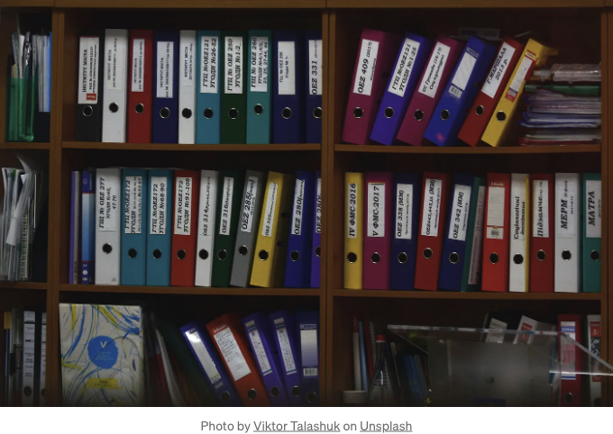

## React 앱에서 인터랙티브 PDF 뷰어를 만들어 보세요! PDF 문서를 표시하고 사용자 정의하는 다양한 방법과 라이브러리를 배웁니다. #React #PDFViewer

웹 개발 분야에서 PDF 문서를 표시하는 것은 많은 애플리케이션에 대한 일반적인 요구 사항이 되었습니다. React는 사용자 인터페이스를 구축하는 인기 있는 JavaScript 라이브러리로, PDF 파일을 효율적으로 처리하고 표시하는 다양한 방법을 제공합니다. 본 글에서는 React 애플리케이션에서 PDF 문서를 표시하는 다양한 방법을 탐색해보겠습니다.



## `<iframe>` 요소 사용하기:

<!-- ui-log 수평형 -->
<ins class="adsbygoogle"
  style="display:block"
  data-ad-client="ca-pub-4877378276818686"
  data-ad-slot="9743150776"
  data-ad-format="auto"
  data-full-width-responsive="true"></ins>
<component is="script">
(adsbygoogle = window.adsbygoogle || []).push({});
</component>

React에서 PDF 문서를 표시하는 가장 간단한 방법은 ``iframe`` 요소를 사용하는 것입니다. PDF 파일을 ``iframe`` 태그 내에 임베드하고 소스를 PDF 파일의 URL로 설정할 수 있습니다.

## 여기 예시가 있습니다:

```js
import React from ‘react’;

const PDFViewer = () => {
 return (
 <div>
 <iframe src=”path_to_pdf_file.pdf” width=”100%” height=”500px” />
 </div>
 );
};
export default PDFViewer;
```

이 방법은 기본적인 상황에 잘 작동하지만 제한 사항이 있습니다. ``iframe`` 요소는 PDF 렌더링을 처리하기 위해 사용자의 브라우저에 의존하며 기능 및 사용자 경험 측면에서 다양할 수 있습니다.

<!-- ui-log 수평형 -->
<ins class="adsbygoogle"
  style="display:block"
  data-ad-client="ca-pub-4877378276818686"
  data-ad-slot="9743150776"
  data-ad-format="auto"
  data-full-width-responsive="true"></ins>
<component is="script">
(adsbygoogle = window.adsbygoogle || []).push({});
</component>

## 장점:

- 간단한 구현:
`iframe`을 사용하여 PDF 문서를 임베드하는 것은 간편하며 최소한의 코드만 필요합니다.
- 브라우저 호환성:
PDF 파일의 렌더링이 사용자의 브라우저에서 처리되므로 다양한 브라우저 간 호환성이 보장됩니다.

## 단점:

- 제한된 사용자 정의:
`iframe` 요소는 PDF 뷰어 경험에 대한 제어를 제공해주지 않습니다. 사용자 정의 옵션은 너비와 높이와 같은 기본 속성으로 제한됩니다.
- 일관성 없는 사용자 경험:
PDF 뷰어의 외관과 동작이 사용자의 브라우저 및 설정에 따라 달라질 수 있어 사용자들에게 일관된 경험을 제공하는 데 어려움을 줄 수 있습니다.

<!-- ui-log 수평형 -->
<ins class="adsbygoogle"
  style="display:block"
  data-ad-client="ca-pub-4877378276818686"
  data-ad-slot="9743150776"
  data-ad-format="auto"
  data-full-width-responsive="true"></ins>
<component is="script">
(adsbygoogle = window.adsbygoogle || []).push({});
</component>

## PDF 뷰어 라이브러리 사용하기:

PDF 뷰어 라이브러리를 사용하면 PDF 뷰잉 경험을 더 세밀하게 제어할 수 있습니다. React 전용으로 구축된 PDF 뷰어 라이브러리를 활용할 수 있습니다. 이러한 라이브러리는 줌, 검색, PDF 문서 내에서 탐색 등과 같은 기능을 제공하며 사용자 정의 가능한 컴포넌트도 제공합니다.

`react-pdf`는 PDF.js를 통합하여 인기 있는 라이브러리 중 하나입니다. 아래는 `react-pdf`를 사용하는 예시입니다:

```js
import React from 'react';
import { Document, Page } from 'react-pdf';

const PDFViewer = () => {
    const pdfURL = 'path_to_pdf_file.pdf';
    return (
        <div>
            <Document file={pdfURL}>
                <Page pageNumber={1} />
            </Document>
        </div>
    );
};

export default PDFViewer;
```

<!-- ui-log 수평형 -->
<ins class="adsbygoogle"
  style="display:block"
  data-ad-client="ca-pub-4877378276818686"
  data-ad-slot="9743150776"
  data-ad-format="auto"
  data-full-width-responsive="true"></ins>
<component is="script">
(adsbygoogle = window.adsbygoogle || []).push({});
</component>

`react-pdf`을 사용하면 특정 페이지를 렌더링하고 레이아웃을 사용자 정의하며 사용자 상호작용을 쉽게 처리할 수 있습니다.

## 장점:

- 향상된 사용자 경험:
react-pdf와 같은 PDF 뷰어 라이브러리를 사용하면 확대/축소, 검색, PDF 문서 내에서 탐색 등의 기능이 있는 일관되고 사용자 정의 가능한 사용자 경험을 제공할 수 있습니다.
- 세밀한 제어:
특정 페이지를 렌더링하고 레이아웃을 사용자 정의하며 사용자 상호작용을 쉽게 처리하여 사용자에게 더 맞춤화된 경험을 제공할 수 있습니다.

## 단점:

<!-- ui-log 수평형 -->
<ins class="adsbygoogle"
  style="display:block"
  data-ad-client="ca-pub-4877378276818686"
  data-ad-slot="9743150776"
  data-ad-format="auto"
  data-full-width-responsive="true"></ins>
<component is="script">
(adsbygoogle = window.adsbygoogle || []).push({});
</component>

- 학습 곡선:
PDF 뷰어 라이브러리를 통합하고 사용하는 것은 해당 라이브러리의 API를 배우고 이해하는 추가적인 노력이 필요할 수 있습니다.
- 번들 크기 증가:
PDF 뷰어 라이브러리를 사용하면 프로젝트에 추가적인 종속성이 필요해져 번들 크기가 커질 수 있습니다. 페이지 로드 시간에 영향을 피하기 위해 번들 크기를 최적화하는 것이 중요합니다.

## PDF 뷰어 경험 향상:

PDF 뷰어 경험을 더 향상시키기 위해 추가적인 기능과 사용자 상호작용을 추가할 수 있습니다. 예를 들어 페이지네이션, 목차, 하이라이팅, 주석과 같은 기능을 구현할 수 있습니다.

이를 위해 React를 `pdfjs-dist`나 `pdf-lib`와 같은 다른 라이브러리와 결합할 수 있습니다. 이러한 라이브러리는 PDF 문서를 조작하고 텍스트를 추출하며 주석을 추가하는 등의 저수준 API를 제공합니다. 이러한 라이브러리를 사용하여 사용자 지정 컴포넌트를 생성하고 특정 요구 사항에 맞는 풍부한 PDF 뷰어를 만들 수 있습니다.

<!-- ui-log 수평형 -->
<ins class="adsbygoogle"
  style="display:block"
  data-ad-client="ca-pub-4877378276818686"
  data-ad-slot="9743150776"
  data-ad-format="auto"
  data-full-width-responsive="true"></ins>
<component is="script">
(adsbygoogle = window.adsbygoogle || []).push({});
</component>

## 장점:

- 맞춤형 기능:
React와 pdfjs-dist 또는 pdf-lib와 같은 낮은 수준의 PDF 조작 라이브러리를 결합하여 페이지네이션, 목차, 하이라이팅 및 주석과 같은 구체적인 기능을 구현할 수 있는 사용자 정의 구성 요소를 만들 수 있습니다.
- 유연성:
이러한 라이브러리를 사용하면 PDF 문서를 더 많은 제어할 수 있어 텍스트 추출, 페이지 조작 및 요구 사항에 따른 고급 작업을 수행할 수 있습니다.

## 단점:

- 복잡한 구현:
추가 기능을 갖춘 사용자 정의 PDF 뷰어를 구축하려면 PDF 파일 구조에 대한 심층적인 이해와 선택된 PDF 조작 라이브러리가 제공하는 API에 대한 이해가 필요합니다.
- 유지 및 업데이트:
PDF 표준이 발전하고 라이브러리가 업데이트되는 경우, 사용자 정의 PDF 뷰어를 최신 상태로 유지하고 새로운 버전의 PDF 조작 라이브러리와의 호환성을 보장하기 위해 시간을 투자해야 할 수도 있습니다.

<!-- ui-log 수평형 -->
<ins class="adsbygoogle"
  style="display:block"
  data-ad-client="ca-pub-4877378276818686"
  data-ad-slot="9743150776"
  data-ad-format="auto"
  data-full-width-responsive="true"></ins>
<component is="script">
(adsbygoogle = window.adsbygoogle || []).push({});
</component>

## 고려해야 할 몇 가지 모범 사례:

- PDF 파일 크기 최적화:
— PDF 문서를 압축하여 파일 크기를 줄입니다. 이렇게 하면 더 빠른 로딩과 향상된 성능을 얻을 수 있습니다.
— PDF 파일에서 불필요한 요소나 페이지를 제거하여 파일 크기를 최소화하는 것을 고려해보세요.
- Lazy Loading:
— PDF 문서가 사용자에게 표시될 때만로드되도록 레이지 로딩 기술을 구현하세요. 이 접근 방식은 초기 페이지 로드 시간을 향상시키고 전체 자원 소비를 줄입니다.
- PDF Viewer 라이브러리 사용:
— react-pdf나 pdf.js와 같은 PDF 뷰어 라이브러리를 활용하여 PDF 렌더링을 처리하고 줌, 검색, 탐색 등의 기능을 제공하여 사용자 경험을 향상시킬 수 있습니다.
— 이러한 라이브러리는 PDF 렌더링의 복잡성을 추상화하고 편리한 컴포넌트 및 API를 제공하여 작업을 진행할 수 있습니다.
- 반응형 디자인:
— PDF 뷰어 컴포넌트가 반응형이며 다양한 화면 크기에 적응하는지 확인하세요. 이를 통해 데스크톱, 태블릿, 모바일 기기를 포함한 다양한 디바이스에서 PDF 문서를 편안하게 볼 수 있습니다.

## 접근성 고려 사항:

- PDF 뷰어 컴포넌트에 대체 텍스트 제공, 키보드로 탐색을 가능하게 하는 등 PDF 컨텐츠가 스크린 리더에 접근 가능하도록 접근성 기능을 구현하세요.
- 장애가 있는 사용자를 위해 PDF 문서를 접근할 수 있도록 하기 위해 WCAG(Web Content Accessibility Guidelines)를 준수하세요.

<!-- ui-log 수평형 -->
<ins class="adsbygoogle"
  style="display:block"
  data-ad-client="ca-pub-4877378276818686"
  data-ad-slot="9743150776"
  data-ad-format="auto"
  data-full-width-responsive="true"></ins>
<component is="script">
(adsbygoogle = window.adsbygoogle || []).push({});
</component>

## 오류 처리:

- PDF 문서를 로드하거나 렌더링할 때 오류를 효과적으로 처리하세요. 문제가 발생했을 경우 유용한 오류 메시지 또는 대체 콘텐츠를 표시하여 사용자 경험을 보호해 주세요.

## 보안 고려 사항:

- 민감하거나 기밀적인 PDF 문서를 다룰 때 주의하세요. 문서를 무단 액세스나 다운로드로부터 보호하기 위한 적절한 보안 조치를 시행하세요.

<!-- ui-log 수평형 -->
<ins class="adsbygoogle"
  style="display:block"
  data-ad-client="ca-pub-4877378276818686"
  data-ad-slot="9743150776"
  data-ad-format="auto"
  data-full-width-responsive="true"></ins>
<component is="script">
(adsbygoogle = window.adsbygoogle || []).push({});
</component>

## 테스트:

- 서로 다른 브라우저 및 장치에서 PDF 뷰어 구성 요소를 철저히 테스트하여 일관된 작동과 호환성을 확인하십시오.
- 다양한 PDF 문서 유형 및 크기로 테스트하여 뷰어의 성능과 응답성을 검증하십시오.

## 문서화:

- PDF 뷰어 구성 요소의 사용법 및 구성 옵션을 문서화하십시오. 다른 개발자들이 프로젝트에 PDF 뷰어를 통합하고 사용자화하기 쉽도록 명확한 지침과 예제를 제공하십시오.

<!-- ui-log 수평형 -->
<ins class="adsbygoogle"
  style="display:block"
  data-ad-client="ca-pub-4877378276818686"
  data-ad-slot="9743150776"
  data-ad-format="auto"
  data-full-width-responsive="true"></ins>
<component is="script">
(adsbygoogle = window.adsbygoogle || []).push({});
</component>

## 최신 소식 받아보기:

- 사용 중인 PDF 뷰어 라이브러리의 업데이트 및 릴리스를 주시하세요. 정기적으로 종속성을 업데이트하여 버그 수정, 성능 향상 및 새로운 기능을 활용해보세요.

## 요약:

React 애플리케이션에서 PDF 문서를 표시하는 것은 원하는 수준의 사용자 정의 및 기능에 따라 여러 방법으로 달성할 수 있습니다. 단순한 `iframe` 요소 사용부터 `react-pdf`와 같은 PDF 뷰어 라이브러리를 활용하는 방법까지, React는 PDF 파일을 처리하는 유연성을 제공합니다. 다양한 접근 방식을 탐색하고 추가 라이브러리를 활용하여 React 애플리케이션 내에서 사용자에게 원활한 PDF 뷰잉 경험을 제공할 수 있습니다.

<!-- ui-log 수평형 -->
<ins class="adsbygoogle"
  style="display:block"
  data-ad-client="ca-pub-4877378276818686"
  data-ad-slot="9743150776"
  data-ad-format="auto"
  data-full-width-responsive="true"></ins>
<component is="script">
(adsbygoogle = window.adsbygoogle || []).push({});
</component>

위의 글이 더 잘 이해되었기를 바랍니다. 이 글에서 다룬 내용에 관한 질문이나 개선할 부분이 있으면 망설이지 말고 아래에 댓글을 남겨주세요.