## 자신의 포트폴리오에 연구 내용을 표시할 때 주의할 점은 무엇일까요? 과도한 양은 어떨 때인가요? 고용 관리자 및 채용 담당자들의 흥미를 유지하는 방법에 대해 알아보세요!

고용 관리자로서, 올바른 균형을 찾아서 UX 연구를 표시할 때 가장 흔히 접하는 실수를 피해 드릴게요.

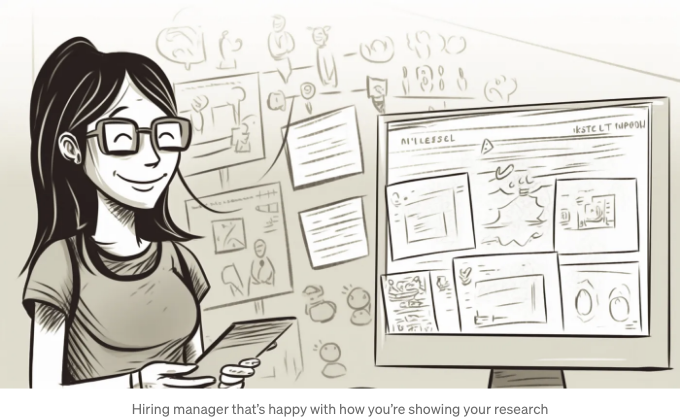
# 왜? 목표는 무엇인가요?

<!-- ui-log 수평형 -->
<ins class="adsbygoogle"
  style="display:block"
  data-ad-client="ca-pub-4877378276818686"
  data-ad-slot="9743150776"
  data-ad-format="auto"
  data-full-width-responsive="true"></ins>
<component is="script">
(adsbygoogle = window.adsbygoogle || []).push({});
</component>

수백 가지의 UX 연구 방법이 있지만, 왜 이 프로젝트에 이 방법을 선택했나요? 이 방법이 도와준 목표는 무엇이었나요? 포트폴리오를 검토하는 사람들이 일반적으로 이 방법이 어디에 사용되는지 알 것이라고 가정하지 마세요. 당신의 일은 그들이 아는 것이 아니라, 당신이 이해하는 것을 보여주는 것입니다.

여기에서 머릴린이 인터뷰를 진행하여 "초기 발견을 검증하고 사람들이 현재 어떻게 습관을 형성하고 그들의 동기와 어려움을 어떻게 이해하는지 추가로 파악했습니다."

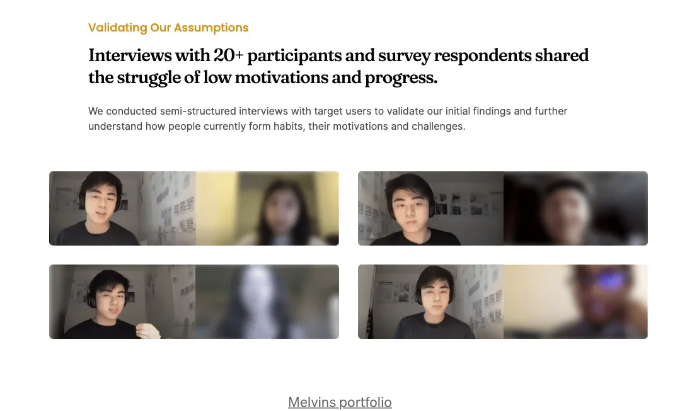

그리고 미란다는 경쟁 분석을 통해 다른 앱의 음식 공유 과정을 팀에 익히게 했습니다.

<!-- ui-log 수평형 -->
<ins class="adsbygoogle"
  style="display:block"
  data-ad-client="ca-pub-4877378276818686"
  data-ad-slot="9743150776"
  data-ad-format="auto"
  data-full-width-responsive="true"></ins>
<component is="script">
(adsbygoogle = window.adsbygoogle || []).push({});
</component>

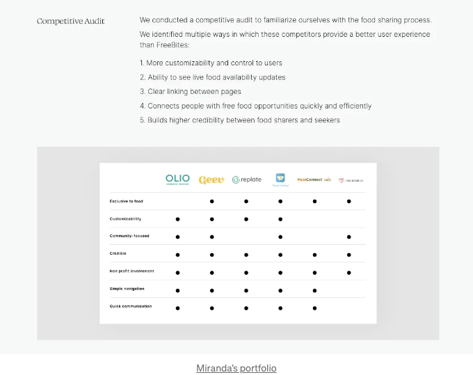

경쟁 분석에 대해 이야기하자면, 저는 현재 경쟁 기능 분석을 어떻게 수행할지에 대한 간결한 코스를 제작 중입니다. 그리고 놀라운 점은, 여러분에게 발견한 결과를 팀에 어떻게 제시할지 보여줄 것이라는 것인데, 이를 통해 진정한 변화를 이끌어 낼 수 있습니다.

지금 등록하신 분들은 코스 출시 시 할인 혜택을 받을 것이므로, 관심이 있다면 확인해보세요:

# 정보 과다 😵‍💫

<!-- ui-log 수평형 -->
<ins class="adsbygoogle"
  style="display:block"
  data-ad-client="ca-pub-4877378276818686"
  data-ad-slot="9743150776"
  data-ad-format="auto"
  data-full-width-responsive="true"></ins>
<component is="script">
(adsbygoogle = window.adsbygoogle || []).push({});
</component>

데이터로 시청자를 압도하지 마세요. 디자인 포트폴리오의 목적은 과정의 각 단계와 세부 정보를 모두 보여주는 것이 아닙니다. 아무도 읽지 않을 겁니다. 포트폴리오를 하이레벨 티저로 생각해보세요. 고용 매니저가 더 알고 싶어하는 정도로 여러분의 사고, 과정, 결과물을 보여줄 수 있는 적절한 균형을 찾고 싶습니다. 특히 연구에 대해서는 방법론에 대해 과도하게 설명하거나 결과물에 대해 지나치게 자세하게 설명하는 것이 쉽기 때문에 간결함이 매우 중요합니다.

여기에 Miranda가 공감 매핑 연습에서 중요한 결과를 요약한 것이 있습니다:

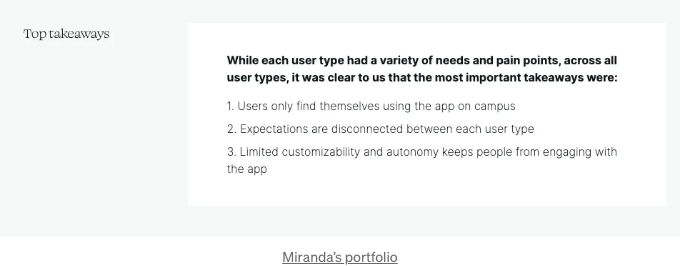

Melvin이 케이스 스터디 섹션의 제목으로 주요 결과를 잘 요약하여 사용한 것을 정말 좋아합니다. 한 문장으로 그가 연구에서 무엇을 발견했는지 명확히 알 수 있고 더 알고 싶어졌습니다. (그것이 훌륭한 이야기력의 힘입니다)

<!-- ui-log 수평형 -->
<ins class="adsbygoogle"
  style="display:block"
  data-ad-client="ca-pub-4877378276818686"
  data-ad-slot="9743150776"
  data-ad-format="auto"
  data-full-width-responsive="true"></ins>
<component is="script">
(adsbygoogle = window.adsbygoogle || []).push({});
</component>

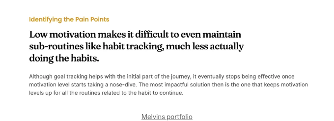

# 시각 자산을 사용자 정의하고 정리하세요

네, 연구에도 적용 가능합니다. 저는 이것을 "작은 포트폴리오 변화가 큰 영향을 미치는 4가지 실수"라는 기사에서도 소개했습니다. 왜냐하면 이것은 경험 부족한 디자이너들이 가장 흔히 하는 실수 중 하나입니다. 당신의 케이스 스터디를 자체적인 디자인 프로젝트로 생각해보세요. 단순히 연구를 수행한 스프레드시트의 스냅샷을 대충 찍는 것은 피하세요. 더 나은 방법이 있습니다.

예를 들어, 이곳에 있는 Melvin을 봅시다. 그가 경쟁 분석의 전체 내용을 보여주려고 한 것이라고 생각하시나요? 아니죠. 그는 포트폴리오용으로 특별히 일부 샘플을 가져와서, 이 부분에서 그의 의견을 명확히 전달할 수 있도록 한 것입니다.

<!-- ui-log 수평형 -->
<ins class="adsbygoogle"
  style="display:block"
  data-ad-client="ca-pub-4877378276818686"
  data-ad-slot="9743150776"
  data-ad-format="auto"
  data-full-width-responsive="true"></ins>
<component is="script">
(adsbygoogle = window.adsbygoogle || []).push({});
</component>

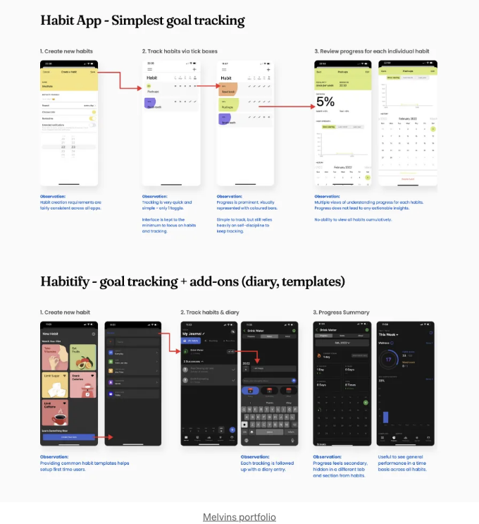

Melvin이 사용자 입력으로 선별된 뷰를 만들었던 또 다른 좋은 예입니다. 그가 실제로 이 입력을 수집한 방식인가요? 아닙니다. 그러나 이는 매우 명확하게 포인트를 전달합니다.

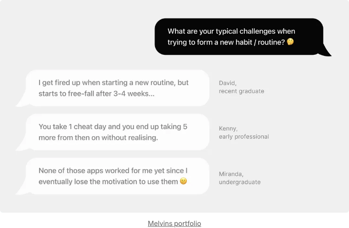

마지막 예시인데, 이는 실제 "작업 파일"을 보여주는 좋은 균형을 이루고 있습니다. 또한 Melvin이 워크샵에서 나온 상위 3개 질문을 요약하여 제시하기 때문에, 전체적으로 결과를 파악하려고 메모지를 일일히 읽어 가지 않아도 됩니다.

<!-- ui-log 수평형 -->
<ins class="adsbygoogle"
  style="display:block"
  data-ad-client="ca-pub-4877378276818686"
  data-ad-slot="9743150776"
  data-ad-format="auto"
  data-full-width-responsive="true"></ins>
<component is="script">
(adsbygoogle = window.adsbygoogle || []).push({});
</component>

멜빈, 너무 멋있어요 😎

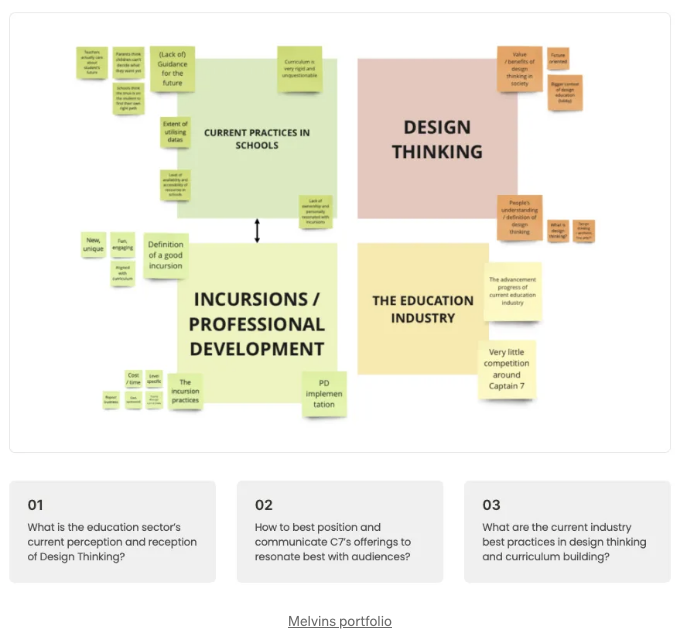

아니야, 한 장 더, 이 부분은 정말 중요해서요. 여러분은 디자이너니까요. 미란다는 분명히 이 공감 맵에서 무언가를 진짜로 모아올 것을 기대하지 않아요. 하지만 이것은 그녀가 노력했다는 걸 보여주고, 나도 쉽게 이 연습에서 무엇을 배웠는지 이해할 수 있어요. 아주 좋아요 👌

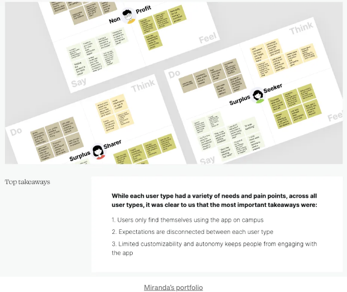

<!-- ui-log 수평형 -->
<ins class="adsbygoogle"
  style="display:block"
  data-ad-client="ca-pub-4877378276818686"
  data-ad-slot="9743150776"
  data-ad-format="auto"
  data-full-width-responsive="true"></ins>
<component is="script">
(adsbygoogle = window.adsbygoogle || []).push({});
</component>

# 디자인과의 연계 끊기

단순히 연구 내용을 고립된 상태로 제시하지 마세요. 연구가 디자인 결정에 어떤 영향을 미쳤는지 명확하게 보여주고, 결과적으로 제품을 전반적으로 어떻게 개선했는지 보여주어야 합니다. 물론 연구 결과를 워크플로우 단계로 모두 반영했기 때문에 이 부분을 잘 보여주는 것이 어려울 수 있습니다. 저는 초기 연구 내용을 '어떻게 하면 우리는 (HMW; How Might We) 구문을 통해 요약하고, 각각에 해당하는 디자인을 보여주는 방법을 좋아합니다.

이곳의 Melvin은 사용자의 요구사항/작업할 일 (JTBD)을 활용하고, 사용자가 원하는 것을 달성하는 데 도움이 되는 와이어프레임을 소개했습니다. 이렇게 함으로써 이전 연구 결과를 직접 디자인 작업과 연결시켰습니다.

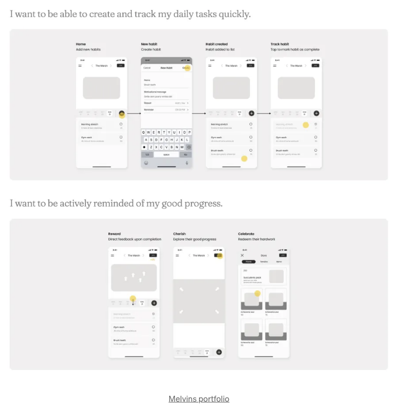

<!-- ui-log 수평형 -->
<ins class="adsbygoogle"
  style="display:block"
  data-ad-client="ca-pub-4877378276818686"
  data-ad-slot="9743150776"
  data-ad-format="auto"
  data-full-width-responsive="true"></ins>
<component is="script">
(adsbygoogle = window.adsbygoogle || []).push({});
</component>

유용성 테스트 결과를 토대로 하는 것이 아마 가장 쉬울 겁니다. 그러나 연구 결과를 간결하게 유지하고 디자인에서 무엇을 변경했는지 명확하게 표현하세요. 멜빈은 이를 아주 아름답게 해내죠:

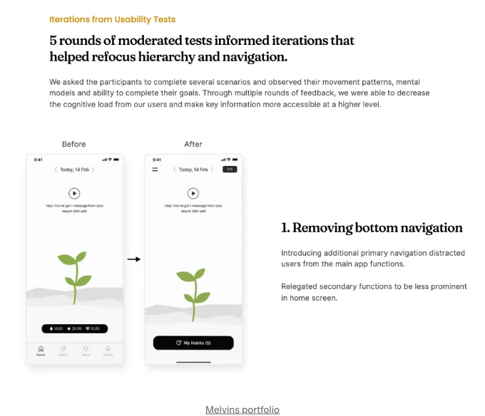

## 그러니 요약하면:

- 목표와 특정 운동을 선택한 이유에 대해 설명하여 실력을 보여주세요
- 간결하게 유지하세요
- 자산을 의도적으로 디자인하세요
- 연구 결과를 디자인 선택과 연결해주세요

<!-- ui-log 수평형 -->
<ins class="adsbygoogle"
  style="display:block"
  data-ad-client="ca-pub-4877378276818686"
  data-ad-slot="9743150776"
  data-ad-format="auto"
  data-full-width-responsive="true"></ins>
<component is="script">
(adsbygoogle = window.adsbygoogle || []).push({});
</component>

포트폴리오 작성에 몰입하셨나요? 채용 담당자나 리크루터가 찾는 모든 것을 포트폴리오에 포함시키고 싶다면 이 체크리스트를 사용해보세요 👇

도움이 되었다면 👏를 눌러주시고 다른 사람들도 찾을 수 있게 도와주세요.

그런데, 더 있습니다…

- UX 및 제품 디자인과 관련된 콘텐츠를 좋아하시나요? Tiktok이나 인스타에서 팔로우해주세요.
- 여러 가지 유용한 자료를 제공했어요.
- 물론 더 많은 디자인 관련 콘텐츠를 보고 싶으시다면 여기 중간 계정을 팔로우해주세요.