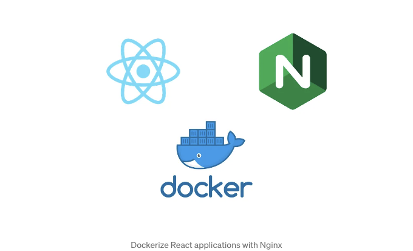

Nginx를 사용하여 React 애플리케이션을 Docker화하는 것은 컨테이너 환경에서 웹 애플리케이션을 배포하는 일반적인 방법입니다. 아래에서 React 애플리케이션을 Nginx와 함께 Docker화하는 단계별 가이드를 제공해 드리겠습니다.

단계 1: React 앱 설정하기

이미 React 애플리케이션이 있을 것으로 가정하고, 구조화되어 있고 정상적으로 작동하는지 확인하세요.

<!-- ui-log 수평형 -->
<ins class="adsbygoogle"
  style="display:block"
  data-ad-client="ca-pub-4877378276818686"
  data-ad-slot="9743150776"
  data-ad-format="auto"
  data-full-width-responsive="true"></ins>
<component is="script">
(adsbygoogle = window.adsbygoogle || []).push({});
</component>

## 단계 2: Dockerfile 만들기

React 앱의 루트 디렉토리에 Dockerfile을 생성하세요. 이 파일은 어떻게 애플리케이션이 Docker 컨테이너 내에서 빌드되고 실행될지 정의합니다.

```js
# 공식 Node.js 런타임을 베이스 이미지로 사용
FROM node:18 as build

# 컨테이너 내의 작업 디렉토리 설정
WORKDIR /app

# package.json 및 package-lock.json을 작업 디렉토리로 복사
COPY package*.json ./

# 의존성 설치
RUN npm install

# 전체 애플리케이션 코드를 컨테이너로 복사
COPY . .

# 프로덕션용으로 React 앱 빌드
RUN npm run build

# 프로덕션 서버로 Nginx 사용
FROM nginx:alpine

# 빌드된 React 앱을 Nginx의 웹 서버 디렉터리로 복사
COPY --from=build /app/build /usr/share/nginx/html

# Nginx 서버를 위해 포트 80 노출
EXPOSE 80

# 컨테이너 실행 시 Nginx 시작
CMD ["nginx", "-g", "daemon off;"]
```

## 단계 3: .dockerignore 파일 만들기

<!-- ui-log 수평형 -->
<ins class="adsbygoogle"
  style="display:block"
  data-ad-client="ca-pub-4877378276818686"
  data-ad-slot="9743150776"
  data-ad-format="auto"
  data-full-width-responsive="true"></ins>
<component is="script">
(adsbygoogle = window.adsbygoogle || []).push({});
</component>

동일한 디렉토리에 .dockerignore 파일을 생성하여 Docker 이미지로 복사되지 않도록 불필요한 파일과 디렉토리를 제외해주세요.

```js
node_modules
build
npm-debug.log
```

단계 4: Docker 이미지 빌드하기

터미널을 열고 React 앱의 루트 디렉토리(여기에 Dockerfile이 있는 곳)로 이동한 다음 Docker 이미지를 빌드해주세요.

<!-- ui-log 수평형 -->
<ins class="adsbygoogle"
  style="display:block"
  data-ad-client="ca-pub-4877378276818686"
  data-ad-slot="9743150776"
  data-ad-format="auto"
  data-full-width-responsive="true"></ins>
<component is="script">
(adsbygoogle = window.adsbygoogle || []).push({});
</component>

```js
docker build -t react-nginx-app .
```

이 명령은 react-nginx-app이라는 Docker 이미지를 생성합니다. 빌드 컨텍스트를 지정하기 위해 명령 끝에 점을 포함해야 합니다.

단계 5: Docker 컨테이너 실행

Docker 이미지를 빌드한 후에 컨테이너를 실행할 수 있습니다.

<!-- ui-log 수평형 -->
<ins class="adsbygoogle"
  style="display:block"
  data-ad-client="ca-pub-4877378276818686"
  data-ad-slot="9743150776"
  data-ad-format="auto"
  data-full-width-responsive="true"></ins>
<component is="script">
(adsbygoogle = window.adsbygoogle || []).push({});
</component>

```js
도커 run --name react-nginx-app -p 8080:80 -d react-nginx-app
```

이 명령은 컨테이너를 분리된 모드(-d)로 실행하고 호스트 머신의 포트 8080을 컨테이너 내부의 포트 80에 매핑합니다.

스텝 6: React 앱에 접속하기

이제 웹 브라우저를 열고 http://localhost:8080 또는 지정한 호스트와 포트로 이동하여 React 애플리케이션에 접속할 수 있습니다.

<!-- ui-log 수평형 -->
<ins class="adsbygoogle"
  style="display:block"
  data-ad-client="ca-pub-4877378276818686"
  data-ad-slot="9743150776"
  data-ad-format="auto"
  data-full-width-responsive="true"></ins>
<component is="script">
(adsbygoogle = window.adsbygoogle || []).push({});
</component>

결론

Nginx를 사용하여 React 애플리케이션을 도커화하면 다양한 환경에 앱을 배포하는 신뢰할 수 있는 방법을 제공합니다. 이 방법을 통해 배포가 간소화되고 다양한 플랫폼 간에 일관성을 보장할 수 있습니다.

코딩을 즐기세요!