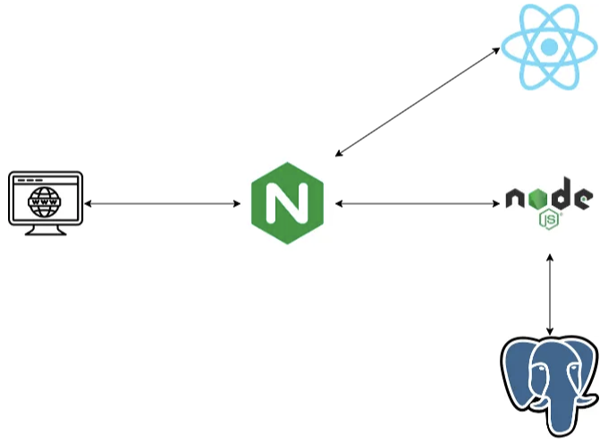
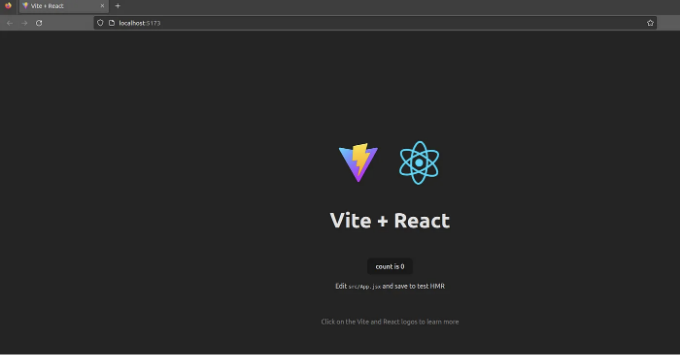
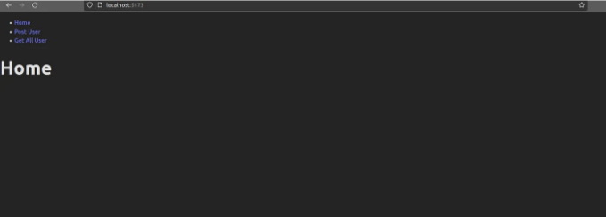
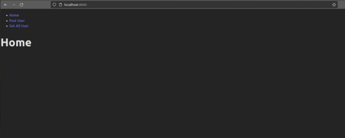
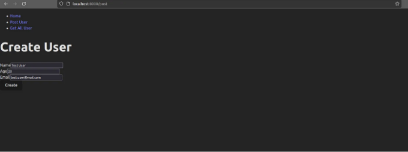
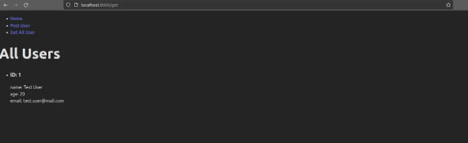

안녕하세요! 이 튜토리얼은 Node.js, Postgres 및 Nginx를 사용하여 React 애플리케이션을 Docker화하는 방법에 대해 설명합니다. 백엔드, 프론트엔드 및 Nginx 서버 설정에 대한 단계별 지침과 도커 파일 및 컨테이너화를 위한 docker-compose.yml 파일이 제공됩니다.

이 프로젝트의 코드는 GitHub에서 찾을 수 있습니다.



# 준비 사항

<!-- ui-log 수평형 -->
<ins class="adsbygoogle"
  style="display:block"
  data-ad-client="ca-pub-4877378276818686"
  data-ad-slot="9743150776"
  data-ad-format="auto"
  data-full-width-responsive="true"></ins>
<component is="script">
(adsbygoogle = window.adsbygoogle || []).push({});
</component>

컴퓨터에 Docker와 Node.js가 설치되어 있는지 확인해주세요. 저는 Node 버전 18.13.0 및 Docker 버전 20.10.24를 사용했습니다.

# 애플리케이션


# 백엔드 빌드

<!-- ui-log 수평형 -->
<ins class="adsbygoogle"
  style="display:block"
  data-ad-client="ca-pub-4877378276818686"
  data-ad-slot="9743150776"
  data-ad-format="auto"
  data-full-width-responsive="true"></ins>
<component is="script">
(adsbygoogle = window.adsbygoogle || []).push({});
</component>

간단한 데이터베이스와 통신하며 프론트 엔드에 라우트를 노출하는 간단한 애플리케이션을 만들겠습니다.

# 프로젝트 시작하기

프로젝트 폴더를 만들어 시작해봅시다. Project라는 새 폴더를 만들고, 그 안에 node라는 폴더를 생성하세요. 다음 명령어를 사용하여 node 폴더 내에서 Node.js 애플리케이션을 초기화하세요:

```js
npm init -y
```

<!-- ui-log 수평형 -->
<ins class="adsbygoogle"
  style="display:block"
  data-ad-client="ca-pub-4877378276818686"
  data-ad-slot="9743150776"
  data-ad-format="auto"
  data-full-width-responsive="true"></ins>
<component is="script">
(adsbygoogle = window.adsbygoogle || []).push({});
</component>

이 명령은 패키지 종속성을 추가할 수 있는 package.json 파일을 생성합니다.


# 백엔드 종속성:

- Express: 클라이언트 요청을 처리하는 노드.js 웹 애플리케이션 프레임워크입니다. 자세한 내용은 Express 문서를 참조하세요.
- Node-Postgres: PostgreSQL 데이터베이스와 연결을 설정하는 데 사용되는 Node.js의 클라이언트입니다. 자세한 내용은 Node Postgres 문서를 참조하세요.
- Nodemon: 파일 변경이 감지되면 Node.js 애플리케이션을 자동으로 다시 시작하는 도구입니다. 자세한 내용은 Nodemon 문서를 참조하세요.

<!-- ui-log 수평형 -->
<ins class="adsbygoogle"
  style="display:block"
  data-ad-client="ca-pub-4877378276818686"
  data-ad-slot="9743150776"
  data-ad-format="auto"
  data-full-width-responsive="true"></ins>
<component is="script">
(adsbygoogle = window.adsbygoogle || []).push({});
</component>

이러한 종속성을 설치하려면 노드 폴더로 이동한 다음 다음 명령을 실행하십시오:

```js
npm install express pg nodemon
```

이 명령은 필요한 모든 종속성을 설치합니다. 패키지 관리자가 패키지와 그 종속성을 다운로드하여 node_modules 폴더에 저장합니다. 이 폴더에는 프로젝트 실행에 필요한 모든 종속성과 그 하위 종속성이 포함되어 있습니다.


<!-- ui-log 수평형 -->
<ins class="adsbygoogle"
  style="display:block"
  data-ad-client="ca-pub-4877378276818686"
  data-ad-slot="9743150776"
  data-ad-format="auto"
  data-full-width-responsive="true"></ins>
<component is="script">
(adsbygoogle = window.adsbygoogle || []).push({});
</component>

# 백엔드 코드 작성하기

index.js 파일을 만들어서 메인 파일로 사용해요. 파일 안에 다음 코드를 추가해주세요.

파일 안에 필요한 패키지를 불러오기 시작해요:

```js
import pg from 'pg';
import express from 'express';
import bodyParser from 'body-parser';
```

<!-- ui-log 수평형 -->
<ins class="adsbygoogle"
  style="display:block"
  data-ad-client="ca-pub-4877378276818686"
  data-ad-slot="9743150776"
  data-ad-format="auto"
  data-full-width-responsive="true"></ins>
<component is="script">
(adsbygoogle = window.adsbygoogle || []).push({});
</component>

현재 데이터베이스는 아직 가동 중이 아니지만, 이미 node-postgres를 사용하여 PostgreSQL 데이터베이스와 연결을 수립하는 과정에 참여하고 있습니다:

```js
const { Client } = pg;

const client = new Client({
  user: 'postgres',
  host: 'db',
  database: 'postgres',
  password: '1234',
  port: 5432,
});
client.connect();
```

사용자 테이블 생성:

```js
const createTable = async () => { 
  await client.query(`CREATE TABLE IF NOT EXISTS users 
  (id serial PRIMARY KEY, name VARCHAR (255) UNIQUE NOT NULL, 
  email VARCHAR (255) UNIQUE NOT NULL, age INT NOT NULL);`)
};

createTable();
```

<!-- ui-log 수평형 -->
<ins class="adsbygoogle"
  style="display:block"
  data-ad-client="ca-pub-4877378276818686"
  data-ad-slot="9743150776"
  data-ad-format="auto"
  data-full-width-responsive="true"></ins>
<component is="script">
(adsbygoogle = window.adsbygoogle || []).push({});
</component>

Express와 미들웨어를 사용하여 POST 메서드를 파싱하세요:

```js
const app = express();
app.use(express.json());
app.use(express.urlencoded({ extended: true }));
```

Hello World 루트를 추가하세요:

```js
app.get('/api', (req, res) => res.send('Hello World!'));
```

<!-- ui-log 수평형 -->
<ins class="adsbygoogle"
  style="display:block"
  data-ad-client="ca-pub-4877378276818686"
  data-ad-slot="9743150776"
  data-ad-format="auto"
  data-full-width-responsive="true"></ins>
<component is="script">
(adsbygoogle = window.adsbygoogle || []).push({});
</component>

다음은 사용자 테이블에서 모든 사용자를 검색하는 GET 메서드를 만드는 방법입니다:

```js
app.get('/api/all', async (req, res) => {
  try {
    const response = await client.query(`SELECT * FROM users`);
    
    if(response){
      res.status(200).send(response.rows);
    }
    
  } catch (error) {
    res.status(500).send('에러');
    console.log(error);
  } 
});
```

그리고 사용자를 사용자 테이블에 삽입하는 POST 메서드를 만드는 방법은 다음과 같습니다:

```js
app.post('/api/form', async (req, res) => {
  try {
    const name  = req.body.name;
    const email = req.body.email;
    const age   = req.body.age;

    const response = await client.query(`INSERT INTO users(name, email, age) VALUES ('${name}', '${email}', ${age});`);
    
    if(response){
      res.status(200).send(req.body);
    }
  } catch (error) {
    res.status(500).send('에러');
    console.log(error);
  }    
});
```

<!-- ui-log 수평형 -->
<ins class="adsbygoogle"
  style="display:block"
  data-ad-client="ca-pub-4877378276818686"
  data-ad-slot="9743150776"
  data-ad-format="auto"
  data-full-width-responsive="true"></ins>
<component is="script">
(adsbygoogle = window.adsbygoogle || []).push({});
</component>

마지막으로, 서버가 실행될 때 API를 노출할 포트를 추가해주세요. 여기서는 포트 3000에 노출하겠습니다.

```js
app.listen(3000, () => console.log(`App running on port 3000.`));
```

이제 우리의 index.js 파일이 준비되었습니다. 코드를 개선하고 다양한 방법을 사용할 수 있습니다. 에러 처리를 더 잘하거나, 컨트롤러, 서비스 및 레포지토리를 활용한 아키텍처 개선, 코드에서 비밀 값들을 제거할 수 있습니다. 하지만 이러한 부분에 초점을 맞추지 않기 때문에, 우리의 백엔드는 가능한 한 간단합니다.

# 라우트 테스트하기

<!-- ui-log 수평형 -->
<ins class="adsbygoogle"
  style="display:block"
  data-ad-client="ca-pub-4877378276818686"
  data-ad-slot="9743150776"
  data-ad-format="auto"
  data-full-width-responsive="true"></ins>
<component is="script">
(adsbygoogle = window.adsbygoogle || []).push({});
</component>

package.json 파일 안의 script 섹션에 다음을 추가해 주세요:

```js
"start": "nodemon index.js"
```

그리고 파일 끝에 다음을 추가해 주세요:

```js
"type": "module"
```

<!-- ui-log 수평형 -->
<ins class="adsbygoogle"
  style="display:block"
  data-ad-client="ca-pub-4877378276818686"
  data-ad-slot="9743150776"
  data-ad-format="auto"
  data-full-width-responsive="true"></ins>
<component is="script">
(adsbygoogle = window.adsbygoogle || []).push({});
</component>

패키지.json 파일은 다음과 같이 보여야 합니다:

```js
{
 "name": "node",
 "version": "1.0.0",
 "description": "",
 "main": "index.js",
 "scripts": {
   "test": "echo \"Error: no test specified\" && exit 1",
   "start": "nodemon index.js"
 },
 "keywords": [],
 "author": "",
 "license": "ISC",
 "dependencies": {
   "express": "^4.18.2",
   "nodemon": "^2.0.22",
   "pg": "^8.11.0"
 },
 "type": "module"
}
```

이제 애플리케이션을 시작하려면 node 폴더 내에서 `npm start`를 실행할 수 있습니다. 그러나 아직 데이터베이스가 실행되지 않았기 때문에 애플리케이션이 충돌합니다.

```js
[nodemon] starting `node index.js`
App running on port 3000.
node:internal/process/promises:288
            triggerUncaughtException(err, true /* fromPromise */);
            ^

Error: getaddrinfo EAI_AGAIN db
    at GetAddrInfoReqWrap.onlookup [as oncomplete] (node:dns:107:26) {
  errno: -3001,
  code: 'EAI_AGAIN',
  syscall: 'getaddrinfo',
  hostname: 'db'
}

Node.js v18.13.0
[nodemon] app crashed - waiting for file changes before starting...아래 코드는 새로운 리액트 프로젝트를 생성합니다:
```

<!-- ui-log 수평형 -->
<ins class="adsbygoogle"
  style="display:block"
  data-ad-client="ca-pub-4877378276818686"
  data-ad-slot="9743150776"
  data-ad-format="auto"
  data-full-width-responsive="true"></ins>
<component is="script">
(adsbygoogle = window.adsbygoogle || []).push({});
</component>

그래서 이 오류를 피하기 위해 다음 라인들을 주석 처리하세요:

```js
//client.connect();
...
//createTable();
```

이제 node 폴더 안에서 npm start를 실행하고 브라우저에서 hello world 루트(http://localhost:3000/api)에 접속하여 작동 여부를 확인해주세요.


<!-- ui-log 수평형 -->
<ins class="adsbygoogle"
  style="display:block"
  data-ad-client="ca-pub-4877378276818686"
  data-ad-slot="9743150776"
  data-ad-format="auto"
  data-full-width-responsive="true"></ins>
<component is="script">
(adsbygoogle = window.adsbygoogle || []).push({});
</component>

테이블 태그를 Markdown 형식으로 변경해주세요.

<!-- ui-log 수평형 -->
<ins class="adsbygoogle"
  style="display:block"
  data-ad-client="ca-pub-4877378276818686"
  data-ad-slot="9743150776"
  data-ad-format="auto"
  data-full-width-responsive="true"></ins>
<component is="script">
(adsbygoogle = window.adsbygoogle || []).push({});
</component>

```js
npm create vite react -- --template react
``` 

이 명령어는 자동으로 새로운 리액트 폴더와 새로운 리액트 프로젝트를 생성합니다.

저는 프로젝트를 만들기 위해 Vite 도구를 선택했습니다. Vite는 31MB의 종속성을 사용하며 프로젝트를 시작하는 시간을 단축해줍니다. Vite 문서를 참조하세요.

다음과 같은 구조로 끝날 것입니다:

<!-- ui-log 수평형 -->
<ins class="adsbygoogle"
  style="display:block"
  data-ad-client="ca-pub-4877378276818686"
  data-ad-slot="9743150776"
  data-ad-format="auto"
  data-full-width-responsive="true"></ins>
<component is="script">
(adsbygoogle = window.adsbygoogle || []).push({});
</component>


# 프론트엔드 종속성:

- Axios: Node.js용 promise 기반 HTTP Client입니다. 더 많은 정보를 원하시면 Axios 문서를 참조해주세요.
- React Router: React 애플리케이션용 라우팅 라이브러리입니다. 라우팅 기능을 정의하고 관리할 수 있는 일련의 컴포넌트와 유틸리티를 제공합니다. 더 많은 정보를 원하시면 React Router 문서를 참조해주세요.

모든 종속성을 설치하려면 react 폴더 안으로 이동하여 다음 코드를 실행하십시오:

<!-- ui-log 수평형 -->
<ins class="adsbygoogle"
  style="display:block"
  data-ad-client="ca-pub-4877378276818686"
  data-ad-slot="9743150776"
  data-ad-format="auto"
  data-full-width-responsive="true"></ins>
<component is="script">
(adsbygoogle = window.adsbygoogle || []).push({});
</component>

```js
npm install axios react-router-dom
```

애플리케이션을 실행하려면 다음을 실행할 수 있어요:

```js
npm run dev
```

http://localhost:5173에서 브라우저에 액세스하면 아래 페이지를 볼 수 있어요:

<!-- ui-log 수평형 -->
<ins class="adsbygoogle"
  style="display:block"
  data-ad-client="ca-pub-4877378276818686"
  data-ad-slot="9743150776"
  data-ad-format="auto"
  data-full-width-responsive="true"></ins>
<component is="script">
(adsbygoogle = window.adsbygoogle || []).push({});
</component>



# 프론트엔드 코드 작성하기

먼저, App.jsx 파일의 내용을 다음 코드로 교체해봅시다:

```js
import ReactDOM from "react-dom/client";
import { BrowserRouter, Routes, Route } from "react-router-dom";
import Layout from "./components/Layout";
import Home from "./components/Home";
import PostUser from "./components/PostUser";
import GetAllUser from "./components/GetAllUser";

export default function App() {
  return (
    <BrowserRouter>
      <Routes>
        <Route path="/" element={<Layout />}>
          <Route index element={<Home />} />
          <Route path="post" element={<PostUser />} />
          <Route path="get" element={<GetAllUser />} />
        </Route>
      </Routes>
    </BrowserRouter>
  );
}
const root = ReactDOM.createRoot(document.getElementById('root'));
root.render(<App />);
```

<!-- ui-log 수평형 -->
<ins class="adsbygoogle"
  style="display:block"
  data-ad-client="ca-pub-4877378276818686"
  data-ad-slot="9743150776"
  data-ad-format="auto"
  data-full-width-responsive="true"></ins>
<component is="script">
(adsbygoogle = window.adsbygoogle || []).push({});
</component>

앱 파일은 라우팅을 관리하고 특정 엔드포인트에서 특정 컴포넌트를 렌더링합니다. 예를 들어 경로가 "/get"인 경우, 데이터베이스에서 모든 사용자를 검색하는 책임을 지고 있는 GetAllUser 컴포넌트를 반환합니다.

이제 애플리케이션 컴포넌트를 생성해 봅시다. 'src' 폴더 안에 'components'라는 폴더를 만들고 다음 네 가지 파일을 만듭니다:

- GetAllUser.jsx
- Home.jsx
- Layout.jsx
- PostUser.jsx

GetAllUser.jsx

<!-- ui-log 수평형 -->
<ins class="adsbygoogle"
  style="display:block"
  data-ad-client="ca-pub-4877378276818686"
  data-ad-slot="9743150776"
  data-ad-format="auto"
  data-full-width-responsive="true"></ins>
<component is="script">
(adsbygoogle = window.adsbygoogle || []).push({});
</component>

```js
import axios from "axios";
import { useEffect, useState } from "react";

const GetAllUser = () => {
  const [users, setAllUser] = useState();
  useEffect(() => {
    axios
      .get("http://localhost:8000/api/all")
      .then((response) => setAllUser(response.data))
      .catch((err) => {
        console.error(err);
      });
  }, []);
  
  return (
    <>
      <h1>All Users</h1>
      <ul>
        {users && users.map(user => 
          <li key={user.id}>
            <h3>ID: {user.id} </h3>
            name: {user.name} <br></br>
            age: {user.age} <br></br>
            email: {user.email} <br></br>
          </li>
        )}
      </ul>
    </>
  );
};

export default GetAllUser;
```

Home.jsx

```js
const Home = () => {
  return <h1>Home</h1>;
};

export default Home;
```

Layout.jsx

<!-- ui-log 수평형 -->
<ins class="adsbygoogle"
  style="display:block"
  data-ad-client="ca-pub-4877378276818686"
  data-ad-slot="9743150776"
  data-ad-format="auto"
  data-full-width-responsive="true"></ins>
<component is="script">
(adsbygoogle = window.adsbygoogle || []).push({});
</component>

```js
import { Outlet, Link } from "react-router-dom";

const Layout = () => {
  return (
    <>
      <nav>
        <ul>
          <li>
            <Link to="/">홈</Link>
          </li>
          <li>
            <Link to="/post">사용자 등록</Link>
          </li>
          <li>
            <Link to="/get">모든 사용자 조회</Link>
          </li>
        </ul>
      </nav>
      <Outlet />
    </>
  );
};
export default Layout;
```

PostUser.jsx

```js
import axios from "axios";
import { useState } from "react";

const PostUser = () => {
  
    const [user, setUser] = useState({
      name: '',
      age: '',
      email: '',
    });

    const createUser = async () => {
      await axios
      .post("http://localhost:8000/api/form", 
      user,
      {
        headers: {
          'Content-Type': 'application/x-www-form-urlencoded'
        }
      })
      .then((response) => {
        setUser({      
          name: '',
          age: '',
          email: '',
        });
        console.log(response);
        return alert("사용자가 생성되었습니다: " + `${JSON.stringify(response.data, null,4)}`);
      })
      .catch((err) => {
        return alert(err);
      });
    }

    const onChangeForm = (e) => {
      if (e.target.name === 'name') {
        setUser({...user, name: e.target.value});
      } else if (e.target.name === 'age') {
        setUser({...user, age: e.target.value});
      } else if (e.target.name === 'email') {
        setUser({...user, email: e.target.value});
      }
    }

    return (
      <div>
          <div>
              <div>
              <h1>사용자 등록</h1>
              <form>
                  <div>
                      <div>
                          <label>이름</label>
                          <input 
                            type="text" 
                            value={user.name}
                            onChange={(e) => onChangeForm(e)} 
                            name="name" 
                            id="name" 
                            placeholder="이름" 
                          />
                      </div>
                      <div>
                          <label>나이</label>
                          <input 
                            type="text" 
                            value={user.age}
                            onChange={(e) => onChangeForm(e)} 
                            name="age" 
                            id="age" 
                            placeholder="나이" 
                          />
                      </div>
                  </div>
                  <div>
                      <div>
                          <label htmlFor="exampleInputEmail1">이메일</label>
                          <input 
                            type="text" 
                            value={user.email}
                            onChange={(e) => onChangeForm(e)} 
                            name="email" 
                            id="email" 
                            placeholder="이메일" 
                          />
                      </div>
                  </div>
                  <button type="button" onClick={() => createUser()}>생성</button>
              </form>
              </div>
          </div>
      </div>
      );
  };
  
export default PostUser;
```

index.css 파일에서 29번째 줄을 제거하세요. 더 나은 레이아웃을 위해:```

<!-- ui-log 수평형 -->
<ins class="adsbygoogle"
  style="display:block"
  data-ad-client="ca-pub-4877378276818686"
  data-ad-slot="9743150776"
  data-ad-format="auto"
  data-full-width-responsive="true"></ins>
<component is="script">
(adsbygoogle = window.adsbygoogle || []).push({});
</component>

```js
place-items: center;
```

해당 줄을 제거한 후에 애플리케이션을 시작하려면 npm run dev 명령을 실행할 수 있습니다. 애플리케이션이 실행되면 http://localhost:5173에서 액세스할 수 있습니다.



마지막으로 Vite에서 모든 주소에서 수신하도록 서버 옵션을 변경해야 합니다. vite.config.js로 이동하여 다음과 같이 파일을 변경하세요:```

<!-- ui-log 수평형 -->
<ins class="adsbygoogle"
  style="display:block"
  data-ad-client="ca-pub-4877378276818686"
  data-ad-slot="9743150776"
  data-ad-format="auto"
  data-full-width-responsive="true"></ins>
<component is="script">
(adsbygoogle = window.adsbygoogle || []).push({});
</component>

```js
import { defineConfig } from 'vite'
import react from '@vitejs/plugin-react'

// https://vitejs.dev/config/
export default defineConfig({
  plugins: [react()],
  server: {
    host: true,
    //port: 5173, 도커 컴포즈로 실행하지 않을 때 사용할 포트
  }
})
```

# Nginx 서버 구성

Nginx는 클라이언트로부터의 요청을 처리하고 해당 요청을 적합한 백엔드 서버로 전달하는 역방향 프록시 서버로 사용할 수 있습니다.

Nginx를 역방향 프록시로 구성하려면 프로젝트의 루트 디렉토리로 이동하여 nginx 폴더를 만들어야 합니다. 이 폴더 안에 default.conf라는 파일을 만들고 다음 구성을 추가하세요.```

<!-- ui-log 수평형 -->
<ins class="adsbygoogle"
  style="display:block"
  data-ad-client="ca-pub-4877378276818686"
  data-ad-slot="9743150776"
  data-ad-format="auto"
  data-full-width-responsive="true"></ins>
<component is="script">
(adsbygoogle = window.adsbygoogle || []).push({});
</component>

```js
upstream front-end {
    server front-end:5173;
}

upstream back-end {
    server back-end:3000;
}
server {
    listen 80;
    location / {
        proxy_pass http://front-end;
    }
    location /sockjs-node {
        proxy_pass http://front-end;
        proxy_http_version 1.1;
        proxy_set_header Upgrade $http_upgrade;
        proxy_set_header Connection "Upgrade";
    }
    location /api {
        rewrite /back-end/(.*) /$1 break;
        proxy_pass http://back-end;
    }
}
```

upstream 지시문은 프록시 패스 지시문에서 참조할 수 있는 서버 그룹을 정의합니다. 이 경우에는 React 프론트엔드 서버를 위한 front-end와 Node.js 백엔드 서버를 위한 back-end 두 개의 upstream을 정의하였습니다.

서버 블록은 포트 80에서 들어오는 요청을 처리하는 구성을 담고 있습니다.

위치 / 블록은 프론트엔드 서버로의 요청을 프록시로 전달하는데 사용되며 proxy_pass http://front-end;가 이용됩니다.

<!-- ui-log 수평형 -->
<ins class="adsbygoogle"
  style="display:block"
  data-ad-client="ca-pub-4877378276818686"
  data-ad-slot="9743150776"
  data-ad-format="auto"
  data-full-width-responsive="true"></ins>
<component is="script">
(adsbygoogle = window.adsbygoogle || []).push({});
</component>

/sockjs-node 블록은 웹소켓 연결을 처리하고 프론트엔드 서버로 전달합니다.

/api 블록은 백엔드 API 요청을 처리하기 위해 URL을 다시 작성하고 proxy_pass http://back-end;를 사용하여 백엔드 서버로 전달합니다.

# Dockerfile 생성

# 프론트엔드 도커 파일

<!-- ui-log 수평형 -->
<ins class="adsbygoogle"
  style="display:block"
  data-ad-client="ca-pub-4877378276818686"
  data-ad-slot="9743150776"
  data-ad-format="auto"
  data-full-width-responsive="true"></ins>
<component is="script">
(adsbygoogle = window.adsbygoogle || []).push({});
</component>

리액트 폴더 안에 Dockerfile이라는 새 파일을 만들어주세요. 파일에 다음 코드를 추가해주세요:

```js
FROM node:alpine

WORKDIR /usr/src/app

COPY . .

RUN npm install

EXPOSE 5173
```

FROM 키워드는 Dockerfile에서 새 Docker 이미지를 빌드하는 데 사용할 기본 이미지를 지정하는 데 사용됩니다. 이 경우에는 기본으로 node:alpine 이미지를 사용하고 있습니다.

WORKDIR 명령은 이후의 RUN, CMD, ENTRYPOINT, COPY, ADD 명령에 대한 작업 디렉토리를 설정합니다.

<!-- ui-log 수평형 -->
<ins class="adsbygoogle"
  style="display:block"
  data-ad-client="ca-pub-4877378276818686"
  data-ad-slot="9743150776"
  data-ad-format="auto"
  data-full-width-responsive="true"></ins>
<component is="script">
(adsbygoogle = window.adsbygoogle || []).push({});
</component>

모든 파일을 로컬 컴퓨터에서 Docker 이미지의 /usr/src/app 디렉토리로 복사하는 COPY . . 명령을 사용합니다.

React 애플리케이션에 필요한 의존성을 설치하는 RUN npm install 명령을 실행합니다.

컨테이너화된 애플리케이션이 들어오는 연결을 위해 포트 5173에서 수신 대기하도록 지정하는 EXPOSE 명령을 사용합니다.

# 백엔드 Dockerfile

<!-- ui-log 수평형 -->
<ins class="adsbygoogle"
  style="display:block"
  data-ad-client="ca-pub-4877378276818686"
  data-ad-slot="9743150776"
  data-ad-format="auto"
  data-full-width-responsive="true"></ins>
<component is="script">
(adsbygoogle = window.adsbygoogle || []).push({});
</component>

프로젝트의 node 폴더 안에 Dockerfile이라는 파일을 생성하고 아래의 코드를 추가해주세요:

```js
FROM node:alpine

WORKDIR /usr/src/app

COPY . .

RUN npm install

EXPOSE 3000
```

이 Dockerfile은 프론트엔드 Dockerfile과 유사합니다. 작업 디렉터리를 설정하고 파일을 복사하며 종속성을 설치한 뒤 백엔드 애플리케이션을 위해 포트 3000을 공개합니다.

# Nginx dockerfile

<!-- ui-log 수평형 -->
<ins class="adsbygoogle"
  style="display:block"
  data-ad-client="ca-pub-4877378276818686"
  data-ad-slot="9743150776"
  data-ad-format="auto"
  data-full-width-responsive="true"></ins>
<component is="script">
(adsbygoogle = window.adsbygoogle || []).push({});
</component>

nginx 폴더 안에 Dockerfile을 만들고 다음 코드를 추가하여 Nginx 이미지를 pull하고 default.conf 파일을 복사합니다:

```js
FROM nginx
COPY ./default.conf /etc/nginx/conf.d/default.conf
```

# docker-compose.yml 구성하기

이제 클라이언트를 구성하고, Nginx 서버에 연결된 서버 API를 구성하고, 모든 것이 정상적으로 작동하는 것을 확인했으므로 docker-compose.yml 파일을 사용하여 모든 것을 통합하는 시간입니다. 이 파일은 모든 구성 요소를 함께 모아주는 것뿐만 아니라 데이터베이스 설정까지 처리할 것입니다.

<!-- ui-log 수평형 -->
<ins class="adsbygoogle"
  style="display:block"
  data-ad-client="ca-pub-4877378276818686"
  data-ad-slot="9743150776"
  data-ad-format="auto"
  data-full-width-responsive="true"></ins>
<component is="script">
(adsbygoogle = window.adsbygoogle || []).push({});
</component>

시작하려면 루트 디렉토리로 이동하여 Project 폴더를 찾고 docker-compose.yml이라는 파일을 만드십시오.

```js
version: '3'

services: 

  back-end:
    build: 
      context: node
    container_name: back-end
    working_dir: /usr/src/app
    networks: 
      - node-network
    volumes: 
      - ./node:/usr/src/app
      - /usr/src/app/node_modules
    tty: true
    ports: 
      - "3000:3000"
    command: npm run start
    depends_on:
       - db

  front-end:
    build: 
      context: react
    container_name: front-end
    working_dir: /usr/src/app
    networks: 
      - node-network
    volumes: 
      - ./react:/usr/src/app
      - /usr/src/app/node_modules
    tty: true
    ports: 
      - "5173:5173"
    command: npm run dev

  db:
    image: postgres
    container_name: db
    restart: always
    tty: true
    volumes:
      - ./data:/var/lib/postgresql/data
    environment: 
      - POSTGRES_PASSWORD=1234
    ports: 
      - "5432:5432"
    networks: 
      - node-network

  nginx:
    build: 
      context: nginx
    container_name: nginx
    restart: always
    tty: true
    ports: 
      - "8000:80"
    networks: 
      - node-network
    depends_on:
       - back-end
       - front-end
  
networks: 
  node-network:
    driver: bridge
```

# 완전히 컨테이너화된 애플리케이션 실행

완전히 컨테이너화된 애플리케이션을 실행하려면 다음 단계를 따르세요:

<!-- ui-log 수평형 -->
<ins class="adsbygoogle"
  style="display:block"
  data-ad-client="ca-pub-4877378276818686"
  data-ad-slot="9743150776"
  data-ad-format="auto"
  data-full-width-responsive="true"></ins>
<component is="script">
(adsbygoogle = window.adsbygoogle || []).push({});
</component>

터미널이나 명령 프롬프트에서 루트 디렉토리를 열어주세요.

다음 명령어를 실행하여 docker-compose.yml 파일을 실행하세요:

```js
docker-compose up --build
```

컨테이너가 실행되면 웹 브라우저에서 http://localhost:8000/을 방문하여 애플리케이션에 액세스할 수 있습니다. Nginx가 리액트 애플리케이션으로 리디렉션됩니다.

<!-- ui-log 수평형 -->
<ins class="adsbygoogle"
  style="display:block"
  data-ad-client="ca-pub-4877378276818686"
  data-ad-slot="9743150776"
  data-ad-format="auto"
  data-full-width-responsive="true"></ins>
<component is="script">
(adsbygoogle = window.adsbygoogle || []).push({});
</component>



만약 "사용자 등록" 옵션을 선택하면 http://localhost:8000/post로 이동됩니다. 여기에서 새 사용자를 생성할 수 있으며 이는 우리가 실행 중인 Postgres 데이터베이스에 기록됩니다.

요약하자면, 프론트엔드가 Nginx에 요청을 보내면 Nginx가 요청을 백엔드로 프록시하게 됩니다. Nginx는 /api 경로를 가지고 있기 때문에 프록시 역할을 하여 요청을 백엔드로 전달합니다. 백엔드는 요청을 처리하고 데이터를 데이터베이스에 저장하며 응답을 생성합니다. 그리고 응답은 다시 Nginx를 통해 프론트엔드로 전송됩니다.

예제를 만들어 보겠습니다:

<!-- ui-log 수평형 -->
<ins class="adsbygoogle"
  style="display:block"
  data-ad-client="ca-pub-4877378276818686"
  data-ad-slot="9743150776"
  data-ad-format="auto"
  data-full-width-responsive="true"></ins>
<component is="script">
(adsbygoogle = window.adsbygoogle || []).push({});
</component>



만약 나이 필드에 문자로 사용자를 생성하려고 시도하면, 테이블이 age INT NOT NULL로 정의되었기 때문에 오류가 발생할 것입니다.

모든 것이 잘 진행된다면, 사용자를 생성한 후 "모든 사용자 가져오기" 옵션으로 이동하여 http://localhost:8000/get로 이동할 수 있습니다. 여기에서 방금 생성한 사용자를 볼 수 있습니다:



<!-- ui-log 수평형 -->
<ins class="adsbygoogle"
  style="display:block"
  data-ad-client="ca-pub-4877378276818686"
  data-ad-slot="9743150776"
  data-ad-format="auto"
  data-full-width-responsive="true"></ins>
<component is="script">
(adsbygoogle = window.adsbygoogle || []).push({});
</component>

도커-컴포즈 업 --빌드를 실행한 후에는 루트 디렉토리에 data라는 새 폴더가 생성된 것을 알 수 있습니다. 이 폴더는 포스트그레스 데이터가 저장되는 곳이며, 컨테이너가 제거되어도 생성한 데이터가 유실되지 않도록 해줍니다.


축하합니다! 완전히 컨테이너화된 애플리케이션을 성공적으로 실행하고 사용자 생성 및 검색 기능을 상호 작용하였습니다.