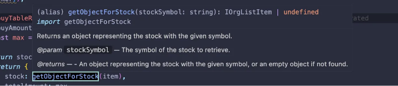
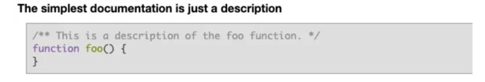

자신만의 구성 요소에 대한 문서 작성은 프로젝트 내에서 명확성과 이해를 보장하는 데 필수적입니다.

함수나 구성 요소 위로 마우스를 올리면 유용한 설명이 표시되는 것을 주목한 적이 있나요? 마치 각 코드 조각이 무엇을 하는지에 대한 즉각적인 통찰력을 얻는 것과 같습니다, 맞죠? 이러한 설명에는 전달할 수 있는 매개변수 및 반환 값을 나타내는 세부 정보가 종종 포함됩니다.



게다가, 향후 업데이트나 지원을 받지 못할 것으로 신호를 주는 사용 중지된 기능에 대한 경고를 만날 수도 있습니다. 그렇다면, 자신만의 함수나 패키지에 대한 이러한 유익한 문서를 어떻게 작성할 수 있을까요? 그것이 JSDoc이 등장하여 도움이 되는 부분입니다.

<!-- ui-log 수평형 -->
<ins class="adsbygoogle"
  style="display:block"
  data-ad-client="ca-pub-4877378276818686"
  data-ad-slot="9743150776"
  data-ad-format="auto"
  data-full-width-responsive="true"></ins>
<component is="script">
(adsbygoogle = window.adsbygoogle || []).push({});
</component>

```markdown


# 장점

- 일관성: 균일한 문서화를 촉진합니다.
- 유지보수: 코드베이스 유지보수를 용이하게 합니다.
- 협업: 더 명확한 코드 통찰력을 제공하여 협업을 강화합니다.

이제 특정 예시에 초점을 맞춰보겠습니다: Button 컴포넌트. 사용된 JSDoc 주석과 생성된 문서의 세부 사항을 살펴봅시다.
```

<!-- ui-log 수평형 -->
<ins class="adsbygoogle"
  style="display:block"
  data-ad-client="ca-pub-4877378276818686"
  data-ad-slot="9743150776"
  data-ad-format="auto"
  data-full-width-responsive="true"></ins>
<component is="script">
(adsbygoogle = window.adsbygoogle || []).push({});
</component>

## 버튼 컴포넌트

```js
import React from 'react';
import "./Button.css"
```

```js
/**
 * 간단한 버튼 컴포넌트입니다.
 *
 * @component
 * @param {Object} props - 컴포넌트는 text와 onClick을 props로 받습니다.
 * @param {string} props.text - 버튼에 표시할 텍스트
 * @param {function} props.onClick - 클릭 이벤트 핸들러
 * @returns {JSX.Element} 렌더된 버튼 컴포넌트를 반환합니다.
 *
 * @example
 * // "Click Me" 텍스트가 있는 버튼 렌더링
 * <Button text="Click Me" onClick={() => console.log('Button clicked!')} />
 */
function Button({ text, onClick }) {
  return (
    <button className='myButton' onClick={onClick}>
      {text}
    </button>
  );
}
export default Button;
```

- @component: 이 함수가 React 컴포넌트임을 나타냅니다.
- @param: 함수가 받는 매개변수를 설명합니다. 이 태그는 각 prop을 따로 문서화하는 데 여러 번 사용됩니다.
- @returns: 함수의 출력을 설명하는데, 이 경우 렌더된 JSX 엘리먼트가 됩니다.
- @example: 코드에서 Button 컴포넌트를 구현하는 방법을 보여주는 사용 예시를 제공합니다.

<!-- ui-log 수평형 -->
<ins class="adsbygoogle"
  style="display:block"
  data-ad-client="ca-pub-4877378276818686"
  data-ad-slot="9743150776"
  data-ad-format="auto"
  data-full-width-responsive="true"></ins>
<component is="script">
(adsbygoogle = window.adsbygoogle || []).push({});
</component>

JSDoc을 도입하여 코드 구조를 강화하고 코드베이스를 더 효율적으로 관리하세요. JSDoc을 사용하면 프로젝트를 유지하고 협업하는 것이 더 쉬워집니다. 동시에 명확하고 간결한 문서화를 보장할 수 있습니다.

LinkedIn에서 계속해서 소식을 받아보세요!