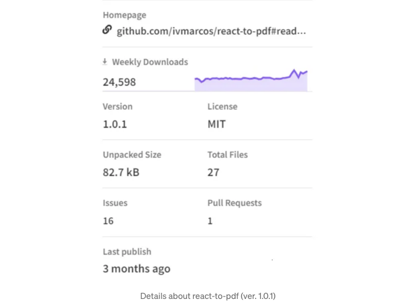
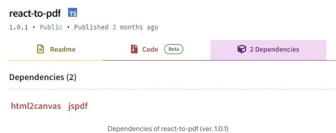

사용자들은 UI의 특정 부분을 PDF 파일로 다운로드하는 방법이 필요할 수 있습니다. 티켓, 영수증 또는 쇼핑 목록이 포함될 수 있습니다. 이는 그들이 이러한 문서를 인쇄하고 싶을 때 편리한 방법입니다.

최근, 사용자가 자체적으로 설정한 항목별 구성 목록을 다운로드할 수 있는 버튼을 만들어야 했습니다. 성능 문제로 인해 가능한 가장 경제적인 방법으로 이를 수행해야 했습니다. 이 여정에서 저를 돕기 위한 React 라이브러리를 찾기 시작했습니다. 다양한 옵션이 있었지만, 모두가 제 사용 사례에 비해 불필요하게 방대했습니다.

간단하게 말하자면, 아마도 html2canvas와 jsPDF의 조합을 권장하는 기사들을 만난 적이 있을 것입니다. 이들은 매우 좋은 라이브러리지만 이런 한정된 사용 사례에는 필요하지 않을 수 있습니다. 이 글에서는 React 컴포넌트를 PDF 파일로 다운로드할 수 있는 간결한 라이브러리인 react-to-pdf (버전 1.0.1)에 대해 이야기하겠습니다. PDF는 컴포넌트 스크린샷에서 생성되며 서버 측 렌더링(SSR)은 지원되지 않음을 알아두세요.

<!-- ui-log 수평형 -->
<ins class="adsbygoogle"
  style="display:block"
  data-ad-client="ca-pub-4877378276818686"
  data-ad-slot="9743150776"
  data-ad-format="auto"
  data-full-width-responsive="true"></ins>
<component is="script">
(adsbygoogle = window.adsbygoogle || []).push({});
</component>

# 라이브러리 검색

나는 몇 가지 기사와 함께 ChatGPT에게 React 컴포넌트를 PDF 파일로 다운로드하는 방법을 물었을 때 html2canvas와 jsPDF를 사용해야 한다는 결론을 얻었다.

이 2개의 라이브러리를 사용하는 전체적인 로직은 렌더링된 컴포넌트를 HTML 캔버스로 변환하고 PDF 파일에 삽입하여 다운로드하는 것이다.

이전에 언급한 대로 경제적인 결정을 내렸어야 했다. jsPDF는 8개의 종속성을 가지고 있지만(하나는 html2canvas), 압축 해제된 크기는 2.5.1 버전 기준으로 14.7MB이다.

<!-- ui-log 수평형 -->
<ins class="adsbygoogle"
  style="display:block"
  data-ad-client="ca-pub-4877378276818686"
  data-ad-slot="9743150776"
  data-ad-format="auto"
  data-full-width-responsive="true"></ins>
<component is="script">
(adsbygoogle = window.adsbygoogle || []).push({});
</component>

이렇게 해서 html2canvas가 의존하는 항목 중 하나이므로 별도로 설치할 필요가 없다고 생각한 우리 팀의 판단으로 인해 jsPDF에 대한 초록빛 빛이 볼 수 있었습니다.

# 길을 따라 발생한 문제들

<!-- ui-log 수평형 -->
<ins class="adsbygoogle"
  style="display:block"
  data-ad-client="ca-pub-4877378276818686"
  data-ad-slot="9743150776"
  data-ad-format="auto"
  data-full-width-responsive="true"></ins>
<component is="script">
(adsbygoogle = window.adsbygoogle || []).push({});
</component>

jsPDF에는 상세한 문서가 있어서 별다른 문제가 없었어요. 특정 컴포넌트를 PDF 파일로 다운로드하는 것이 제 업무였기 때문에 html 메서드를 사용했어요 (또는 그렇게 생각했던 거죠).

아래는 문서에서 html 메서드 사용 예시입니다:

```js
var doc = new jsPDF();

doc.html(document.body, {
   callback: function (doc) {
     doc.save();
   },
   x: 10,
   y: 10
});
```

처음에는 PDF 파일에서 컴포넌트의 스케일링과 위치 조정을 약간 조정하면 잘 작동했어요. 하지만 저희 프로젝트에 사용자 정의 글꼴이 있어서 이를 PDF로 이관하는 것이 추가 노력이 필요했던 문제가 있었어요.

<!-- ui-log 수평형 -->
<ins class="adsbygoogle"
  style="display:block"
  data-ad-client="ca-pub-4877378276818686"
  data-ad-slot="9743150776"
  data-ad-format="auto"
  data-full-width-responsive="true"></ins>
<component is="script">
(adsbygoogle = window.adsbygoogle || []).push({});
</component>

이 방법은 생성된 HTML 콘텐츠의 스타일(글꼴 제외)을 PDF 구조에 사용할 수 있게 했습니다. 하지만 PDF 파일 안에 컴포넌트의 스크린샷을 만들어 넣을 것으로 기대했던 제 예상과는 조금 달랐어요.

이 시점에서, 제 좁은 사용 사례를 위해 다른 라이브러리를 찾아야 했어요.

# react-to-pdf 찾기

조사를 한 결과, react-to-pdf를 발견했어요. 라이브러리의 압축 해제 크기와 의존성 양 등을 확인하면서, 이것을 시도해봐야겠다는 생각이 들었어요.

<!-- ui-log 수평형 -->
<ins class="adsbygoogle"
  style="display:block"
  data-ad-client="ca-pub-4877378276818686"
  data-ad-slot="9743150776"
  data-ad-format="auto"
  data-full-width-responsive="true"></ins>
<component is="script">
(adsbygoogle = window.adsbygoogle || []).push({});
</component>

```markdown


구현에 들어가기 전에, react-to-pdf가 2개의 종속성만 있다는 사실을 알게돼 놀라웠습니다. 버전 1.0.1에서의 압축 해제된 크기는 82.7 kB입니다.



html2canvas와 jsPDF를 사용하는 다양한 방법을 시도한 후, 이 두 가지가 제가 찾던 단순한 종속성이라는 것을 깨달았습니다.
```

<!-- ui-log 수평형 -->
<ins class="adsbygoogle"
  style="display:block"
  data-ad-client="ca-pub-4877378276818686"
  data-ad-slot="9743150776"
  data-ad-format="auto"
  data-full-width-responsive="true"></ins>
<component is="script">
(adsbygoogle = window.adsbygoogle || []).push({});
</component>

# react-to-pdf 사용하기

react-to-pdf를 yarn 또는 npm으로 설치할 수 있습니다:

```js
# Yarn
yarn add react-to-pdf

# NPM
npm install --save react-to-pdf
```

PDF는 컴포넌트 스크린샷에서 생성됩니다. 또한, 서버 측 렌더링(SSR)은 지원되지 않는 점을 유의해 주세요. Next.js와 같은 프레임워크로 개발 중이라면 클라이언트 컴포넌트에서 react-to-pdf를 사용할 수 있습니다.

<!-- ui-log 수평형 -->
<ins class="adsbygoogle"
  style="display:block"
  data-ad-client="ca-pub-4877378276818686"
  data-ad-slot="9743150776"
  data-ad-format="auto"
  data-full-width-responsive="true"></ins>
<component is="script">
(adsbygoogle = window.adsbygoogle || []).push({});
</component>

사용 방법에는 PDF를 생성하는 두 가지 방법이 있습니다: usePDF 훅과 react-to-pdf에서 제공하는 기본 함수를 사용하는 방법이 있습니다.

usePDF 훅을 사용하는 방법은 다음과 같습니다:

```js
import { usePDF } from 'react-to-pdf';

const Component = () => {
   const { toPDF, targetRef } = usePDF({filename: 'page.pdf'});
   return (
      <div>
         <button onClick={() => toPDF()}>Download PDF</button>
         <div ref={targetRef}>
            PDF로 생성할 컨텐츠
         </div>
      </div>
   )
}
```

기본 함수를 사용하는 방법은 다음과 같습니다:

<!-- ui-log 수평형 -->
<ins class="adsbygoogle"
  style="display:block"
  data-ad-client="ca-pub-4877378276818686"
  data-ad-slot="9743150776"
  data-ad-format="auto"
  data-full-width-responsive="true"></ins>
<component is="script">
(adsbygoogle = window.adsbygoogle || []).push({});
</component>

```js
import { useRef } from 'react';
import generatePDF from 'react-to-pdf';

const Component = () => {
   const targetRef = useRef();
   return (
      <div>
         <button onClick={() => generatePDF(targetRef, {filename: 'page.pdf'})}>
            PDF 다운로드
         </button>
         <div ref={targetRef}>
            PDF에 포함될 내용
         </div>
      </div>
   )
}
```

더 나아가려면 몇 가지 옵션을 전달할 수도 있어요:

```js
import generatePDF, { Resolution, Margin } from 'react-to-pdf';

const options = {
   // 기본은 `save`
   method: 'open',
   // 기본은 Resolution.MEDIUM = 3이고, 대부분 충분합니다. 더 높은 값은 이미지 품질을 높이지만 PDF 크기도 늘어나므로 주의하세요.
   // 여러 페이지가 생성될 때 10 이상의 값은 페이지를 다운될 수 있습니다.
   resolution: Resolution.HIGH,
   page: {
      // 마진은 MM 기준이고, 기본값은 Margin.NONE = 0
      margin: Margin.SMALL,
      // 기본은 'A4'
      format: 'letter',
      // 기본은 'portrait'
      orientation: 'landscape',
   },
   canvas: {
      // 크기 성능을 위해 기본은 'image/jpeg'
      mimeType: 'image/png',
      qualityRatio: 1
   },
   // jsPDF 인스턴스 및 html2canvas 함수에 전달된 값을 사용자 정의합니다.
   // 요것을 사용해야 하는 경우는 드물고 문제를 유발할 수 있으니 조심하세요.
   overrides: {
      // 더 많은 옵션은 https://artskydj.github.io/jsPDF/docs/jsPDF.html을 참조하세요.
      pdf: {
         compress: true
      },
      // 더 많은 옵션은 https://html2canvas.hertzen.com/configuration을 참조하세요.
      canvas: {
         useCORS: true
      }
   },
};

// React refs 대신에 타깃 요소를 반환하는 함수를 사용할 수 있습니다.
const getTargetElement = () => document.getElementById('content-id');

const Component = () => {
   return (
      <div>
         <button onClick={() => generatePDF(getTargetElement, options)}>
            PDF 생성
         </button>
         <div id="content-id">
            PDF로 생성될 내용
         </div>
      </div>
   );
}
```

이것은 Code Sandbox를 통해 react-to-pdf 문서에서 제공하는 데모입니다. 위의 코드 블록들도 문서에서 가져왔음을 언급하고 싶군요.
```

<!-- ui-log 수평형 -->
<ins class="adsbygoogle"
  style="display:block"
  data-ad-client="ca-pub-4877378276818686"
  data-ad-slot="9743150776"
  data-ad-format="auto"
  data-full-width-responsive="true"></ins>
<component is="script">
(adsbygoogle = window.adsbygoogle || []).push({});
</component>

# 결론

당신처럼, 사용자가 구성 요소에서 생성된 PDF 파일을 다운로드할 수 있어야 할 때가 있을 것입니다. 다른 리소스를 확인할 때 이를 수행하는 몇 가지 방법이 있습니다.

이 글에서는 가벼운 구조와 간편한 사용법을 선호하는 react-to-pdf에 초점을 맞췄습니다. 이 글이 유사한 작업을 수행하는 데 도움이 되기를 바랍니다.

# 리소스

<!-- ui-log 수평형 -->
<ins class="adsbygoogle"
  style="display:block"
  data-ad-client="ca-pub-4877378276818686"
  data-ad-slot="9743150776"
  data-ad-format="auto"
  data-full-width-responsive="true"></ins>
<component is="script">
(adsbygoogle = window.adsbygoogle || []).push({});
</component>

- jsPDF 문서
- html2canvas 문서
- react-to-pdf GitHub 페이지

# Stackademic

끝까지 읽어주셔서 감사합니다. 떠나시기 전에:

- 저자를 칭찬하고 팔로우해주시면 감사하겠습니다! 👏
- Twitter(X), LinkedIn, YouTube에서 팔로우해주세요.
- 세계 어디서나 무료 프로그래밍 교육을 민주화하는 Stackademic.com 방문해보세요.