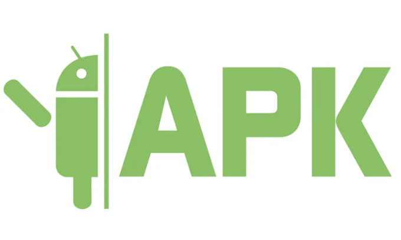
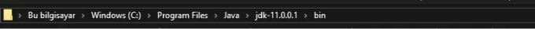
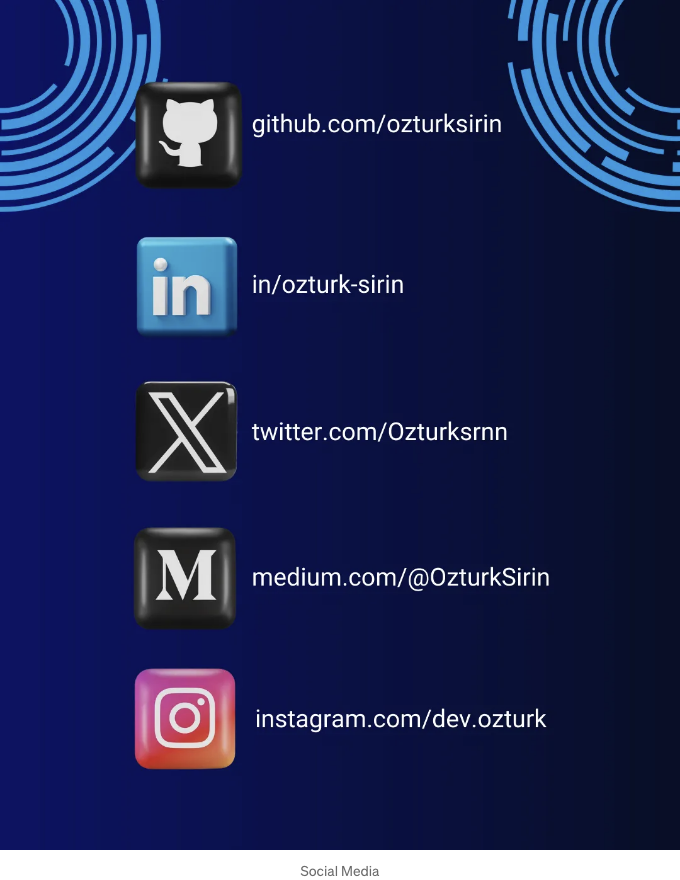

# APK이 뭔가요?

APK 파일(Android Package Kit 파일 형식)은 안드로이드 운영 체제(OS)에서 사용되는 응용 프로그램의 파일 형식입니다. APK 파일은 소프트웨어 프로그램의 모든 코드, 자산 및 리소스를 포함하여 앱이 필요한 모든 데이터를 담고 있습니다.

# APK가 왜 필요한가요?

<!-- ui-log 수평형 -->
<ins class="adsbygoogle"
  style="display:block"
  data-ad-client="ca-pub-4877378276818686"
  data-ad-slot="9743150776"
  data-ad-format="auto"
  data-full-width-responsive="true"></ins>
<component is="script">
(adsbygoogle = window.adsbygoogle || []).push({});
</component>

예를 들어, 우리가 앱을 개발했고 이를 다른 사람(고객 등)에게 테스트하거나 릴리스 전 최종 테스트를 수행하려고 할 때 APK 파일이 필요합니다.

그러나 APK 파일을 설치할 때 주의해야 합니다.
신뢰할 만한 소스에서 다운로드하지 않았거나 악의적으로 수정된 경우 보안 위험이 발생할 수 있습니다. 따라서 APK 파일을 설치할 때는 신뢰할 만한 소스에서 다운로드하고 기기를 최신 상태로 유지하는 것이 중요합니다.

# APK 생성:



<!-- ui-log 수평형 -->
<ins class="adsbygoogle"
  style="display:block"
  data-ad-client="ca-pub-4877378276818686"
  data-ad-slot="9743150776"
  data-ad-format="auto"
  data-full-width-responsive="true"></ins>
<component is="script">
(adsbygoogle = window.adsbygoogle || []).push({});
</component>

- C:\Program Files\Java\jdk-X.X.X.X.X\bin 경로로 로그인한 후 Powershell 또는 터미널을 열어봅시다.

2. 터미널에 키스토어를 생성하는 코드를 작성해 봅시다.

```js
keytool -genkeypair -v -keystore my-upload-key.keystore -alias 
my-key-alias -keyalg RSA -keysize 2048 -validity 10000
```

맥 컴퓨터의 파일 경로는 다음과 같습니다:
/Library/Java/JavaVirtualMachines/jdkX.X.X.jdk/Contents/Home

<!-- ui-log 수평형 -->
<ins class="adsbygoogle"
  style="display:block"
  data-ad-client="ca-pub-4877378276818686"
  data-ad-slot="9743150776"
  data-ad-format="auto"
  data-full-width-responsive="true"></ins>
<component is="script">
(adsbygoogle = window.adsbygoogle || []).push({});
</component>

```js
sudo keytool -genkey -v -keystore my-upload-key.keystore -alias my-key-alias -keyalg RSA -keysize 2048 -validity 10000
```

설명:
3. 생성한 Keystore 파일은 C:\Program Files\Java\jdk-X.X.X.X.X\bin 에 my-upload-key로 생성되었습니다.

4. Keystore 파일을 우리 프로젝트의 android/app 파일로 복사하여 붙여넣으세요.

<!-- ui-log 수평형 -->
<ins class="adsbygoogle"
  style="display:block"
  data-ad-client="ca-pub-4877378276818686"
  data-ad-slot="9743150776"
  data-ad-format="auto"
  data-full-width-responsive="true"></ins>
<component is="script">
(adsbygoogle = window.adsbygoogle || []).push({});
</component>

5. 안드로이드/gradle.properties 파일로 가서 (환경 변수) 정의를 작성해봅시다. 여기에 있는 정보는 우리가 키스토어를 생성할 때 작성한 정보와 동일해야 합니다.

```js
MYAPP_UPLOAD_STORE_FILE=my-upload-key.keystore
MYAPP_UPLOAD_KEY_ALIAS=my-key-alias
MYAPP_UPLOAD_STORE_PASSWORD=*****
MYAPP_UPLOAD_KEY_PASSWORD=*****
```

6. 서명 키와 키스토어 파일을 정의하기 위해 android/app/build.gradle 파일에 코드를 작성해야 합니다.

```js
signingConfigs {
    debug {
        storeFile file('debug.keystore')
        storePassword 'android'
        keyAlias 'androiddebugkey'
        keyPassword 'android'
    }
    release {
        if (project.hasProperty('MYAPP_UPLOAD_STORE_FILE')) {
            storeFile file(MYAPP_UPLOAD_STORE_FILE)
            storePassword MYAPP_UPLOAD_STORE_PASSWORD
            keyAlias MYAPP_UPLOAD_KEY_ALIAS
            keyPassword MYAPP_UPLOAD_KEY_PASSWORD
        }
    }
}
```

<!-- ui-log 수평형 -->
<ins class="adsbygoogle"
  style="display:block"
  data-ad-client="ca-pub-4877378276818686"
  data-ad-slot="9743150776"
  data-ad-format="auto"
  data-full-width-responsive="true"></ins>
<component is="script">
(adsbygoogle = window.adsbygoogle || []).push({});
</component>

7. 마지막으로 터미널에서 cd .\projectName\android 폴더로 이동하여 ./gradlew bundleRelease 명령어를 사용하여 릴리스 번들을 생성할 수 있습니다.



⭐이전 포스트