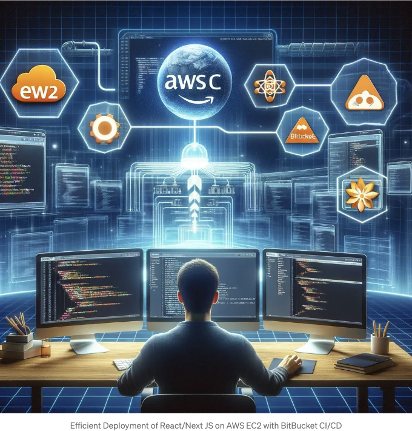

AWS EC2를 이용하여 React/Next.js 웹 애플리케이션을 BitBucket의 CI/CD 파이프라인을 통해 효율적으로 배포하는 간소화된 프로세스를 경험해보세요. 이 안내서는 이러한 강력한 기술들을 통합하는 것을 간단히 만들어주며, 발전된 효율성과 신뢰성을 위해 배포 프로세스를 자동화하는 단계별 접근 방법을 제공합니다. 웹 개발에 익숙하지 않은 분이든 경험 많은 개발자든, 이 블로그를 통해 배포 워크플로우를 향상시킬 통찰력을 얻을 수 있어 클라우드 상에서 원활히 배포되고 수월하게 유지되도록 할 것입니다.

# 목차

- 소개
- 사전 준비 사항
- AWS EC2 배포 설정
- BitBucket와 AWS EC2 간 SSH 연결 설정
- React/Next.js 애플리케이션 배포를 위한 준비
- BitBucket CI/CD를 통한 AWS EC2 자동 배포
- 배포 프로세스 최종화 및 테스트
- 결론

<!-- ui-log 수평형 -->
<ins class="adsbygoogle"
  style="display:block"
  data-ad-client="ca-pub-4877378276818686"
  data-ad-slot="9743150776"
  data-ad-format="auto"
  data-full-width-responsive="true"></ins>
<component is="script">
(adsbygoogle = window.adsbygoogle || []).push({});
</component>

# 소개

React/Next JS 애플리케이션을 효율적으로 배포하는 것은 오늘날 웹 개발 세계에서 중요합니다. 이 안내서는 기존의 React/Next JS 앱, AWS EC2 인스턴스 및 Bitbucket 저장소를 보유한 개발자들을 대상으로 하며, 배포 프로세스를 간소화하는 것을 목표로 합니다. AWS EC2는 애플리케이션이 필요로 하는 확장성과 신뢰성을 제공하며, Bitbucket CI/CD는 원활하고 자동화된 배포 파이프라인을 보장합니다.

이 안내서에서는 Bitbucket 파이프라인 설정, 애플리케이션을 배포하기 위한 준비 작업, AWS EC2를 성공적으로 구성하는 내용을 다룰 예정입니다. CI/CD 능력 수준에 관계없이 개발자를 대상으로 디자인된 이 게시물은 배포 워크플로우를 향상시키기 위한 실용적인 단계를 제공하여 웹 애플리케이션이 효율적이고 신뢰성 있게 배포되도록 돕습니다.

# 선행 조건

<!-- ui-log 수평형 -->
<ins class="adsbygoogle"
  style="display:block"
  data-ad-client="ca-pub-4877378276818686"
  data-ad-slot="9743150776"
  data-ad-format="auto"
  data-full-width-responsive="true"></ins>
<component is="script">
(adsbygoogle = window.adsbygoogle || []).push({});
</component>

이 가이드를 따르려면 다음이 필요합니다:

- AWS EC2 서버: Amazon Web Services (AWS) Elastic Compute Cloud (EC2) 인스턴스가 설정되어 호스팅할 준비가 되어 있어야 합니다. 이를 통해 앱이 필요한 확장 가능한 리소스를 가지게 됩니다.
- React/Next JS 애플리케이션: React/Next JS 애플리케이션이 개발되어 배포할 준비가 되어 있어야 합니다. 앱은 배포할 수 있는 상태여야 하며 필요한 테스트 또는 프로덕션 환경 구성이 이미 완료되어 있어야 합니다.
- Bitbucket Git 저장소: 애플리케이션 코드가 Bitbucket 저장소에 저장되어 있어야 합니다. 이는 Bitbucket의 CI/CD 파이프라인을 활용하여 자동 배포하는 데 중요합니다.

이러한 구성요소를 갖추고 있으면 React/Next JS 애플리케이션을 AWS EC2에 배포하고 Bitbucket CI/CD를 사용하는 방법에 대한 자세한 내용으로 진입할 준비가 되었습니다.

# AWS EC2 배포 설정

<!-- ui-log 수평형 -->
<ins class="adsbygoogle"
  style="display:block"
  data-ad-client="ca-pub-4877378276818686"
  data-ad-slot="9743150776"
  data-ad-format="auto"
  data-full-width-responsive="true"></ins>
<component is="script">
(adsbygoogle = window.adsbygoogle || []).push({});
</component>

React/Next JS 어플리케이션을 AWS EC2에 배포하려면 튼튼한 기반이 필요합니다. 이 섹션에서는 EC2 인스턴스를 설정하여 어플리케이션을 효과적으로 호스팅하고 관리하기 위한 필수 도구와 서비스를 안내합니다.

1. Node.js 및 NPM 설치:

- 먼저 nvm (Node Version Manager)을 설치하여 여러 Node JS 버전을 관리하세요. 이 방법을 통해 React/Next JS 어플리케이션 요구 사항과 일치하는 특정 Node.js 버전을 선택할 수 있습니다. (링크)
- nvm을 설치한 후, 해당 도구를 사용하여 Node JS를 설치하세요. 이렇게 하면 NPM이 자동으로 함께 설치되어 어플리케이션 의존성을 관리할 수 있게 됩니다.

2. PM2 설정하기:

<!-- ui-log 수평형 -->
<ins class="adsbygoogle"
  style="display:block"
  data-ad-client="ca-pub-4877378276818686"
  data-ad-slot="9743150776"
  data-ad-format="auto"
  data-full-width-responsive="true"></ins>
<component is="script">
(adsbygoogle = window.adsbygoogle || []).push({});
</component>

- PM2은 Node JS 애플리케이션용 강력한 프로세스 관리자로, 앱을 백그라운드에서 유지하고 프로세스를 효율적으로 관리하는 데 도움이 됩니다. 앱이 충돌하거나 서버가 다시 부팅될 경우 자동으로 애플리케이션을 다시 시작하도록 npm을 통해 PM2를 설치하세요. (링크)
- PM2를 설치한 후 코드로 이동하여 빌드 명령을 실행하여 프로젝트 빌드를 생성하고, 그 후에 pm2를 사용하여 애플리케이션을 시작할 수 있습니다.

```js
npm run build && pm2 start "애플리케이션 이름"
# 애플리케이션 이름: 필요에 따라 지정할 수 있습니다,
# pm2 start를 실행할 때 프로젝트 폴더 내에 있어야 합니다
```

3. Nginx를 Reverse Proxy로 구성하는 방법:

- EC2 인스턴스에 Nginx를 설치합니다. Nginx는 클라이언트 요청을 특정 포트(예: localhost:3000)에서 실행 중인 애플리케이션으로 리디렉션하는 Reverse Proxy로 작동하며 컨텐츠를 직접 제공합니다.
- sites-available 디렉토리에 있는 Nginx 구성 파일을 수정합니다. 또는 sites-available 내에 새 파일을 생성할 수 있습니다. 여기서 PM2에서 실행 중인 React/Next JS 애플리케이션으로의 요청을 프로기하려면 서버 구성 내의 location 블록을 구성하여 http://localhost:3000 또는 pm2가 서버를 시작하는 포트로 요청을 프록시하도록 설정합니다. 앱이 들어오는 트래픽을 수신하는 포트입니다.
- Nginx sites-available 디렉토리 파일 샘플.

<!-- ui-log 수평형 -->
<ins class="adsbygoogle"
  style="display:block"
  data-ad-client="ca-pub-4877378276818686"
  data-ad-slot="9743150776"
  data-ad-format="auto"
  data-full-width-responsive="true"></ins>
<component is="script">
(adsbygoogle = window.adsbygoogle || []).push({});
</component>

```js
server {
  listen 80;
  server_name 18.xxx.xxx.xx; # 귀하의 도메인 이름 또는 EC2 공인 IP로 대체해주세요
  
  location / {
     proxy_pass http://localhost:3000; # React/Next JS 앱이 3000번 포트에서 실행 중
     proxy_http_version 1.1;
     proxy_set_header Upgrade $http_upgrade;
     proxy_set_header Connection 'upgrade';
     proxy_set_header Host $host;
     proxy_cache_bypass $http_upgrade;
   }
 }
```

- site-available 디렉토리를 설정한 후에 Nginx 서버를 다시 시작하세요.

4. 설정 완료:

- Nginx와 PM2가 구성된 후에 설정을 테스트하여 Nginx가 요청을 애플리케이션으로 올바르게 전달하고 PM2가 애플리케이션을 원활하게 실행하는지 확인하는 것이 중요합니다.
- 브라우저를 열고 공용 IP로 프로젝트가 브라우저에서 제대로 보이는지 확인할 수 있습니다.```

<!-- ui-log 수평형 -->
<ins class="adsbygoogle"
  style="display:block"
  data-ad-client="ca-pub-4877378276818686"
  data-ad-slot="9743150776"
  data-ad-format="auto"
  data-full-width-responsive="true"></ins>
<component is="script">
(adsbygoogle = window.adsbygoogle || []).push({});
</component>

```js
http://18.xxx.xxx.xx:3000
```

- 이 설정을 통해 PM2가 앱 프로세스를 관리하고 Nginx가 웹 서빙과 리버스 프록시 역할을 처리하여 프로덕션 트래픽을 효율적으로 처리할 수 있습니다.

위 단계를 따라하면 AWS EC2 인스턴스에 안정적인 환경을 구축하여 React/Next JS 애플리케이션을 배포할 수 있습니다. 이 설정은 사용자가 애플리케이션에 접근할 수 있음을 보장하는 것뿐만 아니라 안정적이고 확장 가능한 호스팅 솔루션을 제공합니다.

# Bitbucket와 AWS EC2 사이의 SSH 연결 설정하기

<!-- ui-log 수평형 -->
<ins class="adsbygoogle"
  style="display:block"
  data-ad-client="ca-pub-4877378276818686"
  data-ad-slot="9743150776"
  data-ad-format="auto"
  data-full-width-responsive="true"></ins>
<component is="script">
(adsbygoogle = window.adsbygoogle || []).push({});
</component>

Bitbucket 파이프라인을 활용하여 배포 프로세스를 자동화하면 AWS EC2 서버로 업데이트를 쉽게 전송할 수 있습니다. 이 섹션에서는 원활한 배포를 위해 안전한 SSH 통신을 설정하는 방법을 설명합니다.

SSH 키 설정:
Bitbucket과 AWS EC2 인스턴스 간의 신뢰할 수 있는 연결을 구축하려면 SSH 키가 필요합니다. 먼저 PEM 키를 사용하여 SSH 키 쌍(개인 및 공개 키)을 생성합니다. 이 키 쌍을 사용하면 암호 없이 안전하게 액세스할 수 있습니다.

개인 PEM 키를 사용하여 공개 키를 생성하세요.

```js
ssh-keygen -y -f key.pem > key.pub
```

<!-- ui-log 수평형 -->
<ins class="adsbygoogle"
  style="display:block"
  data-ad-client="ca-pub-4877378276818686"
  data-ad-slot="9743150776"
  data-ad-format="auto"
  data-full-width-responsive="true"></ins>
<component is="script">
(adsbygoogle = window.adsbygoogle || []).push({});
</component>

1. Bitbucket에 SSH 키 저장하기:

- Bitbucket에서 저장소 설정으로 이동합니다.
- Pipelines ` SSH keys로 이동합니다.
- 여기에 개인 키와 공개 키를 업로드합니다. Bitbucket은 이 키를 사용하여 AWS EC2 인스턴스에 안전하게 액세스합니다.

2. EC2 인스턴스 구성하기:

- AWS EC2 인스턴스에서 `~/.ssh/authorized_keys` 파일에 액세스합니다.
- 생성한 공개 키를 이 파일에 추가합니다. 이 단계를 통해 Bitbucket이 Bitbucket의 설정에 저장된 개인 키를 사용하여 EC2 서버에 연결을 설정할 수 있습니다.

<!-- ui-log 수평형 -->
<ins class="adsbygoogle"
  style="display:block"
  data-ad-client="ca-pub-4877378276818686"
  data-ad-slot="9743150776"
  data-ad-format="auto"
  data-full-width-responsive="true"></ins>
<component is="script">
(adsbygoogle = window.adsbygoogle || []).push({});
</component>

성공:
위 단계를 통해 Bitbucket과 AWS EC2 인스턴스에서 SSH 키를 성공적으로 구성하여 배포 프로세스에 안전한 채널을 만들었습니다. 이 설정을 통해 Bitbucket에서 AWS EC2로의 배포가 자동화되고 안전하게 이루어지며, 응용 프로그램에 효율적이고 신뢰할 수 있는 업데이트가 가능해집니다.

# 배포를 위해 React/Next JS 애플리케이션 준비

React/Next JS 애플리케이션을 AWS EC2로 배포하기 전에 운영 환경에 최적화하는 것이 중요합니다. 이는 실제 환경에서 최적의 성능을 보장하는 프로덕션 준비 빌드를 생성하는 것을 포함합니다.

프로덕션 빌드 생성:

<!-- ui-log 수평형 -->
<ins class="adsbygoogle"
  style="display:block"
  data-ad-client="ca-pub-4877378276818686"
  data-ad-slot="9743150776"
  data-ad-format="auto"
  data-full-width-responsive="true"></ins>
<component is="script">
(adsbygoogle = window.adsbygoogle || []).push({});
</component>

- 명령어: 서버의 프로젝트 루트 디렉토리에서 `npm run build`를 실행하세요. 이 명령은 애플리케이션을 프로덕션에 최적화된 정적 파일로 컴파일합니다. Next JS 앱은 `.next` 폴더를 보이고, React 앱은 `build` 폴더를 가집니다.
- 확인: 프로덕션 빌드 파일이 있는지 확인하기 위해 출력 디렉토리를 확인하세요. 배포 준비가 끝나면 웹사이트를 업데이트한 내용을 확인하려면 PM2를 다시 시작해야 합니다.

```js
pm2 restart "애플리케이션 이름"
```

중요한 이유:

- 최적화: 성능 향상이 되어 사용자 경험과 SEO에 필수적입니다.
- 신뢰성: 특정 환경 오류를 최소화하여 프로덕션 환경에서 애플리케이션이 원할하게 작동함을 보장합니다.

<!-- ui-log 수평형 -->
<ins class="adsbygoogle"
  style="display:block"
  data-ad-client="ca-pub-4877378276818686"
  data-ad-slot="9743150776"
  data-ad-format="auto"
  data-full-width-responsive="true"></ins>
<component is="script">
(adsbygoogle = window.adsbygoogle || []).push({});
</component>

생산 빌드가 완료되어, 응용 프로그램은 AWS EC2 서버로의 다음 배포 단계를 위해 준비가 되었습니다. 

# Bitbucket CI/CD를 활용한 AWS EC2로의 배포 자동화

React/Next JS 응용 프로그램을 AWS EC2로 효율적으로 배포하는 과정을 간소화하면 업데이트를 원활하게 및 효율적으로 적용할 수 있습니다. Bitbucket Pipelines는 연속적 통합 및 배포 (CI/CD)의 강력함을 활용하여 코드 변경 시에 자동으로 AWS EC2로 직접 배포합니다.

배포 자동화:

<!-- ui-log 수평형 -->
<ins class="adsbygoogle"
  style="display:block"
  data-ad-client="ca-pub-4877378276818686"
  data-ad-slot="9743150776"
  data-ad-format="auto"
  data-full-width-responsive="true"></ins>
<component is="script">
(adsbygoogle = window.adsbygoogle || []).push({});
</component>

- 배포 자동화는 비트버킷 리포지토리에서 bitbucket-pipelines.yml 파일을 구성하는 작업을 포함합니다. 이 YAML 파일은 테스트, 빌드, 및 애플리케이션 배포와 같은 배포 파이프라인 단계를 정의합니다.
- 예시 bitbucket-pipelines.yml 구성:

```js
image: node:latest

pipelines:
  default:
    - step:
        script:
          - echo "이 단계는 명시적으로 지정되지 않은 모든 브랜치에 대해 실행됩니다."

  branches:
    main:
      - step:
          name: 본 빌드 및 배포
          deployment: production
          caches:
            - node
          script:
            - npm install
            - npm run build
            - scp -o StrictHostKeyChecking=no -r .next/ ubuntu@ec2-18-xxx-xxx-xx.eu-west-2.compute.amazonaws.com:/home/ubuntu/my-project/
              # React JS 프로젝트의 경우 .next 대신 build 디렉토리를 사용해야 합니다.
            - ssh -o StrictHostKeyChecking=no ubuntu@ec2-18-xxx-xxx-xx.eu-west-2.compute.amazonaws.com "source ~/.nvm/nvm.sh && pm2 restart all"
```

# 최종적으로 배포 프로세스 완료 및 테스트

배포 파이프라인을 성공적으로 설정하는 것은 중요한 이정표입니다. 마지막 단계는 배포 프로세스가 의도대로 작동하고 AWS EC2 서버로 업데이트를 자동으로 푸시하며 지속성과 관리를 위해 PM2로 애플리케이션을 관리하는지 확인하는 것입니다.

<!-- ui-log 수평형 -->
<ins class="adsbygoogle"
  style="display:block"
  data-ad-client="ca-pub-4877378276818686"
  data-ad-slot="9743150776"
  data-ad-format="auto"
  data-full-width-responsive="true"></ins>
<component is="script">
(adsbygoogle = window.adsbygoogle || []).push({});
</component>

업데이트 배포하기:

- 변경 사항 푸시: Bitbucket 저장소의 주 브랜치로 변경 내용을 커밋하고 푸시합니다. 이 작업은 bitbucket-pipelines.yml 파일에서 구성된 Bitbucket 파이프라인을 트리거합니다.
- 파이프라인 모니터링: Bitbucket 저장소의 Pipelines 섹션으로 이동하여 진행 상황을 모니터링합니다. 종속성 설치, 애플리케이션 빌드, AWS EC2로의 배포 등 단계를 거치는 파이프라인이 표시됩니다.
- 배포 스크립트: 배포 스크립트가 빌드를 서버로 전송하는 것뿐만 아니라 PM2를 통해 애플리케이션을 다시 시작한다는 것을 확인합니다. 파이프라인 내 배포 단계에서 pm2 restart all과 같은 명령어를 사용하여 모든 애플리케이션을 다시 시작하거나 더 구체적인 애플리케이션 다시 시작 명령어를 실행할 수 있습니다.

배포 테스트:

- 라이브 애플리케이션 확인: 파이프라인이 완료되면 새 변경 사항이 정상적으로 작동하는지 확인하기 위해 공용 URL에서 애플리케이션에 접속합니다.
- PM2 상태 확인: AWS EC2 인스턴스에 로그인하여 pm2 list를 사용하여 애플리케이션이 실행 중인지 확인하고 프로세스 상태를 확인합니다. 이렇게 함으로써 PM2가 성공적으로 배포 후 애플리케이션을 다시 시작했는지 확인할 수 있습니다.

<!-- ui-log 수평형 -->
<ins class="adsbygoogle"
  style="display:block"
  data-ad-client="ca-pub-4877378276818686"
  data-ad-slot="9743150776"
  data-ad-format="auto"
  data-full-width-responsive="true"></ins>
<component is="script">
(adsbygoogle = window.adsbygoogle || []).push({});
</component>

# 결론

React/Next JS 애플리케이션을 Bitbucket CI/CD를 사용하여 AWS EC2에 배포하는 것은 개발 효율성과 운영 신뢰성의 강력한 조합을 나타냅니다. 배포 프로세스를 자동화함으로써 워크플로우를 최적화할 뿐만 아니라 애플리케이션이 지속적 통합 및 배포의 이점을 누릴 수 있습니다. 이 안내서는 AWS EC2 환경 설정부터 Bitbucket 파이프라인 구성, 배포 자동화, PM2를 사용한 애플리케이션 관리까지 각 단계를 안내했습니다.

이러한 사례에 순응함으로써 개발에 더 많은 초점을 맞추고 배포의 복잡성에 대해 덜 걱정할 수 있습니다. 성공적인 배포 전략의 핵심은 단순히 프로세스를 자동화하는 데만 있지 않으며, 애플리케이션의 요구사항 및 라이브 환경에서의 성능에 따라 꾸준한 테스트 및 조정이 필요합니다.

계속해서 AWS, Bitbucket 및 PM2의 기능을 탐색하십시오. 배포 파이프라인을 더 최적화하여 애플리케이션이 사용자에게 최상의 경험을 제공하도록 확실하게 하세요.

<!-- ui-log 수평형 -->
<ins class="adsbygoogle"
  style="display:block"
  data-ad-client="ca-pub-4877378276818686"
  data-ad-slot="9743150776"
  data-ad-format="auto"
  data-full-width-responsive="true"></ins>
<component is="script">
(adsbygoogle = window.adsbygoogle || []).push({});
</component>

## 다음에 또 만나요! 코딩 즐기세요!!