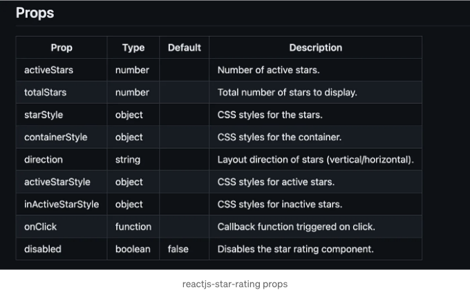

지금의 경쟁 심화된 디지털 환경에서는 사용자 참여를 강화하는 것이 모든 웹 애플리케이션의 성공에 중요합니다. 이를 달성하는 한 가지 효과적인 방법은 별점과 같은 인터랙티브 기능을 통합하는 것입니다. 이 포괄적인 안내서에서는 ReactJS Star Rating 컴포넌트의 파워를 활용하여 애플리케이션을 향상시키고 사용자 상호작용을 촉진하는 방법을 살펴보겠습니다.


# 소개: ReactJS Star Rating의 중요성 이해하기

사용자 피드백은 사용자 경험을 형성하고 제품 결정을 이끌어내는 데 중요한 역할을 합니다. ReactJS Star Rating 컴포넌트를 애플리케이션에 통합함으로써 사용자들이 자신의 의견을 표현할 수 있는 간단하고 효과적인 방법을 제공할 수 있습니다. 전자 상거래 플랫폼, 리뷰 사이트 또는 소셜 네트워킹 앱을 개발하고 있다면, 별점을 구현하여 가치 있는 피드백을 수집하고 사용자 참여를 강화하는 것이 중요합니다.

<!-- ui-log 수평형 -->
<ins class="adsbygoogle"
  style="display:block"
  data-ad-client="ca-pub-4877378276818686"
  data-ad-slot="9743150776"
  data-ad-format="auto"
  data-full-width-responsive="true"></ins>
<component is="script">
(adsbygoogle = window.adsbygoogle || []).push({});
</component>

# 특징들

- 간편함: 최소한의 노력으로 React.js 애플리케이션에 별점 평가를 쉽게 통합할 수 있습니다.
- 맞춤화: 디자인 요구 사항에 맞게 크기, 색상 등을 포함한 별의 모양을 맞춤화할 수 있습니다.
- 유연성: 특정 사용 사례에 적합하도록 전체 및 반 별점 평가 옵션 중 선택할 수 있습니다.
- 접근성: 모든 사용자를 위한 포괄적인 사용자 경험을 보장하기 위해 접근성을 고려하여 설계되었습니다.

# 시작하기: ReactJS Star Rating 통합

React 애플리케이션에 별점 평가를 구현하는 첫 번째 단계는 ReactJS Star Rating 구성 요소를 설치하는 것입니다. 다음 명령을 실행하여 쉽게 설치할 수 있습니다:

<!-- ui-log 수평형 -->
<ins class="adsbygoogle"
  style="display:block"
  data-ad-client="ca-pub-4877378276818686"
  data-ad-slot="9743150776"
  data-ad-format="auto"
  data-full-width-responsive="true"></ins>
<component is="script">
(adsbygoogle = window.adsbygoogle || []).push({});
</component>

패키지 @mil-rlib/reactjs-star-rating

데모 링크 https://milayek86.github.io/reactjs-star-rating/

```js
npm install @mil-rlib/reactjs-star-rating
```

또는

<!-- ui-log 수평형 -->
<ins class="adsbygoogle"
  style="display:block"
  data-ad-client="ca-pub-4877378276818686"
  data-ad-slot="9743150776"
  data-ad-format="auto"
  data-full-width-responsive="true"></ins>
<component is="script">
(adsbygoogle = window.adsbygoogle || []).push({});
</component>

```js
yarn add @mil-rlib/reactjs-star-rating
```

설치가 완료되면 StarRating 컴포넌트를 React 파일에 가져와서 응용 프로그램 전체에 별점을 표시하는 데 사용할 수 있습니다.

# 기본 사용법: 매끄러운 구현

ReactJS Star Rating 컴포넌트를 설치하면 응용 프로그램에 별점을 추가하는 것이 매우 쉽습니다. StarRating 컴포넌트를 가져와서 원하는 등급을 속성(prop)으로 전달하면 됩니다. 다음은 기본적인 예시입니다:```

<!-- ui-log 수평형 -->
<ins class="adsbygoogle"
  style="display:block"
  data-ad-client="ca-pub-4877378276818686"
  data-ad-slot="9743150776"
  data-ad-format="auto"
  data-full-width-responsive="true"></ins>
<component is="script">
(adsbygoogle = window.adsbygoogle || []).push({});
</component>

```js
import React from ‘react’;
import StarRating from ‘@mil-rlib/reactjs-star-rating’;

const ProductRating = ({ rating }) => {
 return (
 <div className="product-rating">
 <StarRating rating={rating} />
 </div>
 );
};
export default ProductRating;
```

# 사용자 정의 옵션: 별점을 필요에 맞게 조정하기

ReactJS Star Rating 컴포넌트는 응용 프로그램의 디자인에 맞는 별점을 보장하기 위한 다양한 사용자 정의 옵션을 제공합니다. 크기, 별의 총 개수, 채워진 별과 빈 별 아이콘을 사용자 정의할 수 있으며, 심지어 등급에 대한 사용자 상호작용도 처리할 수 있습니다. 이러한 유연성 덕분에 응용 프로그램에 별점을 원활하게 통합하면서 브랜딩과 일관성을 유지할 수 있습니다.

```js
import React, { useState } from 'react'
import StarRating from '@mil-rlib/reactjs-star-rating'

const App = () => {
  const [activeStars, setActiveStars] = useState(0)
  const handleStarClick = (starCount) => {
    setActiveStars(starCount)
  }

  return (
    <StarRating
      activeStars={activeStars}
      totalStars={10}
      starStyle={{ fontSize: 40, color: 'red' }}
      containerStyle={{ border: 'solid' }}
      direction={'horizontal'} //vertical/horizontal
      activeStarStyle={{ color: 'green' }}
      inActiveStarStyle={{ color: 'gray' }}
      onClick={handleStarClick}
      disabled={true}
    />
  )
}
```

<!-- ui-log 수평형 -->
<ins class="adsbygoogle"
  style="display:block"
  data-ad-client="ca-pub-4877378276818686"
  data-ad-slot="9743150776"
  data-ad-format="auto"
  data-full-width-responsive="true"></ins>
<component is="script">
(adsbygoogle = window.adsbygoogle || []).push({});
</component>

# 비활성화된 평가

```js
import React from 'react'
import StarRating from '@mil-rlib/reactjs-star-rating'

const DisabledExample = () => {
  return (
    <StarRating
      activeStars={4}
      totalStars={5}
      onClick={(starCount) => console.log('Clicked star count:', starCount)}
      disabled
    />
  )
}

export default DisabledExample
```

# 심화 항목: 상호작용하는 별점 평가

정적인 별점 평가를 표시하는 것은 유용하지만, 사용자가 상호작용하여 피드백을 제공할 수 있도록 하는 것은 사용자 참여를 높일 수 있습니다. ReactJS Star Rating 구성 요소를 사용하면 상호작용하는 별점 평가를 구현하기가 간단합니다. React의 상태 관리 기능을 활용하고 구성 요소가 제공하는 onChange 콜백을 사용하여 동적이고 상호작용하는 별점 평가 시스템을 만들 수 있습니다. 이를 통해 사용자는 제품, 서비스 등을 쉽게 평가할 수 있습니다.

<!-- ui-log 수평형 -->
<ins class="adsbygoogle"
  style="display:block"
  data-ad-client="ca-pub-4877378276818686"
  data-ad-slot="9743150776"
  data-ad-format="auto"
  data-full-width-responsive="true"></ins>
<component is="script">
(adsbygoogle = window.adsbygoogle || []).push({});
</component>

# 속성:



# 결론: ReactJS 스타 등급으로 React 애플리케이션을 높이세요

마지막으로, ReactJS 스타 등급 컴포넌트를 React 애플리케이션에 통합하는 것은 사용자 참여를 촉진하고 가치 있는 피드백을 모을 수 있는 확실한 방법입니다. 귀하의 전자 상거래 플랫폼에서 사용자 경험을 향상시키거나 리뷰 사이트에서 사용자 참여를 촉진하려는 경우, 스타 등급은 중요한 기능으로서 상당한 차이를 만들 수 있습니다. 이 안내서에 소개된 단계를 따르면 React 애플리케이션에 스타 등급을 원활하게 통합하여 사용자가 자신의 의견을 시각적이고 직관적인 방식으로 표현할 수 있도록 제공할 수 있습니다.

<!-- ui-log 수평형 -->
<ins class="adsbygoogle"
  style="display:block"
  data-ad-client="ca-pub-4877378276818686"
  data-ad-slot="9743150776"
  data-ad-format="auto"
  data-full-width-responsive="true"></ins>
<component is="script">
(adsbygoogle = window.adsbygoogle || []).push({});
</component>

프론트 엔드 개발자님 안녕하세요!

사용자 참여를 증진하고 응용 프로그램 상호 작용을 증가시키는 기회를 놓치지 마세요. 지금 바로 ReactJS 별점 평가 컴포넌트를 도입하고 사용자 참여도가 급상승하는 것을 확인해보세요!

Monowar Iqbal layek가 개발한 Github 링크를 통해 자세히 알아보실 수 있습니다.

잊지 마세요, 사용자 경험을 높이는데 도움이 되는 기술들을 접목하는 것은 매우 중요합니다!

감사합니다!