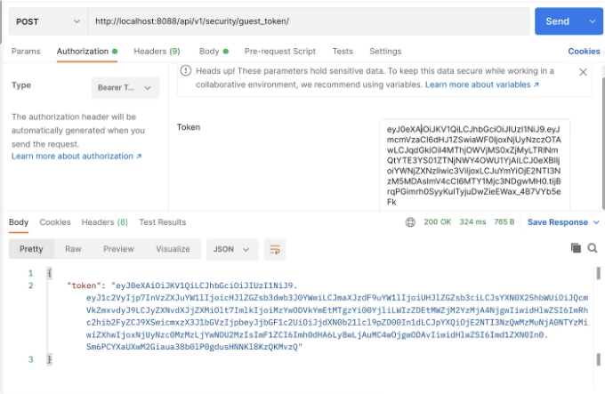

```markdown


슈퍼셋(Superset)은 차트를 빠르게 구축할 수 있는 노코드 웹 기반 인터페이스입니다. 여러 데이터베이스 및 시각화를 지원하여 데이터를 효과적으로 표시할 수 있습니다. 대시보드 임베딩을 통해 슈퍼셋 대시보드를 아이프레임을 통해 자체 애플리케이션에 임베드할 수 있습니다.

임베드된 대시보드는 통찰력 있는 데이터 분석을 웹 애플리케이션에 직접 가져오는 방법을 제공합니다.

임베딩 SDK를 사용하면 앱의 인증을 사용하여 슈퍼셋 대시보드를 자체 웹 앱에 임베드할 수 있습니다.
```  

<!-- ui-log 수평형 -->
<ins class="adsbygoogle"
  style="display:block"
  data-ad-client="ca-pub-4877378276818686"
  data-ad-slot="9743150776"
  data-ad-format="auto"
  data-full-width-responsive="true"></ins>
<component is="script">
(adsbygoogle = window.adsbygoogle || []).push({});
</component>

프론트 엔드 개발자입니다. 위의 텍스트를 친근한 톤으로 한국어로 번역해 드리겠습니다.

임베딩(embedding)은 호스트 애플리케이션에 Superset 페이지를 담고 있는 iframe을 삽입하여 수행됩니다. 사용자가 이미 호스트 앱에 로그인되어 있는 경우 통합 대시보드에 다시 로그인할 필요가 없어야 합니다.

# 목표

- React 앱에서 Superset 그래프에 액세스
- 임베드된 대시보드에 다중 테넌시(multi-tenancy) 지원 추가
- 액세스 제어를 위한 RLS 사용

# 준비 사항

<!-- ui-log 수평형 -->
<ins class="adsbygoogle"
  style="display:block"
  data-ad-client="ca-pub-4877378276818686"
  data-ad-slot="9743150776"
  data-ad-format="auto"
  data-full-width-responsive="true"></ins>
<component is="script">
(adsbygoogle = window.adsbygoogle || []).push({});
</component>

- Docker 또는 Docker Compose
- React 기반의 작동 중인 애플리케이션 및 백엔드

# 도커를 사용하여 Superset 설치

주어진 명령어를 사용하여 Superset의 최신 버전을 설치하세요.

```js
docker run -d -e SUPERSET_FEATURE_EMBEDDED_SUPERSET="true" -v ~/react-app/superset/superset_config_docker.py:/app/pythonpath/superset_config.py -p 8088:8088 --name superset apache/superset
```

<!-- ui-log 수평형 -->
<ins class="adsbygoogle"
  style="display:block"
  data-ad-client="ca-pub-4877378276818686"
  data-ad-slot="9743150776"
  data-ad-format="auto"
  data-full-width-responsive="true"></ins>
<component is="script">
(adsbygoogle = window.adsbygoogle || []).push({});
</component>

# 도커 컴포즈를 사용하여 Superset 설치하기

아래와 같이 Superset 서비스를 위한 docker-compose.yaml 파일을 만드세요. 컨테이너를 시작하려면 docker-compose up 명령을 사용하세요.

```js
version: '2.3'
services:
  superset:
    image: apache/superset:latest
    init: true
    ports:
      - "8088:8088"
    extra_hosts:
      - "host.docker.internal:host-gateway"
    networks:
      - react-app-network
    volumes:
      - ./superset/superset_config_docker.py:/app/pythonpath/superset_config.py
    environment:
      - SQLALCHEMY_DATABASE_URI='postgresql://postgres:postgres@db:5432/superset'
      - SUPERSET_FEATURE_EMBEDDED_SUPERSET='true'
```

아래 명령어를 사용하여 관리자 사용자를 생성하고 Superset을 초기화하세요:

<!-- ui-log 수평형 -->
<ins class="adsbygoogle"
  style="display:block"
  data-ad-client="ca-pub-4877378276818686"
  data-ad-slot="9743150776"
  data-ad-format="auto"
  data-full-width-responsive="true"></ins>
<component is="script">
(adsbygoogle = window.adsbygoogle || []).push({});
</component>

```js
도커 exec -it superset superset fab create-admin --username admin --firstname Superset --lastname Admin --email admin@superset.com --password admin
도커 exec -it superset superset db upgrade
도커 exec -it superset superset init
```

# 슈퍼셋 설정

아래 슈퍼셋 설정을 사용할 것입니다. 가장 중요한 부분은 EMBEDDED_SUPERSET 기능 플래그를 활성화하는 것입니다.

superset_config.py
```

<!-- ui-log 수평형 -->
<ins class="adsbygoogle"
  style="display:block"
  data-ad-client="ca-pub-4877378276818686"
  data-ad-slot="9743150776"
  data-ad-format="auto"
  data-full-width-responsive="true"></ins>
<component is="script">
(adsbygoogle = window.adsbygoogle || []).push({});
</component>

```js
SESSION_COOKIE_SAMESITE = None
ENABLE_PROXY_FIX = True
PUBLIC_ROLE_LIKE_GAMMA = True
FEATURE_FLAGS = {
    "EMBEDDED_SUPERSET": True
}
SQLALCHEMY_DATABASE_URI = 'postgresql://postgres:postgres@db:5432/superset'

CORS_OPTIONS = {
  'supports_credentials': True,
  'allow_headers': ['*'],
  'resources':['*'],
  'origins': ['http://localhost:8088', 'http://localhost:8888']
}
```

# Superset 차트 및 대시보드 생성

도커 이미지가 실행되면 Superset에 로그인하여 다음을 생성할 수 있습니다:

- Superset 사용자
- Superset 대시보드
- 대시보드 내에서 Superset 차트```

<!-- ui-log 수평형 -->
<ins class="adsbygoogle"
  style="display:block"
  data-ad-client="ca-pub-4877378276818686"
  data-ad-slot="9743150776"
  data-ad-format="auto"
  data-full-width-responsive="true"></ins>
<component is="script">
(adsbygoogle = window.adsbygoogle || []).push({});
</component>

# 임베디드 대시보드 UUID 생성

우리의 리액트 앱에서 대시보드에 액세스할 수 있도록하려면, 먼저 슈퍼셋 구성에서 "임베디드" 지원 기능을 활성화해야합니다.

활성화 후에는 대시보드를 임베드로 구성해야하며, 앱에서 임베디드 대시보드 UUID를 사용해야합니다. 해당 UUID는 아래 표시된 대시보드의 임베드 구성 화면에서 찾을 수 있습니다.

Client App의 적절한 호스트:포트를 입력해야합니다. 이제 대시보드는 Client App에 임베드 될 준비가 되어 있습니다.

<!-- ui-log 수평형 -->
<ins class="adsbygoogle"
  style="display:block"
  data-ad-client="ca-pub-4877378276818686"
  data-ad-slot="9743150776"
  data-ad-format="auto"
  data-full-width-responsive="true"></ins>
<component is="script">
(adsbygoogle = window.adsbygoogle || []).push({});
</component>

# 새 사용자 및 역할 생성

임베디드 대시보드에 액세스하도록 허용하려면 새 사용자를 생성하는 것이 좋습니다. 사용자를 생성할 때 다음 매개변수를 사용하세요. 중요한 점은 다음 역할을 부여하는 것입니다: [Public, Gamma]


<!-- ui-log 수평형 -->
<ins class="adsbygoogle"
  style="display:block"
  data-ad-client="ca-pub-4877378276818686"
  data-ad-slot="9743150776"
  data-ad-format="auto"
  data-full-width-responsive="true"></ins>
<component is="script">
(adsbygoogle = window.adsbygoogle || []).push({});
</component>

# 내장 대시보드 슈퍼셋 API와 상호 작용하기

## JWT 액세스 토큰을 가져오는 API

슈퍼셋과 상호 작용하기 위해 API 호출을 하기 전에, 먼저 JWT 액세스 토큰이 필요합니다. 여기에서는 관리자 사용자를 사용하여 액세스/요청 토큰을 가져옵니다. 추가 호출을 위해 "access_token"을 사용할 것입니다. 나중에 사용할 수 있도록 정확히 저장해주시기 바랍니다.

```js
/api/v1/security/login
```

<!-- ui-log 수평형 -->
<ins class="adsbygoogle"
  style="display:block"
  data-ad-client="ca-pub-4877378276818686"
  data-ad-slot="9743150776"
  data-ad-format="auto"
  data-full-width-responsive="true"></ins>
<component is="script">
(adsbygoogle = window.adsbygoogle || []).push({});
</component>


## 게스트 토큰을 받는 API

접근 토큰을 받으면, 임베드된 대시보드 인증을 위해 특별히 사용되는 게스트 토큰(https://github.com/apache/superset/pull/17517)이 필요합니다.

```js
/api/v1/security/guest_token/
```

<!-- ui-log 수평형 -->
<ins class="adsbygoogle"
  style="display:block"
  data-ad-client="ca-pub-4877378276818686"
  data-ad-slot="9743150776"
  data-ad-format="auto"
  data-full-width-responsive="true"></ins>
<component is="script">
(adsbygoogle = window.adsbygoogle || []).push({});
</component>



## 내장 대시보드에 대한 RLS 필터

RLS 규칙을 사용하면 선택한 데이터셋에서 사용자가 쿼리하고 특정 데이터를 볼 수 있는 세밀한 제어를 할 수 있습니다. 예를 들어 멀티테넌트 애플리케이션에서는 Superset 차트가 인증된 사용자에게 속한 데이터만 표시되어야 합니다. 이러한 수준의 제어는 RLS 필터를 사용하여 가능합니다.

RLS 규칙은 서비스 계정이 토큰을 생성할 때 지정되며, 해당 토큰으로 인증된 게스트 사용자가 분석 데이터베이스에 대해 수행하는 모든 쿼리에 적용됩니다. RLS 절이 없이 guest_token을 생성하는 경우 원본 쿼리에 대한 필터링이 이루어지지 않고 모든 데이터가 차트에 표시됩니다.

<!-- ui-log 수평형 -->
<ins class="adsbygoogle"
  style="display:block"
  data-ad-client="ca-pub-4877378276818686"
  data-ad-slot="9743150776"
  data-ad-format="auto"
  data-full-width-responsive="true"></ins>
<component is="script">
(adsbygoogle = window.adsbygoogle || []).push({});
</component>

이 예제에서는 customer_id=4에 대한 RLS 필터를 생성했습니다.

```js
{
"user": {"username": "myAppUser", "first_name": "MyApp User", "last_name": "MyApp User"}, "resources":[{"type": "dashboard", "id": "0f0c12de-6bf7-48e0-be5e-27e8a08c67de"}],"rls":[{"clause": "customer_id=4"}]
}
```


# 클라이언트 앱 (React) 측 코드

<!-- ui-log 수평형 -->
<ins class="adsbygoogle"
  style="display:block"
  data-ad-client="ca-pub-4877378276818686"
  data-ad-slot="9743150776"
  data-ad-format="auto"
  data-full-width-responsive="true"></ins>
<component is="script">
(adsbygoogle = window.adsbygoogle || []).push({});
</component>

아래는 클라이언트 측에서 슈퍼셋 대시보드를 "임베드"하는 데 필요한 코드 스니펫입니다. 대시보드는 DOM에 사용 가능한 iframe에 임베드될 것입니다.

```js
import { embedDashboard } from "@superset-ui/embedded-sdk";
const token = await fetchGuestTokenFromBackend(config);
embedDashboard({
    id: "abcede-ghifj-xyz",  // 슈퍼셋 임베딩 UI에서 제공
    supersetDomain: "https://localhost:8088",
    mountPoint: document.getElementById("superset-container"), // iframe이 렌더링될 HTML 요소
    fetchGuestToken: () => token,
    dashboardUiConfig: { hideTitle: true }
});
```

fetchGuestTokenFromBackend 함수의 구현에 대한 플로우 다이어그램은 위의 이미지를 참고해주세요.

<!-- ui-log 수평형 -->
<ins class="adsbygoogle"
  style="display:block"
  data-ad-client="ca-pub-4877378276818686"
  data-ad-slot="9743150776"
  data-ad-format="auto"
  data-full-width-responsive="true"></ins>
<component is="script">
(adsbygoogle = window.adsbygoogle || []).push({});
</component>

# 중요한 참고사항

RLS 필터링이 작동하지 않는다면, 동일 브라우저에서 다른 사용자가 로그인되어 있는지 확인해주세요. 저희는 동일 브라우저에서 Superset 관리 도구와 React 앱을 함께 열고 있었는데, 어떤 이유 때문에 RLS 필터가 작동하지 않았습니다. Superset 관리 도구에서 로그아웃 한 후에 React 앱의 RLS 필터가 작동하기 시작했습니다.