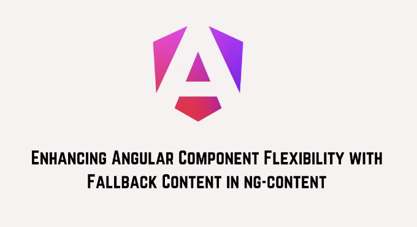

앵귤러 개발자들은 오랫동안 컴포넌트의 유연성과 견고성을 향상시키는 기능을 간청해 왔는데, 앵귤러 v18에서 그들의 기원이 이루어졌습니다: ng-content 슬롯에 대체 콘텐츠를 제공하는 기능이 도입되었습니다. 이 기다려온 기능은 개발자들이 ng-content 슬롯 내에 투영된 콘텐츠가 제공되지 않을 경우에 표시될 기본 콘텐츠를 지정할 수 있도록 합니다:

```js
@Component({
  selector: 'my-comp',
  template: `
    <ng-content select="header">기본 헤더</ng-content>
    <ng-content>기본 본문 콘텐츠</ng-content>
    <ng-content select="footer">기본 푸터</ng-content>
  `
})
export class MyComponent {}
```

위 예제에서는 헤더, 본문 콘텐츠 및 푸터를 위한 여러 ng-content 슬롯을 정의하는 MyComponent 컴포넌트를 정의하고 있습니다. 각 ng-content 태그 내에 기본 콘텐츠를 제공함으로써 이러한 슬롯에 콘텐츠가 투영되지 않은 경우 지정된 기본 콘텐츠가 표시됨을 보장합니다.

<!-- ui-log 수평형 -->
<ins class="adsbygoogle"
  style="display:block"
  data-ad-client="ca-pub-4877378276818686"
  data-ad-slot="9743150776"
  data-ad-format="auto"
  data-full-width-responsive="true"></ins>
<component is="script">
(adsbygoogle = window.adsbygoogle || []).push({});
</component>

다른 컴포넌트에서 이 컴포넌트의 사용법을 고려해 보겠습니다:

```js
@Component({
  template: `
    <my-comp>
      사용자 정의 주요 콘텐츠
      <footer>새로운 푸터</footer>
    </my-comp>
  `
})
class AppComponent {}
```

여기서 AppComponent 안에서는 MyComponent에 사용자 정의 주요 콘텐츠와 새로운 푸터를 프로젝트합니다. 헤더 슬롯에 내용이 프로젝트되지 않았기 때문에 MyComponent 템플릿 내에 지정된 기본 헤더가 표시됩니다. 마찬가지로, 주요 콘텐츠 슬롯에 내용이 프로젝트되지 않은 경우 기본 주요 콘텐츠가 사용됩니다.

Angular의 콘텐츠 프로젝션은 생성 시간에 발생한다는 점을 중요하게 인지해야 합니다. 이는 조건부 렌더링을 통해 슬롯의 내용을 동적으로 변경해도 기본 콘텐츠가 표시되지 않는다는 것을 의미합니다.

<!-- ui-log 수평형 -->
<ins class="adsbygoogle"
  style="display:block"
  data-ad-client="ca-pub-4877378276818686"
  data-ad-slot="9743150776"
  data-ad-format="auto"
  data-full-width-responsive="true"></ins>
<component is="script">
(adsbygoogle = window.adsbygoogle || []).push({});
</component>

```js
@Component({
  selector: 'my-comp',
  template: `
    <ng-content select="header">기본 헤더</ng-content>
    <ng-content>기본 메인 콘텐츠</ng-content>
    <ng-content select="footer">기본 푸터</ng-content>
  `
})
export class MyComponent {}

@Component({
  template: `
    <my-comp>
      @if(condition) {
        사용자 정의 메인 콘텐츠
      }
      <footer>새로운 푸터</footer>
    </my-comp>
  `
})
class AppComponent {}
```

위의 예시에서, 메인 콘텐츠의 조건부 렌더링이 있더라도 Angular의 콘텐츠 프로젝션 중에는 해당 동적 변경 사항이 고려되지 않기 때문에 기본 콘텐츠로 돌아가지 않습니다.

# 🙏 ngneat 및 Netanel Basal 지원하기: 주목 받기!

Angular용 ngneat 오픈 소스 라이브러리에 열정적이거나 Netanel Basal의 블로그 포스트가 학습 과정에서 가치 있는 것으로 생각되는가요? 제 작업을 후원하여 지원을 표현해주세요!
```

<!-- ui-log 수평형 -->
<ins class="adsbygoogle"
  style="display:block"
  data-ad-client="ca-pub-4877378276818686"
  data-ad-slot="9743150776"
  data-ad-format="auto"
  data-full-width-responsive="true"></ins>
<component is="script">
(adsbygoogle = window.adsbygoogle || []).push({});
</component>

저를 팔로우하고 Angular 및 JS에 관한 더 많은 내용을 읽어보세요!