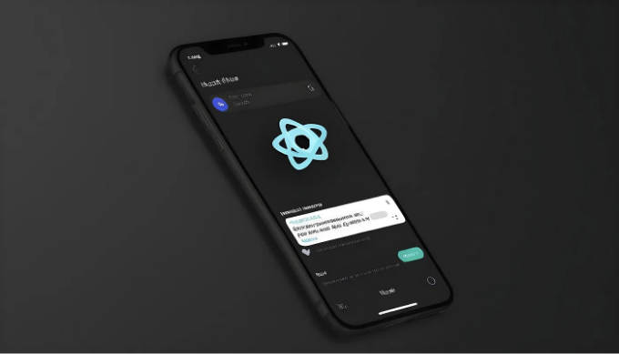

요즘 연결된 세상에서, 모바일 푸시 알림은 사용자를 참여시키고 애플리케이션 내의 중요한 이벤트와 업데이트에 대해 알려주는 필수 도구가 되었습니다. 그러나 사용자 베이스가 커지고 실시간 통신 수요가 증가함에 따라 푸시 알림의 적시 및 안정적인 전달을 보장하는 것은 어려울 수 있습니다. 이 블로그 글에서는 실시간 통신 인프라의 선두 제공 업체 인 PubNub을 활용하여 애플리케이션에서 모바일 푸시 알림을 보내는 프로세스를 간소화하는 방법을 살펴보겠습니다.

PubNub이란 무엇인가요? PubNub은 개발자가 신속하고 쉽게 실시간 응용 프로그램을 구축할 수 있도록 해주는 글로벌 데이터 스트림 네트워크(DSN) 및 실시간 인프라 서비스 회사입니다. PubNub을 사용하면 개발자는 복잡한 인프라를 관리하거나 확장성과 신뢰성을 걱정할 필요 없이 실시간 메시징, 존재 감지 및 데이터 스트리밍과 같은 기능을 애플리케이션에 구현할 수 있습니다. 

푸시 알림을 위해 PubNub을 선택하는 이유는 무엇인가요? PubNub은 모바일 푸시 알림을 보내는 데 여러 가지 이점을 제공합니다:

<!-- ui-log 수평형 -->
<ins class="adsbygoogle"
  style="display:block"
  data-ad-client="ca-pub-4877378276818686"
  data-ad-slot="9743150776"
  data-ad-format="auto"
  data-full-width-responsive="true"></ins>
<component is="script">
(adsbygoogle = window.adsbygoogle || []).push({});
</component>

- 실시간 배송: PubNub의 글로벌 데이터 센터 네트워크를 통해 푸시 알림이 최소 대기 시간으로 모바일 장치로 실시간으로 전달됩니다.
- 확장성: PubNub의 클라우드 기반 인프라는 매우 확장 가능하여 응용 프로그램이 대량의 푸시 알림을 처리할 수 있도록하며, 특히 사용량이 많은 기간에도 작동합니다.
- 신뢰성: PubNub은 높은 가용성과 신뢰성을 제공하여 푸시 알림 전달 실패나 다운타임의 위험을 줄입니다.
- 크로스 플랫폼 지원: PubNub은 iOS, Android, React Native 등 다양한 모바일 생태계를 대상으로하는 응용 프로그램에 적합한 여러 플랫폼을 지원합니다.
- 통합의 용이성: PubNub은 쉽게 모바일 애플리케이션에 통합할 수있는 SDK 및 API를 제공하여 푸시 알림을 구현하는 프로세스를 간소화합니다.

예: React Native 애플리케이션에서 PubNub을 사용하여 푸시 알림 구현하기. React Native 애플리케이션에서 PubNub을 사용하여 푸시 알림을 구현하는 방법에 대해 살펴보겠습니다. 이 예에서는 사용자가 새 메시지를 받을 때 푸시 알림을받는 간단한 채팅 애플리케이션을 만듭니다.

- PubNub 계정 설정:

- PubNub 계정에 가입하고 PubNub 대시 보드에서 게시 및 구독 키를 검색하십시오.

<!-- ui-log 수평형 -->
<ins class="adsbygoogle"
  style="display:block"
  data-ad-client="ca-pub-4877378276818686"
  data-ad-slot="9743150776"
  data-ad-format="auto"
  data-full-width-responsive="true"></ins>
<component is="script">
(adsbygoogle = window.adsbygoogle || []).push({});
</component>

2. PubNub SDK 설치하기:

- npm 또는 yarn을 사용하여 React Native 프로젝트에 PubNub JavaScript SDK를 설치하세요:

```js
npm install pubnub
```

3. 푸시 알림 구성하기:

<!-- ui-log 수평형 -->
<ins class="adsbygoogle"
  style="display:block"
  data-ad-client="ca-pub-4877378276818686"
  data-ad-slot="9743150776"
  data-ad-format="auto"
  data-full-width-responsive="true"></ins>
<component is="script">
(adsbygoogle = window.adsbygoogle || []).push({});
</component>

- iOS 및 Android에 대한 React Native 프로젝트에서 APNS(이 iOS를 위해) 및 FCM(이 Android를 위해)과 같은 플랫폼을 사용하여 푸시 알림 설정을 구성하세요.

4. PubNub 클라이언트 초기화:

- 발행 및 구독 키로 PubNub 클라이언트를 초기화하세요:

```js
import PubNub from 'pubnub';

const pubnub = new PubNub({
  publishKey: 'YOUR_PUBNUB_PUBLISH_KEY',
  subscribeKey: 'YOUR_PUBNUB_SUBSCRIBE_KEY',
});
``` 

<!-- ui-log 수평형 -->
<ins class="adsbygoogle"
  style="display:block"
  data-ad-client="ca-pub-4877378276818686"
  data-ad-slot="9743150776"
  data-ad-format="auto"
  data-full-width-responsive="true"></ins>
<component is="script">
(adsbygoogle = window.adsbygoogle || []).push({});
</component>

5. 푸시 알림 발행:
   
   - 새로운 메시지를 받으면 특정 채널로 푸시 알림을 발행합니다:

   ```js
   const sendMessage = (message) => {
     // 채널로 메시지 발행
     pubnub.publish({
       channel: 'chat_channel',
       message: message,
     });
   };
   ```

6. 푸시 알림 처리:

<!-- ui-log 수평형 -->
<ins class="adsbygoogle"
  style="display:block"
  data-ad-client="ca-pub-4877378276818686"
  data-ad-slot="9743150776"
  data-ad-format="auto"
  data-full-width-responsive="true"></ins>
<component is="script">
(adsbygoogle = window.adsbygoogle || []).push({});
</component>

- 클라이언트 측에서 푸시 알림을 수신하고 처리하는 핸들러를 구현하세요:

```js
// 메시지를 받기 위해 채널을 구독합니다
pubnub.subscribe({
  channels: ['chat_channel'],
});

// 수신한 메시지를 처리합니다
pubnub.addListener({
  message: (message) => {
    // 받은 메시지를 채팅 화면에 표시합니다
    console.log('새 메시지:', message);
  },
});
```

결론: PubNub을 활용하여 모바일 푸시 알림을 전송하는 것으로, 개발자는 사용자에게 즉각적이고 안정적인 알림을 제공함으로써 응용 프로그램의 실시간 통신 기능을 강화할 수 있습니다. PubNub의 확장 가능하고 안정적인 인프라를 활용하면, 개발자는 푸시 알림 전송의 복잡성에 대해 걱정하지 않고 매혹적인 사용자 경험을 구축에 집중할 수 있습니다. 채팅 애플리케이션, 실시간 협업 도구, 또는 기타 유형의 실시간 응용 프로그램을 개발하고 있다면, PubNub은 원활하고 매혹적인 사용자 경험을 제공하기 위해 필요한 도구와 인프라를 제공합니다.

# 🌟 읽어 주셔서 감사합니다!

<!-- ui-log 수평형 -->
<ins class="adsbygoogle"
  style="display:block"
  data-ad-client="ca-pub-4877378276818686"
  data-ad-slot="9743150776"
  data-ad-format="auto"
  data-full-width-responsive="true"></ins>
<component is="script">
(adsbygoogle = window.adsbygoogle || []).push({});
</component>

- 🚀 작업을 지원하려면 이 링크를 클릭해주세요: Support Me 🌟
- 👏 감사를 표현하기 위해 기사에 박수를 보내주세요.
- 📌 더 유익한 콘텐츠를 보려면 Avishek Kumar를 팔로우해주세요.

# 📣 참여하기

- 🔔 트위터에서 팔로우하기
- 🔗 링크드인에서 연락하기

# Stackademic 🎓

<!-- ui-log 수평형 -->
<ins class="adsbygoogle"
  style="display:block"
  data-ad-client="ca-pub-4877378276818686"
  data-ad-slot="9743150776"
  data-ad-format="auto"
  data-full-width-responsive="true"></ins>
<component is="script">
(adsbygoogle = window.adsbygoogle || []).push({});
</component>

감사합니다. 마지막까지 읽어주셔서 감사합니다!

- 작가를 클랩하고 팔로우해주시면 감사하겠습니다! 👏
- X 팔로우하기 | LinkedIn | YouTube | Discord
- 다른 플랫폼에서도 만나보세요: In Plain English | CoFeed | Venture | Cubed
- Stackademic.com에서 더 많은 콘텐츠를 즐겨보세요.