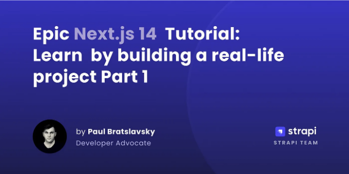

안녕하세요, 멋진 여러분들! 이 글에서 여러분께 우리가 무엇을 만들 것인지 소개해 드리려고 합니다.

Next.js 14와 Strapi의 인기로 인해 여러분도 멋진 것들을 구축할 수 있는 능력을 가질 수 있습니다. 우리는 Next.js 14의 멋진 측면, 앱 폴더, 서버 컴포넌트 및 서버 액션을 포함한 모든 새로운 기능을 다루기 위해 함께 프로젝트를 만들어 보려고 합니다.

만약 비디오 형식을 선호하신다면, [여기](https://www.youtube.com/watch?v=rvo-L0cP5NA) 비디오를 시청해 보실 수 있습니다.

<!-- ui-log 수평형 -->
<ins class="adsbygoogle"
  style="display:block"
  data-ad-client="ca-pub-4877378276818686"
  data-ad-slot="9743150776"
  data-ad-format="auto"
  data-full-width-responsive="true"></ins>
<component is="script">
(adsbygoogle = window.adsbygoogle || []).push({});
</component>

이 게시물에서는 무엇을 만들고 어떤 주제를 다룰지 빠르게 살펴보고, 프로젝트의 기본 구조를 설정하고, 첫 번째 커밋을 만들 것입니다.

그럼, 우리가 무엇을 만들고 있을까요?

## 문제 발생

그래서, 나는 문제가 있었어요. 유튜브에서 많은 시간을 보내고 동영상을 보다가, 중간에 나 자신이 완전히 흥미를 느끼지 못하는 동영상을 피할 수 있었을 것 같다는 것을 깨달았어요.

<!-- ui-log 수평형 -->
<ins class="adsbygoogle"
  style="display:block"
  data-ad-client="ca-pub-4877378276818686"
  data-ad-slot="9743150776"
  data-ad-format="auto"
  data-full-width-responsive="true"></ins>
<component is="script">
(adsbygoogle = window.adsbygoogle || []).push({});
</component>

비디오를 볼 가치가 있는지 먼저 요약을 받을 수 있다면 멋지지 않을까요?

저 또한 비디오를 학습 자료로 활용합니다. 비디오 요약뿐만 아니라 시청한 비디오 주변에 참고할 수 있는 메모를 작성하고 싶었어요.

그리고 바로 그것을 우리가 만들어볼 것이에요, AI의 힘으로 YouTube 비디오를 요약할 수 있는 앱을 만드는 거죠.

비디오에 시간을 허비할 필요 없어요. 우리는 그저 요약을 읽으면 됩니다.

<!-- ui-log 수평형 -->
<ins class="adsbygoogle"
  style="display:block"
  data-ad-client="ca-pub-4877378276818686"
  data-ad-slot="9743150776"
  data-ad-format="auto"
  data-full-width-responsive="true"></ins>
<component is="script">
(adsbygoogle = window.adsbygoogle || []).push({});
</component>

## AI 프로젝트 개요


## 사용할 기술

### Next.js

<!-- ui-log 수평형 -->
<ins class="adsbygoogle"
  style="display:block"
  data-ad-client="ca-pub-4877378276818686"
  data-ad-slot="9743150776"
  data-ad-format="auto"
  data-full-width-responsive="true"></ins>
<component is="script">
(adsbygoogle = window.adsbygoogle || []).push({});
</component>

Next.js는 React JavaScript 라이브러리를 기반으로 구축된 프론트엔드 프레임워크로, 매력적인 사용자 인터페이스를 만드는 데 유용합니다.

웹 개발을 간편하게 해 주어 가장 중요한 부분에 집중할 수 있게 도와줍니다. 이는 클라이언트를 위해 프로젝트를 개발할 수 있는데 가장 중요한 부분입니다.

그리고 이제 React Server Components 및 Server Actions와 같은 React의 새로운 기능에 모두 접근할 수 있습니다.

Next.js의 주요 기능 중 하나는 서버 측 렌더링입니다. 이는 웹 애플리케이션이 빠르게 로드되고 검색 엔진 순위에서 잘 나오도록 개선합니다. 성능 및 SEO에 큰 도움이 됩니다.

<!-- ui-log 수평형 -->
<ins class="adsbygoogle"
  style="display:block"
  data-ad-client="ca-pub-4877378276818686"
  data-ad-slot="9743150776"
  data-ad-format="auto"
  data-full-width-responsive="true"></ins>
<component is="script">
(adsbygoogle = window.adsbygoogle || []).push({});
</component>

Next.js에는 정적 생성 기능도 있어요. 이는 필요하기 전에 파일을 먼저 생성하여 데이터를 가져오기를 기다리지 않고 빠르게 로드할 수 있음을 의미합니다.

게다가, Next.js는 증분 정적 재생성을 제공합니다. 이 기능은 초기 생성 이후 업데이트되지 않거나 미리 생성되지 않은 페이지에 대한 동적 변경으로 정적 콘텐츠를 업데이트합니다.

우리 앱을 스타일링하기 위해 Tailwind와 ShadcnUI를 사용할 거에요.

### Strapi

<!-- ui-log 수평형 -->
<ins class="adsbygoogle"
  style="display:block"
  data-ad-client="ca-pub-4877378276818686"
  data-ad-slot="9743150776"
  data-ad-format="auto"
  data-full-width-responsive="true"></ins>
<component is="script">
(adsbygoogle = window.adsbygoogle || []).push({});
</component>

우리 애플리케이션 개발을 더 쉽게 만드려면 Strapi [헤드리스 CMS]의 강력함을 활용할 것입니다.

Strapi는 오픈 소스 헤드리스 콘텐츠 관리 시스템(CMS)입니다. 기존 CMS와 달리, 콘텐츠의 프론트엔드 표현과 강하게 결합되어있는 기존 CMS와 달리, Strapi와 같은 헤드리스 CMS는 콘텐츠를 백엔드로 관리하고 RESTful 또는 GraphQL API를 통해 제공합니다.

즉, Strapi를 사용하여 콘텐츠를 관리하고 선택한 웹사이트, 모바일 앱 또는 기타 서버 사이드 애플리케이션과 같은 프론트엔드 프레임워크나 플랫폼으로 전달할 수 있습니다.

Strapi를 사용하는 주요 이점은 개발자가 관리자 패널, API 및 데이터베이스 쿼리를 자신의 특정 요구에 맞게 사용자 정의할 수 있는 유연성입니다.

<!-- ui-log 수평형 -->
<ins class="adsbygoogle"
  style="display:block"
  data-ad-client="ca-pub-4877378276818686"
  data-ad-slot="9743150776"
  data-ad-format="auto"
  data-full-width-responsive="true"></ins>
<component is="script">
(adsbygoogle = window.adsbygoogle || []).push({});
</component>

다양한 데이터베이스를 지원하며 React, Vue, Angular과 같은 인기 있는 프론트엔드 프레임워크와 쉽게 통합할 수 있습니다.

우리는 이 경우 Next.js 14를 사용할 것입니다.

Strapi는 개발자와 콘텐츠 제작자가 효율적으로 작업할 수 있도록 콘텐츠 관리 프로세스를 간소화하는 데 중점을 두었습니다.

더 많은 일을 적은 시간에 처리하세요.

<!-- ui-log 수평형 -->
<ins class="adsbygoogle"
  style="display:block"
  data-ad-client="ca-pub-4877378276818686"
  data-ad-slot="9743150776"
  data-ad-format="auto"
  data-full-width-responsive="true"></ins>
<component is="script">
(adsbygoogle = window.adsbygoogle || []).push({});
</component>

이 튜토리얼에서는 다음 Next.js와 Strapi 기능을 다루는 것이 목표입니다.

## 기능

**Next.js 14**

- 새 `/app` 디렉토리,
- 라우팅, 레이아웃, 중첩 레이아웃 및 레이아웃 그룹
- 데이터 가져오기, 캐싱 및 변이
- 로딩 UI
- 라우트 핸들러
- 메타데이터 파일
- 서버와 클라이언트 컴포넌트
- 보안 라우트 미들웨어

<!-- ui-log 수평형 -->
<ins class="adsbygoogle"
  style="display:block"
  data-ad-client="ca-pub-4877378276818686"
  data-ad-slot="9743150776"
  data-ad-format="auto"
  data-full-width-responsive="true"></ins>
<component is="script">
(adsbygoogle = window.adsbygoogle || []).push({});
</component>

- **Shadcn UI**로 구축된 UI 구성 요소
- **Tailwind CSS**를 사용하여 스타일 지정
- **Zod**를 사용한 유효성 검사
- **TypeScript**로 작성됨

**Strapi**

- 콘텐츠 모델링
- **Strapi**를 사용한 API 라우트, 미들웨어 및 정책
- **Strapi**를 사용한 인증
- **Strapi**를 사용한 ORM
- **Strapi**에 있는 데이터베이스

## 프로젝트 개요

<!-- ui-log 수평형 -->
<ins class="adsbygoogle"
  style="display:block"
  data-ad-client="ca-pub-4877378276818686"
  data-ad-slot="9743150776"
  data-ad-format="auto"
  data-full-width-responsive="true"></ins>
<component is="script">
(adsbygoogle = window.adsbygoogle || []).push({});
</component>

### 홈 페이지

기본 랜딩 페이지를 만들 예정이에요! 상단 내비게이션, 히어로 섹션, 혜택 섹션, 그리고 푸터가 포함됩니다.

상단 내비게이션, 히어로 섹션, 그리고 푸터의 모든 내용은 Strapi 인스턴스 안에 저장됩니다.


<!-- ui-log 수평형 -->
<ins class="adsbygoogle"
  style="display:block"
  data-ad-client="ca-pub-4877378276818686"
  data-ad-slot="9743150776"
  data-ad-format="auto"
  data-full-width-responsive="true"></ins>
<component is="script">
(adsbygoogle = window.adsbygoogle || []).push({});
</component>

### 로그인 및 등록 페이지

Strapi를 사용하여 인증을 처리하고, Next 미들웨어 파일을 사용하여 권한이 있는 사용자가 있는지 확인하고 그에 따라 리디렉션을 수행합니다.


### 대시보드

<!-- ui-log 수평형 -->
<ins class="adsbygoogle"
  style="display:block"
  data-ad-client="ca-pub-4877378276818686"
  data-ad-slot="9743150776"
  data-ad-format="auto"
  data-full-width-responsive="true"></ins>
<component is="script">
(adsbygoogle = window.adsbygoogle || []).push({});
</component>

간단한 대시보드가 있을 거에요. 이 중앙 뷰에는 사용 가능한 크레딧, 노트 및 요약이 표시될 거예요. 그리고 상단 내비게이션에 요약 생성 폼이 나타날 거에요.

**요약 생성**

여기서는 YouTube 비디오 URL을 입력하면, 해당 URL을 통해 Open AI에 요청을 보내 YouTube 비디오 대본을 기반으로 요약을 생성할 거에요.

이 튜토리얼에서는 앞으로 앱을 확장할 때 사용할 수 있는 추가 기능을 제공하는 LangChain 라이브러리를 사용해 Open AI에 요청을 보낼 거에요.

<!-- ui-log 수평형 -->
<ins class="adsbygoogle"
  style="display:block"
  data-ad-client="ca-pub-4877378276818686"
  data-ad-slot="9743150776"
  data-ad-format="auto"
  data-full-width-responsive="true"></ins>
<component is="script">
(adsbygoogle = window.adsbygoogle || []).push({});
</component>


**요약 및 메모 페이지**

여기에서는 요약 목록과 요약 상세 페이지에 액세스할 수 있습니다. 여기에서 텍스트를 업데이트하거나 요약을 완전히 삭제할 수 있습니다.

우리의 메모에 대해서도 유사한 섹션이 있을 예정입니다.

<!-- ui-log 수평형 -->
<ins class="adsbygoogle"
  style="display:block"
  data-ad-client="ca-pub-4877378276818686"
  data-ad-slot="9743150776"
  data-ad-format="auto"
  data-full-width-responsive="true"></ins>
<component is="script">
(adsbygoogle = window.adsbygoogle || []).push({});
</component>


**계정 페이지**

마침내 우리의 계정 페이지를 만들게 됩니다. 여기에서는 사용자의 이름과 성, 그리고 소개를 업데이트하고 사진을 변경할 수 있습니다.

저희 앱에서 대부분의 양식 제출은 꽤 멋진 Next Server Actions를 사용할 것입니다.

<!-- ui-log 수평형 -->
<ins class="adsbygoogle"
  style="display:block"
  data-ad-client="ca-pub-4877378276818686"
  data-ad-slot="9743150776"
  data-ad-format="auto"
  data-full-width-responsive="true"></ins>
<component is="script">
(adsbygoogle = window.adsbygoogle || []).push({});
</component>

표 태그를 마크다운 형식으로 변경해주세요.


함께 이 여정을 시작하게 되어 기쁘네요.

## 과정 및 그것이 멋진 이유

저의 목표는 이 튜토리얼을 공개로 만들어 매주 새로운 게시물/비디오를 배포하는 것입니다.

<!-- ui-log 수평형 -->
<ins class="adsbygoogle"
  style="display:block"
  data-ad-client="ca-pub-4877378276818686"
  data-ad-slot="9743150776"
  data-ad-format="auto"
  data-full-width-responsive="true"></ins>
<component is="script">
(adsbygoogle = window.adsbygoogle || []).push({});
</component>

모든 진행 사항은 공개 저장소에 저장되며, 지켜볼 수 있습니다.

당신이 나중에 필요한 대로 추가하거나 확장할 수 있는 애플리케이션을 구축하는 것이 목표입니다.

Next.js의 모든 중요한 부분과 미들웨어, 정책, 라우트, 컨트롤러, 서비스와 관련된 Strapi의 몇 가지 기능을 다룰 것입니다.

저만큼 설레이시다는 것을 바라요!

<!-- ui-log 수평형 -->
<ins class="adsbygoogle"
  style="display:block"
  data-ad-client="ca-pub-4877378276818686"
  data-ad-slot="9743150776"
  data-ad-format="auto"
  data-full-width-responsive="true"></ins>
<component is="script">
(adsbygoogle = window.adsbygoogle || []).push({});
</component>

그럼 시작해봅시다.

## 초기 프로젝트 설정하기

우리는 먼저 프론트엔드를 설정하는 것부터 시작하겠습니다. 이를 위해 [Next.js 14](https://nextjs.org)를 사용할 것입니다.

### 프론트엔드 설정하기

<!-- ui-log 수평형 -->
<ins class="adsbygoogle"
  style="display:block"
  data-ad-client="ca-pub-4877378276818686"
  data-ad-slot="9743150776"
  data-ad-format="auto"
  data-full-width-responsive="true"></ins>
<component is="script">
(adsbygoogle = window.adsbygoogle || []).push({});
</component>

우리는 `epic-next-course`라는 새 폴더를 만들어봅시다. 터미널에서 다음 명령을 실행하여 폴더를 생성할 거에요:

```bash
mkdir epic-next-course
```

폴더를 생성한 후에는 `cd epic-next-course`를 입력하여 해당 폴더로 이동한 다음 아래 명령을 실행해봅시다:

```
npx create-next-app@latest
```

<!-- ui-log 수평형 -->
<ins class="adsbygoogle"
  style="display:block"
  data-ad-client="ca-pub-4877378276818686"
  data-ad-slot="9743150776"
  data-ad-format="auto"
  data-full-width-responsive="true"></ins>
<component is="script">
(adsbygoogle = window.adsbygoogle || []).push({});
</component>

다음 옵션을 선택하세요:

```bash
~/epic-next-course
▶ npx create-next-app@latest
✔ 프로젝트 이름은 무엇인가요? … frontend
✔ TypeScript를 사용하시겠습니까? … No / Yes
✔ ESLint를 사용하시겠습니까? … No / Yes
✔ Tailwind CSS를 사용하시겠습니까? … No / Yes
✔ `src/` 디렉토리를 사용하시겠습니까? … No / Yes
✔ App Router를 사용하시겠습니까? (권장) … No / Yes
✔ 기본 import 별칭 (@/*)를 사용자 정의하시겠습니까? … No / Yes
```

프로젝트를 생성한 후에는 `cd frontend` 명령어로 frontend 폴더로 이동하고, 프론트엔드 프로젝트를 시작하려면 `yarn dev`를 실행하세요.

프로젝트는 [http://localhost:3000](http://localhost:3000)에서 시작됩니다.

<!-- ui-log 수평형 -->
<ins class="adsbygoogle"
  style="display:block"
  data-ad-client="ca-pub-4877378276818686"
  data-ad-slot="9743150776"
  data-ad-format="auto"
  data-full-width-responsive="true"></ins>
<component is="script">
(adsbygoogle = window.adsbygoogle || []).push({});
</component>


### 스타일링을 위한 Shadcn UI 설정

바로 앱을 멋지게 만들기 위해 Tailwind와 Shadcn UI 컴포넌트를 사용할 것입니다. Shadcn UI는 UI 컴포넌트를 직접 코드베이스에 설치하고 필요에 따라 수정/확장할 수 있어 훌륭합니다.

더 많은 정보는 [여기](https://ui.shadcn.com)에서 확인할 수 있습니다.

<!-- ui-log 수평형 -->
<ins class="adsbygoogle"
  style="display:block"
  data-ad-client="ca-pub-4877378276818686"
  data-ad-slot="9743150776"
  data-ad-format="auto"
  data-full-width-responsive="true"></ins>
<component is="script">
(adsbygoogle = window.adsbygoogle || []).push({});
</component>


이제 설정 단계를 진행해 봅시다. [여기](https://ui.shadcn.com/docs/installation/next) 가이드를 참고할 수도 있어요.

**CLI 실행**
shadcn-ui init 명령어를 실행해주세요:

```bash
npx shadcn-ui@latest init
```

<!-- ui-log 수평형 -->
<ins class="adsbygoogle"
  style="display:block"
  data-ad-client="ca-pub-4877378276818686"
  data-ad-slot="9743150776"
  data-ad-format="auto"
  data-full-width-responsive="true"></ins>
<component is="script">
(adsbygoogle = window.adsbygoogle || []).push({});
</component>

**다음 옵션을 선택하세요**

```bash
✔ 사용할 스타일을 선택해주세요. › 기본(Default)
✔ 기본 색상으로 사용할 색상을 선택해주세요. › 슬레이트(Slate)
✔ 색상에 CSS 변수를 사용하시겠습니까? … 아니오 / 예

✔ components.json 작성 중…
✔ 프로젝트 초기화 중…
✔ 종속성 설치 중…

성공! 프로젝트 초기화가 완료되었습니다. 이제 컴포넌트를 추가할 수 있습니다.
```

<!-- ui-log 수평형 -->
<ins class="adsbygoogle"
  style="display:block"
  data-ad-client="ca-pub-4877378276818686"
  data-ad-slot="9743150776"
  data-ad-format="auto"
  data-full-width-responsive="true"></ins>
<component is="script">
(adsbygoogle = window.adsbygoogle || []).push({});
</component>

그게 다에요. 이제 Shadcn UI가 설치되었고 준비가 되었어요.

지금은 비어 있는 components 폴더가 보일 거에요.


첫 번째 컴포넌트를 추가해 보죠. `frontend` 폴더에서 아래 명령어를 실행하면 버튼 컴포넌트가 설치됩니다.

<!-- ui-log 수평형 -->
<ins class="adsbygoogle"
  style="display:block"
  data-ad-client="ca-pub-4877378276818686"
  data-ad-slot="9743150776"
  data-ad-format="auto"
  data-full-width-responsive="true"></ins>
<component is="script">
(adsbygoogle = window.adsbygoogle || []).push({});
</component>

```bash
npx shadcn-ui@latest add button
```

이제 컴포넌트 폴더 안에 버튼이 있습니다.


다음 코드로 `page.tsx` 파일 내에서 사용해봅시다. 모든 코드를 아래와 같이 대체해주세요.

<!-- ui-log 수평형 -->
<ins class="adsbygoogle"
  style="display:block"
  data-ad-client="ca-pub-4877378276818686"
  data-ad-slot="9743150776"
  data-ad-format="auto"
  data-full-width-responsive="true"></ins>
<component is="script">
(adsbygoogle = window.adsbygoogle || []).push({});
</component>

```tsx
import { Button } from “@/components/ui/button”;

export default function Home() {
return (
`메인 className=”컨테이너 mx-auto py-6"`
`버튼`우리 멋진 버튼`/버튼`
`/메인`
);
}
```

그 멋진 버튼을 보세요.


<!-- ui-log 수평형 -->
<ins class="adsbygoogle"
  style="display:block"
  data-ad-client="ca-pub-4877378276818686"
  data-ad-slot="9743150776"
  data-ad-format="auto"
  data-full-width-responsive="true"></ins>
<component is="script">
(adsbygoogle = window.adsbygoogle || []).push({});
</component>

저희 Shadcn UI 컴포넌트가 예상대로 작동한다는 것을 알았으니, 첫 번째 튜토리얼을 완료해 보겠습니다. 이제 Strapi 인스턴스를 설정해 봅시다.

### 백엔드 설정하기

백엔드로는 Strapi를 사용할 예정입니다. Strapi를 사용하면 백엔드를 몇 분 안에 구축할 수 있습니다.

매우 사용자 정의가 가능하며 시작하기 쉽습니다.

<!-- ui-log 수평형 -->
<ins class="adsbygoogle"
  style="display:block"
  data-ad-client="ca-pub-4877378276818686"
  data-ad-slot="9743150776"
  data-ad-format="auto"
  data-full-width-responsive="true"></ins>
<component is="script">
(adsbygoogle = window.adsbygoogle || []).push({});
</component>

[문서](https://docs.strapi.io/dev-docs/quick-start)에서 더 많은 정보를 찾을 수 있어요. 하지만 프로젝트 폴더 안에서 다음 명령을 실행하여 시작할 거에요.

```bash
npx create-strapi-app@latest backend
```

프로젝트를 `backend`라고 부르고`설치 유형`으로 `quickstart`를 선택할 거에요.

```bash
▶ npx create-strapi-app@latest
? 프로젝트 이름을 지정하세요 backend
? 설치 유형을 선택하세요 Quickstart (추천)
퀵스타트 프로젝트를 생성 중.
새로운 Strapi 애플리케이션을 생성 중.
파일을 생성 중.
⠼ 의존성 설치 중:
```

<!-- ui-log 수평형 -->
<ins class="adsbygoogle"
  style="display:block"
  data-ad-client="ca-pub-4877378276818686"
  data-ad-slot="9743150776"
  data-ad-format="auto"
  data-full-width-responsive="true"></ins>
<component is="script">
(adsbygoogle = window.adsbygoogle || []).push({});
</component>

한 번 모든 것이 설치되고 나면 Strapi의 등록 페이지가 나타납니다.


첫 번째 **관리자 사용자**를 생성해 보세요. 완료하면 대시보드가 표시됩니다.


<!-- ui-log 수평형 -->
<ins class="adsbygoogle"
  style="display:block"
  data-ad-client="ca-pub-4877378276818686"
  data-ad-slot="9743150776"
  data-ad-format="auto"
  data-full-width-responsive="true"></ins>
<component is="script">
(adsbygoogle = window.adsbygoogle || []).push({});
</component>

축하합니다. 이제 Strapi 앱이 설정되었습니다.

앞으로의 게시물에서는 Strapi 대시보드를 좀 더 자세히 살펴보겠습니다. 그렇지만 지금은 **컬렉션 타입**을 만들어봅시다.

## 첫 번째 컬렉션 타입 만들기

우리 앱은 탑 네비게이션, 주요 섹션, 특징 및 푸터 섹션을 포함한 홈페이지를 갖게 될 것입니다.

<!-- ui-log 수평형 -->
<ins class="adsbygoogle"
  style="display:block"
  data-ad-client="ca-pub-4877378276818686"
  data-ad-slot="9743150776"
  data-ad-format="auto"
  data-full-width-responsive="true"></ins>
<component is="script">
(adsbygoogle = window.adsbygoogle || []).push({});
</component>


우리 첫 번째 collection type을 만들어서 이 데이터를 저장해 봅시다.

이 게시물에서 시작하고 다음 게시물에서 계속할 예정입니다.

Strapi 애플리케이션에 손쉽게 콘텐츠를 추가하고 API에서 데이터를 가져올 수 있는 방법을 보여드리고 싶어요.

<!-- ui-log 수평형 -->
<ins class="adsbygoogle"
  style="display:block"
  data-ad-client="ca-pub-4877378276818686"
  data-ad-slot="9743150776"
  data-ad-format="auto"
  data-full-width-responsive="true"></ins>
<component is="script">
(adsbygoogle = window.adsbygoogle || []).push({});
</component>

`SINGLE TYPES` 아래의 `Content-Type Builder`로 이동하여 `create-new-single-type`를 클릭해 봐요.

이름을 `Home Page`로 지을 거에요.


텍스트 필드를 추가할 거에요.

<!-- ui-log 수평형 -->
<ins class="adsbygoogle"
  style="display:block"
  data-ad-client="ca-pub-4877378276818686"
  data-ad-slot="9743150776"
  data-ad-format="auto"
  data-full-width-responsive="true"></ins>
<component is="script">
(adsbygoogle = window.adsbygoogle || []).push({});
</component>

표 태그를 마크다운 형식으로 변경하세요.

한번 완료하면 저장을 클릭하세요.

이제 기본 데이터를 추가해보겠습니다.


<!-- ui-log 수평형 -->
<ins class="adsbygoogle"
  style="display:block"
  data-ad-client="ca-pub-4877378276818686"
  data-ad-slot="9743150776"
  data-ad-format="auto"
  data-full-width-responsive="true"></ins>
<component is="script">
(adsbygoogle = window.adsbygoogle || []).push({});
</component>

위에 제목 텍스트와 설명을 추가한 후, 반드시 '발행'을 클릭하세요.

이제 **Insomnia**을 사용하여 API에서 데이터를 가져오는 방법을 살펴보겠습니다. 물론 **Postman**도 사용할 수 있습니다.

미래의 포스트에서는 물론 Next.js 프론트엔드에서 데이터를 가져올 것입니다.

## Strapi API를 통해 데이터 가져오기

<!-- ui-log 수평형 -->
<ins class="adsbygoogle"
  style="display:block"
  data-ad-client="ca-pub-4877378276818686"
  data-ad-slot="9743150776"
  data-ad-format="auto"
  data-full-width-responsive="true"></ins>
<component is="script">
(adsbygoogle = window.adsbygoogle || []).push({});
</component>

우리가 첫 번째 데이터 유형을 준비했으니 **Insomnia**를 사용하여 쿼리하는 방법을 살펴봅시다.

하지만 먼저, 클라이언트에게 이러한 엔드포인트를 제공할 수 있도록 Strapi에 권한을 부여해야 합니다.

이 데이터는 공개 데이터이므로 다음 권한으로 이를 달성할 수 있습니다.


<!-- ui-log 수평형 -->
<ins class="adsbygoogle"
  style="display:block"
  data-ad-client="ca-pub-4877378276818686"
  data-ad-slot="9743150776"
  data-ad-format="auto"
  data-full-width-responsive="true"></ins>
<component is="script">
(adsbygoogle = window.adsbygoogle || []).push({});
</component>

설정으로 이동하여 - 사용자 및 권한 플러그인 - 역할 - 공개를 선택합니다.

**홈페이지**를 선택하고 확인란을 체크합니다.

이제 `http://localhost:1337/api/home-page`로 `GET` 요청을 보내 데이터에 액세스할 수 있어야 합니다.

한 번 시도해 봅시다.

<!-- ui-log 수평형 -->
<ins class="adsbygoogle"
  style="display:block"
  data-ad-client="ca-pub-4877378276818686"
  data-ad-slot="9743150776"
  data-ad-format="auto"
  data-full-width-responsive="true"></ins>
<component is="script">
(adsbygoogle = window.adsbygoogle || []).push({});
</component>


와우. 이제 우리는 초기 **홈 페이지** 데이터를 엔드포인트에서 가져와야 합니다.

```json
{
"data": {
"id": 1,
"attributes": {
"title": "홈 페이지",
"description": "이것은 우리의 첫 번째 단일 컬렉션 유형입니다",
"createdAt": "2024-03-03T20:05:20.941Z",
"updatedAt": "2024-03-03T20:05:22.546Z",
"publishedAt": "2024-03-03T20:05:22.543Z"
}
},
"meta": {}
}
```

가기 전에, 프론트엔드에서 호출해서 초기 데이터를 렌더링할 수 있는지 확인해볼까요?

<!-- ui-log 수평형 -->
<ins class="adsbygoogle"
  style="display:block"
  data-ad-client="ca-pub-4877378276818686"
  data-ad-slot="9743150776"
  data-ad-format="auto"
  data-full-width-responsive="true"></ins>
<component is="script">
(adsbygoogle = window.adsbygoogle || []).push({});
</component>

## 첫 번째 Fetch 요청 만들기

다음 애플리케이션 내에서 데이터를 가져오는 기본 함수를 만들어 봅시다.

Next.js 14를 사용하고 있으므로 RSC [React Server Components]를 사용할 수 있습니다.

**프론트엔드 프로젝트**에서 `src/app/page.tsx` 파일로 이동해 봅시다.

<!-- ui-log 수평형 -->
<ins class="adsbygoogle"
  style="display:block"
  data-ad-client="ca-pub-4877378276818686"
  data-ad-slot="9743150776"
  data-ad-format="auto"
  data-full-width-responsive="true"></ins>
<component is="script">
(adsbygoogle = window.adsbygoogle || []).push({});
</component>

저희가 중요한 버튼 구성 요소를 추가한 곳입니다. CSS를 테스트하기 위해요.


다음과 같이 데이터를 가져오기 위해 다음과 같은 리팩터링을 진행해보겠습니다.

``` tsx ```

<!-- ui-log 수평형 -->
<ins class="adsbygoogle"
  style="display:block"
  data-ad-client="ca-pub-4877378276818686"
  data-ad-slot="9743150776"
  data-ad-format="auto"
  data-full-width-responsive="true"></ins>
<component is="script">
(adsbygoogle = window.adsbygoogle || []).push({});
</component>

```javascript
async function getStrapiData(url: string) {
  const baseUrl = “http://localhost:1337";
  try {
    const response = await fetch(baseUrl + url);
    const data = await response.json();
    return data;
  } catch (error) {
    console.error(error);
  }
}

export default async function Home() {
  const strapiData = await getStrapiData("/api/home-page");

  const { title, description } = strapiData.data.attributes;

  return (
    <main className=”container mx-auto py-6”>
      <h1 className=”text-5xl font-bold”>{title}</h1>
      <p className=”text-xl mt-4”>{description}</p>
    </main>
  );
}
```

<!-- ui-log 수평형 -->
<ins class="adsbygoogle"
  style="display:block"
  data-ad-client="ca-pub-4877378276818686"
  data-ad-slot="9743150776"
  data-ad-format="auto"
  data-full-width-responsive="true"></ins>
<component is="script">
(adsbygoogle = window.adsbygoogle || []).push({});
</component>

```

다음 변경 사항을 적용한 후, 프로젝트가 실행 중인지 확인하고 `http://localhost:3000`으로 이동하면 다음을 확인할 수 있습니다.


잘 했습니다. 이제 **백엔드**에서 **프론트엔드**로 데이터를 가져올 수 있다는 것을 알게 되었습니다.

```

<!-- ui-log 수평형 -->
<ins class="adsbygoogle"
  style="display:block"
  data-ad-client="ca-pub-4877378276818686"
  data-ad-slot="9743150776"
  data-ad-format="auto"
  data-full-width-responsive="true"></ins>
<component is="script">
(adsbygoogle = window.adsbygoogle || []).push({});
</component>

다음 포스트에서는 홈페이지, 내비게이션 및 푸터를 계속 만들 것입니다.

## 마무리

대단한 일했어요, 여러분. 해냈어요. 우리는 Next.js 14와 Strapi 여정을 시작했어요.

프론트엔드와 백엔드를 모두 설정했어요. 이제 프로젝트의 나머지 부분을 계속해서 만들 준비가 되었어요.

<!-- ui-log 수평형 -->
<ins class="adsbygoogle"
  style="display:block"
  data-ad-client="ca-pub-4877378276818686"
  data-ad-slot="9743150776"
  data-ad-format="auto"
  data-full-width-responsive="true"></ins>
<component is="script">
(adsbygoogle = window.adsbygoogle || []).push({});
</component>

프로젝트의 현재 진행 상황을 담은 repo가 있어요.

공개적으로 이를 구축하고 싶어서, GitHub 이슈에 의견과 질문을 자유롭게 추가해주세요.

저만큼 즐거웠던 것을 바랄 뿐이에요. 다음 포스트에서 만나요.

프로젝트 repo는 [여기](https://strp.cc/49HdLeD)에서 찾을 수 있어요. 비디오는 [여기](https://strp.cc/3uXEkgy)에서 확인할 수 있어요.

<!-- ui-log 수평형 -->
<ins class="adsbygoogle"
  style="display:block"
  data-ad-client="ca-pub-4877378276818686"
  data-ad-slot="9743150776"
  data-ad-format="auto"
  data-full-width-responsive="true"></ins>
<component is="script">
(adsbygoogle = window.adsbygoogle || []).push({});
</component>

첫 번째 비디오를 보시려면 여기서 확인하실 수 있어요.