환영합니다! Daily UI 도전 과제를 통해 함께 하는 여정에 다시 오신 것을 환영합니다! 이번 글에서는 21일부터 40일까지의 디자인 작업물을 공유할 예정이에요. 지난 몇 주 동안 사용자 인터페이스 디자인의 다양한 측면에 대해 더 깊이 파고들며, 새로운 기술을 연마하고 탐구해 왔어요. 제 일일 연습을 통해 창의력과 문제 해결 능력의 진화를 보여드릴 테니 함께해 주세요!

디자인들이 마음에 드시기를 바라요!

## Day-21 | 온보딩

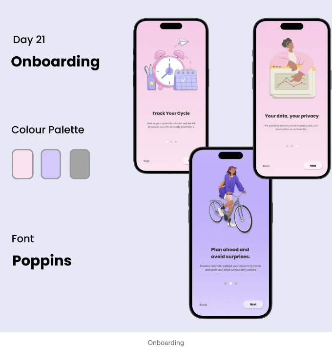

<!-- ui-log 수평형 -->
<ins class="adsbygoogle"
  style="display:block"
  data-ad-client="ca-pub-4877378276818686"
  data-ad-slot="9743150776"
  data-ad-format="auto"
  data-full-width-responsive="true"></ins>
<component is="script">
(adsbygoogle = window.adsbygoogle || []).push({});
</component>

## Day-22 | 탑승권

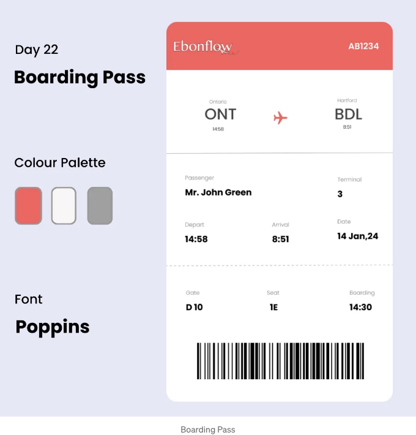

## Day-23 | TV 앱

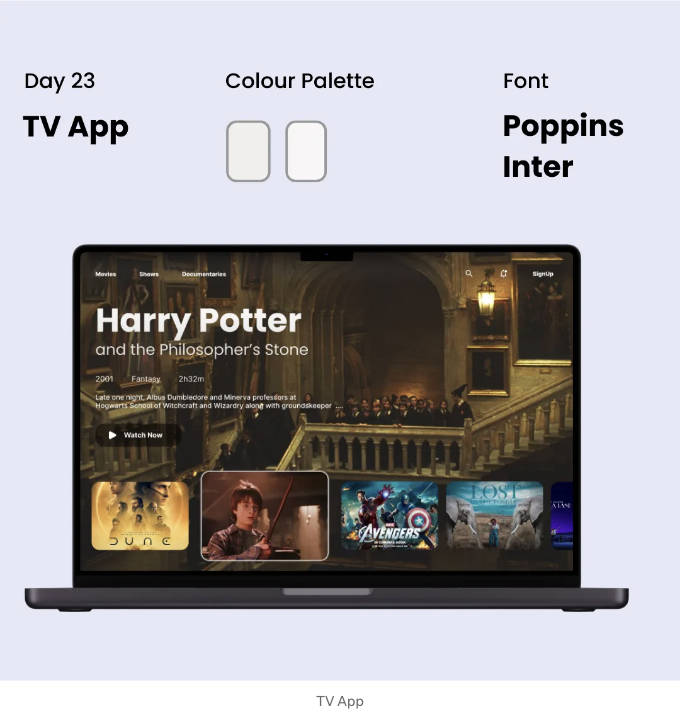

<!-- ui-log 수평형 -->
<ins class="adsbygoogle"
  style="display:block"
  data-ad-client="ca-pub-4877378276818686"
  data-ad-slot="9743150776"
  data-ad-format="auto"
  data-full-width-responsive="true"></ins>
<component is="script">
(adsbygoogle = window.adsbygoogle || []).push({});
</component>

## Day-24 | 뉴스레터 구독

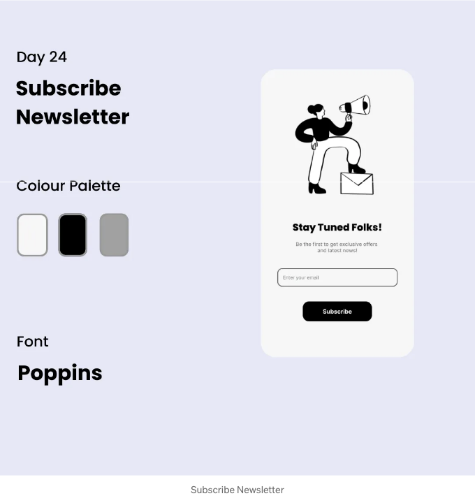

## Day-25 | 유리 날씨 아이콘

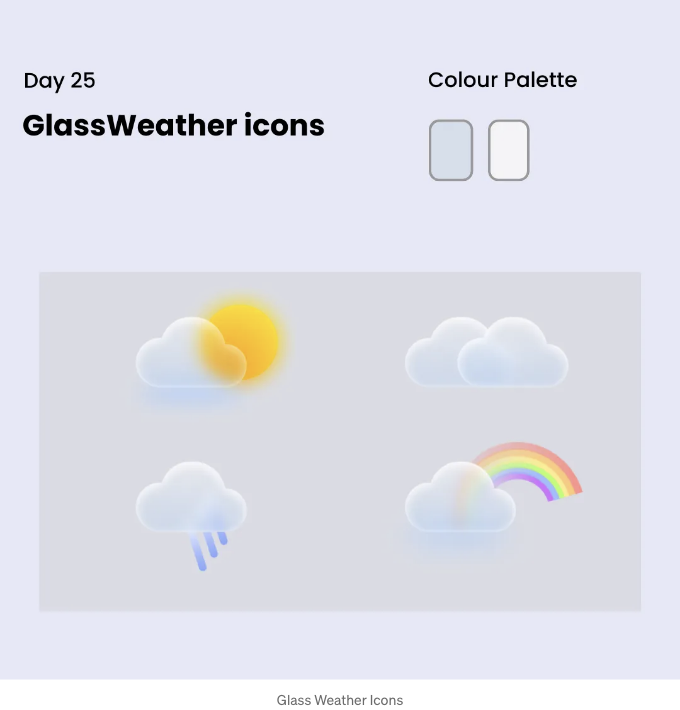

<!-- ui-log 수평형 -->
<ins class="adsbygoogle"
  style="display:block"
  data-ad-client="ca-pub-4877378276818686"
  data-ad-slot="9743150776"
  data-ad-format="auto"
  data-full-width-responsive="true"></ins>
<component is="script">
(adsbygoogle = window.adsbygoogle || []).push({});
</component>

## Day-26 | 드롭다운 메뉴

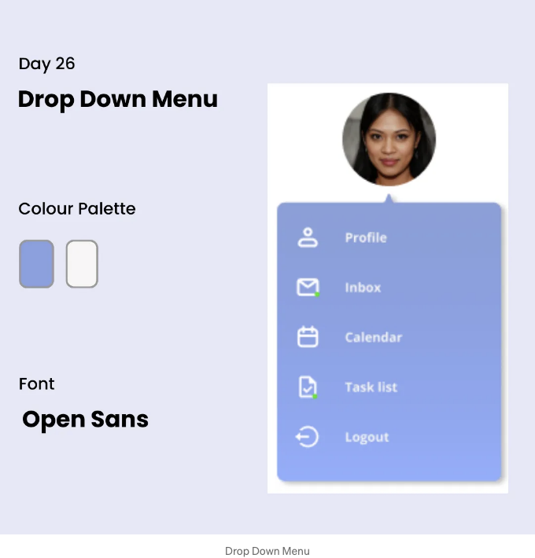

## Day-27 | 문의하기

<!-- ui-log 수평형 -->
<ins class="adsbygoogle"
  style="display:block"
  data-ad-client="ca-pub-4877378276818686"
  data-ad-slot="9743150776"
  data-ad-format="auto"
  data-full-width-responsive="true"></ins>
<component is="script">
(adsbygoogle = window.adsbygoogle || []).push({});
</component>

## Day-28 | 지도

## Day-29 | 가격

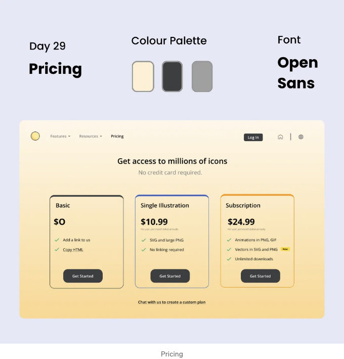

<!-- ui-log 수평형 -->
<ins class="adsbygoogle"
  style="display:block"
  data-ad-client="ca-pub-4877378276818686"
  data-ad-slot="9743150776"
  data-ad-format="auto"
  data-full-width-responsive="true"></ins>
<component is="script">
(adsbygoogle = window.adsbygoogle || []).push({});
</component>

## Day-30 | 업로드

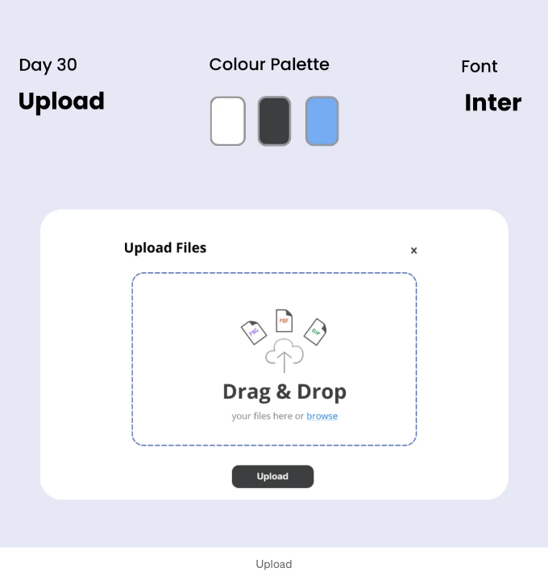

## Day-31 | 기금 모금 캠페인

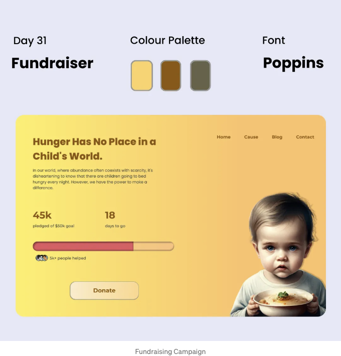

<!-- ui-log 수평형 -->
<ins class="adsbygoogle"
  style="display:block"
  data-ad-client="ca-pub-4877378276818686"
  data-ad-slot="9743150776"
  data-ad-format="auto"
  data-full-width-responsive="true"></ins>
<component is="script">
(adsbygoogle = window.adsbygoogle || []).push({});
</component>

## Day-32 | 제품 커스터마이징

## Day-33 | 자동차 인터페이스

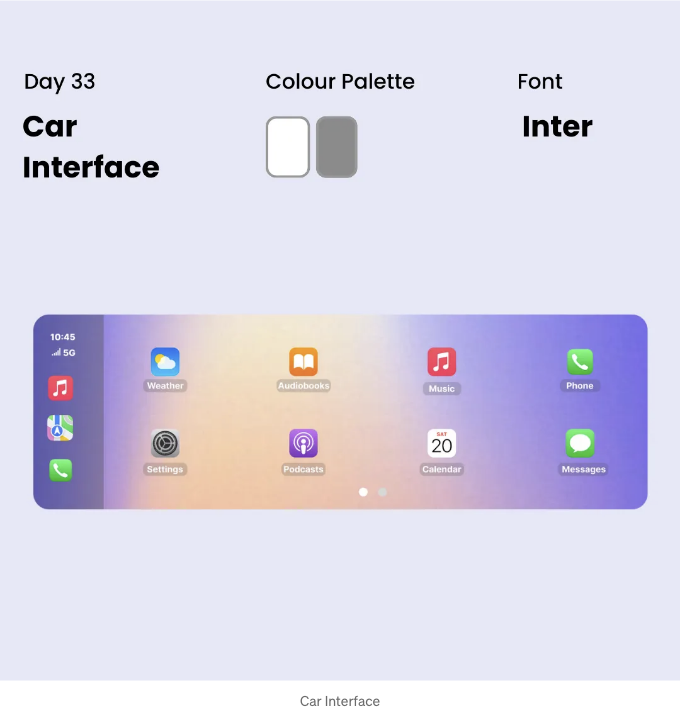

<!-- ui-log 수평형 -->
<ins class="adsbygoogle"
  style="display:block"
  data-ad-client="ca-pub-4877378276818686"
  data-ad-slot="9743150776"
  data-ad-format="auto"
  data-full-width-responsive="true"></ins>
<component is="script">
(adsbygoogle = window.adsbygoogle || []).push({});
</component>

## Day-34 | 블로그 포스트

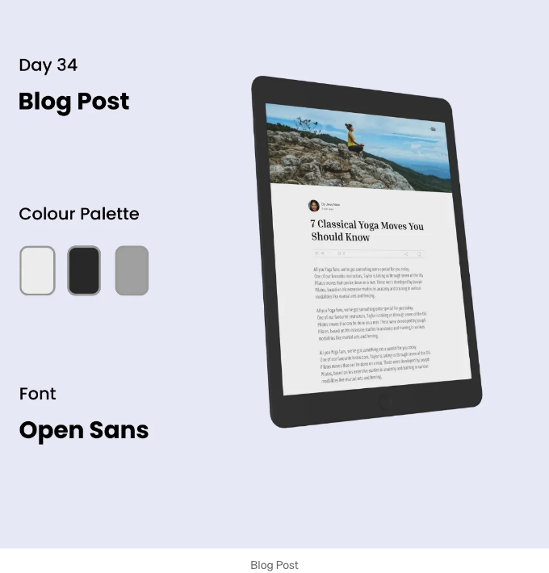

## Day-35 | 특별 혜택

<!-- ui-log 수평형 -->
<ins class="adsbygoogle"
  style="display:block"
  data-ad-client="ca-pub-4877378276818686"
  data-ad-slot="9743150776"
  data-ad-format="auto"
  data-full-width-responsive="true"></ins>
<component is="script">
(adsbygoogle = window.adsbygoogle || []).push({});
</component>

## Day-36 | 날씨

## Day-37 | 캘린더

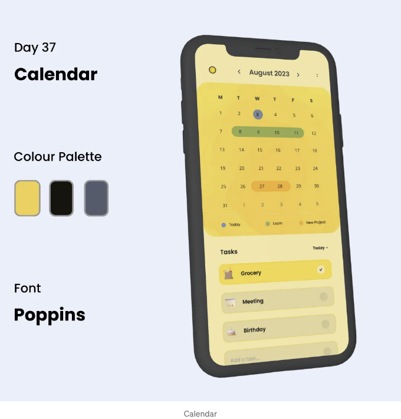

<!-- ui-log 수평형 -->
<ins class="adsbygoogle"
  style="display:block"
  data-ad-client="ca-pub-4877378276818686"
  data-ad-slot="9743150776"
  data-ad-format="auto"
  data-full-width-responsive="true"></ins>
<component is="script">
(adsbygoogle = window.adsbygoogle || []).push({});
</component>

## Day-38 | 후기

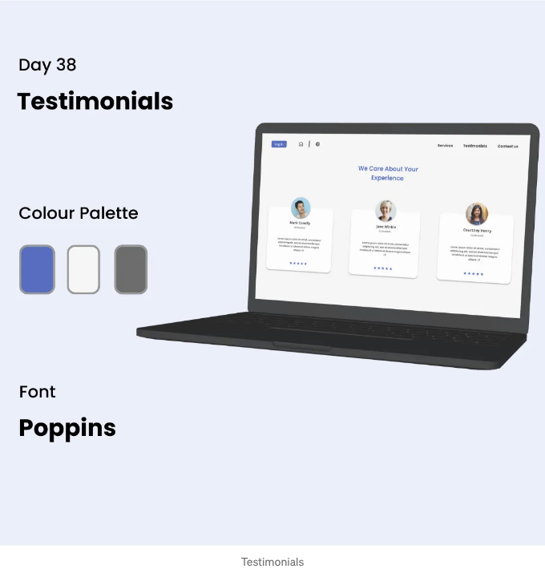

## Day-39 | 레시피

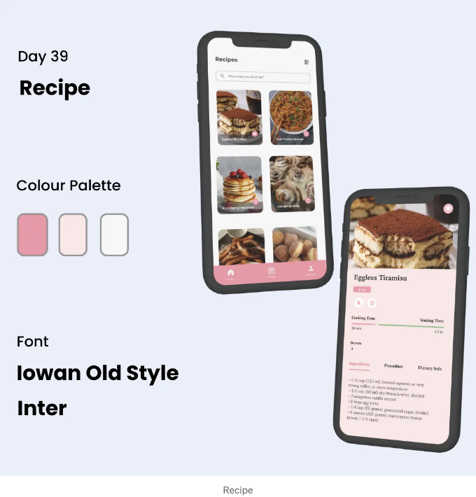

<!-- ui-log 수평형 -->
<ins class="adsbygoogle"
  style="display:block"
  data-ad-client="ca-pub-4877378276818686"
  data-ad-slot="9743150776"
  data-ad-format="auto"
  data-full-width-responsive="true"></ins>
<component is="script">
(adsbygoogle = window.adsbygoogle || []).push({});
</component>

## Day-40 | 운동 추적기

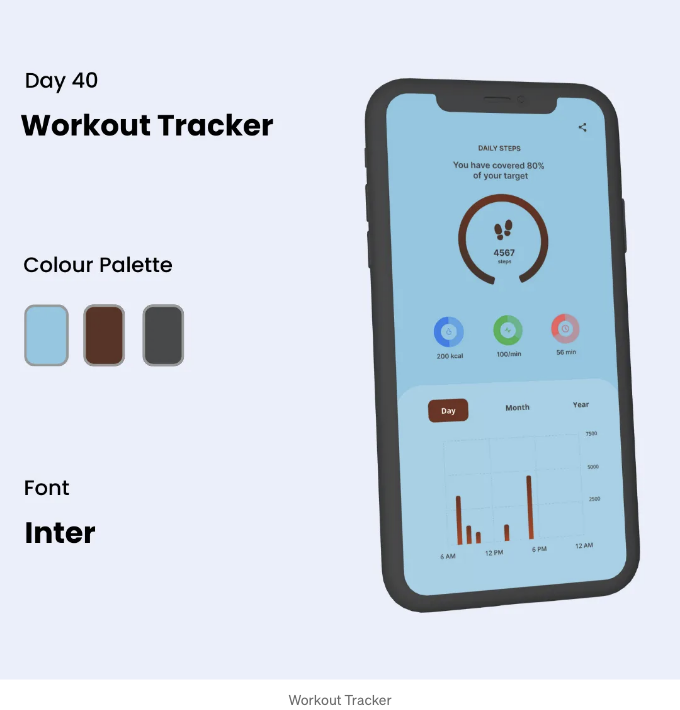

데일리 UI 챌린지 21일부터 40일까지의 여정을 되돌아보면, 내가 이룬 진전과 만들어낸 디자인에 자부심을 느낍니다. 매일 새로운 퍼즐을 풀어야 했지만, 디자인에 대한 열정을 불태우고 창의적 경계를 넓히도록 도와주었습니다.

내 디자인에 애니메이션을 통합하는 것은 사용자 인터페이스 디자인 내에서 동적 가능성을 탐험하는 흥미로운 여정이었습니다. 섬세한 전환부터 눈길을 끄는 효과까지, 각 애니메이션은 상호작용성과 참여를 더해 내 디자인을 생동감 있게 만들었습니다. 사용자를 기쁘게 하고 디자인의 기능성과 미학을 높이는 더 혁신적인 방법을 더욱 열정적으로 탐험하기를 고대합니다.

<!-- ui-log 수평형 -->
<ins class="adsbygoogle"
  style="display:block"
  data-ad-client="ca-pub-4877378276818686"
  data-ad-slot="9743150776"
  data-ad-format="auto"
  data-full-width-responsive="true"></ins>
<component is="script">
(adsbygoogle = window.adsbygoogle || []).push({});
</component>

당신이 내 작업 방식을 엿볼 수 있어서 즐거웠으면 좋겠고, 곧 더 많은 디자인 경험을 공유할 예정이에요.

Day 1–20의 디자인은 여기에서 확인할 수 있어요.

곧 뵙겠습니다!

📱자주 만나요: Instagram| LinkedIn