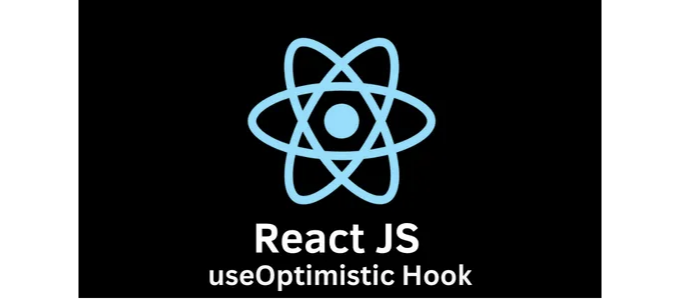

현대 React에서 함수형 컴포넌트와 관련된 가장 중요한 주제 중 하나는 React 훅입니다. 이들이 처음 소개된 것은 2018년 React Conf에서 Sophie Alpert와 Dan Abramov가 소개한 것이었고, 그 뒤로 Ryan Florence가 이를 활용하는 애플리케이션을 리팩토링하는 방법을 소개했습니다.

그리고 그것들은 개발자들 사이에서 새로운 인기 있는 요소가 되었습니다.

오늘은 React의 Canary에서만 사용 가능한 새로운 실험적인 훅인 useOptimistic에 대해 이야기해보려고 합니다. 이 훅을 사용하면 React의 다음 버전을 기다리지 않아도 되고, React 소스 코드 저장소의 주요 브랜치를 추적하는 Canary를 통해 다가오는 기능을 테스트할 수 있습니다.

<!-- ui-log 수평형 -->
<ins class="adsbygoogle"
  style="display:block"
  data-ad-client="ca-pub-4877378276818686"
  data-ad-slot="9743150776"
  data-ad-format="auto"
  data-full-width-responsive="true"></ins>
<component is="script">
(adsbygoogle = window.adsbygoogle || []).push({});
</component>

# 낙관적 업데이트:

useOptimistic의 작동 방식을 자세히 살펴보기 전에 낙관적 업데이트의 개념을 이해하는 것이 중요합니다. 기존의 웹 애플리케이션에서 사용자가 인터페이스와 상호작용(댓글 작성 또는 게시물 좋아요)하면 해당 동작은 일반적으로 서버로 네트워크 요청을 트리거합니다. 그런 다음 UI 업데이트는 서버의 응답을 기다려야 하며, 사용자를 짜증나게 할 수 있는 눈에 띄는 지연이 발생합니다.

낙관적 업데이트는 이 과정을 뒤바꿉니다. 서버 응답을 기다리는 대신, UI는 동작이 이미 성공했다고 가정하여 즉시 업데이트됩니다. 요청이 실패하면 UI를 이전 상태로 롤백할 수 있습니다. 이 접근 방식은 애플리케이션의 성능과 응답성을 크게 향상시킵니다.

# 훅 자체:

<!-- ui-log 수평형 -->
<ins class="adsbygoogle"
  style="display:block"
  data-ad-client="ca-pub-4877378276818686"
  data-ad-slot="9743150776"
  data-ad-format="auto"
  data-full-width-responsive="true"></ins>
<component is="script">
(adsbygoogle = window.adsbygoogle || []).push({});
</component>

`useOptimistic` 함수를 사용하면 비동기 작업 중에 다른 상태를 보여줄 수 있어요. 이 함수는 어떤 상태를 인수로 받아들여 해당 상태의 사본을 반환하는데, 이 상태는 네트워크 요청과 같은 비동기 작업 기간 동안 다를 수 있어요. 여기에는 현재 상태와 작업에 대한 입력을 가져와 낙관적 상태를 반환하는 함수를 제공해야 해요. 

이 상태는 "낙관적" 상태라고 불리며, 실제 작업 완료에 시간이 걸리지만 작업 결과를 사용자에게 즉시 제공하기 위해 보통 사용되어요.

```js
import { useOptimistic } from 'react';

function AppContainer() {
  const [optimisticState, addOptimistic] = useOptimistic(
    state,
    // updateFn
    (currentState, optimisticValue) => {
      // merge and return new state
      // with optimistic value
    }
  );
}
```

## 파라미터

<!-- ui-log 수평형 -->
<ins class="adsbygoogle"
  style="display:block"
  data-ad-client="ca-pub-4877378276818686"
  data-ad-slot="9743150776"
  data-ad-format="auto"
  data-full-width-responsive="true"></ins>
<component is="script">
(adsbygoogle = window.adsbygoogle || []).push({});
</component>

- state: 초기에 반환될 값 및 어떠한 작업도 대기 중이 아닐 때 반환될 값입니다.
- updateFn(currentState, optimisticValue): 현재 상태와 addOptimistic에 전달된 낙관적인 값이 주어졌을 때, 결과적으로 낙관적인 상태를 반환하는 함수입니다. 이 함수는 순수 함수여야 합니다. updateFn은 두 개의 매개변수를 입력으로 받습니다. 현재 상태(currentState)와 낙관적인 값(optimisticValue)입니다. 반환 값은 currentState와 optimisticValue의 병합된 값이 됩니다.

## 반환 값

- optimisticState: 결과적으로 낙관적인 상태입니다. 상태(state)와 동일하며 어떤 작업이 대기 중인 경우 updateFn에 의해 반환된 값과 동일합니다.
- addOptimistic: 낙관적인 업데이트가 있는 경우 호출할 디스패치 함수입니다. optimisticValue라는 모든 타입의 인수를 사용하고 상태와 optimisticValue로 updateFn을 호출할 것입니다.

# 사용 예시:

<!-- ui-log 수평형 -->
<ins class="adsbygoogle"
  style="display:block"
  data-ad-client="ca-pub-4877378276818686"
  data-ad-slot="9743150776"
  data-ad-format="auto"
  data-full-width-responsive="true"></ins>
<component is="script">
(adsbygoogle = window.adsbygoogle || []).push({});
</component>

# 긍정적으로 폼 업데이트하기

useOptimistic Hook은 네트워크 요청과 같은 백그라운드 작업이 완료되기 전에 사용자 인터페이스를 긍정적으로 업데이트하는 방법을 제공합니다. 폼의 맥락에서 이 기술은 앱이 더 반응적으로 느껴지도록 도와줍니다. 사용자가 폼을 제출하면 서버의 응답을 기다리지 않고 변화를 반영하기 위해 인터페이스가 즉시 기대되는 결과로 업데이트됩니다.

예를 들어, 사용자가 폼에 메시지를 입력하고 "전송" 버튼을 클릭하면, useOptimistic Hook은 메시지가 실제로 서버로 전송되기 전에 목록에 즉시 "전송 중..." 레이블과 함께 나타나도록 허용합니다. 이 "긍정적" 접근법은 속도와 응답성을 느끼게 해줍니다. 그런 다음 배경에서 메시지를 실제로 전송하려고 시도합니다. 서버가 메시지를 받았다고 확인하면 "전송 중..." 레이블이 제거됩니다.

useOptimistic hook은 아직 실험적입니다만, React 앱이 더 잘 작동하고 더 빨리 작동하도록 만들 수 있기 때문에 정말 멋집니다. 특히 NextJS와 서버 측 렌더링 기능을 사용하는 앱에게 흥미로울 것입니다. 아직 완전히 준비되지는 않았지만요.

<!-- ui-log 수평형 -->
<ins class="adsbygoogle"
  style="display:block"
  data-ad-client="ca-pub-4877378276818686"
  data-ad-slot="9743150776"
  data-ad-format="auto"
  data-full-width-responsive="true"></ins>
<component is="script">
(adsbygoogle = window.adsbygoogle || []).push({});
</component>

우리는 이것이 언제 React의 공식 부분이 될지 기다리고 있어요. 궁금한데, 여러분 중에 useOptimistic을 프로젝트에서 사용해 보신 분 있나요? 어떻게 생각하시나요? 혹시 게임 체인저가 될 수 있을까요? 여러분의 생각과 경험을 알려주세요!

## 즐거운 코딩! 🚀