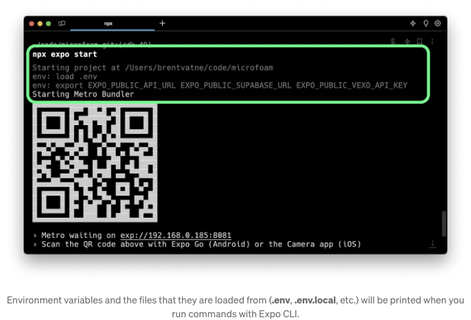

오늘은 에스포 SDK 49를 출시합니다. SDK 49에는 React Native 0.72.4가 포함되어 있습니다. 베타 테스트에 도움을 주신 모든 분들께 감사드립니다.

# 통합된 네트워크 디버깅 및 React 개발 도구

네트워크 디버깅은 이제 JS 디버거에서 사용할 수 있습니다. 여러 SDK 릴리스 동안 j 바로 가기를 사용하여 Expo CLI에서 JS (Hermes) 디버거를 직접 실행하는 것이 가능했습니다. 이 디버거는 이제 엑스포-데브-클라이언트나 Expo Go에서 앱이 실행될 때 네트워크 요청을 지원합니다.

<!-- ui-log 수평형 -->
<ins class="adsbygoogle"
  style="display:block"
  data-ad-client="ca-pub-4877378276818686"
  data-ad-slot="9743150776"
  data-ad-format="auto"
  data-full-width-responsive="true"></ins>
<component is="script">
(adsbygoogle = window.adsbygoogle || []).push({});
</component>

Expo Go나 expo-dev-client로 "Open JS debugger"를 통해 네트워크 인스펙터를 엽니다. 그런 다음 열리는 DevTools 창에서 "Network" 탭을 클릭합니다.

네트워크 인스펙터에서 네트워크를 통해 로드된 이미지도 확인할 수 있습니다.

<!-- ui-log 수평형 -->
<ins class="adsbygoogle"
  style="display:block"
  data-ad-client="ca-pub-4877378276818686"
  data-ad-slot="9743150776"
  data-ad-format="auto"
  data-full-width-responsive="true"></ins>
<component is="script">
(adsbygoogle = window.adsbygoogle || []).push({});
</component>

게다가, Expo CLI에는 이제 React 개발 도구가 내장되어 있습니다: shift+m을 누르고 "Start React devtools"를 선택하여 실행할 수 있습니다.

CLI에서 직접 React 개발 도구로 시작하세요. 앱에서 요소 검사기를 토글하여 요소를 선택하고 React 개발 도구에서 강조 표시된 요소를 볼 수 있습니다.

# Expo Tools 확장 기능을 사용해 VS Code에서 디버깅하기

<!-- ui-log 수평형 -->
<ins class="adsbygoogle"
  style="display:block"
  data-ad-client="ca-pub-4877378276818686"
  data-ad-slot="9743150776"
  data-ad-format="auto"
  data-full-width-responsive="true"></ins>
<component is="script">
(adsbygoogle = window.adsbygoogle || []).push({});
</component>

VS 코드로 Expo 도구 확장 프로그램(GitHub)을 통해 앱 JavaScript 코드를 직접 디버깅할 수 있는 실험적 지원을 추가했어요! 확장 프로그램을 설치하고 앱을 실행한 상태에서 명령 팔레트를 실행(shift+⌘+P on macOS)하고 "Expo: Debug Expo app on a device or simulator, using Hermes"를 선택하세요.

# Expo Router v2.0

유니버설 파일 기반 라우팅을 위한 다음 주요 릴리스입니다. Expo Router v2는 이제 웹에서 빌드 시 정적 렌더링을 위한 옵트인 지원, 자동 정적 타입 라우트, 그리고 비동기 라우트 로딩을 제공합니다. 업그레이드할 때 useSearchParams를 useLocalSearchParams 또는 useGlobalSearchParams로 변경해야할 것을 유의해주세요. "Expo Router v2 발표" 블로그 포스트에서 더 자세히 알아보세요.

<!-- ui-log 수평형 -->
<ins class="adsbygoogle"
  style="display:block"
  data-ad-client="ca-pub-4877378276818686"
  data-ad-slot="9743150776"
  data-ad-format="auto"
  data-full-width-responsive="true"></ins>
<component is="script">
(adsbygoogle = window.adsbygoogle || []).push({});
</component>

# 다른 하이라이트들

- Expo SDK 모듈에 대한 여러 가지 개선 사항: 예를 들어, expo-screen-orientation은 여러 오랜 기간 동안 발생한 문제들을 해결하기 위해 대대적으로 다시 구축되었습니다. expo-blur는 이제 안드로이드를 지원하며 (주의: 저사양 기기에서 특히 성능에 상당한 영향을 줄 수 있음), expo-clipboard은 이제 UIPasteControl 버튼을 내보냅니다. 커뮤니티 및 Expo 엔지니어가 기여한 기타 개선 사항 전체 목록은 CHANGELOG를 참조하십시오.
- Expo 모듈 API의 개선 사항. 최근에 우리는 로컬 모듈을 소개했습니다. 이를 사용하면 라이브러리를 생성하거나 앱의 네이티브 프로젝트를 관리할 필요 없이 앱 내에서 네이티브 코드를 작성할 수 있습니다 — SDK 49 프로젝트에서 시도해보세요: npx create-expo-module --local. 또한 이제 구성 요소 참조에 네이티브 비동기 함수를 추가할 수 있으며 동기 함수는 이제 JavaScriptValue, JavaScriptObject 및 JavaScriptFunction과 같은 원시 JS 형식의 인수를 사용할 수 있습니다.
- iOS 시뮬레이터에서의 Expo Go가 이제 Apple 실리콘에서 네이티브로 실행됩니다. 또한 시뮬레이터 없이 Apple 실리콘 Mac에서 직접 Expo Go를 실행해 볼 수도 있습니다. TestFlight 빌드를 통해 — 그러나 아직 수정해야 할 일부 UI 문제가 있습니다. 이 작업 방식에 대해 자세히 알아보세요.
- 웹에서는 이제 Metro를 권장합니다. @expo/webpack-config 패키지는 현재 유지/보수 모드에 있으며 웹 지원에 대한 노력은 Metro에 집중되어 있습니다. 모든 새 프로젝트가 웹에서 Metro를 사용하는 것을 강력히 권장합니다. Webpack으로만 지원되는 몇 가지 남아 있는 기능이 필요하지 않다면 기존 프로젝트는 대부분 Metro에서 잘 작동해야 합니다. SDK 49에서 Webpack을 사용하면 마주칠 수 있는 문제에 대한 자세한 내용은 아래의 "알려진 회귀" 섹션을 참조하십시오.
- npx expo start는 이제 개발 빌드를 위해 --dev-client 플래그가 더 이상 필요하지 않습니다. 앱 프로젝트에 expo-dev-client가 설치되어 있으면 npx expo start는 자동으로 개발 빌드를 대상으로 설정합니다. 개발 빌드 및 Expo Go 대상 간을 전환하려면 s를 사용하십시오. 이렇게하면 QR 코드가 가리키는 URL과 a/i 키보드 바로 가기가 시작되는 대상이 변경됩니다.

<!-- ui-log 수평형 -->
<ins class="adsbygoogle"
  style="display:block"
  data-ad-client="ca-pub-4877378276818686"
  data-ad-slot="9743150776"
  data-ad-format="auto"
  data-full-width-responsive="true"></ins>
<component is="script">
(adsbygoogle = window.adsbygoogle || []).push({});
</component>

- expo export:embed은 "번들 React Native 코드 및 이미지" 빌드 단계에서 @react-native-community/cli 번들 명령어를 대체했습니다. 이를 통해 사용자 지정 진입 지점 지원이 추가되었습니다 — package.json의 "main"을 원하는 소스 파일로 지정할 수 있습니다 (Expo Router를 사용하지 않는 경우 새 진입 파일에 registerRootComponent를 사용해야 합니다).
- Expo CLI는 이제 Metro에서 환경 변수를 내장 지원합니다. React Native 생태계의 기존 접근 방식은 변수를 업데이트하려면 Babel 캐시를 지워야 하는 등의 문제가 있으며, exclude 및 include 목록과 같은 보안 옵션을 개발자가 선택해야 합니다. 우리의 방식은 Expo Metro 설정에 프로세스를 통합하고 JavaScript 생태계에서 "PUBLIC"을 환경 변수 이름의 접두어로 포함하는 인기있는 관례를 따라 이 문제를 해결합니다. SDK 49에서 .env (및 .env.local과 같은 파일)에 EXPO_PUBLIC_ 접두사로 변수를 정의하면 해당 변수가 사용될 경우 앱 JavaScript에 포함됩니다. 더 알아보기.

- 패키지 버전 유효성 검사에서 선택적으로 제외할 수 있습니다. npx expo install에서 권장 버전과 다른 패키지 버전을 사용하고 싶은 경우가 있을 수 있습니다. 예를 들어, 앱에서 잘 동작하고 수정이 필요한 버그를 해결하는 새 react-native-reanimated 버전을 테스트하고 싶은 경우입니다. 이제 npx expo start 또는 npx expo-doctor에서 경고를 받지 않고, npx expo install --fix를 실행할 때 해당 패키지 버전이 변경되지 않도록하기를 원할 것입니다. 이제 package.json에서 expo.install.exclude 키를 지원하여 유효성 검사에서 제외할 패키지를 지정할 수 있습니다. 더 알아보기.

<!-- ui-log 수평형 -->
<ins class="adsbygoogle"
  style="display:block"
  data-ad-client="ca-pub-4877378276818686"
  data-ad-slot="9743150776"
  data-ad-format="auto"
  data-full-width-responsive="true"></ins>
<component is="script">
(adsbygoogle = window.adsbygoogle || []).push({});
</component>

- 앱 구성에서 현재 스키마를 배열로 사용할 수 있습니다. 이전에는 추가 스키마를 추가하려면 구성 플러그인을 사용해야 했습니다. 이제 문자열 배열이나 문자열을 사용할 수 있습니다: scheme: [`myapp`, `fb1234`] 또는 scheme: `myapp`.
- expo-dev-client에서 Fabric에 대한 실험적인 지원이 추가되었습니다. 시도해보세요: npx create-expo-app@latest -e with-new-arch. 아직 새 아키텍처를 지원하지 않는 유일한 모듈은 expo-updates입니다.
- 권장하는 TypeScript 버전을 ^5.1.3으로 업데이트했습니다. SDK 48에서는 ^4.9.4가 사용되었습니다. TypeScript 5.0 및 5.1 릴리스 노트에서 변경 사항을 확인하고, 이미 사용 중이지 않은 경우 프로젝트에서 TypeScript를 사용하는 방법을 배워보세요.
- React Native 0.72.4, React Native Web 0.19.6. 이번 릴리스에서 많은 개선 사항이 있었습니다. React Native CHANGELOG, 릴리스 노트, React Native Web 릴리스 노트를 참조하세요. React 버전은 0.71과 변경이 없습니다 — 여전히 18.2.0입니다. React Native 0.72.0에서는 React Native에서 오랫동안 사용되고 있던 ProgressBarAndroid 및 ProgressViewIOS 구성 요소가 제거되었습니다. 또한, 해당 플랫폼을 사용 중인 경우 React Native Web의 중요 변경 사항을 확인해주세요.

# EAS Insights 소개

EAS Insights 미리보기가 모든 개발자에게 이제 제공됩니다. 이 서비스의 목표는 합리적인 결정을 내릴 수 있는 데이터를 제공하고, 항상 당신이 빠르고 자신감 있게 반복할 수 있도록 돕는 것입니다. Insights는 빌드, 제출 및 업데이트와 같은 다른 서비스에 밀접하게 통합될 예정입니다 (가까운 미래에 이에 대해 자세히 공유하겠습니다). 미리보기 단계에서는 Insights를 무료로 사용할 수 있습니다.

<!-- ui-log 수평형 -->
<ins class="adsbygoogle"
  style="display:block"
  data-ad-client="ca-pub-4877378276818686"
  data-ad-slot="9743150776"
  data-ad-format="auto"
  data-full-width-responsive="true"></ins>
<component is="script">
(adsbygoogle = window.adsbygoogle || []).push({});
</component>

이 미리보기 릴리스에는 "인사이트(Insights)" 탭이 프로젝트 사이드바에 추가되었어요. EAS Update의 기존 사용자는 프로젝트를 변경하지 않아도 제한된 인사이트 세트를 볼 수 있지만, EAS Insights에 관심 있는 개발자라면 expo-insights 모듈을 설치하는 것을 권장해요. 자세히 알아보세요.

EAS Insights의 미래는 여러분의 피드백에 달려있어요: 필요한 인사이트가 무엇인지, EAS에 직접 통합되면 가장 유익할 것 같은 인사이트는 무엇인지 알려주세요. 댓글이나 제안은 Discord, Twitter 또는 expo.dev/contact를 통해 연락해주세요.

# EAS Build

- Xcode 14.3.1 이미지가 추가되었어요. 이것은 SDK 49 및 React Native 0.72에서의 기본값이에요. 자세히 알아보세요.
- 대형 워커가 이제 Android 및 iOS 빌드에 모두 사용 가능해졌어요. 현재 대형 iOS 빌드는 M2 Pro 또는 M2 호스트에서 실행되며, 중형 워커보다 약 40-50% 빠르게 실행됩니다. 대형 Android 빌드는 중형과 비교하여 메모리와 CPU 수가 두 배로 많아요. n2-standard-8에서 실행되며, 중형은 n2-standard-4에서 실행돼요. 자세히 알아보세요.
- eas device:rename을 사용하여 iOS 내부 배포용으로 등록된 기기의 이름을 변경할 수 있어요. UDID는 기계에 대한 완벽한 식별자지만, 우리는 "Bob의 파란 iPhone 14"와 같은 이름을 더 선호해요. 자세히 알아보세요.

<!-- ui-log 수평형 -->
<ins class="adsbygoogle"
  style="display:block"
  data-ad-client="ca-pub-4877378276818686"
  data-ad-slot="9743150776"
  data-ad-format="auto"
  data-full-width-responsive="true"></ins>
<component is="script">
(adsbygoogle = window.adsbygoogle || []).push({});
</component>

# EAS 업데이트

- 이제 Expo Go는 프로젝트의 expo 의존성 버전이 지원되는 SDK 버전과 일치하는 한 프로젝트를 열어줍니다. 이전에는 runtimeVersion을 sdkVersion 정책을 제외한 다른 값으로 설정하면 Expo Go가 호환되지 않다고 판단하고 실행을 거부했습니다. 주의할 점은 만약 프로젝트가 지정된 SDK 버전의 Expo Go 런타임에 없는 네이티브 API에 의존하고 있다면, 프로젝트가 여전히 실행되지 않을 것입니다. 이러한 경우에는 개발 빌드를 사용하거나 특정 네이티브 API가 없으면 응용 프로그램 코드에 대체 방법을 제공하는 것을 권장합니다.
- Updates.checkForUpdateAsync (🔗) 및 Updates.fetchUpdateAsync (🔗)는 이제 클라이언트가 업데이트 서버와 성공적으로 연락하지만 업데이트가 없을 때에도 오류를 throw하지 않습니다. expo-updates 모듈의 최신 버전을 사용하는 모든 플랫폼의 클라이언트는 EAS 업데이트에서 클라이언트에 새로운 업데이트가 없을 때 경량 HTTP 204 No Content 응답을 받게 됩니다. 아직도 클라이언트가 인터넷에 연결할 수 없는 문제나 잠재적인 서버 다운타임을 처리하기 위해 오류를 catch하는 것이 좋지만, 이 변경으로 업데이트를 가져오는데 문제가 실제로 발생했을 때 이를 감지하는 것이 훨씬 쉬워질 것으로 예상됩니다.
- Android 앱의 expo-updates는 이제 Brotli 압축을 사용하여 JavaScript를 gzip보다 약 15% 더 압축합니다.
- EAS 업데이트의 출시로 "expo publish" 및 클래식 업데이트를 내년에 제거할 예정입니다. 클래식 업데이트 게시는 2024년까지 지원됩니다. 기존 앱은 차단 이전에 게시된 업데이트를 계속 받을 수 있습니다. SDK 49가 클래식 업데이트를 지원하는 마지막 버전이 될 것입니다. 폐기된 expo publish 명령어를 계속 사용하려면 앱 구성에서 updates.useClassicUpdates를 true로 설정하십시오.

# 🏗 폐기 예정, 이름 변경 및 삭제 사항

- Gradle 8용 Android Expo 모듈 업데이트: Kotlin에서 네이티브 모듈을 빌드하는 Expo Modules API를 사용해본 적이 있다면, 모듈이 Gradle 8과 호환되도록하는 방법에 대한 안내가 필요할 것입니다. expo.fyi/expo-modules-gradle8-migration을 참조하십시오.
- sentry-expo 주요 버전 업데이트: sentry-expo@7.0.0의 새 주요 릴리스는 Sentry React Native SDK 버전 5를 사용합니다. 새 아키텍처를 지원합니다. 프로젝트에 영향을 줄 수 있는 변경 사항에 대한 자세한 내용은 마이그레이션 가이드를 참조하십시오.
- Expo CLI는 이제 모든 프로젝트의 기본 포트를 19000 대신 8081로 지정합니다. 포트 19000은 역사적인 이유로만 사용되었으며 더 이상 필요하지 않습니다. 그래서 우리는 8081로 통합했습니다.
- Expo Go 및 expo-dev-client에서 JSC에 대한 원격 디버깅이 비활성화되었습니다. JSC 원격 디버깅은 Hermes로 디버깅하는 것과 비교했을 때 특히 잘 작동하지 않았으며 시간이 지남에 따라 신뢰성이 떨어지게 되었습니다. 더 자세한 내용은 React Native의 이 PR을 참조하십시오. 이것은 그들의 다음 릴리스에 포함될 것입니다.
- Constants.manifest는 폐기되었습니다. 대신 Constants.expoConfig를 사용하십시오. Expo 앱의 manifest는 앱의 자산(예: JavaScript) 및 구성 데이터(일반적으로 app.json의 필드)를 지정합니다. 이전에는 Constants.manifest가 앱의 구성 데이터에 액세스하는 방법이었습니다. SDK 49에서 Constants.expoConfig가 이 목적을 위해 Constants.manifest를 대체합니다. 이 변경 사항에 대해 자세히 알아보려면 expo.fyi/why-constants-expoconfig를 참조하십시오.
- AuthSession 프록시가 제거되었습니다. useProxy 옵션과 AuthSession.startAsync 메서드는 expo-auth-session@5에서 제거되었습니다. expo-auth-session@4를 계속 사용하여 인증 프록시에서 마이그레이션하는 시간이 좀 더 필요한 경우 사용할 수 있습니다. 인증 제공자가 사용자 정의 scheme로 리디렉션하지 않는 인증 공급자에 대한 해결책으로 인증 프록시를 사용하는 경우, Expo Go를 개발 빌드로 전환하고 해당 공급자의 네이티브 SDK를 사용하는 것을 권장합니다. 예: Facebook, Google.
- android:usesCleartextTraffic는 이제 시스템 기본값에 기반합니다. 디버그 빌드에서 명시적으로 활성화되며, 다른 변수들에서는 지정되지 않으며, 이는 API 27 및 이하에서는 기본값이 true로, API 28 이상에서는 기본값이 false로 설정됨을 의미합니다. 안드로이드에서 제품용으로 보안되지 않은 엔드포인트로의 네트워크 요청에 의존하는 경우, expo-build-properties를 통해 수동으로 이를 활성화해야 할 것입니다.
- Reanimated 3은 레거시 Reanimated API를 더 이상 지원하지 않습니다. 아직 더 빠르고 작업하기 쉬운 새 API로 업데이트되기 전에 업데이트되지 않은 라이브러리에 의존하는 경우, 업그레이드 시 이와 관련된 오류가 발생할 수 있습니다. 자세한 내용은 여기서 알아보십시오.
- expo-face-detector 지원이 Expo Go에서 제거되었습니다. 이 변경은 Expo Go iOS 시뮬레이터 빌드에서 Apple Silicon을 네이티브로 지원하기 위해 필요했습니다. 이제 이전과 같이 라이브러리를 Expo Go 외부에서 계속 사용할 수 있습니다.

<!-- ui-log 수평형 -->
<ins class="adsbygoogle"
  style="display:block"
  data-ad-client="ca-pub-4877378276818686"
  data-ad-slot="9743150776"
  data-ad-format="auto"
  data-full-width-responsive="true"></ins>
<component is="script">
(adsbygoogle = window.adsbygoogle || []).push({});
</component>

# ⏪ 알려진 회귀 사항

- H̶e̶r̶m̶e̶s̶ ̶d̶e̶b̶u̶g̶g̶e̶r̶ ̶f̶o̶r̶ ̶A̶n̶d̶r̶o̶i̶d̶ ̶i̶s̶ ̶c̶u̶r̶r̶e̶n̶t̶l̶y̶ ̶n̶o̶t̶ ̶w̶o̶r̶k̶i̶n̶g̶ ̶i̶n̶ ̶E̶x̶p̶o̶ ̶G̶o̶ ̶f̶o̶r̶ ̶A̶n̶d̶r̶o̶i̶d̶ ̶(̶d̶u̶e̶ ̶t̶o̶ ̶a̶ ̶r̶e̶g̶r̶e̶s̶s̶i̶o̶n̶ ̶i̶n̶ ̶R̶e̶a̶c̶t̶ ̶N̶a̶t̶i̶v̶e̶ ̶0̶.̶7̶2̶ ̶-̶ ̶s̶e̶e̶ ̶G̶i̶t̶H̶u̶b̶ ̶f̶o̶r̶ ̶c̶o̶n̶t̶e̶x̶t̶)̶. Update: 이것은 2023년 7월 25일 최신 Expo Go에서 수정되었습니다.
- expo-notifications getExpoPushTokenAsync에서 “No ‘projectId’ found…”(expo#23225) 오류 발생. 이 문제는 함수에 projectId를 옵션으로 전달하여 해결할 수 있습니다.
- eas update 시 “Export was successful.” 출력 후 계속 대기하는 문제(eas-cli#1907) 보고됨. 이 문제를 재현할 수 없어 현재 조사 중에 있습니다.
- n̶p̶x̶ ̶e̶x̶p̶o̶ ̶r̶u̶n̶:̶[̶a̶n̶d̶r̶o̶i̶d̶|̶i̶o̶s̶]̶ ̶i̶n̶ ̶a̶ ̶b̶a̶r̶e̶ ̶R̶e̶a̶c̶t̶ ̶N̶a̶t̶i̶v̶e̶ ̶0̶.̶7̶2̶ ̶p̶r̶o̶j̶e̶c̶t̶ ̶t̶h̶a̶t̶ ̶d̶o̶e̶s̶ ̶n̶o̶t̶ ̶e̶x̶t̶e̶n̶d̶@̶e̶x̶p̶o̶/̶m̶e̶t̶r̶o̶-̶c̶o̶n̶f̶i̶g̶ ̶i̶n̶ ̶m̶e̶t̶r̶o̶.̶c̶o̶n̶f̶i̶g̶.̶j̶s̶ ̶c̶u̶r̶r̶e̶n̶t̶l̶y̶ ̶w̶i̶l̶l̶ ̶f̶a̶i̶l̶ ̶t̶o̶ ̶b̶u̶n̶d̶l̶e̶.̶ ̶원인을 찾았고, fac̶e̶b̶o̶o̶k̶/̶r̶e̶a̶c̶t̶-̶n̶a̶t̶i̶v̶e̶에̶ 풀 리퀘스트를 보냈으며, r̶e̶a̶c̶t̶-̶n̶a̶t̶i̶v̶e̶@̶0̶.̶7̶2̶.̶2̶에̶ 이 문제를 수정한 사항이 업데이트되었습니다. 최신 버전에서 react-native@0.72.4를 사용합니다.
- r̶e̶a̶c̶t̶-̶n̶a̶t̶i̶v̶e̶-̶m̶a̶p̶s̶ ̶모듈의 s̶h̶o̶w̶s̶U̶s̶e̶r̶L̶o̶c̶a̶t̶i̶o̶n̶ ̶프̶r̶o̶프̶가̶ Y̶o̶u̶r̶ ̶A̶n̶d̶r̶o̶i̶d̶ ̶a̶p̶p̶을̶ 크래시하며, 이 문제에 대한 수정을 조사 중입니다. 현재는 r̶e̶a̶c̶t̶-̶n̶a̶t̶i̶v̶e̶-̶m̶a̶p̶s̶@̶~̶2̶.̶0̶.̶0̶-̶b̶e̶t̶a̶.̶1̶0̶를 사용하여 문제를 해결할 수 있습니다. expo-location v16.1.0에서 이 문제가 해결되었으며, 앱에서 npx expo install --fix를 실행하여 업그레이드할 수 있습니다.

# 🧹 더 이상 지원하지 않는 SDK 46; 다음 릴리스에서 SDK 47 및 48 중단

저희는 사용량이 낮은 SDK 버전을 주기적으로 중단하여 지원해야 하는 버전 수를 줄입니다. 이번 릴리스에서 SDK 46의 수명이 종료되었습니다. 이는 SDK 46 프로젝트가 최신 버전의 Expo Go에서 작동하지 않게 될 것을 의미하며, 그 외에는 예상대로 작동할 것입니다.

<!-- ui-log 수평형 -->
<ins class="adsbygoogle"
  style="display:block"
  data-ad-client="ca-pub-4877378276818686"
  data-ad-slot="9743150776"
  data-ad-format="auto"
  data-full-width-responsive="true"></ins>
<component is="script">
(adsbygoogle = window.adsbygoogle || []).push({});
</component>

다음 릴리스에서는 SDK 47 및 48을 지원하지 않게 됩니다. 프로젝트가 이러한 버전 중 하나에서 실행 중이라면 최신 버전으로 업그레이드하는 것을 고려해보세요.

# ➡️ 앱을 업그레이드하는 방법

여기서는 Expo SDK 48에서 49로 앱을 업그레이드하는 방법을 안내해드립니다:

- EAS CLI의 최신 버전으로 업데이트하세요(사용 중이라면):
npm i -g eas-cli.
- 새로운 Expo 패키지를 설치하세요:
npm install expo@^49.0.0 또는 yarn add expo@^49.0.0
- SDK 49와 일치하도록 모든 종속성을 업그레이드하세요:
npx expo install --fix
- 참고: 프로젝트 종속성에 expo-cli가 설치되어 있다면 삭제해야 합니다! SDK 46부터 CLI는 이제 expo 패키지의 일부이며, 이전 expo-cli 패키지가 설치되어 있으면 "error: unknown option --fix’"와 같은 문제가 발생할 수 있습니다.
- package.json에 해상도/오버라이드가 있는 경우, 여전히 필요한지 확인하세요. SDK 48에서 expo-router를 위해 추가했다면 metro와 metro-resolver 오버라이드를 0.76.0으로 제거해야 합니다.
- package.json 종속성에 @babel/plugin-proposal-export-namespace-from이 있는 경우 제거하세요. 이제 babel-preset-expo에 포함되어 있습니다.
- 프로젝트 종속성에서 가능한 문제를 확인하세요:
npx expo-doctor@latest
- 앱에 가장 영향을 주는 중요한 변경 사항을 확인하기 위해 "사용 중단, 이름 바꾸기 및 제거" 섹션을 참고하세요.
- 다른 모든 중요 변경 사항을 확인하기 위해 변경 로그를 확인하세요!
- 필요한 경우 Xcode를 업그레이드하세요: 네이티브 iOS 프로젝트를 컴파일하려면 Xcode 14이 필요합니다. EAS Build의 경우 특정 이미지가 지정되지 않은 프로젝트는 기본으로 Xcode 14.3.1로 설정됩니다.
- 네이티브 프로젝트를 직접 관리하는 경우(bare workflow):
— ios 디렉토리가 있는 경우 npx pod-install을 실행하세요.
— React Native Upgrade Helper에서 관련 변경 사항을 적용하세요.
— 미래 업그레이드를 쉽게 진행하기 위해 prebuild를 채택하는 것을 고려할 수도 있습니다.
- Android용 Expo 모듈을 유지하는 경우: Gradle 8 마이그레이션 가이드를 참조하세요.
- Expo Go를 사용하는 경우: 폰에서 Expo Go 앱을 앱 스토어에서 업데이트하세요. Expo CLI는 시뮬레이터에서 앱을 자동으로 업데이트합니다. expo.dev/tools에서 iOS 시뮬레이터 빌드 또는 APK를 다운로드할 수도 있습니다.
- expo-dev-client로 개발 빌드를 사용하는 경우: 업그레이드 후 새로운 개발 빌드를 생성하세요.
- 질문이 있으신가요? SDK 49로 업그레이드에 중점을 둔 오피스 아워를 개최할 예정입니다. Discord를 주시하시고 자세한 정보/신청 방법을 찾아보세요.

<!-- ui-log 수평형 -->
<ins class="adsbygoogle"
  style="display:block"
  data-ad-client="ca-pub-4877378276818686"
  data-ad-slot="9743150776"
  data-ad-format="auto"
  data-full-width-responsive="true"></ins>
<component is="script">
(adsbygoogle = window.adsbygoogle || []).push({});
</component>

# 릴리스에 기여한 모든 분들께 감사드립니다!

**팀 구성원**: 모두 한 방식 또는 다른 방식으로 기여해주셨습니다. 특히 이번 릴리스에 직접 참여한 엔지니어들을 언급해보자면 Łukasz Kosmaty, Kudo Chien, 그리고 Tomasz Sapeta는 모든 SDK 작업을 주도하셨습니다. 또한 Aleksander Mikucki, Gabriel Donadel, Aman Mittal, Bartosz Kaszubowski, Cedric van Putten, Doug Lowder, Evan Bacon, Keith Kurak, Kim Brandwijk, Quin Jung, Will Schurman까지 포함됩니다. 팀에 온 것을 환영합니다, Alan Hughes, Wojciech Dróżdż, 그리고 Mark Lawlor! 마지막으로, 이렇게 몇 년 동안 기여해주신 Wojciech Kozyra와 Dominik Sokal께 감사드립니다. 그동안의 기여에 감사드립니다!

**외부 기여자**: AB, Abdulah Proho, Adam Schlichtmann, Agustin Falco, Alberto, Alex Lin, Alexander Pataridze, Amir5000, Andrew Levy, André Ribeiro, Angad Sethi, Anindo Sarker, Anna Garcia, Aroyan, Augustine Ezeh, Bartłomiej Banasik, Basarat Ali Syed, BlessedOneKobo, Chee Kit, Daniel Friyia, David Leuliette, Desislav, DynamicApproach, Emmanuel Barat, Emmanuel C. Jemeni, Esteban Salazar, Eugene Nagorny, Felipe S. Santos, Fernando Rojo, Frederick Widjaja, Gianfrancø Null, Guilherme Santos, Gustavo Gard, HBiede, HarshaVardhanReddyDuvvuru, Hirbod, Hubert Gendron, Hugo FOYART, Jakov Glavina, James M, Joe Yanks, Joel Jaison, Jose Luis Paternina, Justice Ekemezie, Kazuma Ohashi, Kilian Finger, Kristaps Birziņš, LULU, Leandro Alberti, Linus Unnebäck, Logan Rosen, MJ Zhang, Mark Oswald, Marlon, Matin Zadeh Dolatabad, Max, Meenu Makkar, Niels Mokkenstorm, Paul Crussaire, RRaideRR, Robert Herber, Sara Tavares, Sergey Pashkevich, Silas, Sylers, Victor Li, Vikrant Bhat, Vittor Javidan, Vojtech Novak, William Théroux, Youssef Henna, Ziv Levy, abing, bigbend, bil9148, billybrown-iii, bouzuya, chalenascholl, jay shah, nishan, phoenixiguess, rcv4, sallen450, toshiyuki-suzuki-yukashikado, 그리고 翊小久까지 포함됩니다.

**베타 테스터**: Danilo Polani, Benedikt, Mario Murrent, RRaideRR, Kyle G, Myroslav Hryhschenko, Timothy Shamilov, Eleftherios Myteletsis, Kaiden Sin, arasrezaei, Jun Matsushita, rvasseur31, Samuel Newman, Chee Kit, 그리고 위에서 언급된 여러 분들입니다.

<!-- ui-log 수평형 -->
<ins class="adsbygoogle"
  style="display:block"
  data-ad-client="ca-pub-4877378276818686"
  data-ad-slot="9743150776"
  data-ad-format="auto"
  data-full-width-responsive="true"></ins>
<component is="script">
(adsbygoogle = window.adsbygoogle || []).push({});
</component>

읽어 주셔서 감사합니다 — 새로운 릴리스를 즐기시길 바랍니다!

- 💬 릴리스에 대해 논의하려면 디스코드나 포럼에 참여해주세요.
- ⭐️ GitHub에서 Expo에 별표를 주거나, 버그 보고서를 제출하거나, 질문이나 제안으로 토론을 시작하여 저희를 돕는 것에 참여해주세요.