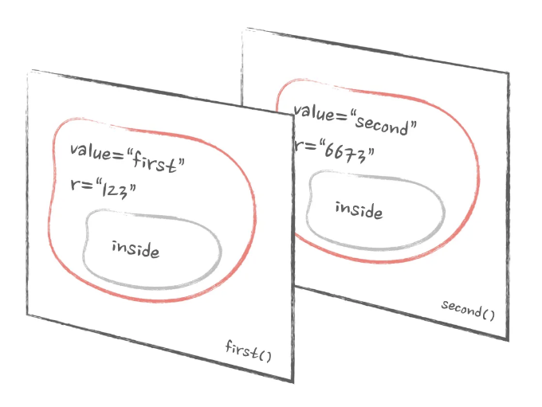
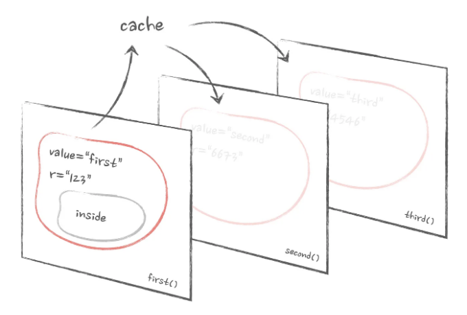

이 기사는 비디오 형식으로 제공됩니다. 자세한 내용은 적지만, 훌륭한 애니메이션과 문자 대신 목소리로 제공됩니다.

또한, 이 기사는 “Advanced React” 서적의 일부입니다. 이 기사를 좋아하신다면 서적도 마음에 드실 수 있습니다 😉

# 목차

<!-- ui-log 수평형 -->
<ins class="adsbygoogle"
  style="display:block"
  data-ad-client="ca-pub-4877378276818686"
  data-ad-slot="9743150776"
  data-ad-format="auto"
  data-full-width-responsive="true"></ins>
<component is="script">
(adsbygoogle = window.adsbygoogle || []).push({});
</component>

- 문제
- JavaScript, 스코프 및 클로저
- 낡은 클로저 문제
- React에서의 낡은 클로저: useCallback
- React에서의 낡은 클로저: Refs
- React에서의 낡은 클로저: React.memo
- Refs를 사용하여 클로저 함정을 피하는 방법

JavaScript의 클로저는 해당 언어에서 가장 무서운 기능 중 하나여야 합니다. 심지어 만능한 ChatGPT도 마찬가지죠. 또한 아마도 가장 숨겨진 언어 개념 중 하나일 것입니다. 우리는 언제나 React 코드를 작성할 때 클로저를 사용합니다. 대부분은 심지어 그것을 깨닫지 못한 채로요. 그러나 결국에는 건져낼 수 없습니다: 복잡하고 효율적인 React 앱을 작성하려면 클로저를 알아야 합니다.

그래서 또 다른 코드 신비로운 세계로 뛰어들어가 봅시다. 이 과정에서 알아볼 내용은 다음과 같습니다:

- 클로저가 무엇이며, 어떻게 나타나며, 왜 필요한지.
- 낡은 클로저가 무엇이며, 왜 발생하는지.
- React에서 낡은 클로저를 유발하는 일반적인 시나리오와 그것들과 싸우는 방법.

<!-- ui-log 수평형 -->
<ins class="adsbygoogle"
  style="display:block"
  data-ad-client="ca-pub-4877378276818686"
  data-ad-slot="9743150776"
  data-ad-format="auto"
  data-full-width-responsive="true"></ins>
<component is="script">
(adsbygoogle = window.adsbygoogle || []).push({});
</component>

경고: React에서 클로저를 다룬 적이 없으면 이 글을 읽는 동안 뇌가 폭발할 수 있습니다. 이 글을 읽을 때 뇌세포를 자극하기 위해 충분한 초콜릿을 준비해 두세요.

# 문제

몇 가지 입력 필드가 있는 양식을 구현하려고 상상해보세요. 필드 중 하나는 외부 라이브러리의 매우 무거운 컴포넌트입니다. 내부에 접근할 수 없어서 성능 문제를 해결할 수 없지만, 이 컴포넌트는 양식에 반드시 필요합니다. 양식의 상태가 변경될 때 컴포넌트가 다시 렌더링 되는 것을 최소화하기 위해 React.memo로 래핑하기로 결정했습니다. 다음과 같이:

```js
const HeavyComponentMemo = React.memo(HeavyComponent);

const Form = () => {
  const [value, setValue] = useState();

  return (
    <>
      <input
        type="text"
        value={value}
        onChange={(e) => setValue(e.target.value)}
      />
      <HeavyComponentMemo />
    </>
  );
};
```

<!-- ui-log 수평형 -->
<ins class="adsbygoogle"
  style="display:block"
  data-ad-client="ca-pub-4877378276818686"
  data-ad-slot="9743150776"
  data-ad-format="auto"
  data-full-width-responsive="true"></ins>
<component is="script">
(adsbygoogle = window.adsbygoogle || []).push({});
</component>

지금까지 잘 하셨어요. 이 Heavy 컴포넌트는 title이라는 하나의 문자열 prop과 onClick 콜백을 받아들입니다. 이 컴포넌트 내부의 "done" 버튼을 클릭할 때 이 콜백이 트리거됩니다. 그리고 이 클릭이 발생할 때 form 데이터를 제출하고 싶다면 쉽습니다. 그냥 title과 onClick prop을 전달하면 됩니다.

```js
const HeavyComponentMemo = React.memo(HeavyComponent);

const Form = () => {
  const [value, setValue] = useState();

  const onClick = () => {
    // 여기서 form 데이터를 제출합니다
    console.log(value);
  };

  return (
    <>
      <input
        type="text"
        value={value}
        onChange={(e) => setValue(e.target.value)}
      />
      <HeavyComponentMemo
        title="폼에 오신 것을 환영합니다"
        onClick={onClick}
      />
    </>
  );
};
```

이제 고민에 직면하게 될 겁니다. 알다시피, React.memo로 래핑된 컴포넌트의 각 prop은 원시 값이거나 리렌더링 사이에 지속되어야 합니다. 그렇지 않으면 메모이제이션이 작동하지 않습니다. 기술적으로, onClick을 useCallback으로 래핑해야 합니다:

```js
const onClick = useCallback(() => {
  // 여기서 데이터를 제출합니다
}, []);
```

<!-- ui-log 수평형 -->
<ins class="adsbygoogle"
  style="display:block"
  data-ad-client="ca-pub-4877378276818686"
  data-ad-slot="9743150776"
  data-ad-format="auto"
  data-full-width-responsive="true"></ins>
<component is="script">
(adsbygoogle = window.adsbygoogle || []).push({});
</component>

하지만 useCallback 훅은 종속성 배열에 모든 종속성을 선언해야 한다는 점을 알고 있습니다. 따라서 내부에 양식 데이터를 제출하려면 해당 데이터를 종속성으로 선언해야 합니다:

```js
const onClick = useCallback(() => {
  // 여기서 데이터 제출
  console.log(value);

  // 종속성에 value 추가
}, [value]);
```

여기에 고민 사항이 있습니다: onClick이 메모이제이션되어 있지만 여전히 누군가 입력할 때마다 변경됩니다. 따라서 성능 최적화가 무용지물이 됩니다.

좋아요, 그만큼 충분하네요. 다른 솔루션을 찾아보죠. React.memo에는 비교 함수라는 것이 있습니다. 이 함수를 통해 React.memo에서 속성 비교에 대해 더 세부적으로 제어할 수 있습니다. 일반적으로 React는 "이전" 속성을 모두 "이후" 속성과 자체적으로 비교합니다. 그러나 이 함수를 제공하면 그 결과에 의존하게 됩니다. 반환 값이 true이면 React는 속성이 동일하다는 것을 알고 해당 컴포넌트를 다시 렌더링하지 않아도 된다. 바로 우리가 필요한 것 같네요.

<!-- ui-log 수평형 -->
<ins class="adsbygoogle"
  style="display:block"
  data-ad-client="ca-pub-4877378276818686"
  data-ad-slot="9743150776"
  data-ad-format="auto"
  data-full-width-responsive="true"></ins>
<component is="script">
(adsbygoogle = window.adsbygoogle || []).push({});
</component>

우리가 신경 쓰는 prop은 제목 하나 뿐이기 때문에 그렇게 복잡하지는 않을 거에요:

```js
const HeavyComponentMemo = React.memo(
  HeavyComponent,
  (before, after) => {
    return before.title === after.title;
  },
);
```

그 다음 전체 폼의 코드는 이렇게 보일 거에요:

```js
const HeavyComponentMemo = React.memo(
  HeavyComponent,
  (before, after) => {
    return before.title === after.title;
  },
);

const Form = () => {
  const [value, setValue] = useState();

  const onClick = () => {
    // 여기서 폼 데이터를 제출합니다.
    console.log(value);
  };

  return (
    <>
      <input
        type="text"
        value={value}
        onChange={(e) => setValue(e.target.value)}
      />
      <HeavyComponentMemo
        title="폼에 오신 걸 환영합니다"
        onClick={onClick}
      />
    </>
  );
};
```

<!-- ui-log 수평형 -->
<ins class="adsbygoogle"
  style="display:block"
  data-ad-client="ca-pub-4877378276818686"
  data-ad-slot="9743150776"
  data-ad-format="auto"
  data-full-width-responsive="true"></ins>
<component is="script">
(adsbygoogle = window.adsbygoogle || []).push({});
</component>

그리고 작동했습니다! 우리가 입력란에 무언가를 입력하면 무겁게 보이는 컴포넌트가 다시 렌더링되지 않고 성능에 영향을 받지 않습니다.

하지만 작은 문제가 하나 있습니다: 실제로 작동하지 않습니다. 입력란에 무언가를 입력한 후 해당 버튼을 클릭하면 onClick에서 로그인 값이 정의되지 않습니다. 그런데 이 값은 정의되어야 합니다. 입력란은 예상대로 작동하고, onClick 바깥에 console.log를 추가하면 올바르게 로깅되지만, onClick 내부에서는 그렇지 않습니다.

```js
// 이 것은 정확히 로깅됩니다.
console.log(value);

const onClick = () => {
  // 이 값은 항상 정의되지 않습니다.
  console.log(value);
};
```

여기서 전체 예제를 직접 테스트할 수 있습니다:

<!-- ui-log 수평형 -->
<ins class="adsbygoogle"
  style="display:block"
  data-ad-client="ca-pub-4877378276818686"
  data-ad-slot="9743150776"
  data-ad-format="auto"
  data-full-width-responsive="true"></ins>
<component is="script">
(adsbygoogle = window.adsbygoogle || []).push({});
</component>

안녕하세요!

이것을 "stale closure" 문제라고 알려져 있습니다. 이 문제를 해결하려면 먼저 JavaScript에서 가장 두려운 주제인 클로저와 그 작동 방식에 대해 조금 더 알아야 합니다.

# JavaScript, 스코프, 그리고 클로저

함수와 변수로 시작해보겠습니다. JavaScript에서 함수를 선언할 때 일반 선언을 사용하든 화살표 함수를 사용하든 어떤 일이 벌어질까요?

<!-- ui-log 수평형 -->
<ins class="adsbygoogle"
  style="display:block"
  data-ad-client="ca-pub-4877378276818686"
  data-ad-slot="9743150776"
  data-ad-format="auto"
  data-full-width-responsive="true"></ins>
<component is="script">
(adsbygoogle = window.adsbygoogle || []).push({});
</component>

```js
function something() {
  //
}
const something = () => {};
```

이렇게 하면 로컬 스코프를 생성합니다: 코드 내부에서 선언된 변수들이 외부에서 보이지 않는 영역입니다.

```js
const something = () => {
  const value = 'text';
};

console.log(value); // 작동하지 않습니다, "value"는 "something" 함수 내부에서만 지역적입니다
```

이것은 함수를 생성할 때마다 발생합니다. 다른 함수 내부에서 생성된 함수는 자체적인 로컬 스코프를 가지며, 외부 함수에서는 보이지 않습니다.

<!-- ui-log 수평형 -->
<ins class="adsbygoogle"
  style="display:block"
  data-ad-client="ca-pub-4877378276818686"
  data-ad-slot="9743150776"
  data-ad-format="auto"
  data-full-width-responsive="true"></ins>
<component is="script">
(adsbygoogle = window.adsbygoogle || []).push({});
</component>

```js
const something = () => {
  const inside = () => {
    const value = 'text';
  };

  console.log(value); // 작동되지 않을 것입니다. "value"은 "inside" 함수 내에서만 유효합니다
};
```

그러나 그 반대로는 열린 도로입니다. 가장 안쪽 함수는 외부에서 선언된 모든 변수를 "볼" 수 있습니다.

```js
const something = () => {
  const value = 'text';

  const inside = () => {
    // 완벽히 괜찮습니다. 여기서 value를 사용할 수 있습니다.
    console.log(value);
  };
};
```

이것은 "클로저"로 알려진 개념을 통해 달성됩니다. 내부 함수는 외부에서 얻은 모든 데이터를 "닫아"버립니다. 이는 말그대로 시간이 정지된 모든 "외부" 데이터의 스냅샷을 메모리에 따로 저장하는 것입니다.

<!-- ui-log 수평형 -->
<ins class="adsbygoogle"
  style="display:block"
  data-ad-client="ca-pub-4877378276818686"
  data-ad-slot="9743150776"
  data-ad-format="auto"
  data-full-width-responsive="true"></ins>
<component is="script">
(adsbygoogle = window.adsbygoogle || []).push({});
</component>

만약에 그 값을 something 함수 내부에서 생성하는 대신 인수로 전달하고 내부 함수를 반환한다면:

```js
const something = (value) => {
  const inside = () => {
    // 정말 괜찮아요, 이곳에서 value를 사용할 수 있습니다
    console.log(value);
  };

  return inside;
};
```

다음과 같은 동작을 얻게 됩니다:

```js
const first = something('first');
const second = something('second');

first(); // "first"를 출력합니다
second(); // "second"를 출력합니다
```

<!-- ui-log 수평형 -->
<ins class="adsbygoogle"
  style="display:block"
  data-ad-client="ca-pub-4877378276818686"
  data-ad-slot="9743150776"
  data-ad-format="auto"
  data-full-width-responsive="true"></ins>
<component is="script">
(adsbygoogle = window.adsbygoogle || []).push({});
</component>

우리는 변수 "first"를 값으로 사용하여 우리의 'something' 함수를 호출하고 결과를 변수에 할당합니다. 결과는 내부에서 선언된 함수에 대한 참조입니다. 클로저가 형성됩니다. 이제 그 참조를 보유하고 있는 첫 번째 변수가 존재하는 한, 우리가 전달한 "first" 값은 고정되고 내부 함수가 그에 액세스할 수 있게 됩니다.

두 번째 호출에도 똑같은 이야기가 적용됩니다: 다른 값으로 전달하면 클로저가 형성되고 반환된 함수는 해당 변수에 영원히 액세스할 수 있게 됩니다.

이는 'something' 함수 내에서 지역적으로 선언된 모든 변수에 대해 적용됩니다:

```js
const something = (value) => {
  const r = Math.random();

  const inside = () => {
    // ...
  };

  return inside;
};

const first = something('first');
const second = something('second');

first(); // 무작위 숫자를 기록합니다
second(); // 다른 무작위 숫자를 기록합니다
```

<!-- ui-log 수평형 -->
<ins class="adsbygoogle"
  style="display:block"
  data-ad-client="ca-pub-4877378276818686"
  data-ad-slot="9743150776"
  data-ad-format="auto"
  data-full-width-responsive="true"></ins>
<component is="script">
(adsbygoogle = window.adsbygoogle || []).push({});
</component>

이것은 동적인 장면을 사진으로 찍는 것과 같아요: 버튼을 누르면 장면 전체가 사진 속에 영원히 “얼려져”버려요. 버튼을 다시 눌러도 이미 촬영된 사진에는 아무 변화도 일어나지 않을 거예요.

```markdown

```

React에서는 우리가 심지어 깨닫지 못하는 사이에 계속해서 클로저를 생성해요. 컴포넌트 내에서 선언된 모든 콜백 함수는 클로저에요:

```js
const Component = () => {
  const onClick = () => {
    // 클로저!
  };

  return <button onClick={onClick} />;
};
```

<!-- ui-log 수평형 -->
<ins class="adsbygoogle"
  style="display:block"
  data-ad-client="ca-pub-4877378276818686"
  data-ad-slot="9743150776"
  data-ad-format="auto"
  data-full-width-responsive="true"></ins>
<component is="script">
(adsbygoogle = window.adsbygoogle || []).push({});
</component>

useEffect 또는 useCallback 훅 안의 모든 것은 클로저입니다:

```js
const Component = () => {
  const onClick = useCallback(() => {
    // 클로저!
  });

  useEffect(() => {
    // 클로저!
  });
};
```

이 모두는 컴포넌트에서 선언된 상태, 프롭스, 그리고 로컬 변수에 액세스할 수 있습니다:

```js
const Component = () => {
  const [state, setState] = useState();

  const onClick = useCallback(() => {
    // 아주 잘 동작
    console.log(state);
  });

  useEffect(() => {
    // 아주 잘 동작
    console.log(state);
  });
};
```

<!-- ui-log 수평형 -->
<ins class="adsbygoogle"
  style="display:block"
  data-ad-client="ca-pub-4877378276818686"
  data-ad-slot="9743150776"
  data-ad-format="auto"
  data-full-width-responsive="true"></ins>
<component is="script">
(adsbygoogle = window.adsbygoogle || []).push({});
</component>

컴포넌트 내의 모든 함수는 컴포넌트 자체가 함수이기 때문에 클로저입니다.

# 클로저 관련 문제

하지만 위에서 말한 모든 내용은 클로저가 없는 언어에서 오는 경우 조금 이상할 수는 있지만 비교적 단순합니다. 몇 가지 함수를 몇 번 만들면 자연스러워집니다. 몇 년 동안 React 앱을 작성하려면 "클로저" 개념을 이해할 필요조차 없습니다.

그렇다면 문제는 무엇일까요? 왜 클로저가 JavaScript에서 가장 무서운 것 중 하나이며 많은 개발자들에게 고통의 근원인가요?

<!-- ui-log 수평형 -->
<ins class="adsbygoogle"
  style="display:block"
  data-ad-client="ca-pub-4877378276818686"
  data-ad-slot="9743150776"
  data-ad-format="auto"
  data-full-width-responsive="true"></ins>
<component is="script">
(adsbygoogle = window.adsbygoogle || []).push({});
</component>

클로저는 생긴 지 쉽 기 리 함수에 대한 참조가 존재하는 한 계속 존재하기 때문이에요. 함수에 대한 참조는 할당할 수 있는 값일 뿐이에요. 약간 머리를 굴려 봅시다. 위에서 가져온 함수인데, 완전히 무해한 클로저를 반환하는 함수가 있어요:

```js
const something = (value) => {
  const inside = () => {
    console.log(value);
  };

  return inside;
};
```

그러나 내부 함수는 every something 호출마다 여기서 다시 만들어져요. 그래서 내가 그것에 대항하고 캐시하려고 결정하면 어떻게 될까요? 이런 식으로 하는 거지요:

```js
const cache = {};

const something = (value) => {
  if (!cache.current) {
    cache.current = () => {
      console.log(value);
    };
  }

  return cache.current;
};
```

<!-- ui-log 수평형 -->
<ins class="adsbygoogle"
  style="display:block"
  data-ad-client="ca-pub-4877378276818686"
  data-ad-slot="9743150776"
  data-ad-format="auto"
  data-full-width-responsive="true"></ins>
<component is="script">
(adsbygoogle = window.adsbygoogle || []).push({});
</component>

표면적으로 코드는 해armless 해 보입니다. 외부 변수 named cache를 생성하고 내부 함수를 cache.current 속성에 할당했습니다. 이제 이 함수가 매번 재생성되는 대신 이미 저장된 값을 반환합니다.

그러나 몇 번 호출해보면 이상한 일이 발생합니다:

```js
const first = something('first');
const second = something('second');
const third = something('third');

first(); // "first"를 출력합니다.
second(); // "first"를 출력합니다.
third(); // "first"를 출력합니다.
```

다양한 인수로 something 함수를 호출해도 항상 첫 번째 값이 로깅되는 것을 볼 수 있습니다!

<!-- ui-log 수평형 -->
<ins class="adsbygoogle"
  style="display:block"
  data-ad-client="ca-pub-4877378276818686"
  data-ad-slot="9743150776"
  data-ad-format="auto"
  data-full-width-responsive="true"></ins>
<component is="script">
(adsbygoogle = window.adsbygoogle || []).push({});
</component>

방금 "고대한 클로저"를 만들었어요. 모든 클로저는 생성될 때의 상태로 고정돼요. 처음으로 something 함수를 호출할 때, "first"가 값 변수에 들어간 클로저를 만들었어요. 그리고 나서, 이를 something 함수 밖의 객체에 저장했어요.

다음에 something 함수를 호출할 때, 새로운 클로저로 새 함수를 만드는 대신, 이전에 만든 것을 반환해요. "first" 변수로 영원히 고정된 것을 말이에요.

이 행동을 수정하려면, 값이 변경될 때마다 함수와 해당 클로저를 다시 만들고 싶어할 거예요. 이런 식으로: 

```markdown

```


<!-- ui-log 수평형 -->
<ins class="adsbygoogle"
  style="display:block"
  data-ad-client="ca-pub-4877378276818686"
  data-ad-slot="9743150776"
  data-ad-format="auto"
  data-full-width-responsive="true"></ins>
<component is="script">
(adsbygoogle = window.adsbygoogle || []).push({});
</component>

```js
const cache = {};
let prevValue;

const something = (value) => {
  // 값이 변경되었는지 확인
  if (!cache.current || value !== prevValue) {
    cache.current = () => {
      console.log(value);
    };
  }

  // 새로고침
  prevValue = value;
  return cache.current;
};
```

다음 값을 이전 값과 비교할 수 있도록 값을 변수에 저장하세요. 그런 다음 변수가 변경되면 cache.current 클로저를 새로 고치세요.

이제 변수를 올바르게 기록하고, 동일한 값을 가진 함수를 비교하면 true가 반환됩니다:

```js
const first = something('first');
const anotherFirst = something('first');
const second = something('second');

first(); // "first"를 기록합니다
second(); // "second"를 기록합니다
console.log(first === anotherFirst); // true가 됩니다
```

<!-- ui-log 수평형 -->
<ins class="adsbygoogle"
  style="display:block"
  data-ad-client="ca-pub-4877378276818686"
  data-ad-slot="9743150776"
  data-ad-format="auto"
  data-full-width-responsive="true"></ins>
<component is="script">
(adsbygoogle = window.adsbygoogle || []).push({});
</component>

여기에서 코드를 재생해보세요:

# React에서의 스테일 클로저: useCallback

우리는 거의 정확히 useCallback 훅이 수행하는 작업을 구현했습니다! useCallback을 사용할 때마다 클로저를 생성하고 전달한 함수가 캐시됩니다:

```js
// 그 인라인 함수는 정확히 이전 섹션과 같이 캐시됩니다
const onClick = useCallback(() => {}, []);
```

<!-- ui-log 수평형 -->
<ins class="adsbygoogle"
  style="display:block"
  data-ad-client="ca-pub-4877378276818686"
  data-ad-slot="9743150776"
  data-ad-format="auto"
  data-full-width-responsive="true"></ins>
<component is="script">
(adsbygoogle = window.adsbygoogle || []).push({});
</component>

만약 이 함수 내부에서 state 또는 props에 액세스해야 한다면, 해당 값을 종속성 배열에 추가해야 합니다:

```js
const Component = () => {
  const [state, setState] = useState();

  const onClick = useCallback(() => {
    // 내부에서 state에 액세스
    console.log(state);

    // 종속성 배열에 추가해야 함
  }, [state]);
};
```

이 종속성 배열은 React가 그 캐시된 클로저를 새로 고침하는 요소입니다. 우리가 값을 !== prevValue로 비교할 때와 똑같이 동작합니다. 그 배열을 잊어버리면, 우리의 클로저가 유효하지 않아집니다:

```js
const Component = () => {
  const [state, setState] = useState();

  const onClick = useCallback(() => {
    // 여기서 state는 항상 초기 상태 값일 것입니다
    // 클로저는 새로 고침되지 않습니다
    console.log(state);

    // 종속성을 잊어버렸습니다
  }, []);
};
```

<!-- ui-log 수평형 -->
<ins class="adsbygoogle"
  style="display:block"
  data-ad-client="ca-pub-4877378276818686"
  data-ad-slot="9743150776"
  data-ad-format="auto"
  data-full-width-responsive="true"></ins>
<component is="script">
(adsbygoogle = window.adsbygoogle || []).push({});
</component>

그 콜백을 트리거할 때마다 기록된 것은 모두 정의되지 않은 상태입니다.

여기서 코드를 실험해보세요:

## React에서의 Stale closures: Refs

콜백 후에 useState 또는 React.useEffect로 변수의 값 변경을 감지했다면, 해당 변수를 useRef로 변경해야 합니다. 

<!-- ui-log 수평형 -->
<ins class="adsbygoogle"
  style="display:block"
  data-ad-client="ca-pub-4877378276818686"
  data-ad-slot="9743150776"
  data-ad-format="auto"
  data-full-width-responsive="true"></ins>
<component is="script">
(adsbygoogle = window.adsbygoogle || []).push({});
</component>

만약 useMemo 훅 대신 Ref를 사용하려고 한다면 어떻게 될까요? 가끔 인터넷의 글들에서 컴포넌트의 props를 메모이즈하는 방법으로 이를 추천하기도 합니다. 표면적으로 봤을 때, 더 간단해 보입니다: useRef에 함수를 전달하고 ref.current로 액세스하면 됩니다. 의존성 없이, 걱정 없이.

그러나, 우리 컴포넌트 안의 모든 함수는 클로저를 형성할 것이며, useRef에 전달하는 함수도 포함될 것입니다. useRef에 전달하는 함수는 한 번만 초기화되고 그 자체로 업데이트되지 않을 것입니다. 기본적으로 우리가 처음 생성한 부분의 로직입니다. 값 대신, 보호하고 싶은 함수를 전달하는 것 뿐입니다. 다음과 같은 것이죠:

```js
const ref = {};

const useRef = (callback) => {
  if (!ref.current) {
    ref.current = callback;
  }

  return ref.current;
};
```

<!-- ui-log 수평형 -->
<ins class="adsbygoogle"
  style="display:block"
  data-ad-client="ca-pub-4877378276818686"
  data-ad-slot="9743150776"
  data-ad-format="auto"
  data-full-width-responsive="true"></ins>
<component is="script">
(adsbygoogle = window.adsbygoogle || []).push({});
</component>

그래서 이 경우, 컴포넌트가 처음으로 마운트됐을 때 형성된 클로저가 유지되고 절대 새로 고쳐지지 않을 것입니다. Ref에 저장된 함수 내에서 상태나 프롭에 접근하려고 할 때 우리는 오직 초기 값만 얻게 될 것입니다:

```js
const Component = ({ someProp }) => {
  const [state, setState] = useState();

  const ref = useRef(() => {
    // 둘 다 이전 값으로 남아 있고 변경되지 않을 것입니다
    console.log(someProp);
    console.log(state);
  });
};
```

이 문제를 해결하려면, 변경될 때마다 그 안에서 접근하려는 값의 Ref를 업데이트해야 합니다. 본질적으로, 우리는 useCallback 훅을 위한 의존성 배열 기능을 구현해야 합니다.

```js
const Component = ({ someProp }) => {
  // Ref 초기화 - 클로저 생성!
  const ref = useRef(() => {
    // 둘 다 이전 값으로 남아 있고 변경되지 않을 것입니다
    console.log(someProp);
    console.log(state);
  });

  useEffect(() => {
    // 상태나 프롭 변경 시 클로저 업데이트
    ref.current = () => {
      console.log(someProp);
      console.log(state);
    };
  }, [state, someProp]);
};
```

<!-- ui-log 수평형 -->
<ins class="adsbygoogle"
  style="display:block"
  data-ad-client="ca-pub-4877378276818686"
  data-ad-slot="9743150776"
  data-ad-format="auto"
  data-full-width-responsive="true"></ins>
<component is="script">
(adsbygoogle = window.adsbygoogle || []).push({});
</component>

여기서 코드를 조금 더 수정해 보세요:

# React에서 무효한 클로저: React.memo

마침내! 이 글의 시작점과 우리가 이 모든 것을 시작하게 된 수수께끼로 돌아옵니다. 문제가 있는 코드를 다시 살펴보겠습니다:

```js
const HeavyComponentMemo = React.memo(
  HeavyComponent,
  (before, after) => {
    return before.title === after.title;
  },
);

const Form = () => {
  const [value, setValue] = useState();

  const onClick = () => {
    // 여기서 폼 데이터를 제출합니다
    console.log(value);
  };

  return (
    <>
      <input
        type="text"
        value={value}
        onChange={(e) => setValue(e.target.value)}
      />
      <HeavyComponentMemo
        title="폼에 오신 것을 환영합니다"
        onClick={onClick}
      />
    </>
  );
};
```

<!-- ui-log 수평형 -->
<ins class="adsbygoogle"
  style="display:block"
  data-ad-client="ca-pub-4877378276818686"
  data-ad-slot="9743150776"
  data-ad-format="auto"
  data-full-width-responsive="true"></ins>
<component is="script">
(adsbygoogle = window.adsbygoogle || []).push({});
</component>

버튼을 클릭할 때마다 "undefined"를 기록하는 문제가 발생합니다. onClick 내부의 값이 업데이트되지 않습니다. 왜 그런지 알 수 있을까요?

당연히 다시 말하면, 또 다시 기존 클로저 문제입니다. onClick을 생성할 때 클로저는 먼저 기본 상태 값 "undefined"로 형성됩니다. 그 클로저를 타이틀 prop과 함께 메모이즈된 컴포넌트에 전달합니다. 비교 함수 내에서 우리는 타이틀만 비교합니다. 타이틀은 변하지 않고 그냥 문자열입니다. 비교 함수는 항상 true를 반환하며, HeavyComponent가 업데이트되지 않고, 따라서 맨 처음 onClick 클로저의 참조를 가지며 "undefined" 값이 고정된 상태입니다.

이제 문제를 알았으니 어떻게 해결해야 할까요? 여기서 말하는 것보다 더 쉽지 않아요...

이상적으로는 모든 prop을 비교 함수에 포함해야 하기 때문에, 여기에 onClick을 포함해야 합니다:

<!-- ui-log 수평형 -->
<ins class="adsbygoogle"
  style="display:block"
  data-ad-client="ca-pub-4877378276818686"
  data-ad-slot="9743150776"
  data-ad-format="auto"
  data-full-width-responsive="true"></ins>
<component is="script">
(adsbygoogle = window.adsbygoogle || []).push({});
</component>

```js
(before, after) => {
  return (
    before.title === after.title &&
    before.onClick === after.onClick
  );
};
```

하지만 이 경우에는 React의 기본 동작을 다시 구현하고 있는 것이므로, 비교 함수 없이 React.memo와 정확히 동일한 작업을 하고 있습니다. 그러므로 그냥 이 부분을 없애고 HeavyComponent만을 남겨둘 수 있습니다.

하지만 그렇게 하려면 우리의 onClick을 useCallback으로 감싸야 합니다. 하지만 이것은 상태에 따라 바뀌기 때문에 매 타자를 칠 때마다 변경될 것입니다. 우리는 돌아온 꼴: 우리의 무거운 컴포넌트는 매 상태 변경 시 다시 렌더링될 것이며, 우리가 피하려고 시도했던 것과 정확히 반대 상황이 될 것입니다.

우리는 합성을 이용하여 상태나 HeavyComponent를 추출 및 분리해볼 수 있지만, 쉽지 않을 것입니다: input과 HeavyComponent 둘 다 그 상태에 의존하고 있기 때문이죠.```

<!-- ui-log 수평형 -->
<ins class="adsbygoogle"
  style="display:block"
  data-ad-client="ca-pub-4877378276818686"
  data-ad-slot="9743150776"
  data-ad-format="auto"
  data-full-width-responsive="true"></ins>
<component is="script">
(adsbygoogle = window.adsbygoogle || []).push({});
</component>

우리는 여러 다른 방법을 시도할 수 있어요. 하지만 클로저 트랩을 피하기 위해 어떤 대규모 리팩토링을 해야 할 필요는 없어요. 여기에 우리를 도와줄 멋진 꼼수 하나가 있어요.

# Ref를 사용하여 클로저 트랩 회피하기

이 꼼수는 정말 놀라운데요: 매우 간단하지만 React에서 함수를 메모이즈하는 방식을 영원히 바꿀 수 있어요. 아니면 아닐지도 모르겠지만... 어쨌든 유용할 수 있어요, 그러니 함께 살펴봐요.

일단 React.memo에서 비교 함수와 onClick 구현을 제거해봅시다. 상태와 메모이즈된 HeavyComponent만 있는 순수 컴포넌트로 만들어봅시다:

<!-- ui-log 수평형 -->
<ins class="adsbygoogle"
  style="display:block"
  data-ad-client="ca-pub-4877378276818686"
  data-ad-slot="9743150776"
  data-ad-format="auto"
  data-full-width-responsive="true"></ins>
<component is="script">
(adsbygoogle = window.adsbygoogle || []).push({});
</component>

```js
const HeavyComponentMemo = React.memo(HeavyComponent);

const Form = () => {
  const [value, setValue] = useState();

  return (
    <>
        <input type="text" value={value} onChange={(e) => setValue(e.target.value)} />
        <HeavyComponentMemo title="양식에 오신 것을 환영합니다" onClick={...} />
    </>
  );
}
```

이제 리렌더링 사이에 안정적인 onClick 함수가 필요하지만 최신 상태에도 액세스 할 수 있어야 합니다. 

이를 Ref에 저장할 것이므로 Ref를 추가해보겠습니다. 일단 비워둡니다:

```js
const Form = () => {
  const [value, setValue] = useState();

  // 빈 Ref 추가
  const ref = useRef();
};
```

<!-- ui-log 수평형 -->
<ins class="adsbygoogle"
  style="display:block"
  data-ad-client="ca-pub-4877378276818686"
  data-ad-slot="9743150776"
  data-ad-format="auto"
  data-full-width-responsive="true"></ins>
<component is="script">
(adsbygoogle = window.adsbygoogle || []).push({});
</component>

함수가 최신 상태에 액세스하려면 모든 다시 렌더링될 때 다시 만들어져야 합니다. 이것을 피할 방법은 없어요. 이것은 클로저의 성질로 React와는 아무 상관이 없어요. useEffect 안에서 Ref를 수정해야 하고 렌더링 안에서 직접 수정하면 안돼요. 그래서 이렇게 하죠. 

```js
const Form = () => {
  const [value, setValue] = useState();

  // 빈 ref를 추가
  const ref = useRef();

  useEffect(() => {
    // 상태와 함께 트리거하고 싶은 콜백
    ref.current = () => {
      console.log(value);
    };

    // 의존성 배열 없어요!
  });
};
```

의존성 배열이 없는 useEffect는 매번 다시 렌더링될 때만 트리거될 거예요. 바로 우리가 원하는 것이에요. 이제 ref.current 안에는 항상 최신 상태를 기록하는 클로저가 있어요.

하지만 그 ref.current를 메모이징된 컴포넌트에 바로 전달할 수는 없어요. 매번 다시 렌더링될 때마다 값이 달라지기 때문에 메모이제이션은 작동하지 않아요.

<!-- ui-log 수평형 -->
<ins class="adsbygoogle"
  style="display:block"
  data-ad-client="ca-pub-4877378276818686"
  data-ad-slot="9743150776"
  data-ad-format="auto"
  data-full-width-responsive="true"></ins>
<component is="script">
(adsbygoogle = window.adsbygoogle || []).push({});
</component>

```js
const Form = () => {
  const ref = useRef();

  useEffect(() => {
    ref.current = () => {
      console.log(value);
    };
  });

  return (
    <>
      {/* 그렇게 하면 안돼요, 메모이제이션이 깨집니다 */}
      <HeavyComponentMemo onClick={ref.current} />
    </>
  );
};
```

대신에, 의존성이 없는 작은 빈 함수를 useCallback으로 감싸서 만들어봅시다.

```js
const Form = () => {
  const ref = useRef();

  useEffect(() => {
    ref.current = () => {
      console.log(value);
    };
  });

  const onClick = useCallback(() => {
    // 빈 의존성! 절대 변하지 않습니다
  }, []);

  return (
    <>
      {/* 이제 메모이제이션이 작동합니다, onClick은 절대 변하지 않습니다 */}
      <HeavyComponentMemo onClick={onClick} />
    </>
  );
};
```

이제 메모이제이션이 완벽하게 작동합니다 — onClick이 변하지 않습니다. 하나 문제가 있습니다, 그러나: 아무것도 수행하지 않습니다.
```

<!-- ui-log 수평형 -->
<ins class="adsbygoogle"
  style="display:block"
  data-ad-client="ca-pub-4877378276818686"
  data-ad-slot="9743150776"
  data-ad-format="auto"
  data-full-width-responsive="true"></ins>
<component is="script">
(adsbygoogle = window.adsbygoogle || []).push({});
</component>

그런데 마법 같은 트릭을 보여줄게요: 동작하게 하려면 memoized 콜백 내에서 ref.current를 호출하기만 하면 됩니다:

```js
useEffect(() => {
  ref.current = () => {
    console.log(value);
  };
});

const onClick = useCallback(() => {
  // 여기서 ref를 호출
  ref.current();

  // 여전히 비어 있는 종속성 배열!
}, []);
```

useCallback의 종속성에 ref가 없는 것을 주목하셨나요? 없어도 됩니다. ref 자체는 변하지 않습니다. useRef 훅이 반환하는 가변 객체에 대한 참조일 뿐입니다.

하지만 클로저가 주변 모든 것을 고정시키지만, 객체를 불변하게 하거나 고정시키지는 않습니다. 객체는 메모리의 다른 부분에 저장되며, 여러 변수가 정확히 같은 객체에 대한 참조를 포함할 수 있습니다.

<!-- ui-log 수평형 -->
<ins class="adsbygoogle"
  style="display:block"
  data-ad-client="ca-pub-4877378276818686"
  data-ad-slot="9743150776"
  data-ad-format="auto"
  data-full-width-responsive="true"></ins>
<component is="script">
(adsbygoogle = window.adsbygoogle || []).push({});
</component>

```js
const a = { value: 'one' };
// b는 같은 객체를 참조하는 다른 변수입니다.
const b = a;
```

만약 한 참조를 통해 객체를 변경한 후 다른 참조를 통해 접근하면 변경 사항이 반영됩니다:

```js
a.value = 'two';

console.log(b.value); // "two"가 출력됩니다
```

우리의 경우에는 심지어 그렇지 않습니다: useCallback 내부와 useEffect 내부에서 정확히 같은 참조를 가지고 있습니다. 따라서 useEffect 내부에서 ref 객체의 현재 속성을 변경할 때, 우리는 해당 속성에 접근할 수 있습니다. 이 속성은 최신 상태 데이터를 캡처한 클로저입니다.```

<!-- ui-log 수평형 -->
<ins class="adsbygoogle"
  style="display:block"
  data-ad-client="ca-pub-4877378276818686"
  data-ad-slot="9743150776"
  data-ad-format="auto"
  data-full-width-responsive="true"></ins>
<component is="script">
(adsbygoogle = window.adsbygoogle || []).push({});
</component>

전체 코드는 이렇게 될 거예요:

```js
const Form = () => {
  const [value, setValue] = useState();
  const ref = useRef();

  useEffect(() => {
    ref.current = () => {
      // 최신 값으로 업데이트 될 거에요
      console.log(value);
    };
  });

  const onClick = useCallback(() => {
    // 최신 값으로 업데이트 될 거에요
    ref.current?.();
  }, []);

  return (
    <>
      <input
        type="text"
        value={value}
        onChange={(e) => setValue(e.target.value)}
      />
      <HeavyComponentMemo
        title="Welcome closures"
        onClick={onClick}
      />
    </>
  );
};
```

이제 우리는 두 마리 토끼를 모두 잡았어요: 무거운 컴포넌트가 제대로 메모이제이션이 되고 매번 상태 변경 시 재렌더링 되지 않아요. 또한 그 컴포넌트에서 onClick 콜백은 메모이제이션을 망치지 않고 최신 데이터에 접근할 수 있어요. 이제 우리는 안전하게 백엔드에 필요한 모든 데이터를 보낼 수 있어요!

수정된 예제로 놀아보세요:

<!-- ui-log 수평형 -->
<ins class="adsbygoogle"
  style="display:block"
  data-ad-client="ca-pub-4877378276818686"
  data-ad-slot="9743150776"
  data-ad-format="auto"
  data-full-width-responsive="true"></ins>
<component is="script">
(adsbygoogle = window.adsbygoogle || []).push({});
</component>

희망적으로, 이 모든 것이 이해되고 클로저에 대해 이해하기 쉬워졌을 거에요. 가기 전에 클로저에 대해 기억해야 할 몇 가지 사항이 있어요:

- 클로저는 다른 함수 내부에서 함수가 생성될 때마다 형성돼요.
- React 컴포넌트는 그냥 함수일 뿐이기 때문에, useCallback이나 useRef와 같은 후크를 포함하여 내부에서 생성된 모든 함수는 클로저를 형성해요.
- 클로저를 형성하는 함수가 호출될 때, 주변 데이터가 '동결'되어 스냅샷처럼 유지돼요.
- 해당 데이터를 업데이트하려면 '닫힌' 함수를 다시 생성해야 해요. 이것이 useCallback과 같은 후크의 종속성이 허용하는 작업이에요.
- 만약 종속성을 놓치거나, ref.current에 할당된 닫힌 함수를 갱신하지 않으면 클로저는 '쇠고리'가 될 수 있어요.
- React에서 '쇠고리 클로저' 함정을 피하는 방법은 Ref가 가변 객체라는 점을 활용하는 것이에요. 우리는 클로저 바깥에서 ref.current를 변이할 수 있고, 그런 다음 내부에서 액세스할 수 있을 거예요. 최신 데이터일 거에요.

이 기사에 대한 자료를 기반으로 한 비디오를 아래에서 확인할 수 있어요. 자세한 내용은 아니지만 멋진 애니메이션과 시각화가 있는데, 지식을 확고히 하는 데 도움이 될 거예요.

이 기사는 "고급 React" 책의 일환입니다. 이 기사를 좋아하셨다면 책도 좋아하실 수 있어요 😉

<!-- ui-log 수평형 -->
<ins class="adsbygoogle"
  style="display:block"
  data-ad-client="ca-pub-4877378276818686"
  data-ad-slot="9743150776"
  data-ad-format="auto"
  data-full-width-responsive="true"></ins>
<component is="script">
(adsbygoogle = window.adsbygoogle || []).push({});
</component>

https://www.developerway.com에서 처음 발행되었습니다. 해당 웹사이트에는 이와 비슷한 추가 기사가 더 있습니다.

다음 기사가 곧 나오는 대로 알림을 받으려면 뉴스레터를 구독하거나 LinkedIn에서 연락하거나 Twitter를 팔로우하세요.