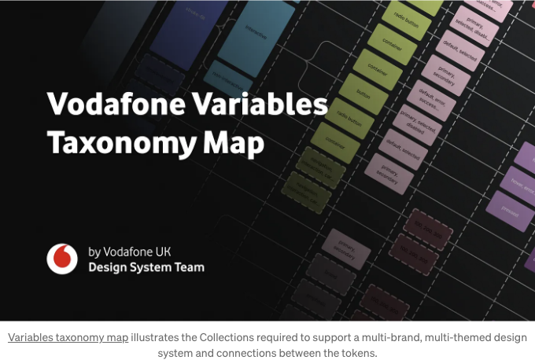
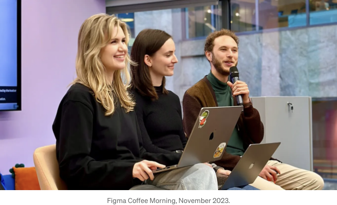

발행자: Alex Dyulgerova 및 Robyn Layton

Variables 런칭을 위한 프로젝트를 시작하면서 Config 2023에서 우리는 많은 통찰력있는 정보를 발견했지만 사용 사례에 대한 준비된 솔루션이나 다른 프레임워크의 결정에 이르는 발견 프로세스는 없었습니다. 따라서 우리는 우리의 여정을 문서화함으로써 Design system에 Variables를 적용하려는 누군가에게 영감을 줄 수 있기를 희망합니다.

## 문제 제시

소스 웹(Source Web)은 Vodafone의 디자인 시스템으로, 영국을 특히 중점으로 6개 이상의 시장에 걸쳐 500명 이상의 디자이너, 개발자 및 다른 내부 직원들에게 서비스를 제공하고 있습니다.

<!-- ui-log 수평형 -->
<ins class="adsbygoogle"
  style="display:block"
  data-ad-client="ca-pub-4877378276818686"
  data-ad-slot="9743150776"
  data-ad-format="auto"
  data-full-width-responsive="true"></ins>
<component is="script">
(adsbygoogle = window.adsbygoogle || []).push({});
</component>

보다폰 UK는 세 가지 주요 고객을 대상으로 하는 브랜드로 구성되어 있습니다:

- Vodafone — 다양한 제품 카탈로그를 판매하고 모든 하위 브랜드를 위한 네트워크 커버리지를 제공하는 모회사
- VOXI — 청소년을 대상으로 하는 브랜드
- Talkmobile — 간편한 SIM Only 거래를 제공하는 브랜드

보다폰 내의 브랜드들은 본질적으로 동일한 제품을 판매하지만, 각각이 독립적으로 디자인되고 비즈니스에서 완전히 독립된 엔티티로 취급됩니다.

소스 웹은 항상 다양한 브랜드, 언어, 시즌 캠페인, 테마, 서브 테마 및 역테마를 지원하기 위해 설립되었습니다. 디자이너와 개발자 간의 비즈니스 승인된 솔루션을 위해 노력하며, 엔지니어들은 다양한 코드 패치를 적극적으로 구현하여 테마 적용 수준을 높이고 있습니다.

<!-- ui-log 수평형 -->
<ins class="adsbygoogle"
  style="display:block"
  data-ad-client="ca-pub-4877378276818686"
  data-ad-slot="9743150776"
  data-ad-format="auto"
  data-full-width-responsive="true"></ins>
<component is="script">
(adsbygoogle = window.adsbygoogle || []).push({});
</component>

파인그마의 현재 멀티 브랜드 방법은 컴포넌트를 서브 브랜드 라이브러리로 복제하고 스타일링 오버라이드를 적용하는 것을 포함합니다. 이러한 컴포넌트들은 부모 라이브러리와 연결되어 있지만, 로컬 테마를 지우는 경우가 많아 라이브러리 업데이트를 받아들이는 데에 대한 우려가 있습니다. 과다하고 오래된 파일은 디자이너들이 메모리 문제에 대한 주요 우려를 악화시키며, 개발자들은 단일 정보 원천이 부족합니다.

말할 것도 없이, 이러한 브랜드들 각각을 위해 여러 디자인 시스템을 구축하고 유지하는 노력은 시간/비용 효율적이거나 확장 가능하지 않습니다.

## 목표

우리는 미래에 대비한 세분화된 분류 구조가 필요했습니다. 이는 멀티 브랜드 접근 방식에 적합한 통일성을 제공하고 재사용을 가능하게 하는 것이 목표였습니다.

<!-- ui-log 수평형 -->
<ins class="adsbygoogle"
  style="display:block"
  data-ad-client="ca-pub-4877378276818686"
  data-ad-slot="9743150776"
  data-ad-format="auto"
  data-full-width-responsive="true"></ins>
<component is="script">
(adsbygoogle = window.adsbygoogle || []).push({});
</component>

Vodafone의 혁신 문화를 주도하는 우리는 시스템 간의 공통점을 찾는 노력을 이끌고 있습니다. 아직 해결되지 않은 도전입니다.

## 연구

저희의 연구는 Variables의 출시 전에 시작되었습니다. 토큰은 새로운 개념은 아니었지만 산업 표준 형식이 없는 비교적 추상적인 개념이었습니다. 기존 프레임워크를 탐색하는 것이 Vodafone의 독특한 분류 체계를 구축하는 데 중요한 역할을 했으며, 우리는 여러분이 자신의 발견 과정에서 이러한 리소스를 다뤄보는 것을 추천합니다.

저희는 Material Design, Adobe의 Spectrum, IBM의 Carbon, NewsKit, Sainsbury's Luna, Microsoft의 Fluent 2, Atlassian과 같은 성립된 디자인 시스템을 시작으로 탐구를 시작했습니다. 이미 적용되고 문서화된 토큰의 활용 방법을 이해하기 위해 봤습니다.

<!-- ui-log 수평형 -->
<ins class="adsbygoogle"
  style="display:block"
  data-ad-client="ca-pub-4877378276818686"
  data-ad-slot="9743150776"
  data-ad-format="auto"
  data-full-width-responsive="true"></ins>
<component is="script">
(adsbygoogle = window.adsbygoogle || []).push({});
</component>

다음으로, James와 Louis의 SCHEMA 2022에서의 디자인 토큰 파일 형식 소개, Brad Frost의 테마 디자인 시스템에 대한 게시물 및 Nate Baldwin의 유연한 토큰 분류에 관한 발표 등 핵심 음성들의 기사와 발표 자료를 철저히 조사했습니다.

실제 전환점은 Nathan Curtis의 디자인 시스템에서 토큰 네이밍을 탐구한 부분에서 발생했습니다. 그의 깊은 통찰력은 디자인 토큰의 해부학과 분류를 분해하기 시작하는 데 큰 틀을 제공했으며, 이를 우리가 필요로 하는 규모에 적용하는 방법을 제시했습니다.

## 분류

Nathan Curtis의 기사와 같이, 우리는 원자를 검토하고 버튼을 선택하여 토큰 네이밍 규칙을 시험해보았습니다. 이는 더 복잡한 요소로 진전되었는데, 이는 해결하기 어려웠지만 가장 많이 사용하는 구성 요소들 사이의 공통 구조를 식별하는 데 도움이되었습니다. 그렇지 않으면 즉시 명확하지 않았을 것입니다.

<!-- ui-log 수평형 -->
<ins class="adsbygoogle"
  style="display:block"
  data-ad-client="ca-pub-4877378276818686"
  data-ad-slot="9743150776"
  data-ad-format="auto"
  data-full-width-responsive="true"></ins>
<component is="script">
(adsbygoogle = window.adsbygoogle || []).push({});
</component>

## 테스트

2023년 6월에 변수가 도입되면서 초기 매핑 구조를 테스트했습니다. 구조는 다음과 같이 세분화되었습니다:

- 기본 컬렉션: 색상이 아닌 값(간격, 반지름 등)을 보관
- 색상 컬렉션: 모든 디지털 브랜드 HEX 코드를 처리

두 컬렉션은 브랜드를 분리하기 위해 모드를 사용했지만, 하나의 컬렉션으로는 모든 브랜드, 테마 및 서브 테마를 효과적으로 수용할 수 없다는 것이 빨리 나타났습니다. 게다가 브랜드 간 색상은 종종 정확하게 매핑되지 않아 어떤 값은 필요하지 않은 경우가 있어 분류체계에 갭이 발생합니다. 이로 인해 색상 컬렉션을 브랜드 컬렉션으로 나누어 테마와 서브 테마를 위해 모드를 사용하기로 결정했습니다.

<!-- ui-log 수평형 -->
<ins class="adsbygoogle"
  style="display:block"
  data-ad-client="ca-pub-4877378276818686"
  data-ad-slot="9743150776"
  data-ad-format="auto"
  data-full-width-responsive="true"></ins>
<component is="script">
(adsbygoogle = window.adsbygoogle || []).push({});
</component>

Vodafone의 브랜드 디자이너들과 협업하면서 발견한 것은 아이덴티티 팔레트가 대부분 인쇄 및 위쪽 라인에 초점을 맞추고 있음을 보여 주었습니다. 브랜드별 이름이 지정된 일반적인 명칭이 후에 디지털 애플리케이션에 적용됩니다. 예를 들어:

- Vodafone Red(브랜드 색상)은 Primary1(디지털 색상)으로 변환됩니다.
- Aubergine(브랜드 색상)은 Secondary1(디지털 색상)이 됩니다.
- Fresh Orange(브랜드 색상)은 Warn(디지털 색상)으로 변신합니다.

개별 브랜드 모음을 만들면 각 브랜드 팀이 닉네임 변수를 방해하지 않고 소유하고 제어할 수 있습니다. 핵심 브랜드 용어와의 연결을 유지하면 팀 간 협업이 더 원활해지며, 동일한 언어로 대화하기가 더 쉬워집니다.

그런 다음 이러한 브랜드 모음은 관련 프리미티브 모음에 정보를 공급하여 브랜드화된 값이 중립적인 디지털 토큰으로 변환됩니다. 이 연결은 브랜드 팔레트에서 고려되지 않았을 수 있는 테마, 접근성 및 디지털 상호 작용을 위한 누락된 색상 토큰을 발견하는 데 중요합니다.

<!-- ui-log 수평형 -->
<ins class="adsbygoogle"
  style="display:block"
  data-ad-client="ca-pub-4877378276818686"
  data-ad-slot="9743150776"
  data-ad-format="auto"
  data-full-width-responsive="true"></ins>
<component is="script">
(adsbygoogle = window.adsbygoogle || []).push({});
</component>

우리의 탐험 중에는 루이스와 제이콥의 심층탐구에서 도움을 받았어요. 여기에서는 우리의 구조에서 빠진 요소인 시맨틱 컬렉션에 대해 강조했어요. 여기서 브랜드를 모드를 사용해 연결하고 프리미티브의 일반적인 원시 값에 의도와 목적을 부여해요. 이 시맨틱 토큰은 컴포넌트에 직접 적용되며, 이는 그들이 브랜드 간의 스타일링 및 로직을 상속받는 방식이에요. 이렇게 적용하면 디자이너들이 파일에서 간단히 브랜드 간을 전환할 수 있어요.

우리는 변수를 컴포넌트 수준에서 전체 페이지의 맥락으로 옮겼어요. 이를 하기 전에는 중단점 관련 토큰을 시맨틱에서 분리해야 하는 중요성이 명확하지 않았어요. 이제 새로운 페이지 컬렉션을 통해 라이브러리의 크기를 3분의 2로 크게 축소할 수 있게 될 거예요. 이러한 변형이 더 많은 조작성을 제공할 것이며, Source Web의 사용성을 혁신적으로 향상시킬 것입니다. 소비 팀이 작업 중인 중단점에 따라 전체 파일을 전환할 수 있도록하면, Source Web은 보다 가볍고 똑똑하며 사용자 친화적일 것이에요.

지난 이터레이션에서 중요한 교훈 중 하나는 변수가 추가 비용이나 노력없이 화이트 라벨 브랜드 (브랜드 제로)를 만들 수 있게끔 했다는 것이었어요. 유니버설 와이어프레임 시스템의 역할을 하며, 우리 컴포넌트에서 관련된 브랜드 스타일링을 제거해 Source Web의 소비자들이 디자인 시스템을 테마화된 제품으로 상상하게 도와주며, 목적과 의도에 기반한 디자인을 장려함으로써 미학보다는 가치 있는 디자인이 이끌어지도록 도와줘요.

<!-- ui-log 수평형 -->
<ins class="adsbygoogle"
  style="display:block"
  data-ad-client="ca-pub-4877378276818686"
  data-ad-slot="9743150776"
  data-ad-format="auto"
  data-full-width-responsive="true"></ins>
<component is="script">
(adsbygoogle = window.adsbygoogle || []).push({});
</component>

## 결과

이 프로토 타입은 변수의 실용적 장점을 효과적으로 강조하며, 서브 브랜드를 지원하기 위해 라이브러리를 분기하지 않아도 된다는 것을 보여 주었습니다. 우리의 제안된 프레임워크는 기존의 문제점을 해결하고 미래 지향적인 다중 브랜드 구조를 보장하기 위해 다음을 의도합니다:

- 테마: 브랜드 내에서의 테마 및 서브 테마 설정이 라이브러리를 분기하지 않고 쉽게 완료되며, 시즌 캠페인과 서브 브랜드를 지원하기 위해 필요한 라이브러리를 사용하지 않아도 됩니다.
- 브랜드 색상 매핑: 모든 브랜드는 색상 매핑을 간편하게 하기 위해 개별적으로 맞춤형 브랜드 및 기본 컬렉션을 갖게 되며, 구성 요소에서 색상 매핑을 단순화하고 누락된 토큰을 강조하며 협업을 강화합니다.
- 메모리 효율성: 페이지 컬렉션을 통해 구성 요소 크기를 3분의 2로 축소할 수 있습니다.
- 채택을 방해하는 요인: 화이트 레이블 브랜드 제로는 시각적 처리보다 구성 요소의 기능을 강조함으로써 도입을 막는 정신적 장벽을 극복할 것입니다.
- 일관성: 변수를 통해 간과될 수 있는 패턴을 식별하는 데 도움이 될 것입니다.
- 참여: 변수의 다양성과 시간 효율성을 보여줌으로써 토큰 채택을 위한 아이디어를 더 빨리 판매하는 데 도움이 될 것입니다.

이 프로젝트는 Nathan Curtis의 분류를 모방하여 Vodafone UK의 타사 논리도를 형성했습니다. 자세한 내용은 커뮤니티 파일을 사용하여 다운로드할 수 있습니다.

<!-- ui-log 수평형 -->
<ins class="adsbygoogle"
  style="display:block"
  data-ad-client="ca-pub-4877378276818686"
  data-ad-slot="9743150776"
  data-ad-format="auto"
  data-full-width-responsive="true"></ins>
<component is="script">
(adsbygoogle = window.adsbygoogle || []).push({});
</component>

## 다음 단계

이 글을 작성하는 시점에서 Figma 변수는 오픈 베타 상태입니다. 따라서 필요한 변수들이 아직 모두 제공되지 않았습니다. 미래 릴리스에서 더 많은 기능을 기대하고 있으며, 이를 라이브러리에 완전히 통합할 수 있도록 기다리고 있습니다. 그동안 개발자들과 협력하여 분류 체계 명칭을 조정하고, 변수를 팀에 가장 방해받지 않는 방식으로 적용하기 위한 계획을 세울 예정입니다.

## 감사의 글

<!-- ui-log 수평형 -->
<ins class="adsbygoogle"
  style="display:block"
  data-ad-client="ca-pub-4877378276818686"
  data-ad-slot="9743150776"
  data-ad-format="auto"
  data-full-width-responsive="true"></ins>
<component is="script">
(adsbygoogle = window.adsbygoogle || []).push({});
</component>

저희는 이 복잡한 과제에 대한 최상의 해결책을 찾을 기회를 우리에게 신뢰해준 디자인 리드 M 스미스님께 감사드립니다. 또한 Figma에게도 감사의 말씀을 전합니다. Figma는 우리를 초대하여 우리의 여정을 넓은 UX 커뮤니티와 공유하고 발표할 수 있도록 오픈 커피 모닝에서 자리를 마련해 주셨습니다. 

