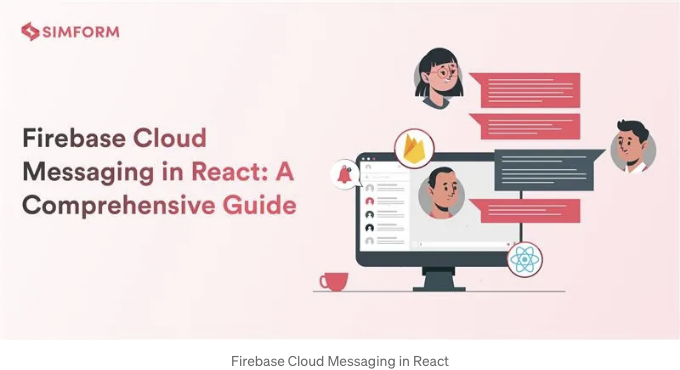
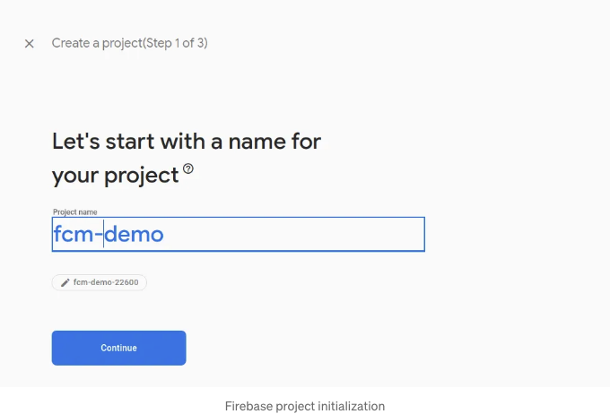
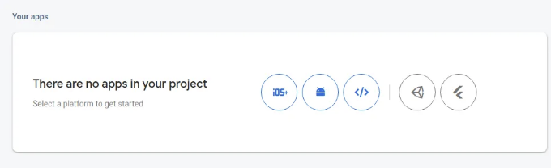
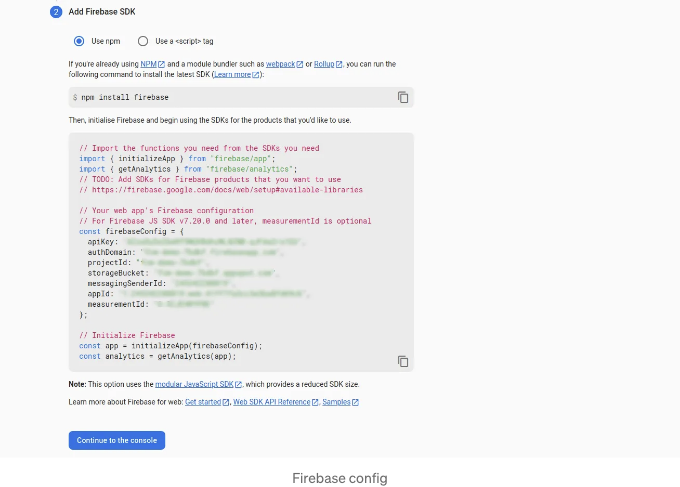
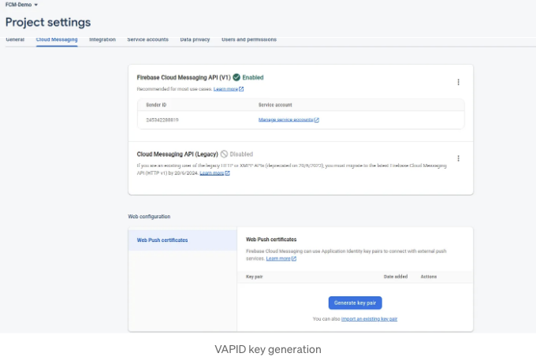
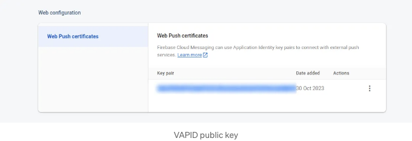
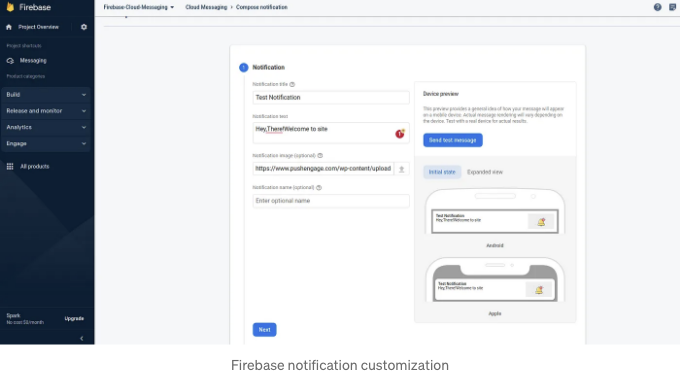
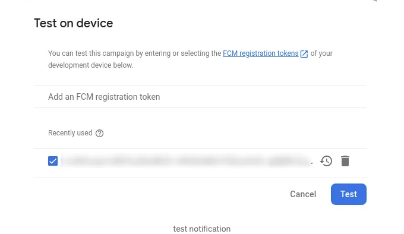
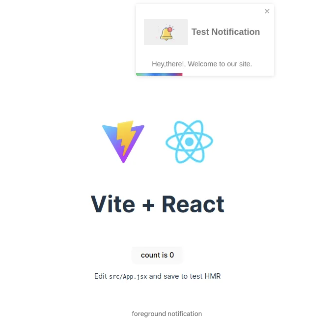
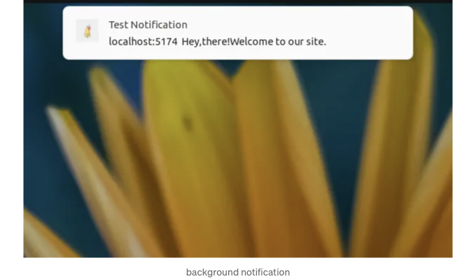

리액트 앱에 Firebase를 사용하여 쉽게 푸시 알림을 추가하는 방법을 배워보세요.



Firebase는 Google이 개발한 인기 있는 웹 및 모바일 애플리케이션 개발 플랫폼으로, 개발자들이 앱을 쉽게 구축, 관리 및 성장시킬 수 있도록 도와줍니다. Firebase는 신속한 앱 개발과 향상된 사용자 경험을 위한 다양한 서비스를 제공합니다. 다음은 몇 가지 중요한 Firebase 서비스입니다:

- Firebase 실시간 데이터베이스
- Firebase 인증
- Firebase 클라우드 메시징 (FCM)/ Firebase 푸시 알림
- Firebase 호스팅
- Firebase 클라우드 Firestore

<!-- ui-log 수평형 -->
<ins class="adsbygoogle"
  style="display:block"
  data-ad-client="ca-pub-4877378276818686"
  data-ad-slot="9743150776"
  data-ad-format="auto"
  data-full-width-responsive="true"></ins>
<component is="script">
(adsbygoogle = window.adsbygoogle || []).push({});
</component>

이 글에서는 Firebase 푸시 알림의 개념을 자세히 살펴보고, 이 서비스를 React 앱에 배경 및 전경 알림을 위해 통합하는 방법을 알아볼 것입니다.

# FCM/Firebase 푸시 알림이란?

푸시 알림은 React 애플리케이션과 사용자의 상호작용을 증가시키는 강력한 방법입니다. Firebase는 Firebase Cloud Messaging(FCM) 서비스를 제공합니다. 이는 모바일 기기와 웹 애플리케이션으로 알림을 보낼 수 있는 클라우드 기반 메시징 서비스입니다.

FCM을 활용하면 새로운 콘텐츠를 확인할 때 클라이언트 앱에 알림을 보낼 수 있습니다. 사용자들의 어깨를 두드리며 돌아오라고 상기시키는 것과 같이, 사용자들을 끌어들이고 기쁘게 만들어주는 역할을 합니다.

<!-- ui-log 수평형 -->
<ins class="adsbygoogle"
  style="display:block"
  data-ad-client="ca-pub-4877378276818686"
  data-ad-slot="9743150776"
  data-ad-format="auto"
  data-full-width-responsive="true"></ins>
<component is="script">
(adsbygoogle = window.adsbygoogle || []).push({});
</component>

Benefits of FCM :

- Cross-Platform Support
- Real-Time Engagement
- Scalability and Reliability
- User Segmentation
- Easy Integration with Firebase Services
- Free Tier Availability
- Customization Options
- Security Measures

더 많은 정보는 여기를 클릭해주세요.

# 리액트 앱 샘플 설정

<!-- ui-log 수평형 -->
<ins class="adsbygoogle"
  style="display:block"
  data-ad-client="ca-pub-4877378276818686"
  data-ad-slot="9743150776"
  data-ad-format="auto"
  data-full-width-responsive="true"></ins>
<component is="script">
(adsbygoogle = window.adsbygoogle || []).push({});
</component>

- Vite React 프로젝트 초기화: 아래 명령어를 실행하여 새 데모 React 앱을 만드세요:

```js
npm create vite@latest demo-app --template react
cd demo-app
npm install
```

2. 의존성 설치: firebase와 react-toastify를 설치할 것입니다. react-toastify를 사용하면 앱에 쉽게 알림을 추가할 수 있습니다.

```js
npm i firebase react-toastify
```

<!-- ui-log 수평형 -->
<ins class="adsbygoogle"
  style="display:block"
  data-ad-client="ca-pub-4877378276818686"
  data-ad-slot="9743150776"
  data-ad-format="auto"
  data-full-width-responsive="true"></ins>
<component is="script">
(adsbygoogle = window.adsbygoogle || []).push({});
</component>

3. 폴더 구조:

```js
.
├── index.html
├── package.json
├── package-lock.json
├── public
│   ├── firebase-messaging-sw.js
│   └── vite.svg
├── README.md
├── src
│   ├── App.css
│   ├── App.jsx
│   ├── assets
│   │   └── react.svg
│   ├── components
│   │   └── Message.jsx
│   ├── firebase
│   │   └── firebaseConfig.js
│   ├── index.css
│   └── main.jsx
└── vite.config.js
```

# Firebase 프로젝트 설정

1. 새 Firebase 프로젝트를 초기화하세요:

<!-- ui-log 수평형 -->
<ins class="adsbygoogle"
  style="display:block"
  data-ad-client="ca-pub-4877378276818686"
  data-ad-slot="9743150776"
  data-ad-format="auto"
  data-full-width-responsive="true"></ins>
<component is="script">
(adsbygoogle = window.adsbygoogle || []).push({});
</component>

Firebase 프로젝트를 추가하고 이름을 지정하세요. 원하는대로 분석을 활성화 또는 비활성화하세요.



2. Firebase 구성 생성:

Firebase 프로젝트와 React 앱 간의 연결을 설정해야 합니다. 이를 위해 앱에 통합할 Firebase 구성이 필요합니다.

<!-- ui-log 수평형 -->
<ins class="adsbygoogle"
  style="display:block"
  data-ad-client="ca-pub-4877378276818686"
  data-ad-slot="9743150776"
  data-ad-format="auto"
  data-full-width-responsive="true"></ins>
<component is="script">
(adsbygoogle = window.adsbygoogle || []).push({});
</component>

프로젝트 설정으로 이동해서 `일반` 탭으로 이동한 후 `내 앱`을 선택하세요. 웹 앱 옵션을 선택하세요.



닉네임을 제공하고 앱을 등록하세요. 구성이 생성됩니다.



<!-- ui-log 수평형 -->
<ins class="adsbygoogle"
  style="display:block"
  data-ad-client="ca-pub-4877378276818686"
  data-ad-slot="9743150776"
  data-ad-format="auto"
  data-full-width-responsive="true"></ins>
<component is="script">
(adsbygoogle = window.adsbygoogle || []).push({});
</component>

3. 웹 푸시 인증서 키(VAPID 키) 생성:

VAPID는 Voluntary Application Server Identity의 약자로, 웹 푸시 알림을 보내고 받는 새로운 방법입니다. VAPID 키를 사용하면 서버에서 브라우저로 직접 웹 푸시 알림을 보낼 수 있습니다.

프로젝트 설정 ` Cloud Messaging ` 웹 구성으로 이동하여 키 쌍을 생성하세요.



<!-- ui-log 수평형 -->
<ins class="adsbygoogle"
  style="display:block"
  data-ad-client="ca-pub-4877378276818686"
  data-ad-slot="9743150776"
  data-ad-format="auto"
  data-full-width-responsive="true"></ins>
<component is="script">
(adsbygoogle = window.adsbygoogle || []).push({});
</component>



# Firebase 프로젝트와 React 애플리케이션 연결하기

- 환경 변수 생성하기:

루트 폴더에 .env 파일을 생성하고 Firebase 구성 값 및 vapid 키를 안전하게 저장하세요.

<!-- ui-log 수평형 -->
<ins class="adsbygoogle"
  style="display:block"
  data-ad-client="ca-pub-4877378276818686"
  data-ad-slot="9743150776"
  data-ad-format="auto"
  data-full-width-responsive="true"></ins>
<component is="script">
(adsbygoogle = window.adsbygoogle || []).push({});
</component>

```js
VITE_APP_API_KEY=your-api-key
VITE_APP_AUTH_DOMAIN=your-auth-domain
VITE_APP_PROJECT_ID=your-project-id
VITE_APP_STORAGE_BUCKET=your-storage-bucket
VITE_APP_MESSAGING_SENDER_ID=your-messaging-sender-id
VITE_APP_APP_ID=your-app-id
VITE_APP_MEASUREMENT_ID=your-measurement-id
VITE_APP_VAPID_KEY=your-vapid-key
```

.env 파일에서 값을 가져오려면 다음을 사용할 수 있어요:

```js
import.meta.env.<VITE_APP_VARIABLE_NAME>
```

2. firebaseConfig.js 파일을 생성하세요:

<!-- ui-log 수평형 -->
<ins class="adsbygoogle"
  style="display:block"
  data-ad-client="ca-pub-4877378276818686"
  data-ad-slot="9743150776"
  data-ad-format="auto"
  data-full-width-responsive="true"></ins>
<component is="script">
(adsbygoogle = window.adsbygoogle || []).push({});
</component>

src/firebase/firebaseConfig.js 파일을 만들어 구성 파일을 생성하세요. 앱을 초기화하고 구성을 사용하여 Firebase 프로젝트와 연결하세요.

메시징 서비스를 활성화하려면 firebase/messaging에서 제공하는 getMessaging을 사용해야 합니다. 앱을 메시징 객체와 연결하세요.

```js
import { initializeApp } from "firebase/app";
import { getMessaging } from "firebase/messaging";

// .env 파일에서 가져온 Firebase 구성 값
const firebaseConfig = {
  apiKey: import.meta.env.VITE_APP_API_KEY,
  authDomain: import.meta.env.VITE_APP_AUTH_DOMAIN,
  projectId: import.meta.env.VITE_APP_PROJECT_ID,
  storageBucket: import.meta.env.VITE_APP_STORAGE_BUCKET,
  messagingSenderId: import.meta.env.VITE_APP_MESSAGING_SENDER_ID,
  appId: import.meta.env.VITE_APP_APP_ID,
  measurementId: import.meta.env.VITE_APP_MEASUREMENT_ID,
};

// Firebase 초기화
const app = initializeApp(firebaseConfig);

// 메시징 서비스
export const messaging = getMessaging(app);
```

# 알림 권한 및 등록 토큰

<!-- ui-log 수평형 -->
<ins class="adsbygoogle"
  style="display:block"
  data-ad-client="ca-pub-4877378276818686"
  data-ad-slot="9743150776"
  data-ad-format="auto"
  data-full-width-responsive="true"></ins>
<component is="script">
(adsbygoogle = window.adsbygoogle || []).push({});
</component>

브라우저로 Push 알림을 보내려면 사용자의 허락이 필요합니다.

브라우저의 Notification API를 사용할 것입니다. 사용자의 허락을 요청하고, Firebase의 getToken 메서드와 메시징 객체를 사용하여 등록 토큰을 가져올 수 있습니다.

App.jsx에 다음 코드를 추가하세요:

```js
import { getToken } from "firebase/messaging";
import { messaging } from "./firebase/firebaseConfig";

const { VITE_APP_VAPID_KEY } = import.meta.env;

async function requestPermission() {
  // Notification API를 사용하여 허가 요청
  const permission = await Notification.requestPermission();

  if (permission === "granted") {
    const token = await getToken(messaging, {
      vapidKey: VITE_APP_VAPID_KEY,
    });

    // 토큰을 서버로 보낼 수 있습니다
    console.log("생성된 토큰: ", token);
  } else if (permission === "denied") {
    // 알림이 차단됨
    alert("알림에 대해 거부하셨습니다");
  }
}

useEffect(() => {
  requestPermission();
}, []);
```

<!-- ui-log 수평형 -->
<ins class="adsbygoogle"
  style="display:block"
  data-ad-client="ca-pub-4877378276818686"
  data-ad-slot="9743150776"
  data-ad-format="auto"
  data-full-width-responsive="true"></ins>
<component is="script">
(adsbygoogle = window.adsbygoogle || []).push({});
</component>

이 시나리오에서는 현재 콘솔에 토큰을 표시하고 있습니다. 그러나 이 토큰은 서버로 전송하여 Node.js나 다른 적절한 백엔드 라이브러리를 사용하여 백엔드를 구성하는 데 사용할 수도 있습니다.

# 알림 수신 대기 설정

알림은 전경 알림과 배경 알림 두 가지 유형으로 나눌 수 있습니다.

모든 알림에는 제목과 본문이 있어야 하며, 이미지는 선택 사항입니다.

<!-- ui-log 수평형 -->
<ins class="adsbygoogle"
  style="display:block"
  data-ad-client="ca-pub-4877378276818686"
  data-ad-slot="9743150776"
  data-ad-format="auto"
  data-full-width-responsive="true"></ins>
<component is="script">
(adsbygoogle = window.adsbygoogle || []).push({});
</component>

## 포그라운드 알림 수신기

앱이 포그라운드에서 활성 상태인 경우를 다루기 위해 Firebase의 onMessage 이벤트 리스너를 사용하겠습니다.

이전에 언급한 대로, 알림 처리는 react-toastify를 활용하여 이루어집니다.

App.jsx 파일에 제공된 코드를 통합하여 원활한 사용자 경험을 보장하세요.

<!-- ui-log 수평형 -->
<ins class="adsbygoogle"
  style="display:block"
  data-ad-client="ca-pub-4877378276818686"
  data-ad-slot="9743150776"
  data-ad-format="auto"
  data-full-width-responsive="true"></ins>
<component is="script">
(adsbygoogle = window.adsbygoogle || []).push({});
</component>

```js
import { toast, ToastContainer } from "react-toastify";
import Message from "./components/Message";
import "react-toastify/dist/ReactToastify.css";

function App() {

   onMessage(messaging, (payload) => {
     toast(<Message notification={payload.notification} />);
   });

   // ... 나머지 코드 ...

   return (
       <>
          // ... 나머지 코드 ...
          <ToastContainer />
       </>
   );
}
```

알림을 표시하려면 아래와 같이 Message.jsx 라는 별도의 컴포넌트를 만들었습니다:

```js
const Message = ({ notification }) => {
  return (
    <>
      <div id="notificationHeader">
        {/* 이미지는 선택 사항입니다 */}
        {notification.image && (
          <div id="imageContainer">
            
          </div>
        )}
        <span>{notification.title}</span>
      </div>
      <div id="notificationBody">{notification.body}</div>
    </>
  );
};

export default Message;
```

스타일을 직접 구성하거나 아래 제공된 스타일을 사용할 수 있습니다.
```

<!-- ui-log 수평형 -->
<ins class="adsbygoogle"
  style="display:block"
  data-ad-client="ca-pub-4877378276818686"
  data-ad-slot="9743150776"
  data-ad-format="auto"
  data-full-width-responsive="true"></ins>
<component is="script">
(adsbygoogle = window.adsbygoogle || []).push({});
</component>

```js
#notificationHeader {
  display: flex;
  justify-content: space-around;
  align-items: center;
  font-size: 20px;
  font-weight: bold;
}

#notificationBody {
  margin-top: 10px;
  text-align: center;
}

#imageContainer {
  display: flex;
  align-items: center;
  height: 100px;
  object-fit: contain;
}
```

## 배경 알림 수신기

앱이 비활성 상태인 경우에 대비해서, public 폴더에 서비스 워커 파일(firebase-messaging-sw.js)을 생성해야 합니다. 그 안에 messaging.onBackgroundMessage 이벤트 리스너를 사용할 것입니다.

이 이벤트 리스너는 웹 애플리케이션이 활성 상태가 아닐 때(백그라운드에 있거나 종료된 상태) 발신 메시지를 수신하는 데 사용됩니다. 백그라운드 메시지가 수신되면, 제공된 콜백 함수를 호출하여 메시지 페이로드를 기록하고 알림을 표시합니다.
```

<!-- ui-log 수평형 -->
<ins class="adsbygoogle"
  style="display:block"
  data-ad-client="ca-pub-4877378276818686"
  data-ad-slot="9743150776"
  data-ad-format="auto"
  data-full-width-responsive="true"></ins>
<component is="script">
(adsbygoogle = window.adsbygoogle || []).push({});
</component>

self.registration.showNotification은 백그라운드 메시지를 받았을 때 사용자 브라우저에 알림을 표시하는 데 사용됩니다. FCM 페이로드에서 데이터를 활용하여 제목, 본문 및 아이콘을 가진 알림을 생성합니다.

firebase-messaging-sw.js의 코드는 아래와 같습니다:

```js
// Scripts for firebase and firebase messaging
importScripts("https://www.gstatic.com/firebasejs/8.10.0/firebase-app.js");
importScripts(
  "https://www.gstatic.com/firebasejs/8.10.0/firebase-messaging.js"
);

// 서비스 워커에서 Firebase 앱 초기화
// "Default" Firebase 구성 (오류 방지)
const defaultConfig = {
  apiKey: true,
  projectId: true,
  messagingSenderId: true,
  appId: true,
};

firebase.initializeApp(firebaseConfig);

// Firebase 메시징 검색
const messaging = firebase.messaging();

messaging.onBackgroundMessage((payload) => {
  const notificationTitle = payload.notification.title;
  const notificationOptions = {
    body: payload.notification.body,
    icon: payload.notification.image,
  };

  self.registration.showNotification(notificationTitle, notificationOptions);
});
```

여기서, V8 호환 버전의 압축된 스크립트 `importScripts`를 사용했습니다.

<!-- ui-log 수평형 -->
<ins class="adsbygoogle"
  style="display:block"
  data-ad-client="ca-pub-4877378276818686"
  data-ad-slot="9743150776"
  data-ad-format="auto"
  data-full-width-responsive="true"></ins>
<component is="script">
(adsbygoogle = window.adsbygoogle || []).push({});
</component>

# 푸시 알림 테스트 중

지금 우리 알림 서비스가 잘 작동하는지 테스트할 수 있어요.

Firebase `Engage` Messaging으로 이동해서 첫 번째 캠페인을 만들어주세요. 메시지 유형을 Firebase 알림 메시지로 선택하고 제목, 본문, 이미지(옵션)를 제공하여 알림 메시지를 맞춤 설정해주세요.



<!-- ui-log 수평형 -->
<ins class="adsbygoogle"
  style="display:block"
  data-ad-client="ca-pub-4877378276818686"
  data-ad-slot="9743150776"
  data-ad-format="auto"
  data-full-width-responsive="true"></ins>
<component is="script">
(adsbygoogle = window.adsbygoogle || []).push({});
</component>

"Send"을 클릭하고 등록 토큰을 여기에 붙여넣으세요. 토큰을 선택하고 "테스트"를 클릭하세요. 알림 메시지가 전송됩니다.



# 결과

## 화면 알림:

<!-- ui-log 수평형 -->
<ins class="adsbygoogle"
  style="display:block"
  data-ad-client="ca-pub-4877378276818686"
  data-ad-slot="9743150776"
  data-ad-format="auto"
  data-full-width-responsive="true"></ins>
<component is="script">
(adsbygoogle = window.adsbygoogle || []).push({});
</component>

어플이 활성화된 상태일 때 알림이 어떻게 표시될 지 확인해보세요.



## 배경 알림:

어플이 백그라운드에 있거나 종료된 상태일 때 알림이 어떻게 표시될 지 확인해보세요.

<!-- ui-log 수평형 -->
<ins class="adsbygoogle"
  style="display:block"
  data-ad-client="ca-pub-4877378276818686"
  data-ad-slot="9743150776"
  data-ad-format="auto"
  data-full-width-responsive="true"></ins>
<component is="script">
(adsbygoogle = window.adsbygoogle || []).push({});
</component>



# 알림 캠페인에서의 사용자 정의

알림 제목, 본문 및 이미지 외에 많은 다른 사항을 구성할 수 있습니다.

- 대상 고객층: 알림을 위한 대상 고객층을 지정할 수 있습니다. 사용자 언어, 기기 범주, 국가/지역 등 다양한 기준에 따라 특정 사용자 세그먼트를 대상으로 설정할 수 있습니다.
- 일정: 알림을 보낼 때 일정을 설정할 수 있습니다. 즉시 보내거나, 특정 시간에 보내거나, 주기적으로 보낼 수 있습니다.
- 전환 이벤트: 전환 이벤트는 사용자가 알림을 받은 후 취할 행동으로, 이는 알림을 클릭하거나 구매를 완료하거나 서비스에 가입하거나 앱에 가치 있는 기타 사용자 참여 지표를 포함할 수 있습니다. 이러한 전환 이벤트를 추적하여 알림 캠페인의 효과를 측정할 수 있습니다.

<!-- ui-log 수평형 -->
<ins class="adsbygoogle"
  style="display:block"
  data-ad-client="ca-pub-4877378276818686"
  data-ad-slot="9743150776"
  data-ad-format="auto"
  data-full-width-responsive="true"></ins>
<component is="script">
(adsbygoogle = window.adsbygoogle || []).push({});
</component>

# 결론

이 체계적인 안내서는 React 애플리케이션에 푸시 알림을 구현하는 단계별 안내를 제공했습니다. FCM은 개발자들이 알림을 보내는 데 도움을 주는 클라우드 기반 메시징 서비스입니다. 이는 크로스 플랫폼 지원을 제공하며 새로운 데이터 이용 가능성에 대해 클라이언트에게 실시간으로 알림을 보내는 것으로 사용자 참여를 높입니다. 제시된 과정을 따라 당신은 앱을 설정하여 전경과 배경 시나리오에서 실시간 사용자 참여와 재참여를 보장하는 알림을 전달할 수 있었을 것입니다.

FCM은 React 애플리케이션에서 사용자 참여와 알림 전달을 향상시키려는 개발자들에게 중요한 자원이 될 수 있습니다.