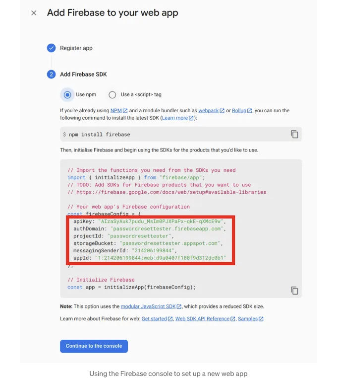
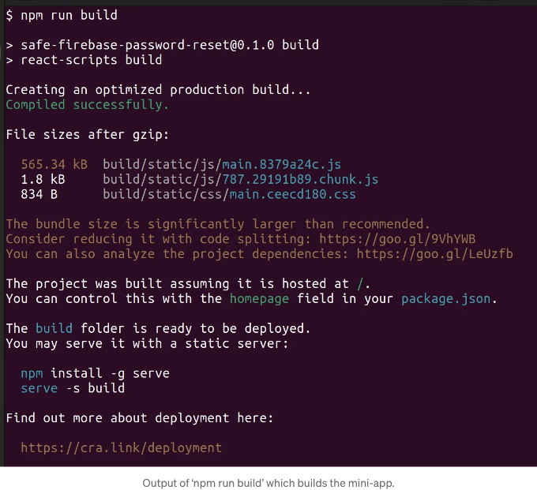
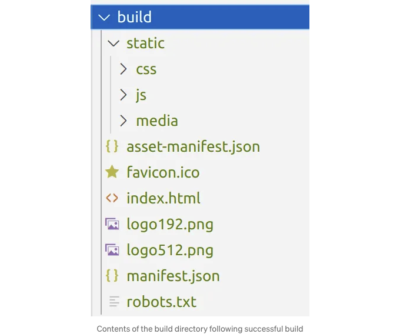
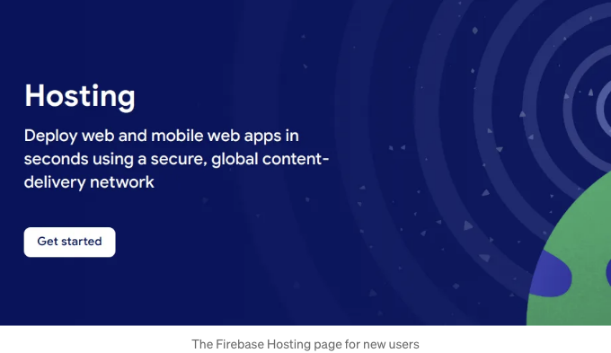
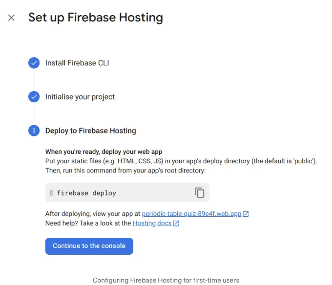
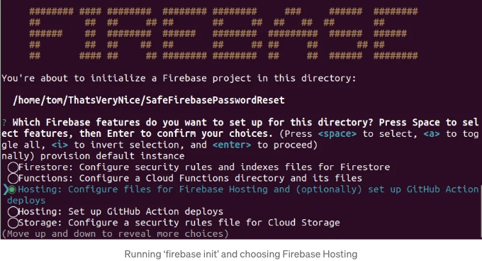
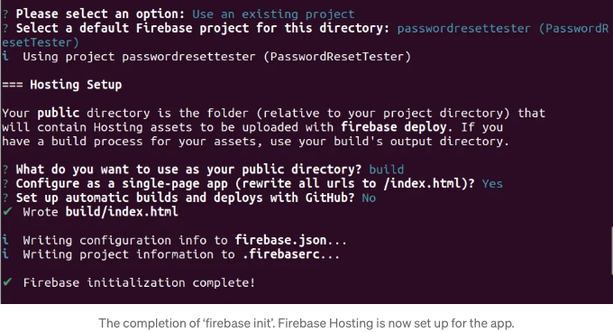
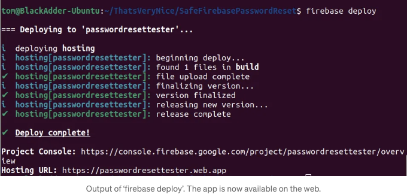
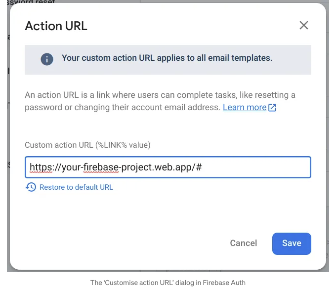

## Firebase Auth의 기본 비밀번호 재설정 앱은 보안에 취약합니다. 사용자가 보안에 취약한 비밀번호를 입력할 수 있게끔 허용하기 때문입니다. 

제 이전 블로그에서는 Firebase의 비밀번호 재설정 시스템이 보안에 취약하다고 설명했습니다. 이 블로그에서는 이러한 보안 취약성이 있는 시스템에 대한 대체할 수 있는 오픈 소스 프로젝트를 소개합니다.

이 문제는 Firebase Auth에서 이메일/비밀번호 인증을 사용하는 앱에 해당됩니다. 사용자가 비밀번호를 재설정하려고 할 때, 기본적으로 이 미니 앱으로 이동됩니다:

<!-- ui-log 수평형 -->
<ins class="adsbygoogle"
  style="display:block"
  data-ad-client="ca-pub-4877378276818686"
  data-ad-slot="9743150776"
  data-ad-format="auto"
  data-full-width-responsive="true"></ins>
<component is="script">
(adsbygoogle = window.adsbygoogle || []).push({});
</component>

위에서 보시는 것처럼, 비밀번호 보안이 거의 없습니다. 유일한 규정은 비밀번호가 6자 이상이어야한다는 것뿐입니다. 그래서 사용자는 'aaaaaa'나 '123456'과 같이 정말 평범한 비밀번호를 선택할 수 있습니다.

따라서 시간이 지남에 따라 사용자는 비밀번호 재설정 기능을 계속 사용하면서 점점 덜 보안적인 비밀번호로 이동하게 됩니다.

# 간단한 해결책

<!-- ui-log 수평형 -->
<ins class="adsbygoogle"
  style="display:block"
  data-ad-client="ca-pub-4877378276818686"
  data-ad-slot="9743150776"
  data-ad-format="auto"
  data-full-width-responsive="true"></ins>
<component is="script">
(adsbygoogle = window.adsbygoogle || []).push({});
</component>

`SafeFirebasePasswordReset` 저장소는 Firebase의 기본적이고 보안이 취약한 비밀번호 재설정 미니 앱을 대체하기 위해 설계되었습니다. 다음과 같이 보입니다:

여기서 주목해야 할 점은 일반적인 비밀번호나 쉽게 추측할 수 있는 비밀번호를 사용할 때 경고를 제공하며, 사용자가 입력을 개선하는 방법에 대한 힌트도 제공한다는 것입니다.

해당 저장소는 오픈 소스이며 사용자의 요구에 맞게 쉽게 사용자 정의할 수 있으며 무료로 사용 가능합니다(MIT 라이선스).

<!-- ui-log 수평형 -->
<ins class="adsbygoogle"
  style="display:block"
  data-ad-client="ca-pub-4877378276818686"
  data-ad-slot="9743150776"
  data-ad-format="auto"
  data-full-width-responsive="true"></ins>
<component is="script">
(adsbygoogle = window.adsbygoogle || []).push({});
</component>

# SafeFirebasePasswordReset 사용 방법

우리는 코드로부터 미니 앱을 만들 것이고, Firebase Hosting을 사용하여 서비스를 제공한 다음, 새 위치를 가리키도록 이메일 템플릿을 업데이트할 것입니다.

이를 위해 다음이 설치되어 있어야 합니다:

- Git
- NodeJS
- Firebase CLI (설치 후 명령 프롬프트 창을 열고 firebase login을 입력하세요).

<!-- ui-log 수평형 -->
<ins class="adsbygoogle"
  style="display:block"
  data-ad-client="ca-pub-4877378276818686"
  data-ad-slot="9743150776"
  data-ad-format="auto"
  data-full-width-responsive="true"></ins>
<component is="script">
(adsbygoogle = window.adsbygoogle || []).push({});
</component>

명령 프롬프트에서 시작해서, 레포를 클론하세요: git clone https://github.com/tdcolvin/SafeFirebasePasswordReset.git.

# 앱 설정 및 빌드

그런 다음, 클론으로 생성된 디렉토리로 이동하세요: cd SafeFirebasePasswordReset. 거기서 npm i로 필요한 노드 모듈을 가져올 수 있습니다. 완료되면 node_modules 디렉토리가 생깁니다.

Firebase 구성 객체가 필요합니다. 이를 얻으려면 Firebase 콘솔로 이동하여, 톱니바퀴 아이콘을 클릭하고, 프로젝트 설정을 클릭한 후 일반 탭에서 앱 추가를 클릭하고, 웹 아이콘(라벨 `/`로 표시됨)을 클릭하고, 앱 이름으로 Password Reset을 입력하고, 앱 등록을 누르세요. 아래와 같은 화면이 표시됩니다:

<!-- ui-log 수평형 -->
<ins class="adsbygoogle"
  style="display:block"
  data-ad-client="ca-pub-4877378276818686"
  data-ad-slot="9743150776"
  data-ad-format="auto"
  data-full-width-responsive="true"></ins>
<component is="script">
(adsbygoogle = window.adsbygoogle || []).push({});
</component>

빨간 상자 안의 텍스트를 src/firebaseConfig.ts 파일에 해당 위치에 복사하세요. 이제 SafeFirebasePasswordReset이 프로젝트에 설정되었습니다.

마지막으로, npm run build를 실행하여 미니 앱을 빌드하세요. 이 작업은 다음과 같이 끝나야 합니다:

<!-- ui-log 수평형 -->
<ins class="adsbygoogle"
  style="display:block"
  data-ad-client="ca-pub-4877378276818686"
  data-ad-slot="9743150776"
  data-ad-format="auto"
  data-full-width-responsive="true"></ins>
<component is="script">
(adsbygoogle = window.adsbygoogle || []).push({});
</component>

작업이 완료되면 오류가 발생하지 않았는지 확인하고(녹색 "정상적으로 컴파일됨" 라인을 확인하세요), 프로젝트에 다음 내용이 포함된 빌드 디렉토리가 생성됩니다:

이 파일들은 미니 앱을 제공하는 데 필요한 파일입니다. Firebase Hosting을 통해 이 파일들을 제공할 것입니다.

# Firebase Hosting: 웹에서 미니 앱을 이용 가능하게 만들기

<!-- ui-log 수평형 -->
<ins class="adsbygoogle"
  style="display:block"
  data-ad-client="ca-pub-4877378276818686"
  data-ad-slot="9743150776"
  data-ad-format="auto"
  data-full-width-responsive="true"></ins>
<component is="script">
(adsbygoogle = window.adsbygoogle || []).push({});
</component>

파이어베이스 호스팅은 앱을 호스팅하기에 좋은 선택입니다. 기능은 간소하지만 파이어베이스와 잘 통합되어 있으며 무료 티어도 넉넉합니다. 그러나 이 경우 파이어베이스 호스팅이 특별한 것은 없으므로 거의 모든 다른 호스팅 플랫폼을 사용할 수 있습니다.

이미 프로젝트에서 사용 중이라면이 앱을 위해 새 사이트를 만들어야 합니다. 그렇지 않은 경우, 프로젝트의 파이어베이스 콘솔에서 파이어베이스 호스팅을 열고 시작하는 방법을 안내 받을 수 있습니다:

시작하기 버튼을 클릭하면 단계별 가이드가 표시되며, 계속해서 다음 버튼을 누르다가 마지막으로 콘솔로 계속합니다.

<!-- ui-log 수평형 -->
<ins class="adsbygoogle"
  style="display:block"
  data-ad-client="ca-pub-4877378276818686"
  data-ad-slot="9743150776"
  data-ad-format="auto"
  data-full-width-responsive="true"></ins>
<component is="script">
(adsbygoogle = window.adsbygoogle || []).push({});
</component>

터미널 창에서 미니 앱 디렉토리로 이동한 다음 firebase init을 입력하세요.

아래로 이동해서 (화살표 키) Hosting을 선택하려면 스페이스바를 누르고, 그 후 Enter키를 눌러 진행하세요.

<!-- ui-log 수평형 -->
<ins class="adsbygoogle"
  style="display:block"
  data-ad-client="ca-pub-4877378276818686"
  data-ad-slot="9743150776"
  data-ad-format="auto"
  data-full-width-responsive="true"></ins>
<component is="script">
(adsbygoogle = window.adsbygoogle || []).push({});
</component>

- 다음 질문에서 로그인을 선택하세요.
- 기존 프로젝트를 사용 선택
- Firebase 프로젝트를 선택하세요.
- 공개 디렉터리로 사용할 것은 무엇입니까? "build"를 입력하고 엔터키를 눌러주세요. (이전에 만든 build 디렉터리를 사용하려고 합니다).
- 단일 페이지 앱으로 구성하시겠습니까? 답은 예입니다. "y"를 입력하고 엔터키를 눌러주세요.
- GitHub와의 자동 빌드 및 배포 설정하시겠습니까? 아니오를 선택하세요.

위 옵션을 보여주는 확인서는 아래와 같습니다:

이제 Firebase Hosting을 앱에 구성했습니다. 우와!

<!-- ui-log 수평형 -->
<ins class="adsbygoogle"
  style="display:block"
  data-ad-client="ca-pub-4877378276818686"
  data-ad-slot="9743150776"
  data-ad-format="auto"
  data-full-width-responsive="true"></ins>
<component is="script">
(adsbygoogle = window.adsbygoogle || []).push({});
</component>

마지막으로 남은 단계는 앱을 업로드하여 웹에서 사용할 수 있게 하는 것입니다. firebase deploy를 입력하고 엔터를 누르세요. 다음을 보게 될 것입니다:

하단의 호스팅 URL을 주의깊게 기억해 두세요. 이후에 필요할 것입니다.

# 사용자를 새로운 앱으로 보내기

<!-- ui-log 수평형 -->
<ins class="adsbygoogle"
  style="display:block"
  data-ad-client="ca-pub-4877378276818686"
  data-ad-slot="9743150776"
  data-ad-format="auto"
  data-full-width-responsive="true"></ins>
<component is="script">
(adsbygoogle = window.adsbygoogle || []).push({});
</component>

마지막으로, Firebase의 비밀번호 재설정 이메일을 새 주소로 사용자에게 안내해야 합니다.

Firebase 콘솔에서 인증을 선택한 다음 템플릿 탭을 클릭하세요. 수정 아이콘(오른쪽 상단의 연필 아이콘)을 누르고 조정 작업 URL을 클릭하세요.

여기에 위에서 얻은 호스팅 URL을 상자에 입력하고 /#을 더하세요. 따라서 호스팅 URL이 https://your-firebase-project.web.app인 경우 https://your-firebase-project.web.app/#을 입력하세요.

<!-- ui-log 수평형 -->
<ins class="adsbygoogle"
  style="display:block"
  data-ad-client="ca-pub-4877378276818686"
  data-ad-slot="9743150776"
  data-ad-format="auto"
  data-full-width-responsive="true"></ins>
<component is="script">
(adsbygoogle = window.adsbygoogle || []).push({});
</component>

# 왜 #를 사용할까요? 약간 더 안전하기 때문이에요. 이렇게 하면 사용자의 브라우저가 해당 페이지를 방문할 때 비밀번호 재설정 키를 인터넷을 통해 전송하지 않게 됩니다.

저장하고, 끝났어요.

문제가 있으면 GitHub 저장소에서 이슈를 열어주시면 최선을 다해 도와드리겠습니다. 이 저장소가 막 만들어진 것이기 때문에 모든 피드백을 감사히 받고 있으며, 그 어떤 기여도 더욱 감사하게 받아들일 것입니다.

Tom Colvin은 안드로이드 및 보안 전문가입니다. 프리랜서로 활동하고 있습니다. 앱 개발 전문가인 Apptaura의 공동 창업자이며 개발 팀을 이끌고 있습니다.

<!-- ui-log 수평형 -->
<ins class="adsbygoogle"
  style="display:block"
  data-ad-client="ca-pub-4877378276818686"
  data-ad-slot="9743150776"
  data-ad-format="auto"
  data-full-width-responsive="true"></ins>
<component is="script">
(adsbygoogle = window.adsbygoogle || []).push({});
</component>

# Coda 1: SafeFirebasePasswordReset이 비밀번호 강도를 측정하는 방법

SafeFirebasePasswordReset은 비밀번호 강도를 추정하는 데 사용되는 zxcvbn 라이브러리를 사용합니다. 이 라이브러리는 구성보다는 추측 가능성에 중점을 둔 흥미로운 - 그리고 내 의견으로는 더 안전한 - 방식을 채택합니다. 이는 OWASP에서 승인한 전략입니다.

예를 들어, 일반적인 비밀번호 "password"를 살펴보겠습니다. 사용자에게 대문자, 소문자, 숫자 및 기호의 혼합 사용만을 강요한다면 "P@ssw0rd"가 테스트를 통과할 것입니다. 하지만, 비밀번호 해독기에게는 해당 비밀번호가 원래 것보다 조금 더 안전한 것 뿐입니다. 반면 zxcvbn은 비밀번호의 기간을 추정하여 비밀번호의 구성과 무관하게 해독하는 데 얼마나 오래 걸릴지 산정합니다.

# Coda 2: 작업 URL들

<!-- ui-log 수평형 -->
<ins class="adsbygoogle"
  style="display:block"
  data-ad-client="ca-pub-4877378276818686"
  data-ad-slot="9743150776"
  data-ad-format="auto"
  data-full-width-responsive="true"></ins>
<component is="script">
(adsbygoogle = window.adsbygoogle || []).push({});
</component>

Firebase에서는 비밀번호 재설정 이메일만을 위한 조치 URL을 변경할 수 없습니다. 주소 확인 및 MFA 등록과 같은 다른 이유로 전송된 이메일에도 동일한 URL이 표시됩니다.

이게 짜즯!

SafeFirebasePasswordReset은 비밀번호 재설정 외의 경우에는 기본 앱을 간단히 리디렉션하여 이 문제를 해결합니다.

# 코다 3: Firebase 비밀번호 정책의 예정된 변경사항

<!-- ui-log 수평형 -->
<ins class="adsbygoogle"
  style="display:block"
  data-ad-client="ca-pub-4877378276818686"
  data-ad-slot="9743150776"
  data-ad-format="auto"
  data-full-width-responsive="true"></ins>
<component is="script">
(adsbygoogle = window.adsbygoogle || []).push({});
</component>

앞으로 Firebase Auth를 구성하여 비밀번호가 특정 길이이거나 특정 유형의 문자를 포함해야 하는 옵션을 설정할 수 있을 것으로 보입니다. 하지만 아직 일반적으로 사용 가능한 상태는 아닙니다.

어쨌든, 이 변경 사항은 기본 Firebase Auth에 비해 상당한 비용 영향을 미치는 Identity Platform의 Firebase Auth에만 적용됩니다. 이 변경이 이루어져도 Passw0rd!와 같은 취약한 비밀번호 사용을 막지는 않을 수 있습니다. 하지만 Google에게는 좋은 발전 단계이며, 희망적으로 언젠가는 SafeFirebasePasswordReset이 더 이상 필요하지 않을 것입니다.