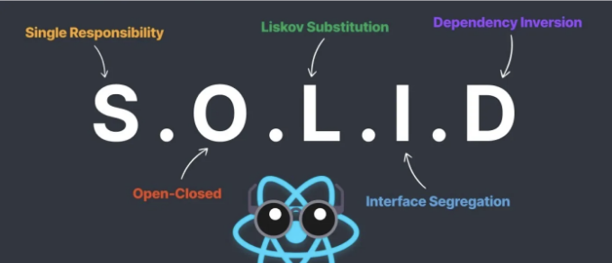
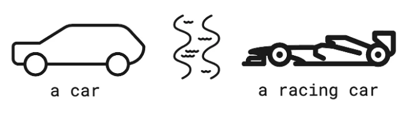

SOLID는 소프트웨어 디자인에서 중요한 다섯 가지 규칙의 그룹입니다. 이러한 규칙은 코드를 이해하기 쉽고 유연하며 유지할 수 있도록 돕습니다.



## 1. Single Responsibility Principle (SRP)

<!-- ui-log 수평형 -->
<ins class="adsbygoogle"
  style="display:block"
  data-ad-client="ca-pub-4877378276818686"
  data-ad-slot="9743150776"
  data-ad-format="auto"
  data-full-width-responsive="true"></ins>
<component is="script">
(adsbygoogle = window.adsbygoogle || []).push({});
</component>

우리 React/React Native 프로젝트에서 단일 책임 원칙 (SRP)을 준수하는 방법은 각 구성 요소가 애플리케이션에서 특정하고 명확히 정의된 목적을 가지도록 하는 것입니다. 예를 들어, 한 구성 요소가 특정 부분을 표시하거나 사용자 입력을 처리하거나 데이터를 가져오기 위해 API 호출을 수행하는 것과 같은 역할을 담당할 수 있습니다. 구성 요소를 단일하고 명확한 작업으로 제한함으로써 코드베이스의 가독성과 유지 관리성을 향상시킬 수 있습니다.

다음은 React 애플리케이션에서 단일 책임 원칙을 구현하는 일반 지침입니다:

- 구성 요소를 작고 한 가지 일만 하는 것으로 유지하세요: 구성 요소를 작고 집중된 상태로 유지하고 각각을 단 하나의 명확한 책임으로 할당하세요.
- 서로 다른 작업을 섞지 말기: 관련이 없는 작업을 하나의 구성 요소에 번들로 묶지 마세요. 예를 들어, 폼을 표시하는 데 담당하는 구성 요소는 목록 데이터를 가져오는 API 호출도 처리해서는 안 됩니다.
- 합성 사용하기: 작은 구성 요소들을 결합하여 재사용 가능한 UI 구성 요소를 만드세요. 이를 통해 개발자들은 복잡한 UI를 더 작고 관리하기 쉬운 부분으로 나눌 수 있으며, 애플리케이션의 다양한 부분에서 쉽게 재사용할 수 있습니다.
- Props와 상태를 현명하게 다루기: Props는 데이터와 액션을 자식 구성 요소로 전달하는 메신저 역할을 합니다. 반면에 상태는 구성 요소의 개인 메모처럼 고유한 정보를 보관합니다. 상태는 한 부분에만 한정되지 않는 정보를 담을 때 사용하세요.

<!-- ui-log 수평형 -->
<ins class="adsbygoogle"
  style="display:block"
  data-ad-client="ca-pub-4877378276818686"
  data-ad-slot="9743150776"
  data-ad-format="auto"
  data-full-width-responsive="true"></ins>
<component is="script">
(adsbygoogle = window.adsbygoogle || []).push({});
</component>

```js
import React, { useEffect, useState } from "react";
import { View, Text, Image } from "react-native";
import axios from "axios";


const ListItems = () => {
 const [listItems, setListItems] = useState([]);
 const [isLoading, setIsLoading] = useState(true);


 useEffect(() => {
   axios.get("https://.../listitems/").then((res) => {
       setListItems(res.data)
   }).catch(e => {
       errorToast(e.message);
   }).finally(() => {
       setIsLoading(false);
   })
 }, [])


 if (isLoading){
   return <Text>Loading...</Text>
 }


 return (
   <View>
       {listItems.map(item => {
           return (
               <View>
                    <Image src={uri:item.img} />
                    <Text>{item.name}</Text>
                    <Text>{item.description}</Text>
               </View>
           )
       })}
   </View>
 );
};


export default ListItems;
```

처음에는 코드가 잘 작성된 것처럼 보일 수 있습니다. 하지만 컴포넌트 정의를 심층적으로 살펴보면 일부 "문제"를 발견할 수 있습니다. ListItems 컴포넌트는 여러 역할을 수행합니다:

- 상태 관리
- 리스트 아이템 요청 및 가져오기 과정 처리
- 컴포넌트 렌더링

처음에는 전형적인 컴포넌트처럼 보일 수 있지만, SRP(단일 책임 원칙)에 따르면 할당된 책임보다 더 많은 책임을 다루고 있습니다.```

<!-- ui-log 수평형 -->
<ins class="adsbygoogle"
  style="display:block"
  data-ad-client="ca-pub-4877378276818686"
  data-ad-slot="9743150776"
  data-ad-format="auto"
  data-full-width-responsive="true"></ins>
<component is="script">
(adsbygoogle = window.adsbygoogle || []).push({});
</component>

그래서, 어떻게 더 좋게 만들 수 있을까요?

일반적으로, 컴포넌트 내부에 useEffect가 있는 경우, 해당 작업을 처리하고 useEffect를 컴포넌트 밖으로 유지할 수 있는 사용자 정의 훅을 만들 수 있습니다.

이 경우, 새 파일을 만들어 사용자 정의 훅을 만들겠습니다. 이 훅은 목록 데이터를 가져오고 상태를 관리하는 로직을 담당할 것입니다.

```js
import React, { useEffect, useState } from "react";
import axios from "axios";

const useFetchListItems = () => {
    const [listItems, setListItems] = useState([]);
    const [isLoading, setIsLoading] = useState(true);

    useEffect(() => {
        axios.get("https://.../listitems/").then((res) => {
            setListItems(res.data);
        }).catch(e => {
            errorToast(e.message);
        }).finally(() => {
            setIsLoading(false);
        });
    }, []);

    return { listItems, isLoading };
}
```

<!-- ui-log 수평형 -->
<ins class="adsbygoogle"
  style="display:block"
  data-ad-client="ca-pub-4877378276818686"
  data-ad-slot="9743150776"
  data-ad-format="auto"
  data-full-width-responsive="true"></ins>
<component is="script">
(adsbygoogle = window.adsbygoogle || []).push({});
</component>

상태 처리와 목록 항목 가져오기 작업을 분리함으로써 초기 컴포넌트는 크게 단순해지고 이해하기 쉬워집니다. 이제 컴포넌트의 유일한 책임은 정보를 표시하는 것뿐이므로 유지 관리 및 확장이 더 용이해졌습니다.

우리가 리팩토링하고 SRP와 호환되는 컴포넌트는 다음과 같이 보일 것입니다:

```js
import { useFetchListItems } from "hooks/useFetchListItems";

const ListItems = () => {
 const { listItems, isLoading } = useFetchListItems();

 if (isLoading){
   return <Text>로딩 중...</Text>
 }

 return (
   <View>
       {listItems.map(item => {
           return (
               <View>
                    <Image src={uri:item.img} />
                    <Text>{item.name}</Text>
                    <Text>{item.description}</Text>
               </View>
           )
       })}
   </View>
 );
};

export default ListItems;
```

그러나 새로운 훅을 자세히 살펴보면 두 가지 작업을 수행하고 있다는 것을 알 수 있습니다. 상태 관리와 목록 항목을 가져오는 작업을 모두 처리합니다. 그러므로 단일 책임 원칙에서 제안하는 것처럼 한 가지 작업만 하는 것과는 맞지 않는 것 같습니다.

<!-- ui-log 수평형 -->
<ins class="adsbygoogle"
  style="display:block"
  data-ad-client="ca-pub-4877378276818686"
  data-ad-slot="9743150776"
  data-ad-format="auto"
  data-full-width-responsive="true"></ins>
<component is="script">
(adsbygoogle = window.adsbygoogle || []).push({});
</component>

이 문제를 해결하기 위해, 목록 항목을 가져오는 로직을 분리할 수 있습니다. 간단하게 말해서, 새로운 파일인 api.js를 만들고 거기에서 목록 항목을 가져오는 코드를 이동하겠습니다:

```js
import axios from "axios";
import errorToast from "./errorToast";

const fetchListItems = () => {
 return axios
   .get("https://.../listitems/")
   .catch((e) => {
     errorToast(e.message);
   })
   .then((res) => res.data);
};
```

🎉 그리고 새로운 리팩토링된 커스텀 훅입니다:

```js
import { useEffect, useState } from "react";
import { fetchListItems } from "./api";

const useFetchListItems = () => {
 const [listItems, setListItems] = useState([]);
 const [isLoading, setIsLoading] = useState(true);

 useEffect(() => {
   fetchListItems()
     .then((listItems) => setListItems(listItems))
     .finally(() => setIsLoading(false));
 }, []);

 return { listItems, isLoading };
};
```

<!-- ui-log 수평형 -->
<ins class="adsbygoogle"
  style="display:block"
  data-ad-client="ca-pub-4877378276818686"
  data-ad-slot="9743150776"
  data-ad-format="auto"
  data-full-width-responsive="true"></ins>
<component is="script">
(adsbygoogle = window.adsbygoogle || []).push({});
</component>

간단하게 유지하는 것에 대해 이야기해 봐요. 단일 책임 원칙(SRP)을 따르면 코드를 조직화하고 실수를 방지할 수 있어요. 하지만 항상 쉬운 일은 아니에요. 파일 구조를 더 복잡하게 만들 수 있고, 계획을 세우는 데 추가적인 시간이 필요할 수 있어요.

예를 들어, 우리는 각 파일이 하나의 일을 하도록 만들어 구조를 약간 복잡하게 만들었지만 이는 원칙에 부합해요. 그러나 엄격하게 SRP를 지키는 것이 항상 최선은 아니에요. 때로는 코드에 복잡성을 갖는 것이 너무 복잡하게 만드는 것보다 나을 수도 있어요.

우리가 엄격히 SRP를 지키지 않아도 되는 상황이 있어요. 예를 들어:

- Form 구성 요소: 폼은 데이터 확인, 상태 관리, 정보 업데이트 등 여러 작업을 수행해요. 이러한 작업을 분리하면 다른 도구나 라이브러리를 사용할 때 코드가 혼란스러워질 수 있어요.
- 테이블 구성 요소: 테이블도 데이터 표시 및 사용자 상호작용 관리 등 다양한 작업을 처리해요. 이런 작업을 분리하면 코드가 더 혼란스러워질 수 있어요.

<!-- ui-log 수평형 -->
<ins class="adsbygoogle"
  style="display:block"
  data-ad-client="ca-pub-4877378276818686"
  data-ad-slot="9743150776"
  data-ad-format="auto"
  data-full-width-responsive="true"></ins>
<component is="script">
(adsbygoogle = window.adsbygoogle || []).push({});
</component>

## 2. 개방/폐쇄 원칙 (OCP)

- 확장 가능: 컴포넌트에 새로운 동작, 기능 및 기능을 추가할 수 있습니다. 이미 작동하는 방식을 변경할 필요 없이도 구성 요소에 새로운 기능을 추가할 수 있습니다.
- 수정 불가: React 컴포넌트를 만들고 구현한 후에는 필요한 경우가 아니면 소스 코드를 직접 조작하지 말아야 합니다.

다음의 기본 React Native 컴포넌트를 살펴보겠습니다:

```js
import React from 'react';

interface IListItem {
  title: string;
  image: string;
  isAuth: boolean;
  onClickMember: () => void;
  onClickGuest: () => void;
}

const ListItem: React.FC<IListItem> = ({ title, image, isAuth, onClickMember, onClickGuest }: IListItem) => {
  const handleMember = () => {
    // 어떤 로직
    onClickMember();
  };

  const handleGuest = () => {
    // 어떤 로직
    onClickGuest();
  };
  return (
    <View>
      <Image source={uri:image} />
      <Text>{title}</Text>
      {
      isAuth ? 
      <Button onClick={handleMember}>장바구니에 추가 +</Button>
      :
      <Button onClick={handleGuest}>모달 보기</button>
      }
    </View>
  );
};
```

<!-- ui-log 수평형 -->
<ins class="adsbygoogle"
  style="display:block"
  data-ad-client="ca-pub-4877378276818686"
  data-ad-slot="9743150776"
  data-ad-format="auto"
  data-full-width-responsive="true"></ins>
<component is="script">
(adsbygoogle = window.adsbygoogle || []).push({});
</component>

제가 보기에, 위에 있는 코드는 원칙에 맞지 않습니다. 인증 상태에 따라 다른 기능을 렌더링하여 원칙을 위반하고 있습니다.

다른 로직으로 다른 버튼을 렌더링하려면 이 코드 블록을 수정하는 것이 좋습니다:

```js
interface IButtonHandler {
  handle(): void;
}

export const GuestButtonHandler: React.FC<{ onClickGuest?: () => void }> = ({ onClickGuest }) => {
  const handle = () => {
    // 게스트용 로직
    onClickGuest();
  };

  return <Button onClick={handle}>모달 보기</Button>;
};

export const MemberButtonHandler: React.FC<{ onClickMember?: () => void }> = ({ onClickMember }) => {
  const handle = () => {
    // 회원용 로직
    onClickMember();
  };

  return <Button onClick={handle}>장바구니 추가 +</Button>;
};
```

```js
import React from 'react';

interface IListItem {
  title: string;
  image: string;
}

export const ListItem: React.FC<IListItem> = ({ title, image, children }) => {

  return (
    <View>
      <Image source={{ uri: image }} />
      <Text>{title}</Text>
      {children}
    </View>
  );
};

export default ListItem;
```

<!-- ui-log 수평형 -->
<ins class="adsbygoogle"
  style="display:block"
  data-ad-client="ca-pub-4877378276818686"
  data-ad-slot="9743150776"
  data-ad-format="auto"
  data-full-width-responsive="true"></ins>
<component is="script">
(adsbygoogle = window.adsbygoogle || []).push({});
</component>

그리고 마지막으로, 불필요한 코드를 제거하고 새로운 children이라는 속성을 생성하여 다른 구성 요소가 이를 자식으로 전달하여 이 구성 요소를 확장할 수 있도록 합니다.:

```js
import {ListItem} from "../index.tsx"
import {GuestButtonHandler, MemberButtonHandler} from "../handlers"

const App = () => {
  return (
    <ListItem title={item.title} image={item.image}>
      isAuth ? <MemberButtonHandler /> : <GuestButtonHandler />
    </ListItem>
  );
};

export default App
```

🎉 이제 ListItem 컴포넌트는 확장을 위해 열려 있고 수정을 위해 닫혀 있습니다. 더 효율적인 방법이 됐어요. 왜냐하면 이제 다양한 것을 보여 주기 위해 많은 props가 필요 없는 별도의 구성 요소를 만들었기 때문입니다. 필요한 특징을 가진 올바른 부분을 보여주기만 하면 됩니다. 또한, 구성 요소가 내부에서 많은 작업을 수행한다면, 단일 책임 원칙(SRP)을 어기게 될 수 있습니다. 그래서 이 새로운 방식은 코드를 정리하고 명확하게 유지할 수 있도록 도와줍니다.

## 3. Liskov Substitution Principle (LSP)

<!-- ui-log 수평형 -->
<ins class="adsbygoogle"
  style="display:block"
  data-ad-client="ca-pub-4877378276818686"
  data-ad-slot="9743150776"
  data-ad-format="auto"
  data-full-width-responsive="true"></ins>
<component is="script">
(adsbygoogle = window.adsbygoogle || []).push({});
</component>

특정 클래스의 서브클래스는 슈퍼클래스를 대체할 수 있어야 합니다. 그렇게 함으로써 어떤 기능도 깨지지 않아야 합니다.

예시:

만약 "RacingCar"가 "Car"의 서브클래스라면, "Car"의 인스턴스를 "RacingCar"로 대체할 수 있어야 합니다. 이 때 어떤 놀라운 점도 생기지 않아야 합니다. 즉, "RacingCar"는 "Car" 클래스에서 설정한 모든 기대치를 충족해야합니다.



<!-- ui-log 수평형 -->
<ins class="adsbygoogle"
  style="display:block"
  data-ad-client="ca-pub-4877378276818686"
  data-ad-slot="9743150776"
  data-ad-format="auto"
  data-full-width-responsive="true"></ins>
<component is="script">
(adsbygoogle = window.adsbygoogle || []).push({});
</component>

리액트에서 Liskov 대체 원칙(LSP)은 부모 구성 요소를 쉽게 대체할 수 있으면서도 자식 구성 요소처럼 똑같은 작업을 수행할 수 있는 능력에 관한 것입니다. 구성 요소가 다른 구성 요소를 사용하는 경우 이전과 마찬가지로 작동하여야 합니다.

이제 코드를 살펴보겠습니다:

```js
const SuccessButton = () => {
  return (
      <Text>Success</Text>
  );
};
```

그래서 SuccessButton 구성 요소를 만들고자 하지만 버튼 기능을 Text로 대체할 수 없으므로 이는 원칙을 위반합니다. 대신에 다음과 같이 그냥 버튼을 반환해야 합니다:

<!-- ui-log 수평형 -->
<ins class="adsbygoogle"
  style="display:block"
  data-ad-client="ca-pub-4877378276818686"
  data-ad-slot="9743150776"
  data-ad-format="auto"
  data-full-width-responsive="true"></ins>
<component is="script">
(adsbygoogle = window.adsbygoogle || []).push({});
</component>

```js
const SuccessButton = () => {
  return (
    <TouchableOpacity style={styles.button} onPress={onPress}>
      <Text>Success</Text>
    </TouchableOpacity>
  );
};
```

이 방법은 더 좋지만, 부족해요. 우리는 버튼 자체의 모든 기능을 상속해야 합니다:

```js
const SuccessButton = () => {
  return (
    <TouchableOpacity style={styles.button} onPress={onPress} {…props}>
      <Text>Success</Text>
    </TouchableOpacity>
  );
};
```

🎉 이제 버튼의 모든 속성을 상속했고, 이러한 속성을 새 버튼에 전달했어요. 또한 SuccessButton의 모든 인스턴스는 프로그램의 동작을 변경하지 않고 버튼의 인스턴스 자리에 여전히 사용할 수 있으며, Liskov 대체 원칙을 따릅니다.

<!-- ui-log 수평형 -->
<ins class="adsbygoogle"
  style="display:block"
  data-ad-client="ca-pub-4877378276818686"
  data-ad-slot="9743150776"
  data-ad-format="auto"
  data-full-width-responsive="true"></ins>
<component is="script">
(adsbygoogle = window.adsbygoogle || []).push({});
</component>

## 4. Interface Segregation Principle (ISP)


더 잘 이해하기 위해 예시로 파고들어 봅시다:

```jsx
const ListItem = ({item}) => {

  return (
    <View>
      <Image source={uri:item.image} />
      <Text>{item.title}</Text>
      <Text>{item.description}</Text>
    </View>
  );
};
```

<!-- ui-log 수평형 -->
<ins class="adsbygoogle"
  style="display:block"
  data-ad-client="ca-pub-4877378276818686"
  data-ad-slot="9743150776"
  data-ad-format="auto"
  data-full-width-responsive="true"></ins>
<component is="script">
(adsbygoogle = window.adsbygoogle || []).push({});
</component>

우리는 ListItem 컴포넌트가 item props로 부터 이미지, 제목, 설명과 같은 몇 가지 데이터만 필요로 한다는 것을 알고 있습니다. 그래서 ListItem을 props로 제공할 때, 컴포넌트가 실제로 필요로 하는 것보다 더 많은 것을 전달하게 될 수 있습니다. 왜냐하면 item props 자체가 컴포넌트가 필요로 하지 않는 데이터를 포함할 수 있기 때문입니다.

이 문제를 해결하기 위해 우리는 컴포넌트가 필요로 하는 것만 props로 제한할 수 있습니다.

```js
const ListItem = ({image, title, description}) => {

  return (
    <View>
      <Image source={{uri: image}} />
      <Text>{title}</Text>
      <Text>{description}</Text>
    </View>
  );
};
```

🎉 그리고 이제 우리의 컴포넌트는 ISP 원칙과 호환됩니다.

<!-- ui-log 수평형 -->
<ins class="adsbygoogle"
  style="display:block"
  data-ad-client="ca-pub-4877378276818686"
  data-ad-slot="9743150776"
  data-ad-format="auto"
  data-full-width-responsive="true"></ins>
<component is="script">
(adsbygoogle = window.adsbygoogle || []).push({});
</component>

## 5. 의존성 역전 원칙 (DIP)

React의 맥락에서, 이 원칙은 고수준 컴포넌트가 저수준 컴포넌트에 직접 의존하지 않도록하고, 둘 다 공통 추상화에 의존하도록합니다. 이 경우 "컴포넌트"는 React 컴포넌트, 함수, 모듈, 클래스 기반 컴포넌트 또는 서드파티 라이브러리와 같은 애플리케이션의 어떤 부분을 의미합니다. 예시를 통해 살펴보겠습니다:

```js
const CreateListItemForm = () => {
  const handleCreateListItemForm = async (e) => {
    try {
      const formData = new FormData(e.currentTarget);
      await axios.post("https://myapi.com/listItems", formData);
    } catch (err) {
      console.error(err.message);
    }
  };

  return (
    <form onSubmit={handleCreateListItemForm}>
      <input name="title" />
      <input name="description" />
      <input name="image" />
    </form>
  );
};
```

위의 컴포넌트는 폼을 렌더링하여 리스트 항목을 생성하는 처리를 다루는 양식을 나타냅니다. 제출된 데이터를 API로 전송하는 방식입니다.

<!-- ui-log 수평형 -->
<ins class="adsbygoogle"
  style="display:block"
  data-ad-client="ca-pub-4877378276818686"
  data-ad-slot="9743150776"
  data-ad-format="auto"
  data-full-width-responsive="true"></ins>
<component is="script">
(adsbygoogle = window.adsbygoogle || []).push({});
</component>

다음 시나리오를 고려해보세요. 동일한 UI를 가진 목록 항목 편집용 또 다른 양식이 있지만 로직(예: API 엔드포인트)만 다를 뿐입니다. 우리의 양식은 또 다른 엔드포인트가 필요하기 때문에 재사용할 수 없게 됩니다. 따라서 우리는 특정 저수준 모듈에 의존하지 않는 컴포넌트를 만들어야 합니다.

```js
const ListItemForm = ({ onSubmit }) => {
  return (
    <form onSubmit={onSubmit}>
      <input name="title" />
      <input name="description" />
      <input name="image" />
    </form>
  );
};
```

양식에서 의존성을 제거했으므로 이제 필요한 로직을 props를 통해 전달할 수 있습니다.

```js
const CreateListItemForm = () => {
  const handleCreateListItem = async (e) => {
    try {
      const formData = new FormData(e.currentTarget);
      await axios.post("https://myapi.com/listItems", formData);
    } catch (err) {
      console.error(err.message);
    }
  };
  return <ListItemForm onSubmit={handleCreateListItem} />;
};
```

<!-- ui-log 수평형 -->
<ins class="adsbygoogle"
  style="display:block"
  data-ad-client="ca-pub-4877378276818686"
  data-ad-slot="9743150776"
  data-ad-format="auto"
  data-full-width-responsive="true"></ins>
<component is="script">
(adsbygoogle = window.adsbygoogle || []).push({});
</component>

```js
const EditListItemForm = () => {
  const handleEditListItem = async (e) => {
    try {
      // 편집 로직
    } catch (err) {
      console.error(err.message);
    }
  };
  return <ListItemForm onSubmit={handleEditListItem} />;
};
```

이 단순화 및 DIP를 적용하면 각 구성 요소를 일부러 다른 관련 부분에 영향을 미치지 않도록 따로 테스트할 수 있습니다. 해당 사항이 없기 때문에. 


```

<!-- ui-log 수평형 -->
<ins class="adsbygoogle"
  style="display:block"
  data-ad-client="ca-pub-4877378276818686"
  data-ad-slot="9743150776"
  data-ad-format="auto"
  data-full-width-responsive="true"></ins>
<component is="script">
(adsbygoogle = window.adsbygoogle || []).push({});
</component>

```markdown

```