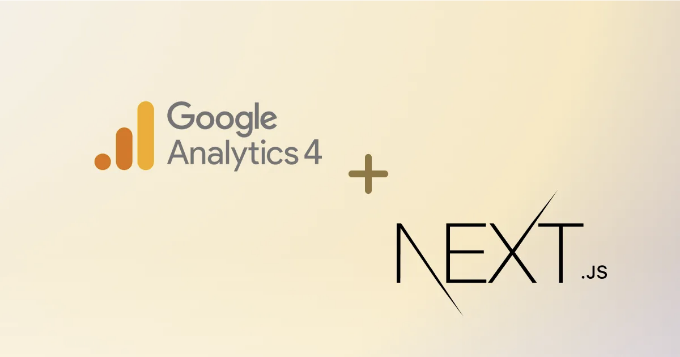
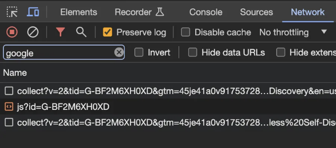
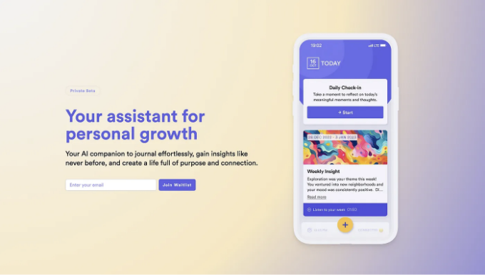

구글이 Google Analytics 4 (GA4)로 전환되었는데, Next.js 14 사이트에 설정할 때 react-ga4와 같은 널리 사용되는 npm 패키지를 위한 명확하고 실용적인 안내가 부족하다는 것을 알게 되었습니다. 이 공백을 채워보겠습니다!

# 업데이트: Next.js의 공식 컴포넌트를 선택하도록 업데이트하기

이 가이드를 게시한 후, redditor wplaga가 Google Analytics, Google Tag Manager 또는 Google Maps와 같은 서비스를 Next.js 프로젝트에 통합하기 위해 react-ga4를 사용하는 대안을 강조했습니다. Next.js는 서드파티 통합을 처리하는 데 특별히 설계된 공식 컴포넌트를 제공하며, 더 직접적이고 신뢰할 수 있는 방법을 제공합니다. 이 접근 방식은 많은 면에서 react-ga4 방법을 따르지만 Next.js 생태계 내에서 네이티브 솔루션이라는 장점이 있습니다. react-ga4 접근 방식에 관심이 있거나 이해를 넓히려는 경우, 다음 섹션에서 다루겠습니다. 그러나 Next.js의 자체 도구를 사용하는 더 간단한 방법을 선호하는 경우 아래 내용을 참조하세요:

<!-- ui-log 수평형 -->
<ins class="adsbygoogle"
  style="display:block"
  data-ad-client="ca-pub-4877378276818686"
  data-ad-slot="9743150776"
  data-ad-format="auto"
  data-full-width-responsive="true"></ins>
<component is="script">
(adsbygoogle = window.adsbygoogle || []).push({});
</component>

시작하려면 @next/third-parties 라이브러리를 설치해주세요:

```js
yarn add @next/third-parties@latest next@latest
```

중요 공지: next/third-parties의 최신 버전(14.0.4)은 Google Analytics 구성 요소의 내보내기가 누락되어 있습니다. "Unsupported Server Component type: undefined" 오류가 발생할 수 있습니다. 이 문제는 패키지의 최신 캐너리 릴리즈에서 수정되었습니다. 이슈 확인 바랍니다. 아래 명령어로 설치하실 수 있습니다:

```js
yarn add @next/third-parties@14.0.5-canary.38
```

<!-- ui-log 수평형 -->
<ins class="adsbygoogle"
  style="display:block"
  data-ad-client="ca-pub-4877378276818686"
  data-ad-slot="9743150776"
  data-ad-format="auto"
  data-full-width-responsive="true"></ins>
<component is="script">
(adsbygoogle = window.adsbygoogle || []).push({});
</component>

시작해봅시다. 여러분의 응용 프로그램 전체 루트에 Google Analytics를 적용하려면 Next.js Third-Party Google Analytics 컴포넌트를 루트 레이아웃에 통합하면 됩니다. 단순히 측정 ID를 제공하면 됩니다. 그럼 이제 시작할 준비가 된 거죠. 이 방법은 Google Analytics를 Next.js 프로젝트에 효율적으로 통합하는 직접적이고 잘 지원되는 방법을 제공합니다.

```js
// src/app/layout.js

import { GoogleAnalytics } from '@next/third-parties/google'
 
export default function RootLayout({ children }) {
  return (
    <html lang="en">
      <body>{children}</body>
      <GoogleAnalytics gaId="G-XYZ" />
    </html>
  )
}
```

이제 페이지 뷰가 추적되고 있습니다. 특정 경로에 Google Analytics를 로드하려면 페이지에 컴포넌트를 포함시키면 됩니다.

사용자 상호작용을 클라이언트 컴포넌트에서 이벤트로 추적하려면 `sendGAEvent` 함수를 사용하면 됩니다. dataLayer 객체를 사용하여 이벤트를 전송합니다. 이 함수가 작동하려면 `GoogleAnalytics` 컴포넌트가 부모 레이아웃, 페이지, 컴포넌트 중 하나에 포함되어 있거나 직접 같은 파일에 포함되어 있어야 합니다.

<!-- ui-log 수평형 -->
<ins class="adsbygoogle"
  style="display:block"
  data-ad-client="ca-pub-4877378276818686"
  data-ad-slot="9743150776"
  data-ad-format="auto"
  data-full-width-responsive="true"></ins>
<component is="script">
(adsbygoogle = window.adsbygoogle || []).push({});
</component>

```js
// 당신이 개발하고 있는 컴포넌트 중 하나, 예를 들어:
// src/components/EventButton.jsx

'use client'
 
import { sendGAEvent } from '@next/third-parties/google'
 
export function EventButton() {
  return (
    <div>
      <button
        onClick={() => sendGAEvent({ event: 'buttonClicked', value: 'xyz' })}
      >
        Send Event
      </button>
    </div>
  )
}
```

여기까지 입니다. Google Tag Manager 또는 Google Maps에 대한 전체 가이드와 설명은 여기에서 찾을 수 있습니다: https://nextjs.org/docs/app/building-your-application/optimizing/third-party-libraries#google-analytics

# react-ga4 사용 — 시작하기.

당신이 Google Analytics 계정, 생성된 속성, 그리고 측정 ID를 가지고 있다고 상정합니다. 또한 추적할 준비가 된 작동 중인 Next.js 또는 React 사이트를 가지고 있어야 합니다. 우리는 바로 Google Analytics 4 설정으로 넘어갈 것입니다.

<!-- ui-log 수평형 -->
<ins class="adsbygoogle"
  style="display:block"
  data-ad-client="ca-pub-4877378276818686"
  data-ad-slot="9743150776"
  data-ad-format="auto"
  data-full-width-responsive="true"></ins>
<component is="script">
(adsbygoogle = window.adsbygoogle || []).push({});
</component>

# 목표: SSR 호환, Google Analytics 4를 활용한 유연한 이벤트 추적

우리의 목표는 간단합니다: Google Analytics 스크립트로 인해 사이트가 느려지지 않으면서 서버 측 렌더링(SSR)을 활용하고 다양한 구성 요소 간에 이벤트 추적이 가능한 사이트를 원합니다.

먼저 react-ga4를 설치해봅시다. 해당 패키지는 react-ga의 후속 제품입니다. 설치 과정은 간단합니다.

```js
yarn add react-ga4
```

<!-- ui-log 수평형 -->
<ins class="adsbygoogle"
  style="display:block"
  data-ad-client="ca-pub-4877378276818686"
  data-ad-slot="9743150776"
  data-ad-format="auto"
  data-full-width-responsive="true"></ins>
<component is="script">
(adsbygoogle = window.adsbygoogle || []).push({});
</component>

다음으로, Google Analytics를 초기화하는 함수와 이벤트를 추적하는 함수 두 가지를 보관할 유틸리티 파일을 만들 것입니다. 저는 /src/utilities/google-analytics.js 파일에 어떻게 설정했는지 알려드리겠습니다:

```js
// /src/utilities/google-analytics.js

import ReactGA from "react-ga4";

const initializeGA = () => {
  // 여러분의 Measurement ID로 교체해주세요
  // 가능하다면 환경 변수에서 가져와야 합니다
  ReactGA.initialize("여러분의_MEASUREMENT_ID");
  // 작업이 끝난 후에는 console.log() 문을 제거하는 것을 잊지 마세요
  console.log("GA가 초기화되었습니다");
};

const trackGAEvent = (category, action, label) => {
  console.log("GA 이벤트:", category, ":", action, ":", label);
  // GA4 이벤트 발송
  ReactGA.event({
    category: category,
    action: action,
    label: label,
  });
};

export default initializeGA;
export { initializeGA, trackGAEvent };
```

이제 페이지가 로딩될 때 initializeGA() 함수를 호출해야 합니다. Next.js 14에서는 페이지가 SSR을 사용하기 때문에 페이지를 느리게 만들고 싶지 않습니다. 따라서 클라이언트 컴포넌트를 사용할 것입니다. 이 컴포넌트에서 useEffect를 사용하여 Google Analytics를 초기화할 것입니다. 또한 Google Analytics가 초기화되었는지 윈도우 컨텍스트에 표시하도록 할 것입니다. 이 컴포넌트를 메인 페이지 구조에서 가져올 수 있습니다.

```js
// /src/components/GoogleAnalytics.jsx

"use client";

import { useEffect } from "react";
import { initializeGA } from "@/utils/GoogleAnalytics";

export default function GoogleAnalytics() {
  useEffect(() => {
    if (!window.GA_INITIALIZED) {
      initializeGA();
      window.GA_INITIALIZED = true;
    }
  }, []);
}
```

<!-- ui-log 수평형 -->
<ins class="adsbygoogle"
  style="display:block"
  data-ad-client="ca-pub-4877378276818686"
  data-ad-slot="9743150776"
  data-ad-format="auto"
  data-full-width-responsive="true"></ins>
<component is="script">
(adsbygoogle = window.adsbygoogle || []).push({});
</component>

메인 페이지 파일(예: page.jsx, _app.jsx 등)에 다음 내용을 포함하세요:

```js
// /src/app/page.jsx

import GoogleAnalytics from "@/components/GoogleAnalytics";

export default async function Home() {
  return (
    <div className="bg-white">
      {/* 컴포넌트를 최상단에 바로 import하세요 */}
      <GoogleAnalytics />
      
      <Header />
      <main>
        {/* 페이지 디자인에 따라 내용을 채워넣으세요 */}
      </main>
      <Footer />
    </div>
  );
}
```

# 페이지 뷰 확인하기

브라우저 개발자 도구의 네트워크 탭에서 "google"로 필터링하여 페이지 뷰가 추적되는지 확인하거나 Google Analytics 디버거 확장 프로그램을 사용하여 확인하세요.

<!-- ui-log 수평형 -->
<ins class="adsbygoogle"
  style="display:block"
  data-ad-client="ca-pub-4877378276818686"
  data-ad-slot="9743150776"
  data-ad-format="auto"
  data-full-width-responsive="true"></ins>
<component is="script">
(adsbygoogle = window.adsbygoogle || []).push({});
</component>



# 이벤트 추적 설정하기

이벤트 추적을 위해 우리가 설정한 유틸리티 파일에서 trackGAEvents를 import하고, 이벤트 카테고리, 액션, 라벨을 정의하면 준비 끝!

```js
// /src/components/MyForm.jsx

"use client";

import { trackGAEvent } from "@/utils/GoogleAnalytics";

export default function MyForm({ className }) {
  // trackGAEvent 함수를 어떻게 사용하는지 보여주기 위한 더미 컴포넌트
  // 원하는 곳에서 이벤트를 추적하고 싶을 때 함수 호출에 사용할 수 있습니다
  function handleSubmit(event) {
    trackGAEvent("내 카테고리", "내 액션", "내 라벨");
    // 실제 폼 제출 처리를 여기서 처리합니다
  }

  return (
    <form className={className} action={handleSubmit}>
      <input type="text" placeholder="이름" />
      <input type="email" placeholder="이메일" />
      <button type="submit">제출</button>
    </form>
  );
}
```

<!-- ui-log 수평형 -->
<ins class="adsbygoogle"
  style="display:block"
  data-ad-client="ca-pub-4877378276818686"
  data-ad-slot="9743150776"
  data-ad-format="auto"
  data-full-width-responsive="true"></ins>
<component is="script">
(adsbygoogle = window.adsbygoogle || []).push({});
</component>


# 여기까지입니다! 행복한 느낌을 받았으면 좋겠네요, 그리고...

이 안내서가 여러분의 Next.js 프로젝트에 Google Analytics 4를 원활하게 통합하는 데 도움이 되기를 바랍니다. 그리고 이 글이 유용했다면, 저가 작업 중인 프로젝트인 'layers'도 확인해보세요. 이 프로젝트는 인공지능이 적용된 일기 작성 동반자로, 여러분의 글을 자동으로 행동가능한 통찰로 변환하고 균형 잡힌, 스스로 결정할 수 있는 삶을 살도록 돕습니다.

마치 언제든 여러분이 삶, 생각, 문제에 대해 반성할 수 있도록 도와주는 코치가 있는 것처럼, 자세한 주간 보고서와 심지어 맞춤형 팟캐스트도 제공합니다. 한 번 시도해 보고 일기 작성 경험을 향상시켜 보세요 🙂

<!-- ui-log 수평형 -->
<ins class="adsbygoogle"
  style="display:block"
  data-ad-client="ca-pub-4877378276818686"
  data-ad-slot="9743150776"
  data-ad-format="auto"
  data-full-width-responsive="true"></ins>
<component is="script">
(adsbygoogle = window.adsbygoogle || []).push({});
</component>

