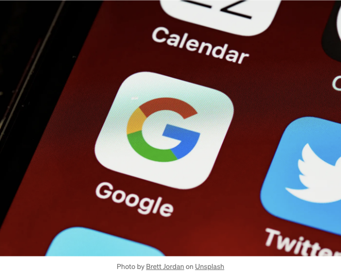

수파베이스 문서는 좋지만, 서버 측 렌더링에서 Google 인증을 구현하거나 Next.js 프로젝트 내에서 서버 컴포넌트 내에서 작업할 때 몇 가지 어려움을 겪었습니다. 몇 시간 동안의 연구 끝에 해결책을 찾았고, 여러분도 같은 문제를 겪지 않기를 바랍니다.

여기 계시니까, 이미 Next.js 또는 React 프로젝트를 설정하고 Google 인증에 대한 난제를 극복하는 방법을 알고 싶어하는 것으로 가정하겠습니다. 시작합시다. 프로젝트를 시작하지 않았다면, 여기 Next.js 프로젝트를 설정하는 링크가 있습니다.

# Next.js 설정하기

<!-- ui-log 수평형 -->
<ins class="adsbygoogle"
  style="display:block"
  data-ad-client="ca-pub-4877378276818686"
  data-ad-slot="9743150776"
  data-ad-format="auto"
  data-full-width-responsive="true"></ins>
<component is="script">
(adsbygoogle = window.adsbygoogle || []).push({});
</component>

# Supabase를 이용한 Next.js를 위한 서버 측 인증 설정하기

먼저, Supabase를 사용하여 Next.js에 대한 서버 측 인증 설정하는 방법에 익숙해져야 합니다:

이제 실행 세부 정보로 들어가 봅시다:

## 단계 1: 콜백 라우트 구성

<!-- ui-log 수평형 -->
<ins class="adsbygoogle"
  style="display:block"
  data-ad-client="ca-pub-4877378276818686"
  data-ad-slot="9743150776"
  data-ad-format="auto"
  data-full-width-responsive="true"></ins>
<component is="script">
(adsbygoogle = window.adsbygoogle || []).push({});
</component>

/app/auth/callback/route.ts 파일에 다음 코드를 추가해주세요:

```js
/app/auth/callback/route.ts

import { cookies } from "next/headers";
import { NextResponse } from "next/server";
import { type CookieOptions, createServerClient } from "@supabase/ssr";

export async function GET(request: Request) {
  const { searchParams, origin } = new URL(request.url);
  const code = searchParams.get("code");
  // "next" 값이 있는 경우 리디렉션 URL로 사용
  const next = searchParams.get("next") ?? "/";

  if (code) {
    const cookieStore = cookies();
    const supabase = createServerClient(
      process.env.NEXT_PUBLIC_SUPABASE_URL!,
      process.env.NEXT_PUBLIC_SUPABASE_ANON_KEY!,
      {
        cookies: {
          get(name: string) {
            return cookieStore.get(name)?.value;
          },
          set(name: string, value: string, options: CookieOptions) {
            cookieStore.set({ name, value, ...options });
          },
          remove(name: string, options: CookieOptions) {
            cookieStore.delete({ name, ...options });
          },
        },
      },
    );
    const { error } = await supabase.auth.exchangeCodeForSession(code);
    if (!error) {
      return NextResponse.redirect(`${origin}${next}`);
    }
  }

  // 사용자를 오류 페이지로 이동시킵니다.
  return NextResponse.redirect(`${origin}/auth/auth-code-error`);
}
```

## 단계 2: Google 인증 동작 구현

action.ts 파일에 다음 코드를 추가하세요.

<!-- ui-log 수평형 -->
<ins class="adsbygoogle"
  style="display:block"
  data-ad-client="ca-pub-4877378276818686"
  data-ad-slot="9743150776"
  data-ad-format="auto"
  data-full-width-responsive="true"></ins>
<component is="script">
(adsbygoogle = window.adsbygoogle || []).push({});
</component>

```js
"use server";

import { createClient } from "@/utils/supabase/server";

export async function signInWithGoogle() {
  const supabase = await createClient();

  const { data, error } = await supabase.auth.signInWithOAuth({
    provider: "google",
    options: {
      // 배포된 애플리케이션으로 이동시에 "http://localhost:3000"을 대체해주세요
      redirectTo: "http://localhost:3000/auth/callback",
    },
  });

  if (data?.url) {
    console.log(data);
    return redirect(data.url);
  }
}
```

## 단계 3: 로그인 양식 업데이트

로그인 양식 컴포넌트에서 Google 로그인을 포함하도록 업데이트하십시오:

```js
//참고: 이것은 서버 컴포넌트로 내보낼 수 있는 클라이언트 컴포넌트입니다

"use client"

import { signInWithGoogle } from "@/app/lib/actions";
import { useFormStatus } from "react-dom";
import { FcGoogle } from "react-icons/fc";
import toast from "react-hot-toast";
import Link from "next/link";


function GoogleSignInButton () {
  const { pending } = useFormStatus();

  async function handleSignInGoogle() {
    try {
      await signInWithGoogle();
      toast.success("Google로 로그인 중")
    } catch (error) {
      toast.error("Google 로그인 중 오류 발생")
    }
  }

  return (
    <div
      formAction={handleSignInGoogle}
      className="flex cursor-pointer items-center justify-center gap-2"
     >
      <FcGoogle className="text-2xl" />
       {pending ? "로딩 중 ...." : <p className="text-center text-green-500">Google로 로그인</p>}
    </div>
  )
}

export default function LoginForm() {
  return (
    <div className="mt-10 flex flex-col rounded-lg bg-white p-5 shadow-xl w-[30rem] md:p-10">
      //다른 로그인 옵션
      ...

      <GoogleSignInButton />
      
     </div>
   
  );
}
```

<!-- ui-log 수평형 -->
<ins class="adsbygoogle"
  style="display:block"
  data-ad-client="ca-pub-4877378276818686"
  data-ad-slot="9743150776"
  data-ad-format="auto"
  data-full-width-responsive="true"></ins>
<component is="script">
(adsbygoogle = window.adsbygoogle || []).push({});
</component>

축하합니다! 당신은 Next.js와 함께 Supabase 구글 인증을 성공적으로 설정했습니다. 다음에 만날 때까지 즐거운 코딩 하시고 즐거운 삶 되세요!