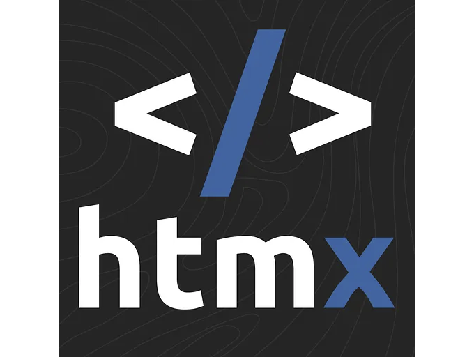

다음 웹 개발 프로젝트에서 HTMX와 React 중 어떤 것을 선택할지 고르는 것은 그들 사이의 개념적 차이뿐만 아니라 실제 작동 방식도 이해해야 합니다. 아래에서는 두 기술을 더 깊이 파헤쳐 예시를 통해 각각이 웹 개발 프로젝트를 향상시키는 데 어떻게 활용될 수 있는지 보여드리겠습니다.

## HTMX와 React 소개

HTMX는 HTML의 본연적인 기능을 활용하여 웹 상호작용을 간소화하는 접근 방식으로 주목받고 있습니다. 이는 JavaScript를 많이 필요로 하지 않고 동적 콘텐츠 로딩 및 페이지 업데이트를 가능케 하여 웹 개발을 보다 접근성 있고 빠르게 만듭니다.

<!-- ui-log 수평형 -->
<ins class="adsbygoogle"
  style="display:block"
  data-ad-client="ca-pub-4877378276818686"
  data-ad-slot="9743150776"
  data-ad-format="auto"
  data-full-width-responsive="true"></ins>
<component is="script">
(adsbygoogle = window.adsbygoogle || []).push({});
</component>

Meta가 개발한 React는 구성 요소 기반의 아키텍처로 유명합니다. 개발자들이 쉽게 높은 반응성과 복잡한 웹 애플리케이션을 구축할 수 있도록 합니다. React의 광범위한 생태계와 커뮤니티 지원으로 인해, 그것은 가장 인기 있는 프론트엔드 라이브러리 중 하나가 되었습니다.

## 실용적인 예제

HTMX와 React의 실용적인 응용 사례를 이해하기 위해 블로그 글의 댓글을 새로 고치지 않고 로드하는 기능을 만드는 방법을 살펴보겠습니다.

HTMX 예제: 댓글 로드하기

<!-- ui-log 수평형 -->
<ins class="adsbygoogle"
  style="display:block"
  data-ad-client="ca-pub-4877378276818686"
  data-ad-slot="9743150776"
  data-ad-format="auto"
  data-full-width-responsive="true"></ins>
<component is="script">
(adsbygoogle = window.adsbygoogle || []).push({});
</component>

HTMX를 사용하면 복잡한 JavaScript를 작성하지 않고도 간단한 코드로이 기능을 구현할 수 있습니다. 아래는 간단한 예제입니다:

HTML:

```js
<button hx-get="/comments" hx-target="#comments-section" hx-trigger="click">
  Load Comments
</button>
<div id="comments-section"></div>
```

- hx-get="/comments": 버튼을 클릭하면 HTMX에게 /comments URL로 GET 요청을 수행하도록 지시합니다.
- hx-target="#comments-section": GET 요청의 응답(HTML 형식으로 예상)은 comments-section이라는 ID를 가진 요소에 삽입됩니다.
- hx-trigger="click": 이벤트를 정의하여 GET 요청을 트리거합니다. 이 경우에는 버튼 클릭이 해당 이벤트입니다.

<!-- ui-log 수평형 -->
<ins class="adsbygoogle"
  style="display:block"
  data-ad-client="ca-pub-4877378276818686"
  data-ad-slot="9743150776"
  data-ad-format="auto"
  data-full-width-responsive="true"></ins>
<component is="script">
(adsbygoogle = window.adsbygoogle || []).push({});
</component>

이 예제는 HTMX를 사용하여 HTML 속성을 통해 인터랙티브 콘텐츠를 직접로드하도록 허용하기 때문에 HTML에 익숙한 개발자들에게 매우 간단합니다.

React 예제: 댓글 로딩

React에서 동일한 기능을 달성하려면 컴포넌트 기반 아키텍처와 상태 및 이벤트 처리를 위해 JavaScript를 사용하는 점 때문에 조금 더 설정이 필요합니다.

```js
import React, { useState } from 'react';

function CommentsLoader() {
  const [comments, setComments] = useState(null);

  const loadComments = async () => {
    const response = await fetch('/comments');
    const commentsData = await response.text();
    setComments(commentsData);
  };

  return (
    <div>
      <button onClick={loadComments}>댓글 로드</button>
      <div id="comments-section">{comments}</div>
    </div>
  );
}

export default CommentsLoader;
```

<!-- ui-log 수평형 -->
<ins class="adsbygoogle"
  style="display:block"
  data-ad-client="ca-pub-4877378276818686"
  data-ad-slot="9743150776"
  data-ad-format="auto"
  data-full-width-responsive="true"></ins>
<component is="script">
(adsbygoogle = window.adsbygoogle || []).push({});
</component>

- useState 훅은 댓글 상태를 초기화합니다.
- loadComments 함수는 버튼을 클릭할 때 댓글을 가져와서 가져온 데이터로 댓글 상태를 업데이트합니다.
- 컴포넌트는 loadComments를 트리거하는 버튼을 렌더링하며, 가져온 댓글을 div 안에 렌더링합니다.

## 선택하는 방법

HTMX를 선택하는 경우:

- 간단한 중간 수준의 상호 작용이 필요한 프로젝트에 적합합니다.
- 무거운 JavaScript 사용을 피하고 프로젝트를 가볍게 유지하고 싶을 때.
- 빠른 개발과 사용 편의성이 중요한 경우, 특히 HTML에 뛰어난 백그라운드를 가진 개발자들에게 적합합니다.

<!-- ui-log 수평형 -->
<ins class="adsbygoogle"
  style="display:block"
  data-ad-client="ca-pub-4877378276818686"
  data-ad-slot="9743150776"
  data-ad-format="auto"
  data-full-width-responsive="true"></ins>
<component is="script">
(adsbygoogle = window.adsbygoogle || []).push({});
</component>

리액트를 선택하는 경우:

- 복잡한 단일 페이지 애플리케이션(SPAs)을 구축할 때 또는 견고한 상태 관리 시스템이 필요한 경우.
- 구성 요소 재사용성을 향상시키는 대규모 응용 프로그램을 개발하는 경우.
- JavaScript와 현대적인 프런트엔드 개발 관행에 익숙한 개발팀이 있는 경우.

HTMX와 리액트는 모두 웹 개발에 대한 독특한 장점을 제공합니다. HTMX는 프로세스를 간소화하여 JavaScript에 깊게 들어가지 않고 HTML의 기능을 향상시키려는 개발자들과 간단한 작업에 이상적입니다. 반면 구성 요소 기반 아키텍처를 가진 리액트는 복잡하고 동적인 웹 애플리케이션을 만드는 데 더 적합합니다.

제공된 예제를 통해 HTMX와 리액트 중 어떤 기술을 선택해야 하는지는 프로젝트의 복잡성, 팀의 전문지식 및 특정 개발 요구 사항에 따라 달라집니다. HTMX의 간결함과 직접성 또는 강력하고 확장 가능한 리액트 중 어느 쪽을 선택하든 효율적이고 상호작용성 있는 웹 애플리케이션을 구축하는 데 도움이 될 것입니다.

<!-- ui-log 수평형 -->
<ins class="adsbygoogle"
  style="display:block"
  data-ad-client="ca-pub-4877378276818686"
  data-ad-slot="9743150776"
  data-ad-format="auto"
  data-full-width-responsive="true"></ins>
<component is="script">
(adsbygoogle = window.adsbygoogle || []).push({});
</component>

행복한 코딩! 🚀

# 간단한 영어로 🚀

In Plain English 커뮤니티에 참여해 주셔서 감사합니다! 계속하기 전에:

- 작가를 박수와 팔로우 해주세요 ️👏️️
- 팔로우하기: X | LinkedIn | YouTube | Discord | 뉴스레터
- 다른 플랫폼 방문하기: Stackademic | CoFeed | Venture | Cubed
- PlainEnglish.io에서 더 많은 콘텐츠 확인하기