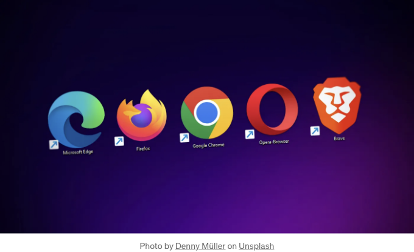

## React 애플리케이션에서 브라우저 새로고침 이벤트를 다루어 데이터 무결성을 유지하고 사용자 경험을 향상시키해 보세요. 사용자 상호작용을 효과적으로 다루는 기술을 개선하기 위해 다양한 시나리오를 계속해서 학습하고 실험해보세요.

React 애플리케이션에서는 브라우저 새로고침 이벤트를 적절하게 처리하여 부드러운 사용자 경험을 보장하고 애플리케이션 상태를 유지하는 것이 중요합니다. 이 글에서는 React에서 브라우저 새로고침 이벤트를 식별하는 최상의 방법과 피해야 할 일반적인 함정을 알아보겠습니다. React 코드 조각을 사용한 구현을 보여주고 그 흐름을 설명하는 예시를 제공할 것입니다. 함께 알아보세요!



## 브라우저 새로고침 식별하기:

<!-- ui-log 수평형 -->
<ins class="adsbygoogle"
  style="display:block"
  data-ad-client="ca-pub-4877378276818686"
  data-ad-slot="9743150776"
  data-ad-format="auto"
  data-full-width-responsive="true"></ins>
<component is="script">
(adsbygoogle = window.adsbygoogle || []).push({});
</component>

React에서 브라우저 새로고침 이벤트를 식별하려면 beforeunload 이벤트를 사용할 수 있어요. 이 이벤트는 사용자가 페이지를 떠나거나 새로고침하려고 시도할 때 트리거됩니다. 이 이벤트를 처리함으로써 우리는 개입하여 사용자에게 확인 메시지를 표시하고, 새로고침을 진행할지 또는 취소할지 선택하게 할 수 있어요.

## React에서의 예시 구현:

```js
import React, { useEffect } from 'react';
const MyComponent = () => {
  useEffect(() => {
    const handleBeforeUnload = (event) => {
      event.preventDefault();
      // 새로고침 처리를 위한 사용자 정의 로직
      // 확인 메시지 표시 또는 필요한 작업 수행
    };
    window.addEventListener('beforeunload', handleBeforeUnload);
    return () => {
      window.removeEventListener('beforeunload', handleBeforeUnload);
    };
  }, []);
  return <div>나의 컴포넌트</div>;
};
```

## 코드 흐름 설명:

<!-- ui-log 수평형 -->
<ins class="adsbygoogle"
  style="display:block"
  data-ad-client="ca-pub-4877378276818686"
  data-ad-slot="9743150776"
  data-ad-format="auto"
  data-full-width-responsive="true"></ins>
<component is="script">
(adsbygoogle = window.adsbygoogle || []).push({});
</component>

- 우리는 MyComponent라는 기능성 컴포넌트를 정의합니다.
- 컴포넌트 내부에서 useEffect 훅을 사용하여 beforeunload 이벤트 리스너를 설정합니다.
- beforeunload 이벤트가 발생하면 handleBeforeUnload 함수가 호출됩니다.
- 이벤트의 기본 동작인 페이지 새로고침을 막기 위해 event.preventDefault()를 호출합니다.
- handleBeforeUnload 함수 내부에는 확인 메시지 표시 또는 필요한 작업 수행과 같은 사용자 정의 로직을 추가할 수 있습니다.
- useEffect 훅의 정리 함수 내에서, 메모리 누수를 방지하기 위해 beforeunload 이벤트 리스너를 제거합니다.

## Best Practices:

- beforeunload 이벤트 사용:
beforeunload 이벤트에 리스너를 등록하여 브라우저 새로고침 이벤트를 효과적으로 감지하세요. 이 이벤트는 주요 브라우저에서 지원되며 새로고침 동작을 가로챌 수 있는 신뢰할 수 있는 방법을 제공합니다.
- 기본 동작 방지:
beforeunload 이벤트 핸들러 내에서 event.preventDefault()를 호출하여 새로고침 프로세스를 중지하세요. 이렇게 하면 브라우저의 기본 동작인 페이지 새로고침이 방지되며 사용자에게 확인 메시지를 표시하거나 사용자 정의 로직을 실행할 수 있습니다.
- 이벤트 리스너 정리:
메모리 누수를 방지하기 위해 컴포넌트의 정리 함수에서 beforeunload 이벤트 리스너를 제거하는 것을 잊지 마세요. 이렇게 하면 컴포넌트가 언마운트될 때 이벤트 리스너가 제거됩니다.

## 피해야 할 일반적인 함정:

<!-- ui-log 수평형 -->
<ins class="adsbygoogle"
  style="display:block"
  data-ad-client="ca-pub-4877378276818686"
  data-ad-slot="9743150776"
  data-ad-format="auto"
  data-full-width-responsive="true"></ins>
<component is="script">
(adsbygoogle = window.adsbygoogle || []).push({});
</component>

- beforeunload 이벤트 남용 방지: beforeunload 이벤트 핸들러 내에서 사용자 정의 로직을 구현할 때 주의하세요. 이 이벤트에서 모든 작업을 신뢰할 수 없고 일부 브라우저 제한 사항이 적용될 수 있음을 염두에 두세요.
- 확인 메시지 과용: 확인 메시지는 중요한 데이터 손실 방지에 유용할 수 있지만, 확인 대화 상자를 과도하게 사용하면 사용자 경험에 부정적인 영향을 줄 수 있습니다. 적절한 시기에 대체 접근 방법을 고려하여 신중하게 사용하세요.

## 요약:

React에서 브라우저 새로고침 이벤트를 처리하는 것은 애플리케이션 상태 유지와 부드러운 사용자 경험 제공에 필수적입니다. 이 기사에서 제시된 모베스트 프랙티스를 따르고 피해야 할 일반적인 장애물을 이해함으로써, 브라우저 새로고침 이벤트를 효과적으로 식별하고 애플리케이션 요구에 맞게 동작을 사용자 정의할 수 있습니다. 일관된 동작을 보장하기 위해 다양한 브라우저에서 구현을 철저히 테스트하도록 기억하세요. 즐거운 코딩 되세요!

위 기사가 더 나은 이해를 제공했기를 희망합니다. 글에서 논의한 부분에 대한 질문이나 개선 사항이 있으면 언제든지 댓글을 남겨주세요.