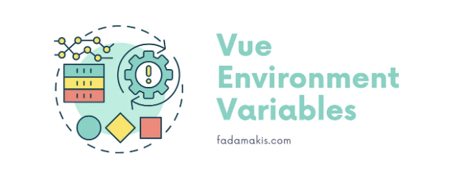

Vue는 널리 사용되는 dotenv 모듈을 사용하여 환경 디렉토리에서 다음 파일에서 빌드 구성을 로드합니다:

```js
.env                # 항상 로드됨
.env.local          # 항상 로드됨, git에서 무시됨
.env.[mode]         # 지정된 모드에서만 로드됨
.env.[mode].local   # 지정된 모드에서만 로드됨, git에서 무시됨
```

각 파일은 다음 형식을 가지고 있습니다.

<!-- ui-log 수평형 -->
<ins class="adsbygoogle"
  style="display:block"
  data-ad-client="ca-pub-4877378276818686"
  data-ad-slot="9743150776"
  data-ad-format="auto"
  data-full-width-responsive="true"></ins>
<component is="script">
(adsbygoogle = window.adsbygoogle || []).push({});
</component>

```js
VITE_SOME_KEY=123
DB_PASSWORD=secret
```

VITE_ 접두사가있는 모든 것은 import.meta.env 내의 클라이언트 애플리케이션에서 자동으로 사용할 수 있습니다.

```js
<script setup>
console.log(import.meta.env.VITE_SOME_KEY) // "123"
</script>
```

애플리케이션의 다른 부분은 .dotenv 파일을 사용하여 VITE_ 접두사없이 안전하게 변수를 노출시킬수 있어서 클라이언트로 유출되지 않습니다.```

<!-- ui-log 수평형 -->
<ins class="adsbygoogle"
  style="display:block"
  data-ad-client="ca-pub-4877378276818686"
  data-ad-slot="9743150776"
  data-ad-format="auto"
  data-full-width-responsive="true"></ins>
<component is="script">
(adsbygoogle = window.adsbygoogle || []).push({});
</component>

지금까지 쉽죠. 실제로는 각 환경에 대해 여러 구성 파일이 있을 것입니다.

예를 들어 로컬 환경에서

```js
# .env.local
VITE_BACKEND_URL=http://localhost:3000/
VITE_PUBLIC_URL=http://localhost:3000/uploads/
```

그리고 프로덕션 환경에서

<!-- ui-log 수평형 -->
<ins class="adsbygoogle"
  style="display:block"
  data-ad-client="ca-pub-4877378276818686"
  data-ad-slot="9743150776"
  data-ad-format="auto"
  data-full-width-responsive="true"></ins>
<component is="script">
(adsbygoogle = window.adsbygoogle || []).push({});
</component>

```js
# .env.production
VITE_BACKEND_URL=http://example.com/
VITE_PUBLIC_URL=http://example.cloudflare.com/uploads/
```

클라이언트 측에서는 이러한 변수를 직접 사용할 수 있습니다. 전역적으로 사용할 수 있기 때문이에요.

```js
// /lib/fetch.ts

import axios from "axios";

const instance = axios.create({
  baseURL: import.meta.env.VITE_BACKEND_URL,
});
```

만약 TypeScript를 사용하는 경우 (그래야죠, 그렇죠?), 조금은 도움이 안 될 수도 있는 오류를 볼 수 있을 거에요.```  

<!-- ui-log 수평형 -->
<ins class="adsbygoogle"
  style="display:block"
  data-ad-client="ca-pub-4877378276818686"
  data-ad-slot="9743150776"
  data-ad-format="auto"
  data-full-width-responsive="true"></ins>
<component is="script">
(adsbygoogle = window.adsbygoogle || []).push({});
</component>

```js
'env' 속성은 'ImportMeta' 타입에 존재하지 않습니다.ts(2339)
```

TypeScript가 만족하도록 아래 내용을 포함한 파일 src/types/vite-env.d.ts를 만드세요.

```js
/// <reference types="vite/client" />

interface ImportMetaEnv {
  readonly VITE_PUBLIC_URL: string;
  readonly VITE_BACKEND_URL: string;
}

interface ImportMeta {
  readonly env: ImportMetaEnv;
}
```

마지막으로, 코드에서 import.meta.env.VITE_BACKEND_URL을 너무 길어 보이는 것 같아요. 일반적으로 중간에 있는 appSettings.ts 파일을 만들어 이를 캡슐화하는 편이에요.``` 

<!-- ui-log 수평형 -->
<ins class="adsbygoogle"
  style="display:block"
  data-ad-client="ca-pub-4877378276818686"
  data-ad-slot="9743150776"
  data-ad-format="auto"
  data-full-width-responsive="true"></ins>
<component is="script">
(adsbygoogle = window.adsbygoogle || []).push({});
</component>

```js
// src/config/appSetings.ts

export default {
  baseURL: import.meta.env.VITE_BACKEND_URL,
  publicUrl: import.meta.env.VITE_PUBLIC_URL,
};
```

따라서 우리의 원본 코드는 더 간단해 집니다.

```js
import axios from "axios";
import { baseUrl } from "@/config/appSetings"

const instance = axios.create({
  baseURL,
});
```