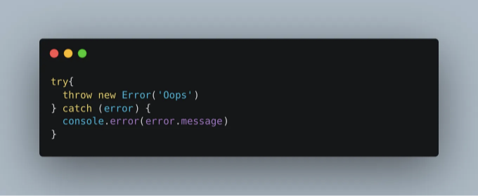
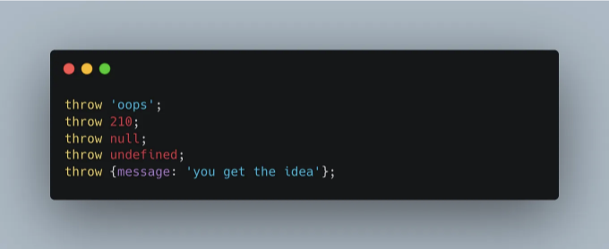
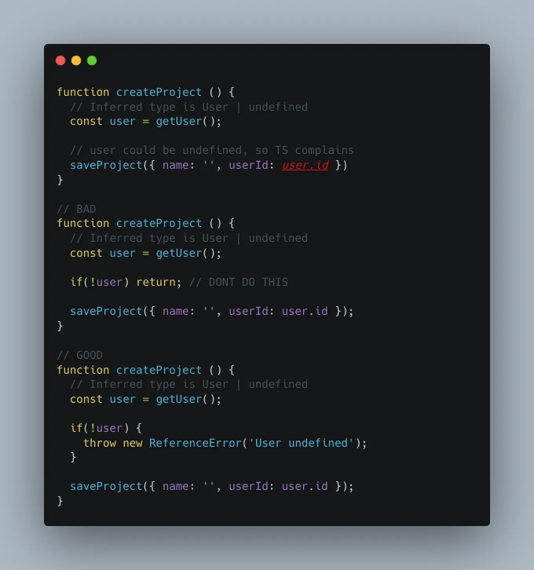
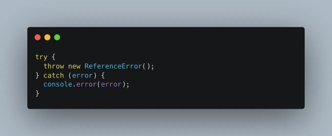
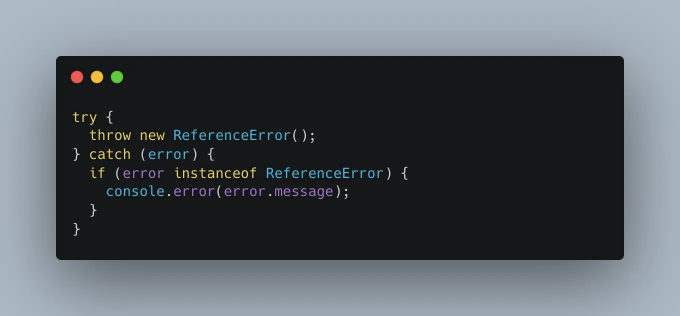
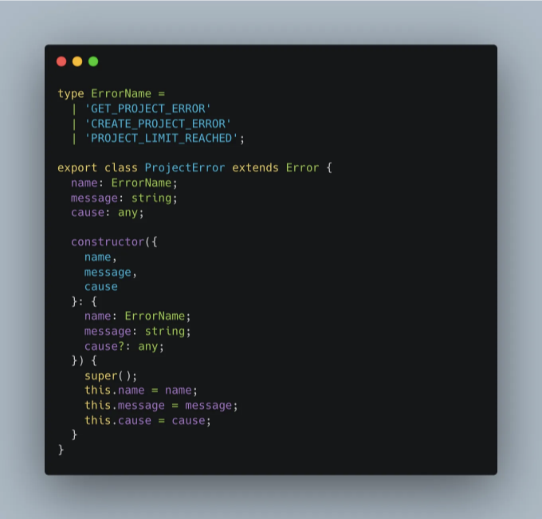
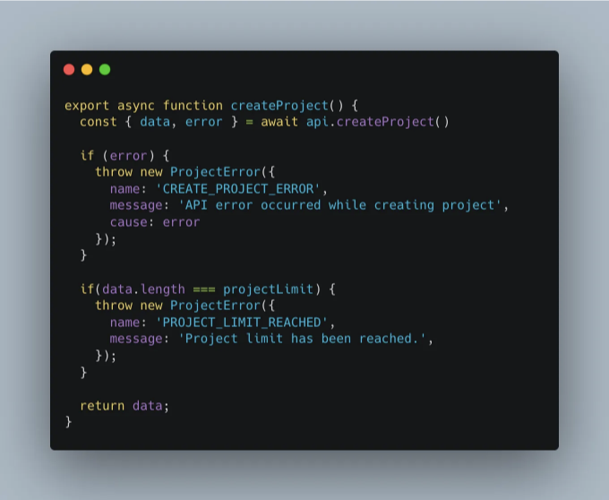
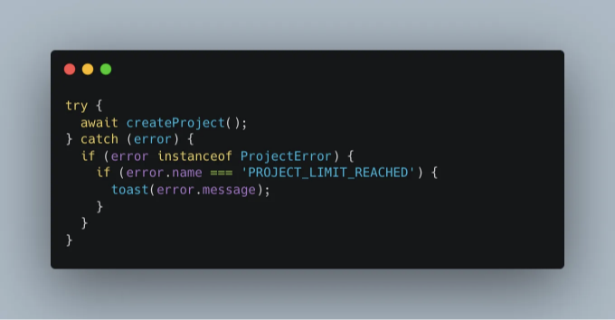
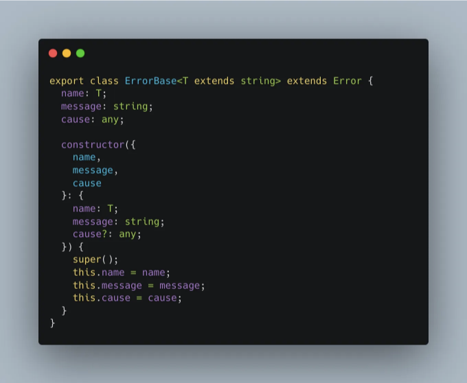
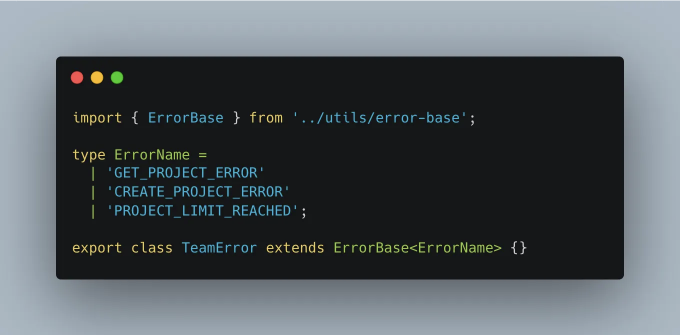

Type/JavaScript에서의 오류 처리는 중요성을 충분히 인식받지 못하는 주제입니다. 어떤 프로젝트든 오류를 잡고 기록하는 것이 그 프로젝트의 장기적인 성공에 중요합니다.

저는 이전 몇 년 동안 TypeScript를 더 많이 다루면서 오류 처리를 정말 이해하지 못했다는 것을 깨달았습니다. 종종 이 문제에 부딪히곤 했죠:

<!-- ui-log 수평형 -->
<ins class="adsbygoogle"
  style="display:block"
  data-ad-client="ca-pub-4877378276818686"
  data-ad-slot="9743150776"
  data-ad-format="auto"
  data-full-width-responsive="true"></ins>
<component is="script">
(adsbygoogle = window.adsbygoogle || []).push({});
</component>

오류의 유형이 알 수없으므로 오류와 관련된 어떤 작업도 수행할 수 없습니다. 그대로 사용할 수 있도록 새 유형으로 캐스트하거나 유형을 좁히기 전에 다시 시도해야 합니다. 올바른 답변은 유형을 좁히는 것이며, 이를 어떻게 해야 하는지 살펴보겠지만, 왜 그렇게 해야 하는지도 알아볼 겁니다.

JavaScript에서는 거의 모든 것을 던질 수 있습니다:

따라서 실제로 잡히는 오류는 알 수 없습니다. 하지만 TypeScript를 사용하여 깔끔하게 오류를 처리할 수 있는 방법이 있으며, 지난 몇 년 동안 나는 이를 도와주는 디자인 패턴을 개발했습니다. 제가 정말 즐겨 사용하는 방법입니다.

<!-- ui-log 수평형 -->
<ins class="adsbygoogle"
  style="display:block"
  data-ad-client="ca-pub-4877378276818686"
  data-ad-slot="9743150776"
  data-ad-format="auto"
  data-full-width-responsive="true"></ins>
<component is="script">
(adsbygoogle = window.adsbygoogle || []).push({});
</component>

# 자바스크립트 오류의 기본 사항

## 자바스크립트의 오류 유형

자바스크립트에는 많은 종류의 오류가 있지만 가장 일반적인 것들은 다음과 같습니다:

- ReferenceError — 코드가 존재하지 않는 변수를 참조했습니다.
- TypeError — 값이 예상한 유형이 아닙니다.
- SyntaxError — 코드가 구문적으로 올바르지 않았습니다.

<!-- ui-log 수평형 -->
<ins class="adsbygoogle"
  style="display:block"
  data-ad-client="ca-pub-4877378276818686"
  data-ad-slot="9743150776"
  data-ad-format="auto"
  data-full-width-responsive="true"></ins>
<component is="script">
(adsbygoogle = window.adsbygoogle || []).push({});
</component>

## 에러 처리

가끔은 직접 에러를 던져야 할 때가 있습니다. 예를 들어, 함수 호출로부터 반환되는 값에 의존하는 코드가 있을 수 있지만, 값이 정의되지 않을 가능성이 있거나 TypeScript가 그렇게 믿고 있다고 가정합시다. 이 예에서는 던지는 것이 반환된 사용자를 제한하는 가장 좋은 해결책입니다.

## 에러 처리하기

<!-- ui-log 수평형 -->
<ins class="adsbygoogle"
  style="display:block"
  data-ad-client="ca-pub-4877378276818686"
  data-ad-slot="9743150776"
  data-ad-format="auto"
  data-full-width-responsive="true"></ins>
<component is="script">
(adsbygoogle = window.adsbygoogle || []).push({});
</component>

한 번 오류가 발생하면 try/catch 문에서 잡히기 전까지 콜스택을 따라 올라갑니다. try 블록 내에서 실행되는 코드가 오류를 발생시키면 catch 블록에서 해당 오류가 "잡히게" 됩니다. 오류는 함수 내부의 함수에서 발생할 수 있으며, try/catch 문에서 잡히기 전까지 콜스택을 계속 올라갈 수 있습니다.

## 오류 유형 좁히기

한 번 잡힌 오류를 확인하는 것이 유용할 수 있습니다. 이를 통해 알 수 없는 유형에서 특정 유형으로 유형을 좁힐 수 있습니다. 이를 해결하기 위해 instanceof를 사용할 수 있습니다.

<!-- ui-log 수평형 -->
<ins class="adsbygoogle"
  style="display:block"
  data-ad-client="ca-pub-4877378276818686"
  data-ad-slot="9743150776"
  data-ad-format="auto"
  data-full-width-responsive="true"></ins>
<component is="script">
(adsbygoogle = window.adsbygoogle || []).push({});
</component>

# 기본 사항은 충분히 했으니, 이제 디자인 패턴을 살펴봅시다

내 최신 프로젝트에서는 코드를 도메인별로 Features라는 디렉토리에 그룹화했습니다. 이 아키텍처에 대해 자세히 설명하겠지만, 간단히 말해 Feature 디렉토리에는 주어진 도메인을 위한 코드가 포함되어 있습니다. 관련된 컴포넌트, 훅, 타입, 오류 등이 포함될 수 있습니다. 이 게시물에서 우리가 관심을 가지는 것은 오류입니다. 각 Feature 디렉토리에는 해당 도메인을 위해 사용자 정의 오류 클래스를 정의한 errors.ts 파일이 포함되어 있습니다.

## 사용자 지정 오류 유형 만들기

<!-- ui-log 수평형 -->
<ins class="adsbygoogle"
  style="display:block"
  data-ad-client="ca-pub-4877378276818686"
  data-ad-slot="9743150776"
  data-ad-format="auto"
  data-full-width-responsive="true"></ins>
<component is="script">
(adsbygoogle = window.adsbygoogle || []).push({});
</component>

errors.ts 파일에 클래스를 내보냅니다. 잠재적인 이름에 대한 유니언 타입을 유지하여 IntelliSense와 타입 안전성을 높였습니다. 해당 클래스는 Error 객체를 확장하므로 대부분의 JS 런타임에서 스택 트레이스를 삽입할 수 있습니다.

## 커스텀 에러 던지기

새로운 에러가 인스턴스화될 때, name 값은 IntelliSense를 제공하며 유니언 타입에 정의된 이름 중 하나여야 합니다.

<!-- ui-log 수평형 -->
<ins class="adsbygoogle"
  style="display:block"
  data-ad-client="ca-pub-4877378276818686"
  data-ad-slot="9743150776"
  data-ad-format="auto"
  data-full-width-responsive="true"></ins>
<component is="script">
(adsbygoogle = window.adsbygoogle || []).push({});
</component>

## 사용자 지정 오류 처리

오류가 catch되면 instanceof를 사용하여 오류 유형을 좁힐 수 있습니다. 한 번 좁혀지면 error.name을 통해 Intellisense를 얻을 수 있습니다. 이 시점에서 throw된 오류의 이름을 기반으로 논리를 수행할 수 있습니다. 이 예시에서 PROJECT_LIMIT_REACHED 오류는 사용자에게 표시하고자 하는 오류이며, 사용자를 위해 렌더링될 메시지를 명시적으로 제공했습니다.

<!-- ui-log 수평형 -->
<ins class="adsbygoogle"
  style="display:block"
  data-ad-client="ca-pub-4877378276818686"
  data-ad-slot="9743150776"
  data-ad-format="auto"
  data-full-width-responsive="true"></ins>
<component is="script">
(adsbygoogle = window.adsbygoogle || []).push({});
</component>

## 재사용 가능한 에러 베이스 만들기

많은 errors.ts 파일이 있기 때문에 코드가 DRY 상태를 유지하고 싶어요. 우리 클래스에서 유일하게 동적인 코드는 이름 유니언 타입입니다. 그래서 ErrorBase 클래스를 생성했어요. 이 클래스는 사용될 이름 유형으로 제네릭을 받아요.

이제 새로운 사용자 정의 에러 클래스를 만들 때 이 기본 클래스를 확장하면, 사용 가능한 이름의 유니언 타입을 지정해주는 것만 하면 돼요.

<!-- ui-log 수평형 -->
<ins class="adsbygoogle"
  style="display:block"
  data-ad-client="ca-pub-4877378276818686"
  data-ad-slot="9743150776"
  data-ad-format="auto"
  data-full-width-responsive="true"></ins>
<component is="script">
(adsbygoogle = window.adsbygoogle || []).push({});
</component>

# 결론

나는 이 디자인 패턴을 정말 즐기고 있고, 이를 통해 나의 코드가 훨씬 유지 및 보수하기 쉬워졌다. 에러 처리는 잘 관리된 앱의 한 부분에 불과하다는 것을 명심해주세요. 또 다른 중요한 단계는 Sentry와 같은 도구를 사용하여 에러를 로깅하는 것입니다.
