## 디자인 리더십

먼저, 우크라이나 디지털 컨설팅 회사에서 일하면서 리더십을 발휘했습니다. 그 후에는 에스토니아 출신의 도시 이동성 회사에서 디자인 관리에 몸담았습니다. 지금은 네덜란드 본사의 기업 소프트웨어 회사에서 디자이너 팀을 이끌고 있죠. 그리고 알아요, 다양한 회사에서 디자인 리더십은 각기 다른 형태로 나타나며, 각자 독특한 기대를 뒤따릅니다.

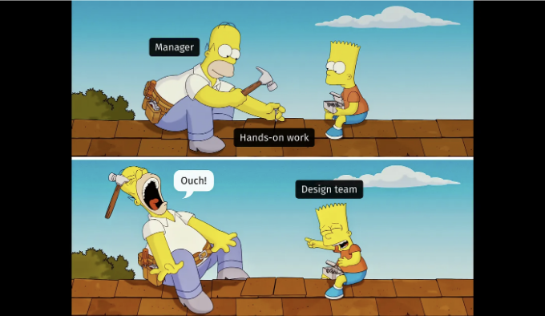

디자인 관리의 다양한 측면과 당신의 관리 프로필을 정의하는 요소에 대해 이야기하기 전에, 간단한 질문부터 시작해보죠: 디자인 매니저는 어디에서 올까요?

<!-- ui-log 수평형 -->
<ins class="adsbygoogle"
  style="display:block"
  data-ad-client="ca-pub-4877378276818686"
  data-ad-slot="9743150776"
  data-ad-format="auto"
  data-full-width-responsive="true"></ins>
<component is="script">
(adsbygoogle = window.adsbygoogle || []).push({});
</component>

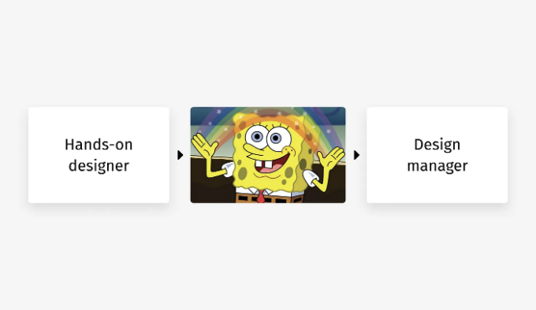

디자인 매니지먼트는 디자이너의 경력 궤적 상에서 상위 단계로 보일 수 있습니다. 주니어로 시작하여 더 높은 직책으로 성장한 다음, 갑자기 — 팀 리더 또는 매니저가 되는 경우가 많습니다.

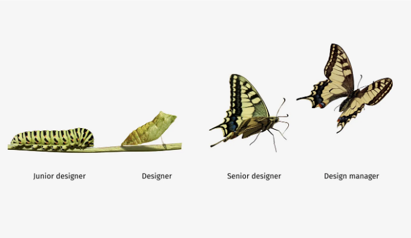

하지만 듣고 보셔요: 매니지먼트는 디자인의 자연스러운 연장선이 아닙니다. 디자이너로 일하는 동안 자동으로 습득할 수 없는 다른 스킬 세트입니다. 실제로는 아래의 미임(meme)에 더 가까울 수 있습니다:

<!-- ui-log 수평형 -->
<ins class="adsbygoogle"
  style="display:block"
  data-ad-client="ca-pub-4877378276818686"
  data-ad-slot="9743150776"
  data-ad-format="auto"
  data-full-width-responsive="true"></ins>
<component is="script">
(adsbygoogle = window.adsbygoogle || []).push({});
</component>

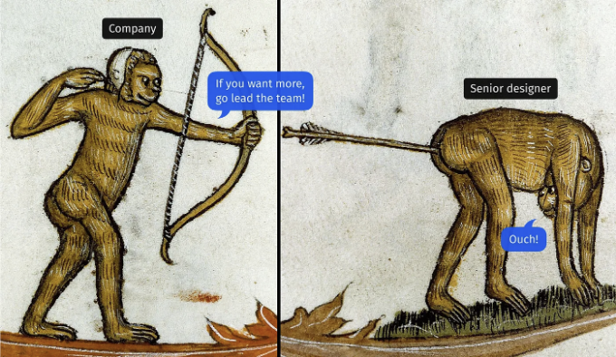

디자이너와 디자인 리더로부터 기대되는 기술 세트를 살펴보겠습니다. 관리자 경력을 선택한 사람들은 점차 실무 경험을 줄이면서 손을 놓아야 할 것입니다. 제가 관찰한 바에 따르면, 매니저들은 일반적으로 디자인에서의 실질적 기술이 중간 정도에서 정체되는 것을 보게 될 것입니다.

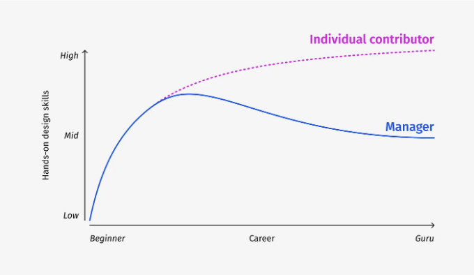

직책 표기는 다양하지만, 대개 생각하는 것은 모두가 공감할 수 있는 것 같습니다. 시니어(또는 때로는 리드) 수준에 도달하는 것은 직업 생활에서 중대한 지점이라고 봅니다. 이 단계에서 추가적인 경력 성장은 대개 개인 기여자로 남을 것인지 관리로 전환할 것인지에 달려 있습니다.

<!-- ui-log 수평형 -->
<ins class="adsbygoogle"
  style="display:block"
  data-ad-client="ca-pub-4877378276818686"
  data-ad-slot="9743150776"
  data-ad-format="auto"
  data-full-width-responsive="true"></ins>
<component is="script">
(adsbygoogle = window.adsbygoogle || []).push({});
</component>

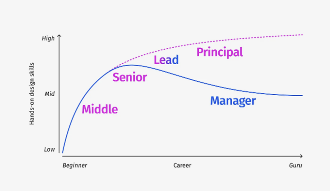

물론, 디자인 매니저로 전환하는 것이 의미있을 때는, 중요한 디자인 기술을 잃는다는 조건만 갖추지 않으면 됩니다. 그래서 디자이너가 부족하거나 제한적으로 갖고 있는 특정 관리 기술을 함께 습득해야 합니다.

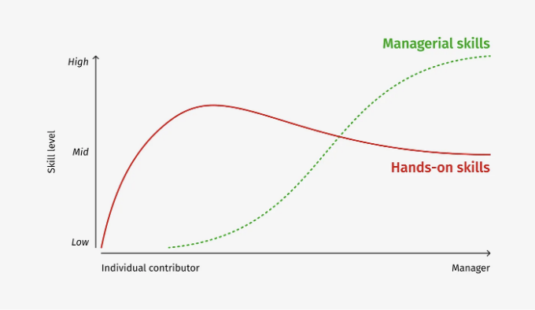

반면에, 초보 디자인 리더가 팀을 디자인하는 데 능가하려고 시도할 때, 그는 실패로 향하는 길에 올라섭니다.

<!-- ui-log 수평형 -->
<ins class="adsbygoogle"
  style="display:block"
  data-ad-client="ca-pub-4877378276818686"
  data-ad-slot="9743150776"
  data-ad-format="auto"
  data-full-width-responsive="true"></ins>
<component is="script">
(adsbygoogle = window.adsbygoogle || []).push({});
</component>

```markdown
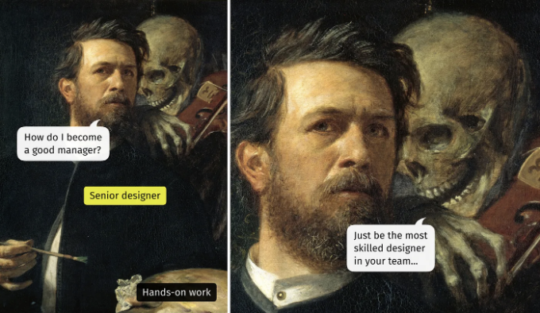

리더십 트랙을 선택하면 마음가짐, 도구 및 방법론에서 많은 변화가 있게 됩니다. 간단히 말해, 디자인하는 것보다 소통, 계획 및 전략에 더욱 집중하게 됩니다. 이 현상의 생생한 예는 매일 사용하는 도구가 급격히 바뀌는 것입니다.

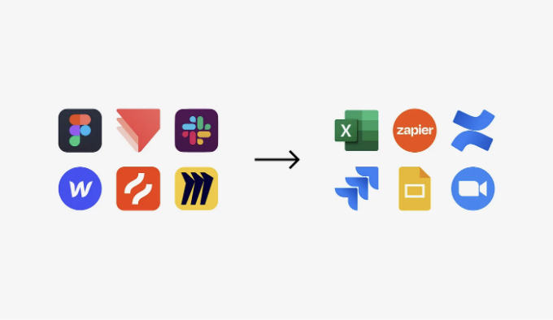

하지만 가장 흥미로운 변화 중 하나는 디자인 중심의 프레임워크에서 사람 중심의 프레임워크로의 전환입니다. 유명한 디자인 생각 프로세스와 직원 라이프사이클을 비교해 보면, 직원 라이프사이클은 디자이너들 사이에서는 잘 알려지지 않았지만 덜 유명하지는 않습니다:
```

<!-- ui-log 수평형 -->
<ins class="adsbygoogle"
  style="display:block"
  data-ad-client="ca-pub-4877378276818686"
  data-ad-slot="9743150776"
  data-ad-format="auto"
  data-full-width-responsive="true"></ins>
<component is="script">
(adsbygoogle = window.adsbygoogle || []).push({});
</component>

- 디자인 생각: 공감 → 정의 → 아이디어 발전 → 프로토타입 → 시험 → 실행.
- 직원 수명주기: 유치 → 채용 → 입사 → 개발 → 유지 → 이직.

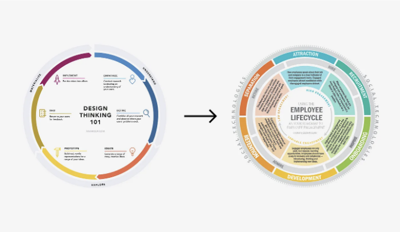

개별 기여자들이 디자인 결정 및 솔루션을 소유하지만, 리더들은 해당 디자인 결정을 내리고 디자인 솔루션을 제공하는 팀에 대한 책임을 져야 합니다.

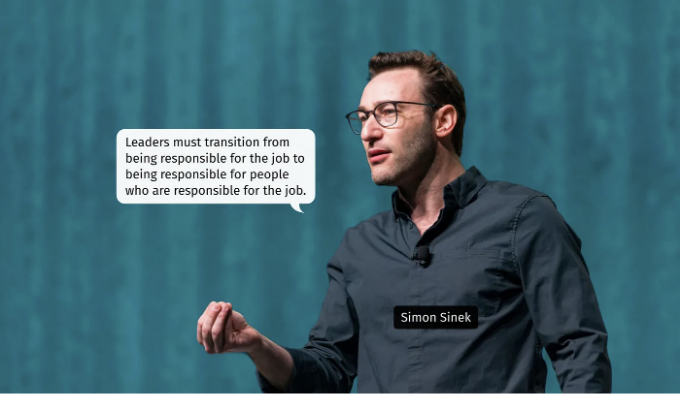

<!-- ui-log 수평형 -->
<ins class="adsbygoogle"
  style="display:block"
  data-ad-client="ca-pub-4877378276818686"
  data-ad-slot="9743150776"
  data-ad-format="auto"
  data-full-width-responsive="true"></ins>
<component is="script">
(adsbygoogle = window.adsbygoogle || []).push({});
</component>

안타깝게도, 관리 업무와 실무 업무의 균형 잡힌 조합은 일정한 한계 내에서만 가능합니다. 두 분야 모두 헌신을 요구하기 때문에 어느 한 쪽이 반드시 우위를 차지하게 될 것입니다.

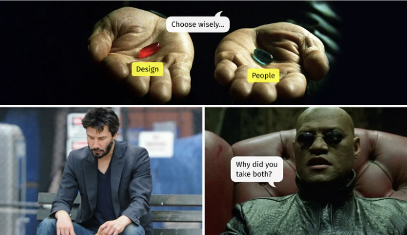

그렇다면 디자인 관리란 무엇일까요? 이름에서 알 수 있듯이, 디자인 관리는 디자인과 관리의 교차점에 위치해 있습니다. 그래서, 이 역할의 두 구성 요소에 대해 자세히 살펴보겠습니다.

- 디자인 측면: 디자인 품질, 비전, 전략, 사용자 여정, UX 메트릭, 디스커버리, 방법론 및 도구 등
- 인적 측면: 기술, 승진, 채용, 온보딩, 팀 내 협업, 위기 관리 등

<!-- ui-log 수평형 -->
<ins class="adsbygoogle"
  style="display:block"
  data-ad-client="ca-pub-4877378276818686"
  data-ad-slot="9743150776"
  data-ad-format="auto"
  data-full-width-responsive="true"></ins>
<component is="script">
(adsbygoogle = window.adsbygoogle || []).push({});
</component>

디자인 관리자로서의 프로필은 디자인 및 인적 구성 요소의 비율로 정해집니다. 이것은 제한된 유형의 집합이 아니라 연속적인 스펙트럼입니다.

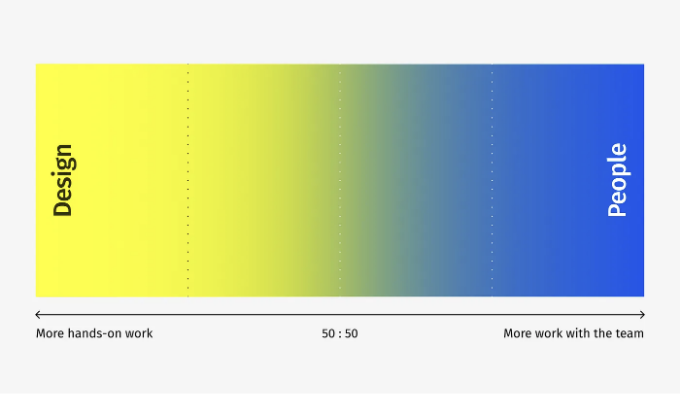

"디자인 ↔ 인적" 축 이외에도 사람의 역할 경험을 더할 수 있습니다. 이렇게하면 디자인 리더의 다양성을 받아들일 수 있습니다. 예를 들어, 일부는 계층적 수준에서 운영 작업을 관리하는 경우를 고려할 때 직접적인 작업에 깊이 몰두합니다. 반면에, 다른 리더들은 팀원이 충분히 경력이 있고 많은 통제가 필요하지 않기 때문에 디자인에 직접 개입하는 것보다 팀 관리를 우선시합니다.

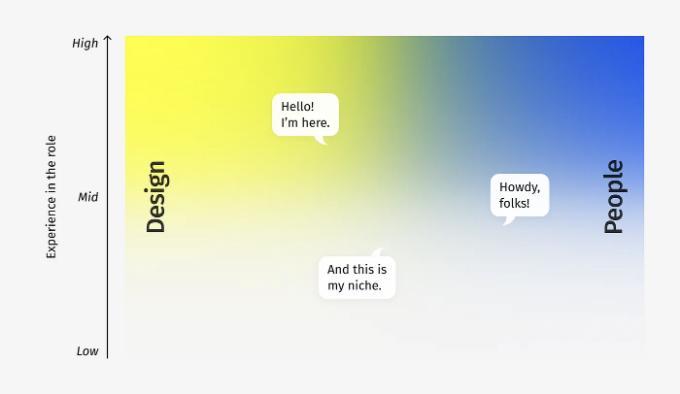

<!-- ui-log 수평형 -->
<ins class="adsbygoogle"
  style="display:block"
  data-ad-client="ca-pub-4877378276818686"
  data-ad-slot="9743150776"
  data-ad-format="auto"
  data-full-width-responsive="true"></ins>
<component is="script">
(adsbygoogle = window.adsbygoogle || []).push({});
</component>

여러 요소들이 당신의 위치에 영향을 미치는 스펙트럼에 대해 알아보겠습니다:

- 비즈니스 모델: 에이전시, 컨설팅, 디지턈 제품 회사.
- 회사 규모: 소형, 중소형, 대형.
- 비즈니스 단계: 스타트업, 성장 중인 비즈니스, 또는 수립된 회사.
- 책임 영역: 당신은 모든 디자이너를 관리하거나 여러 디자인 팀 중 하나만을 관리합니다; 당신의 팀은 모든 디자이너(UX, 브랜딩, 모션, 마케팅 등)를 포함하거나 특정 유형만을 포함할 수 있습니다.
- 조직 구조: 제품 또는 엔지니어링 부문에 소속된 사람에게 보고하거나, 디자인에 대한 별도의 경영진이 있을 수 있습니다.
- 디자인 모델: 당신의 팀 구성원들이 교차 기능 팀에 영구적으로 포함되어 있는지 아니면 “서비스로서의 디자인”으로 우선순위가 있는 요청에 응답하는지를 파악할 수 있습니다.

물론, 이것은 완전한 목록이 아닙니다; 당신이 근무하는 장소는 당신의 역할을 특정 방식으로 형성하고 당신이 탁월한 가치를 제공하고 있는 것에 대한 기대를 설정할 수 있는 추가적인 독특한 기능을 가질 수 있습니다.

동일한 직책을 가진 사람들이 어떻게 다르게 작업할 수 있는지 맛을 볼 수 있도록 3가지 관리 설정을 자세히 살펴봅시다.

<!-- ui-log 수평형 -->
<ins class="adsbygoogle"
  style="display:block"
  data-ad-client="ca-pub-4877378276818686"
  data-ad-slot="9743150776"
  data-ad-format="auto"
  data-full-width-responsive="true"></ins>
<component is="script">
(adsbygoogle = window.adsbygoogle || []).push({});
</component>

## 예시 1. "안정된 균형"

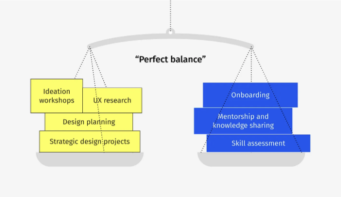

많은 디자인 리더들에게 현실인 이 완벽히 균형잡힌 프로필은 장기간 유지하는 것이 도전을 제기합니다. 저울의 양쪽 접시에 늘어놓인 작업들이 늘어날수록 어느 날, 자신을 넘어선 지침과 심각한 소진 직전에 처한 상황에 놓일 수도 있습니다.

이 프로필은 최근에 빠르게 성장한 디자인 팀들에서 자주 관찰되며, 가장 유망한 디자이너들이 이 자리를 맡았지만 아직 디자인 매니저로부터 무엇을 기대해야 할지 모르는 경우가 많습니다.

<!-- ui-log 수평형 -->
<ins class="adsbygoogle"
  style="display:block"
  data-ad-client="ca-pub-4877378276818686"
  data-ad-slot="9743150776"
  data-ad-format="auto"
  data-full-width-responsive="true"></ins>
<component is="script">
(adsbygoogle = window.adsbygoogle || []).push({});
</component>

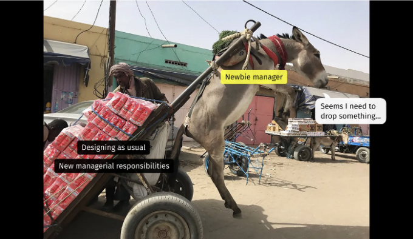

## 예시 2. "보너스가 있는 디자인 전문가"

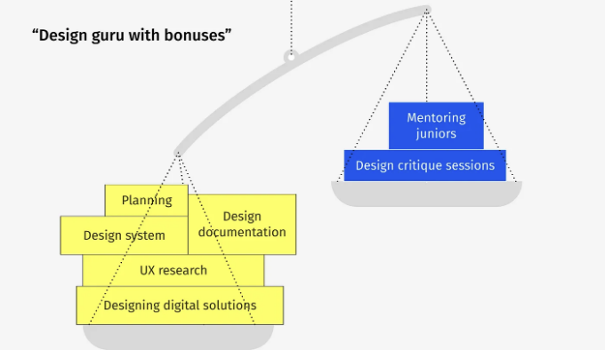

이 세팅이 본질적으로 잘못된 것은 아니지만, 누군가는 급여나 직원 유지와 같은 민감한 주제를 다뤄야 합니다. 일반적으로 이런 주제들은 디자인 리더의 상사나 인사 담당자에게 속합니다. 그러나 이 디자인 리더 유형은 모든 사람이 제목이나 계급과 관계없이 협력할 것으로 기대되는 초기 단계 스타트업에서 이상적일 수 있습니다.

<!-- ui-log 수평형 -->
<ins class="adsbygoogle"
  style="display:block"
  data-ad-client="ca-pub-4877378276818686"
  data-ad-slot="9743150776"
  data-ad-format="auto"
  data-full-width-responsive="true"></ins>
<component is="script">
(adsbygoogle = window.adsbygoogle || []).push({});
</component>

한편, "상여급을 받는 디자인 전문가"라는 역할은 어떤 사람이 관리 책임을 완전히 맡기 싫어하는 것을 의미할 수 있습니다. 이러한 리더들은 구체적인 가치가 즉시 드러나는 현장 작업에 근거한 자신의 컴포트 존을 벗어나 충분히 잘 알지 못하는 관리의 영역으로 나아가는 것을 두려워할 수 있습니다.

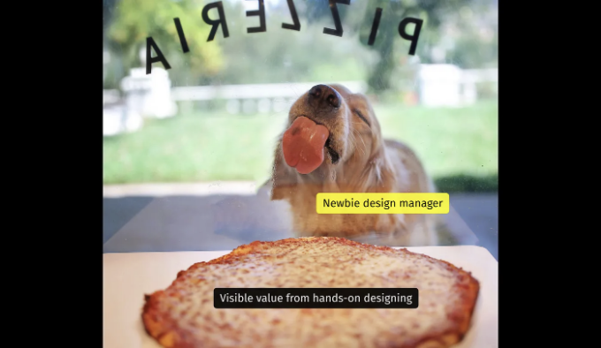

## 예시 3. "디자이너들의 지도자"

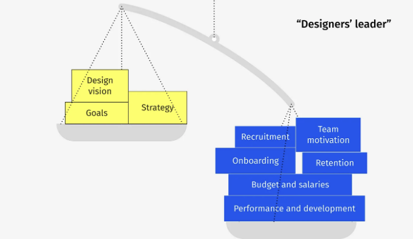

<!-- ui-log 수평형 -->
<ins class="adsbygoogle"
  style="display:block"
  data-ad-client="ca-pub-4877378276818686"
  data-ad-slot="9743150776"
  data-ad-format="auto"
  data-full-width-responsive="true"></ins>
<component is="script">
(adsbygoogle = window.adsbygoogle || []).push({});
</component>

내 경험상, '디자이너들의 리더'는 팀이 충분히 커지고 경험이 쌓여 있어 실용적인 디자인 업무를 자율적으로 처리할 수 있는 때에 나타나며, 정렬, 표준화 및 공통 방향성이 필요할 때발생합니다. 디자이너들이 이미 자신의 전문성을 가지고 있다면(개별적으로 또는 팀으로), 더 많은 실용적 디자인 전문가를 추가할 필요가 없습니다.

그러나 이전에 언급된 관리 프로필들처럼, 이것도 도전을 야기합니다. 완전히 관리 책임에 몰두한 디자인 리더는 운영 작업에 압도당할 수 있어 전략적 프로젝트 및 비전 설정에 충분한 시간을 할애하기 어려울 수 있습니다. 운영 작업은 결코 끝나지 않는데 비해, 리더의 주요 가치는 전략적 계획 및 긍정적 변화를 추진하는 데 있습니다.

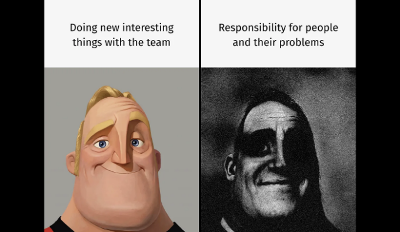

기업의 요구 사항을 충족시키는 것에 중점을 둔 디자인 매니저 유형 스펙트럼이 개인적인 선호도가 아니라 적절한 기업 상황에 부합하도록 되어 있다는 것을 인식하는 것이 중요합니다. 각 유형은 조직의 독특한 맥락에서 나오며, 이를 이해하는 것이 효과적인 관리의 핵심입니다.

<!-- ui-log 수평형 -->
<ins class="adsbygoogle"
  style="display:block"
  data-ad-client="ca-pub-4877378276818686"
  data-ad-slot="9743150776"
  data-ad-format="auto"
  data-full-width-responsive="true"></ins>
<component is="script">
(adsbygoogle = window.adsbygoogle || []).push({});
</component>

또한, 당신은 혼자서 일하지 않습니다. 다른 전문가들도 당신의 팀과 협력하여 성공을 보장합니다:

- 인재 전문가/채용 담당자,
- 인사 매니저 또는 인재 파트너,
- 제품 매니저,
- 엔지니어링 매니저,
- 디자인 디렉터 등.

약간 복잡하죠? 중복되는 기능 및 미처 처리되지 않은 책임이 없도록 보장하기 위해서는 역할과 책임에 대한 세심한 조정과 명확성이 필요합니다.

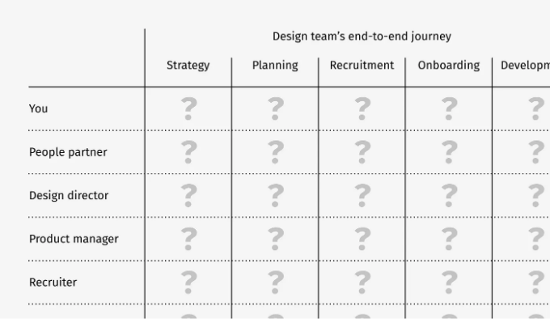

<!-- ui-log 수평형 -->
<ins class="adsbygoogle"
  style="display:block"
  data-ad-client="ca-pub-4877378276818686"
  data-ad-slot="9743150776"
  data-ad-format="auto"
  data-full-width-responsive="true"></ins>
<component is="script">
(adsbygoogle = window.adsbygoogle || []).push({});
</component>

디자인 팀에 직접적이거나 간접적인 영향을 미치는 모든 사람을 나열하고 그들의 참여를 단계별로 매핑함으로써 집중해야 할 부분과 다른 사람에게 의존해야 할 부분을 알 수 있습니다. 이를 통해 다른 사람에게 자신의 가치와 기여를 효과적으로 전달할 수도 있습니다.

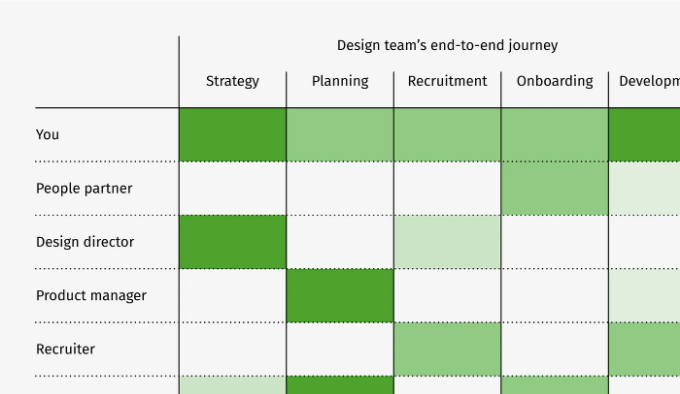

보시다시피, 디자인 매니저의 정의와 그들이 해야 할 일에 대한 표준은 단일한 것이 없습니다. 여러 요소에 의해 정의되는 프로필은 다양하지만, 이는 언제나 여러분의 리더십 열망에 부합하는 기업을 찾을 수 있다는 것을 의미하기도 합니다.

유념해야 할 단 하나의 주의 사항이 있습니다: 팀원들의 문제를 잘 해결하고 그들의 성공을 돕느냐에 따라 팀 내에서 어떻게 리더로 인식되는지가 달라집니다. 공식적인 위치와는 무관하게 사람들이 사실상의 리더로 인식하는지에 대한 빠른 테스트가 있습니다: 디자이너들의 문제에 대해 가장 먼저 알게 되는 사람이 누구인가요? 그들이 여러분에게 알리나요, 아니면 다른 누군가를 통해 그것을 알게 되나요?

<!-- ui-log 수평형 -->
<ins class="adsbygoogle"
  style="display:block"
  data-ad-client="ca-pub-4877378276818686"
  data-ad-slot="9743150776"
  data-ad-format="auto"
  data-full-width-responsive="true"></ins>
<component is="script">
(adsbygoogle = window.adsbygoogle || []).push({});
</component>

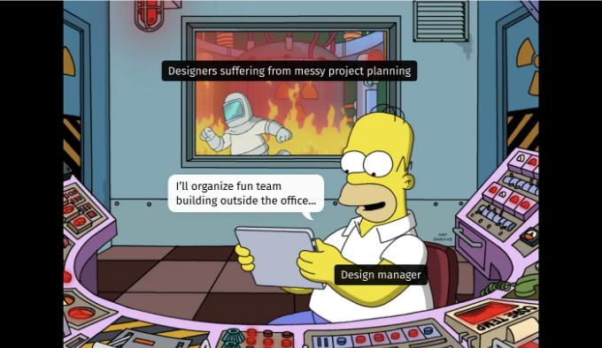

# 요약

- 디자인 관리는 활기찬 스펙트럼으로, 손으로 일을 하는 디자이너부터 전략적 디자인 작업에 집중하는 완전한 팀 리더까지 다양하게 뻗어 있습니다.
- 당신의 리더십 유형은 사업의 성격, 조직 구조, 디자인 팀 구성, 회사의 성숙도 수준 등이라는 운영 환경에 따라 달라집니다.
- 한 명이 매니저의 타이틀을 가지고 있더라도, "인식된 리더"는 보통 팀원들이 자신들의 문제를 맡기는 사람으로, 공식적인 프로세스와는 관계없이 우리로 돌아오게 됩니다.

그러니 디자이너로서 매니지먼트로의 이동을 고민 중이라면, 일반적인 리더십 뿐만 아니라 회사 내에서 필요한 특정 유형의 디자인 매니저도 탐색해보세요.

<!-- ui-log 수평형 -->
<ins class="adsbygoogle"
  style="display:block"
  data-ad-client="ca-pub-4877378276818686"
  data-ad-slot="9743150776"
  data-ad-format="auto"
  data-full-width-responsive="true"></ins>
<component is="script">
(adsbygoogle = window.adsbygoogle || []).push({});
</component>

- ✍️ 제 중요한 디자인 기사 모두가 여기에 있어요.
- 💼 LinkedIn에서 연결합시다. 만약에 제가 이 기사 주제를 컨퍼런스나 밋업에서 발표하길 원하면 노트를 남겨주세요.
- 🏰 디자인 기사에 질려셨나요? 사진 및 간과된 건축에 관한 제 블로그도 확인해보세요.