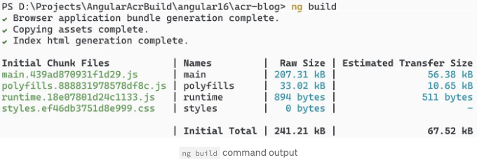
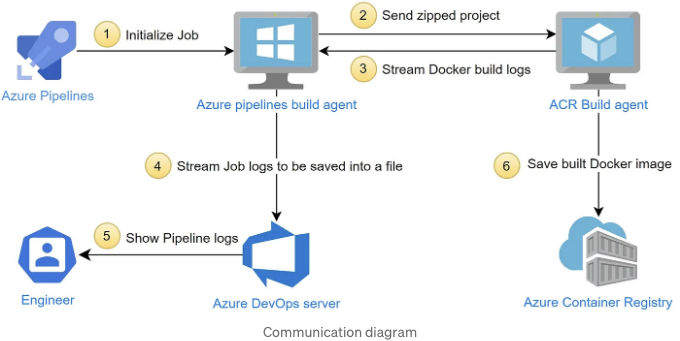
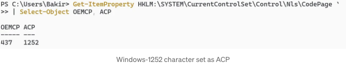
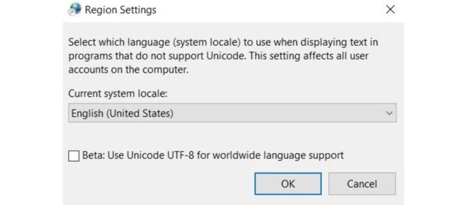
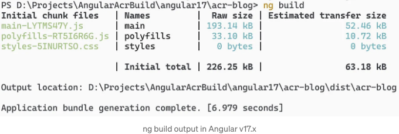

## 도커 빌드에서 간단한 유니코드 문자가 문제를 일으켰을 때

# 소개

소프트웨어 엔지니어로서 소프트웨어 문제가 발생하면 그 원인을 찾고 싶어합니다. 그리고 그에 따라서, 우리는 코드를 실행하는 시스템을 소유하거나 제어하지 못한다면 깊이 파고들지 못하여 문제를 해결하지 못할 수 있습니다.

이 기사에서는 간단한 유니코드 문자가 문제를 일으켰는데, 이를 해결하려는 노력 끝에 문제가 해결되지 않는 것처럼 보였던 상황을 분석해보겠습니다. 걱정하지 마세요. 그 해법을 살펴보겠지만, 다른 문제를 일으킬 수 있음에 주의해야 합니다.

<!-- ui-log 수평형 -->
<ins class="adsbygoogle"
  style="display:block"
  data-ad-client="ca-pub-4877378276818686"
  data-ad-slot="9743150776"
  data-ad-format="auto"
  data-full-width-responsive="true"></ins>
<component is="script">
(adsbygoogle = window.adsbygoogle || []).push({});
</component>

문제에 대해 자세히 알아보기 전에 Angular, Azure Container Registry 및 Azure Pipelines Windows 에이전트가 어떻게 기여하는지 이해해야 합니다.

[이미지](./img/HowAngularv17AccidentallySolvedaPreviouslyUnsolvableProblem_0.png)

## Azure 파이프라인 에이전트

Azure 파이프라인은 Microsoft의 솔루션으로 자동으로 빌드 및 코드 프로젝트를 테스트합니다. 이는 지속적인 통합 및 지속적인 전달 (CI/CD) 관행을 결합하여 애플리케이션을 어디든지 빌드, 테스트 및 릴리스할 수 있습니다.

<!-- ui-log 수평형 -->
<ins class="adsbygoogle"
  style="display:block"
  data-ad-client="ca-pub-4877378276818686"
  data-ad-slot="9743150776"
  data-ad-format="auto"
  data-full-width-responsive="true"></ins>
<component is="script">
(adsbygoogle = window.adsbygoogle || []).push({});
</component>

Azure 파이프라인 에이전트는 한 번에 하나의 작업을 실행하는 설치된 에이전트 소프트웨어가 있는 컴퓨팅 인프라(컴퓨터)입니다. CI/CD 작업은 이러한 작업 내에서 수행됩니다.

Azure 파이프라인은 두 가지 주요 유형의 에이전트를 제공합니다:

- Microsoft 호스팅 에이전트(마이크로소프트에 의해 클라우드에서 호스팅 및 완전히 관리됨)
- 자체 호스팅 에이전트(온프레미스 인프라에 호스팅됨)

Azure 파이프라인 에이전트는 다양한 유형의 기계에 설치할 수 있습니다:

<!-- ui-log 수평형 -->
<ins class="adsbygoogle"
  style="display:block"
  data-ad-client="ca-pub-4877378276818686"
  data-ad-slot="9743150776"
  data-ad-format="auto"
  data-full-width-responsive="true"></ins>
<component is="script">
(adsbygoogle = window.adsbygoogle || []).push({});
</component>

- macOS 에이전트
- Linux 에이전트
- Windows 에이전트
- Docker 에이전트

이게 왜 중요한지 곧 알게 될 거예요.

## az acr build 커맨드란 무엇인가요?

익숙한 docker build 형식을 사용하는 경우, Azure CLI의 az acr build 커맨드는 프로젝트를 압축하고 임시 blob 저장소에 업로드하여 Microsoft 호스팅 에이전트가 가져와 docker build를 수행할 수 있게 합니다.

<!-- ui-log 수평형 -->
<ins class="adsbygoogle"
  style="display:block"
  data-ad-client="ca-pub-4877378276818686"
  data-ad-slot="9743150776"
  data-ad-format="auto"
  data-full-width-responsive="true"></ins>
<component is="script">
(adsbygoogle = window.adsbygoogle || []).push({});
</component>

빌드 과정 중에, 빌드 에이전트는 로그를 다시 보내줍니다 (나중에 왜 이게 중요한지 알게 될 거예요). 작업이 완료되면, 생성된 이미지가 Azure Container Registry에 푸시됩니다 — Microsoft Azure 클라우드에 호스팅된 관리되는 Docker 레지스트리 서비스입니다.

## Angular 소개

Angular는 인기 있는 오픈 소스 프론트엔드 웹 애플리케이션 프레임워크로, 동적인 단일 페이지 웹 애플리케이션(SPA)과 점진적 웹 애플리케이션(PWA)을 만드는 데 사용됩니다.

# Angular이 책임을 질까요?

<!-- ui-log 수평형 -->
<ins class="adsbygoogle"
  style="display:block"
  data-ad-client="ca-pub-4877378276818686"
  data-ad-slot="9743150776"
  data-ad-format="auto"
  data-full-width-responsive="true"></ins>
<component is="script">
(adsbygoogle = window.adsbygoogle || []).push({});
</component>

저희 Angular 애플리케이션의 Dockerfile을 살펴보겠습니다.

Angular 프로젝트는 ng build 명령어를 사용하여 빌드됩니다. 이 명령어는 npm run build 명령어로 백그라운드에서 호출됩니다.

버전 17 이전의 모든 Angular 버전에서는 빌드가 완료되면 npm run build 명령어에서 다음 텍스트가 출력됩니다:



<!-- ui-log 수평형 -->
<ins class="adsbygoogle"
  style="display:block"
  data-ad-client="ca-pub-4877378276818686"
  data-ad-slot="9743150776"
  data-ad-format="auto"
  data-full-width-responsive="true"></ins>
<component is="script">
(adsbygoogle = window.adsbygoogle || []).push({});
</component>

초록색 체크 표시가 문제를 만드는 요인입니다. 왜냐하면 "✔"는 유니코드 문자 (코드 U+2714)이기 때문이죠.

# Azure DevOps 에이전트의 잘못

다음 YAML 파이프라인 정의와 함께 Azure 파이프라인에서 az acr build 명령을 Windows 에이전트에서 실행해 봅시다 (Windows OS의 중요성에 대해서는 곧 알아볼 것입니다):

동일한 오류는 Python을 사용하여 Windows OS 기계에서 다음 명령을 사용하여 재현할 수 있습니다.

<!-- ui-log 수평형 -->
<ins class="adsbygoogle"
  style="display:block"
  data-ad-client="ca-pub-4877378276818686"
  data-ad-slot="9743150776"
  data-ad-format="auto"
  data-full-width-responsive="true"></ins>
<component is="script">
(adsbygoogle = window.adsbygoogle || []).push({});
</component>

```markdown
```js
(python -c "print('\u2714')") >> output.txt
```

# 발생하는 위치 및 이유

셀프 호스팅된 에이전트를 사용하면, 파이프 라인 로그가 모두 에이전트의 컴퓨터에 저장되지 않고 Azure DevOps 서버로 로그가 파이프됩니다. 

문제는 파이프라인 에이전트 내에서 'checkmark'인 '\u2714' 문자를 해독하려고 시도할 때 발생하며, 이는 colorama/ansitowin32.py 스크립트 파일에 관련한 오류 로그 부분에서 확인할 수 있습니다:
```

<!-- ui-log 수평형 -->
<ins class="adsbygoogle"
  style="display:block"
  data-ad-client="ca-pub-4877378276818686"
  data-ad-slot="9743150776"
  data-ad-format="auto"
  data-full-width-responsive="true"></ins>
<component is="script">
(adsbygoogle = window.adsbygoogle || []).push({});
</component>

```js
D:\a\_work\1\s\build_scripts\windows\artifacts\cli\Lib\site-packages\colorama/ansitowin32.py
```

플로우 다이어그램을 보고, 모든 구성 요소가 서로 어떻게 대화하는지 살펴봅시다.



기술적으로, 2단계와 3단계에서 우리의 압축된 프로젝트는 Azure Blob 저장소에 업로드되며, 여기서 ACR 빌드 에이전트가 해당 데이터를 가져옵니다. 마찬가지로, ACR 빌드 에이전트는 로그를 Azure Blob 저장소에 저장하고 이것들은 az acr 명령의 일부로 스트리밍됩니다.
```

<!-- ui-log 수평형 -->
<ins class="adsbygoogle"
  style="display:block"
  data-ad-client="ca-pub-4877378276818686"
  data-ad-slot="9743150776"
  data-ad-format="auto"
  data-full-width-responsive="true"></ins>
<component is="script">
(adsbygoogle = window.adsbygoogle || []).push({});
</component>

Azure 파이프라인 빌드 에이전트에서 발생하는 오류는 Azure Blob storage에서 로그를 스트리밍하고 표준 출력으로 인쇄하는 동안 3단계와 4단계 사이에 발생합니다.

Azure CLI 서버는 colorama(파이썬 패키지)를 사용하여 터미널 텍스트에 색을 입히기 위해 stdout을 감싸고 찾은 ANSI 시퀀스를 제거하여(출력물에서 엉터리 문자로 나타날 것) Win32 API 호출을 통해 터미널의 상태를 수정합니다.

## Azure CLI 소스 코드 깊이 파헤치기

Azure CLI의 오류는 command_modules/acr/_stream_utils.py 파일 143번째 줄에서 발생합니다.

<!-- ui-log 수평형 -->
<ins class="adsbygoogle"
  style="display:block"
  data-ad-client="ca-pub-4877378276818686"
  data-ad-slot="9743150776"
  data-ad-format="auto"
  data-full-width-responsive="true"></ins>
<component is="script">
(adsbygoogle = window.adsbygoogle || []).push({});
</component>

```js
import colorama
.
.
colorama.init()
.
.
print(flush.decode('utf-8', errors='ignore'))
```

이 줄의 역할은 UTF-8로 디코딩된 바이트 문자열(블롭 스토리지에서 검색된 로그 데이터)을 출력하는 것뿐입니다. 그러나 colorama 패키지가 가져와 초기화되어 있으므로 이후 print 명령 호출은 텍스트에 색상이나 스타일을 추가하기 위해 colorama 기능을 사용할 것입니다.

Colorama는 Win32 API 호출을 사용하여 터미널의 상태를 수정하며, Win32 API는 기본적으로 유니코드 특정 문자를 지원하지 않는 ANSI 코드 페이지를 사용합니다. 우리가 유니코드 문자열을 표시하려고 하는데 유니코드 코드 페이지를 지원하지 않는 API를 사용하고 있어서 문제가 발생한 것입니다.

이제 이 배경에서 무슨 일이 일어나는지 이해하기 시작했습니다. 하지만 실제 해결책을 살펴보기 전에 다른 가능성 있는 반쯤 마음에 드는 해결책들을 확인해 봅시다.
```

<!-- ui-log 수평형 -->
<ins class="adsbygoogle"
  style="display:block"
  data-ad-client="ca-pub-4877378276818686"
  data-ad-slot="9743150776"
  data-ad-format="auto"
  data-full-width-responsive="true"></ins>
<component is="script">
(adsbygoogle = window.adsbygoogle || []).push({});
</component>

# 로그를 비활성화하면 문제가 해결될 것으로 생각되지만, 더 나은 방법이 있습니다.

이상적으로는 az acr build 명령을 사용하여 로그를 완전히 비활성화하고 --no-logs 인수를 추가하는 것입니다. 그러나 이는 빌드 로그를 완전히 잃는다는 점에서 가장 나쁜 해결책입니다.

```js
az acr build --no-logs --registry $(Registry) --image "$(image):$(tag)" .
```

<!-- ui-log 수평형 -->
<ins class="adsbygoogle"
  style="display:block"
  data-ad-client="ca-pub-4877378276818686"
  data-ad-slot="9743150776"
  data-ad-format="auto"
  data-full-width-responsive="true"></ins>
<component is="script">
(adsbygoogle = window.adsbygoogle || []).push({});
</component>

- `ng build` 명령의 진행 로그를 progress=false 인자로 비활성화하세요. 진행 관련 일부 로그를 잃지만 이상적인 해결책은 아닙니다.

```js
RUN npm run build -- --progress=false
```

# 진짜 해결책

해결책을 살펴보기 전에, 인코딩 및 문자 세트 (코드 페이지)가 어떻게 작동하는지 이해하는 것이 좋습니다. Unicode 및 Character Sets (No Excuses!) 기사를 읽으면 개발자가 꼭 알아야 할 최소한의 내용을 이해할 수 있습니다.

<!-- ui-log 수평형 -->
<ins class="adsbygoogle"
  style="display:block"
  data-ad-client="ca-pub-4877378276818686"
  data-ad-slot="9743150776"
  data-ad-format="auto"
  data-full-width-responsive="true"></ins>
<component is="script">
(adsbygoogle = window.adsbygoogle || []).push({});
</component>

- ACP는 ANSI (미국 국가 표준 협회) 코드 페이지를 의미하며, 기본적으로 미국 및 서유럽 지역에서는 Windows-1252 문자 집합으로 설정됩니다. 이는 레거시 GUI 애플리케이션에서 사용됩니다.
- OEMCP는 원본 장비 제조업체 코드 페이지를 의미하며, 기본적으로는 원본 IBM PC의 문자 집합인 437로 설정됩니다. 이는 레거시 콘솔 애플리케이션에서 사용됩니다.

PowerShell을 통해 Windows 레지스트리에서 현재 정의된 ANSI 코드 페이지 및 OEM 코드 페이지를 확인할 수 있습니다. 아래의 레지스트리 경로를 살펴보세요:

```js
Get-ItemProperty HKLM:\SYSTEM\CurrentControlSet\Control\Nls\CodePage `
  | Select-Object OEMCP, ACP
```



<!-- ui-log 수평형 -->
<ins class="adsbygoogle"
  style="display:block"
  data-ad-client="ca-pub-4877378276818686"
  data-ad-slot="9743150776"
  data-ad-format="auto"
  data-full-width-responsive="true"></ins>
<component is="script">
(adsbygoogle = window.adsbygoogle || []).push({});
</component>

지역 설정에 따라이 값은 코드 페이지 식별자 목록 중 아무것이나 가질 수 있습니다. 가장 일반적인 것들은 다음과 같습니다:

- 874-타이
- 932-ShiftJIS — 일본
- 936-GBK — 중국 (중화인민공화국, 싱가포르)
- 949-한국 통합 한글
- 950-Big5 Extended — 중국 (대만, 홍콩 특별 행정구)
- 1250-중앙 유럽
- 1251-키릴 자모
- 1252-U.S. (ANSI)
- 1253-그리스
- 1254-터키
- 1255-히브리어
- 1256-아랍어
- 1257-발트

cmd.exe와 powershell.exe에서 텍스트는 현재 지정된 ANSI 코드 페이지를 사용하여 작성 및 읽기됩니다.

유니코드 특정 문자를 인코딩하기 위해 Windows 레지스트리 항목을 변경하여 Windows가 UTF-8 인코딩 (코드 페이지 65001)을 사용하도록해야 합니다.

<!-- ui-log 수평형 -->
<ins class="adsbygoogle"
  style="display:block"
  data-ad-client="ca-pub-4877378276818686"
  data-ad-slot="9743150776"
  data-ad-format="auto"
  data-full-width-responsive="true"></ins>
<component is="script">
(adsbygoogle = window.adsbygoogle || []).push({});
</component>

```js
New-ItemProperty -LiteralPath 'HKLM:\SYSTEM\CurrentControlSet\Control\Nls\CodePage' -Name 'ACP' -Value '65001' -PropertyType String -Force;
```

이와 유사한 결과를 얻는 방법은 전 세계 언어 지원을 위해 유니코드 UTF-8을 사용하는 베타 기능을 활성화하는 것입니다.

- intl.cpl 실행
- "관리" 탭 열기
- "시스템 지역 설정 변경" 열기
- "베타: 전 세계 언어 지원을 위해 유니코드 UTF-8 사용" 활성화하기


```

<!-- ui-log 수평형 -->
<ins class="adsbygoogle"
  style="display:block"
  data-ad-client="ca-pub-4877378276818686"
  data-ad-slot="9743150776"
  data-ad-format="auto"
  data-full-width-responsive="true"></ins>
<component is="script">
(adsbygoogle = window.adsbygoogle || []).push({});
</component>

## 이 솔루션이 다른 문제를 일으키는 방법

그러나 이로 인해 낡은 Windows 버전에서 부팅 문제가 발생하거나 PowerShell이 작은 글꼴 크기로 고정되거나 텍스트가 잘못 표시될 수 있는 등의 다른 문제가 발생할 수 있습니다. 따라서 이 문제를 해결함으로써 다른 문제가 발생할 수도 있습니다.

그러니 여기서는 사실 두 악 중에 작은 악을 택하는 것입니다.

## Linux 에이전트

<!-- ui-log 수평형 -->
<ins class="adsbygoogle"
  style="display:block"
  data-ad-client="ca-pub-4877378276818686"
  data-ad-slot="9743150776"
  data-ad-format="auto"
  data-full-width-responsive="true"></ins>
<component is="script">
(adsbygoogle = window.adsbygoogle || []).push({});
</component>

지금 문제는 Linux 기반 Azure DevOps 에이전트에서도 동일한 오류가 발생하는가요? 그 답은 아닙니다. 왜냐하면 colorama에서 터미널 출력을 변경하기 위해 Win32 API 호출을 할 필요가 없기 때문이죠.

# Angular 버전 17.x가 이 문제를 해결한 방법

음, 정말 간단합니다. Angular 버전 17부터는 'ng build' 명령어의 빌드 출력에 '✔' (유니코드) 문자가 더 이상 표시되지 않아 Win32 API와의 인코딩 문제를 일으키지 않습니다. 그게 전부입니다.



<!-- ui-log 수평형 -->
<ins class="adsbygoogle"
  style="display:block"
  data-ad-client="ca-pub-4877378276818686"
  data-ad-slot="9743150776"
  data-ad-format="auto"
  data-full-width-responsive="true"></ins>
<component is="script">
(adsbygoogle = window.adsbygoogle || []).push({});
</component>

# 결론

보이지 않는 해결책을 가진 코딩 문제는 처음에는 좌절스럽기도 하지만, 이것을 해결하는 것이 바로 우리 소프트웨어 엔지니어들이 하는 일입니다. 이러한 문제들은 우리의 인내와 끈기를 시험하며, 해결된 후에는 귀중한 경험과 배경에서 어떻게 일이 작동하는지에 대한 세밀한 통찰력을 제공합니다.

명확한 해결책이 없는 도중 장애물을 마주치는 것은 desparate할 수 있지만, 이것이 우리에게 성장과 학습의 기회를 제공하는 것을 기억하는 것이 중요합니다. 궁극적으로, 이것은 우리에게 다른 소프트웨어 엔지니어들과 구분되는 깊은 이해력을 제공합니다.

이것이 과거에 직면한 보이지 않는 해결이 불가능한 코딩 문제를 다시 해결하고 재시도하는 동기부여가 되길 바랍니다.

<!-- ui-log 수평형 -->
<ins class="adsbygoogle"
  style="display:block"
  data-ad-client="ca-pub-4877378276818686"
  data-ad-slot="9743150776"
  data-ad-format="auto"
  data-full-width-responsive="true"></ins>
<component is="script">
(adsbygoogle = window.adsbygoogle || []).push({});
</component>

이 기사에서 사용된 모든 소스 코드는 내 GitHub 저장소에 있습니다.

# 평문으로 🚀

In Plain English 커뮤니티에 참여해 주셔서 감사합니다! 떠나시기 전에:

- 작가를 박수로 응원하고 팔로우하는 것을 잊지 마세요️👏️️
- 팔로우하기: X | LinkedIn | YouTube | Discord | Newsletter
- 다른 플랫폼 방문하기: Stackademic | CoFeed | Venture | Cubed
- PlainEnglish.io에서 더 많은 컨텐츠를 확인하세요