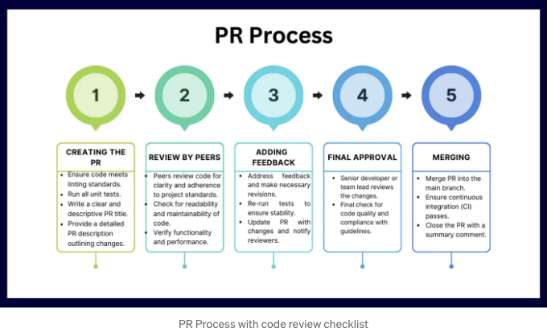

## 소개

React는 웹사이트와 웹 앱을 만드는 데 인기 있는 도구입니다. 그 유연성과 효율성으로 유명합니다. 그러나 React에서 코드를 작성하는 다양한 방법들이 있기 때문에, 우리의 코드를 깔끔하고 이해하기 쉽게 유지하는 것이 중요합니다. 그래서 React를 많이 다뤄온 사람으로서, React 코드 리뷰에 관한 몇 가지 간단하지만 효과적인 팁을 공유하고 싶습니다. 이 안내서는 우리의 React 코드가 최상의 상태에 있는지 확인하는 데 있습니다.

어떤 사람이라도 이해하기 쉬운 방식으로 React 코드를 확인하는 방법을 살펴볼 것입니다. 이 팁을 사용하려면 전문가일 필요는 없습니다! 코드를 정돈하고 좋은 실천 방법을 따르도록 도와주는 몇 가지 간단한 단계들을 진행할 것입니다. React를 처음 사용하거나 얼마나 오랫동안 사용하고 있던 중이든, 이 가이드라인을 통해 코드를 더 나아지고 작업하기 쉽게 만드는 데 도움을 받을 수 있을 것입니다. 그러니 함께 React 코드 리뷰의 세계로 여행을 시작해봅시다!

<!-- ui-log 수평형 -->
<ins class="adsbygoogle"
  style="display:block"
  data-ad-client="ca-pub-4877378276818686"
  data-ad-slot="9743150776"
  data-ad-format="auto"
  data-full-width-responsive="true"></ins>
<component is="script">
(adsbygoogle = window.adsbygoogle || []).push({});
</component>

덤으로 들어가기 전에 내 개인 웹 사이트에서 웹 개발에 대한 더 자세한 기사를 탐색해보세요:

## 1. Pre-Commit 훅으로 린트 활성화하기

리액트 프로젝트에서 Pre-Commit 훅을 구현하는 것은 코드 품질과 일관성을 보장하는 강력한 방법입니다. 이 프로세스는 코드를 커밋할 때마다 자동으로 린트하도록 설정하는 메커니즘을 설정하는 것을 포함하며, 변경 사항을 커밋할 때마다 코드를 자동으로 린트하고 프로젝트의 코딩 표준에서의 문제나 벗어남을 적발하여 저장소에 추가되기 전에 해결합니다.

```js
// package.json
{
  "husky": {
    "hooks": {
      "pre-commit": "eslint src/ --fix"
    }
  }
}
```  

<!-- ui-log 수평형 -->
<ins class="adsbygoogle"
  style="display:block"
  data-ad-client="ca-pub-4877378276818686"
  data-ad-slot="9743150776"
  data-ad-format="auto"
  data-full-width-responsive="true"></ins>
<component is="script">
(adsbygoogle = window.adsbygoogle || []).push({});
</component>

## Pre-Commit 훅의 장점

- 즉각적인 피드백: 개발자들은 코드에 대한 즉각적인 피드백을 받아 문제를 신속하게 식별하고 수정할 수 있습니다.
- 일관된 코드 품질: Pre-commit 훅을 통해 모든 기여가 동일한 품질 기준을 준수하게 됩니다.
- 코드 검토 시간 단축: 자동화된 린트 작업을 통해 코드 검토 프로세스는 구조적 및 논리적 측면에 더 집중할 수 있게 되어 문법이나 스타일 문제에 대해 덜 신경쓰게 됩니다.

React 프로젝트에 린팅을 위한 pre-commit 훅을 통합함으로써, 제정의된 코딩 표준을 준수하는 코드가 커밋된 것을 보장하여 깔끔하고 유지보수하기 좋은 코드베이스를 얻을 수 있습니다.

## PR 프로세스 확인하기

<!-- ui-log 수평형 -->
<ins class="adsbygoogle"
  style="display:block"
  data-ad-client="ca-pub-4877378276818686"
  data-ad-slot="9743150776"
  data-ad-format="auto"
  data-full-width-responsive="true"></ins>
<component is="script">
(adsbygoogle = window.adsbygoogle || []).push({});
</component>



## 2. 풀 리퀘스트(Pull Request)에 설명 요청하기

풀 리퀘스트(PR)에 명확하고 간결한 설명을 제공하는 것은 효과적인 코드 리뷰 프로세스를 위해 중요합니다. 이는 리뷰어에게 컨텍스트를 제공하여 변경 사항의 목적과 범위를 설명합니다. 다음은 정보를 제공하는 PR 설명을 작성하는 방법입니다:

```js
제목: 사용자 프로필 업데이트 기능 구현

설명:
- 사용자 정보를 업데이트하기 위해 사용자 프로필 페이지에 새 양식 추가.
- 폼 데이터를 백엔드로 제출하기 위한 API 호출 통합.
- 폼 필드에 대한 클라이언트 측 유효성 검사 포함.
- 모바일 기기에서 사용성을 보장하기 위해 폼에 반응형 디자인 구현.
- 새 컴포넌트 및 함수에 대한 유닛 테스트 추가.

참고:
- 사용자 세부 정보를 업데이트하는 백엔드 API는 이미 PR #123에서 병합됨.
- API가 활성화될 때까지 테스트를 위해 모의 데이터 사용 중.

화면 캡처:
- [양식 UI를 볼 수 있는 화면 캡처 또는 링크 첨부]
```

<!-- ui-log 수평형 -->
<ins class="adsbygoogle"
  style="display:block"
  data-ad-client="ca-pub-4877378276818686"
  data-ad-slot="9743150776"
  data-ad-format="auto"
  data-full-width-responsive="true"></ins>
<component is="script">
(adsbygoogle = window.adsbygoogle || []).push({});
</component>

풀 리퀘스트에 상세한 설명을 추가하는 것은 리뷰 프로세스를 원활하게 만들 뿐만 아니라 팀 간 커뮤니케이션을 강화하고 프로젝트 문서화에 도움이 됩니다.

## 3. 콘솔 로그 확인

프로덕션 코드에서 콘솔 로그를 제거하는 것은 일반적인 관행입니다. 콘솔 로그는 콘솔 출력을 혼란스럽게 만들 수 있고 민감한 정보를 노출할 수 있습니다. 콘솔 로그를 확인하는 중요성을 설명하는 예시를 살펴보겠습니다:

사용자 데이터를 가져오는 함수가 있다고 가정해보겠습니다:

<!-- ui-log 수평형 -->
<ins class="adsbygoogle"
  style="display:block"
  data-ad-client="ca-pub-4877378276818686"
  data-ad-slot="9743150776"
  data-ad-format="auto"
  data-full-width-responsive="true"></ins>
<component is="script">
(adsbygoogle = window.adsbygoogle || []).push({});
</component>

```js
async function fetchUserData(userId) {
    console.log("사용자 데이터를 가져오는 중:", userId);
    // 데이터를 가져오는 로직...
}
```

개발 환경에서 이 console.log 문은 디버깅에 도움이 됩니다만, 프로덕션 빌드에는 적합하지 않습니다. 구현 세부 정보를 노출시키고 정보 누출의 원인이 될 수 있습니다.

자동 제거: Webpack이나 Babel 플러그인과 같은 도구를 사용하여 빌드 프로세스 중에 console.log를 제거하세요.

## 4. ES6+ 기능 사용하기

<!-- ui-log 수평형 -->
<ins class="adsbygoogle"
  style="display:block"
  data-ad-client="ca-pub-4877378276818686"
  data-ad-slot="9743150776"
  data-ad-format="auto"
  data-full-width-responsive="true"></ins>
<component is="script">
(adsbygoogle = window.adsbygoogle || []).push({});
</component>

React 개발에 ES6+ 기능을 통합하면 코드를 현대화할 뿐만 아니라 더 간결하고 가독성 있게 만들어줍니다. ES6는 React 애플리케이션에서 널리 사용되는 다양한 새로운 기능을 소개했습니다.

```js
// 화살표 함수:
const handleClick = () => {
  console.log('버튼이 클릭되었습니다');
};

// 템플릿 리터럴:
const greeting = `안녕하세요, ${userName}!`;

// 구조 분해:
const { title, content } = this.props;

// 기본 매개변수:
const greet = (name = '손님')=> {
  console.log(`안녕하세요, ${name}`);
}
```

React 개발에서 ES6+ 기능을 채택함으로써 더 깔끔하고 효율적이며 유지보수가 쉬운 코드를 작성할 수 있습니다. 이를 통해 현대 JavaScript 기능을 최대한 활용할 수 있습니다.

## 5. 기술적 네이밍

<!-- ui-log 수평형 -->
<ins class="adsbygoogle"
  style="display:block"
  data-ad-client="ca-pub-4877378276818686"
  data-ad-slot="9743150776"
  data-ad-format="auto"
  data-full-width-responsive="true"></ins>
<component is="script">
(adsbygoogle = window.adsbygoogle || []).push({});
</component>

React에서 서술적 네이밍은 컴포넌트, 함수, 변수 및 props의 이름을 선택할 때 목적과 사용법을 명확하게 전달하는 것을 의미합니다. 이 관행은 코드의 가독성과 유지보수성을 높입니다.

아래는 React 코드 스니펫에서 서술적이지 않은 네이밍과 더 서술적인 네이밍을 비교한 내용입니다:

## 서술적이지 않은 예시

```js
import React, { useState } from 'react';

function Comp({ title }) {
  const [val, setVal] = useState('');
  const arr = ['React', 'Vue', 'Angular'];

  const update = (e) => {
    setVal(e.target.value);
  };

  return (
    <div>
      <h1>{title}</h1>
      <input type="text" value={val} onChange={update} />
      {arr.map((i, index) => <p key={index}>{i}</p>)}
    </div>
  );
}
```

<!-- ui-log 수평형 -->
<ins class="adsbygoogle"
  style="display:block"
  data-ad-client="ca-pub-4877378276818686"
  data-ad-slot="9743150776"
  data-ad-format="auto"
  data-full-width-responsive="true"></ins>
<component is="script">
(adsbygoogle = window.adsbygoogle || []).push({});
</component>

더 자세한 버전에서 각 변수, 함수, 그리고 컴포넌트 prop는 그 목적과 다루는 데이터 유형을 명확하게 전달하는 이름을 갖고 있습니다. 이렇게 하면 코드의 가독성과 유지 관리성이 향상됩니다.

## 6. 함수형 컴포넌트를 클래스 컴포넌트 대신 사용하기

<!-- ui-log 수평형 -->
<ins class="adsbygoogle"
  style="display:block"
  data-ad-client="ca-pub-4877378276818686"
  data-ad-slot="9743150776"
  data-ad-format="auto"
  data-full-width-responsive="true"></ins>
<component is="script">
(adsbygoogle = window.adsbygoogle || []).push({});
</component>

React 16.8 버전에서 Hooks가 소개되면서 함수형 컴포넌트가 상태(state)와 라이프사이클(lifecycle) 기능을 활용할 수 있게 되어, 기존에는 클래스 컴포넌트에서만 사용할 수 있었던 기능을 활용할 수 있게 되었습니다. 이 변경으로 React 애플리케이션을 작성하고 구조화하는 방식에 상당한 영향이 있습니다.

클래스 컴포넌트:

```js
class UserProfile extends React.Component {
  state = { user: null };

  componentDidMount() {
    fetchUser(this.props.userId).then(user => this.setState({ user }));
  }

  render() {
    const { user } = this.state;
    return user ? <div>{user.name}</div> : <div>Loading...</div>;
  }
}
```

함수형 컴포넌트:

<!-- ui-log 수평형 -->
<ins class="adsbygoogle"
  style="display:block"
  data-ad-client="ca-pub-4877378276818686"
  data-ad-slot="9743150776"
  data-ad-format="auto"
  data-full-width-responsive="true"></ins>
<component is="script">
(adsbygoogle = window.adsbygoogle || []).push({});
</component>

```js
function UserProfile({ userId }) {
  const [user, setUser] = useState(null);

  useEffect(() => {
    fetchUser(userId).then(setUser);
  }, [userId]);

  return user ? <div>{user.name}</div> : <div>Loading...</div>;
}
```

React 개발에서 함수형 컴포넌트로의 전환이 깔끔하고 가독성이 좋은 코드를 촉진하며 현대적인 React 기능의 모든 장점을 활용합니다.

## 7. Prop Types 및 Default Props

Prop Types 및 Default Props는 컴포넌트의 프롭스의 타입 안전성과 기본 동작을 보장하는 React에서 중요한 기능입니다.

<!-- ui-log 수평형 -->
<ins class="adsbygoogle"
  style="display:block"
  data-ad-client="ca-pub-4877378276818686"
  data-ad-slot="9743150776"
  data-ad-format="auto"
  data-full-width-responsive="true"></ins>
<component is="script">
(adsbygoogle = window.adsbygoogle || []).push({});
</component>

```js
import PropTypes from 'prop-types';

function UserGreeting({ name, age }) {
  return (
    <div>
      <h1>Hello, {name}!</h1>
      <p>Your age is {age} years.</p>
    </div>
  );
}

UserGreeting.propTypes = {
  name: PropTypes.string.isRequired,
  age: PropTypes.number
};

UserGreeting.defaultProps = {
  age: 18 // Default age if not provided
};
```

이 예시에서는 UserGreeting이 이름 (필수 문자열)과 나이 (숫자)를 기대합니다. 만약 나이가 제공되지 않으면, 기본값으로 18이 설정됩니다. PropTypes와 DefaultProps를 사용하면 컴포넌트의 견고함과 명확성이 향상됩니다.

## 8. React.memo를 사용하여 불필요한 렌더링 방지

React.memo는 함수형 컴포넌트의 렌더링 성능을 최적화하는 React의 하이어오더 컴포넌트입니다. 현재 및 새로운 props를 얕은 비교하여, props가 변경됐을 때에만 컴포넌트를 재렌더링하여 불필요한 렌더링을 방지합니다.```

<!-- ui-log 수평형 -->
<ins class="adsbygoogle"
  style="display:block"
  data-ad-client="ca-pub-4877378276818686"
  data-ad-slot="9743150776"
  data-ad-format="auto"
  data-full-width-responsive="true"></ins>
<component is="script">
(adsbygoogle = window.adsbygoogle || []).push({});
</component>

```js
const MyComponent = React.memo(({ text }) => {
  console.log('Rendering MyComponent');
  return <div>{text}</div>;
});

// 이 경우에는 MyComponent는 'text' prop이 변경될 때만 다시 렌더링됩니다.
```

React.memo를 사용하면 함수형 컴포넌트가 가능한 한 효율적으로 작동하도록 할 수 있어서 필요할 때만 업데이트하여 소중한 렌더링 리소스를 절약할 수 있습니다.

## 9. Lazy Loading 구현하기

React에서의 Lazy Loading은 페이지 로드 시 비필수 리소스의 로딩을 지연시키는 기술입니다. 코드를 논리적 중단점에서 분할하고 사용자가 필요할 때에만 로드하는 것이 핵심입니다.

<!-- ui-log 수평형 -->
<ins class="adsbygoogle"
  style="display:block"
  data-ad-client="ca-pub-4877378276818686"
  data-ad-slot="9743150776"
  data-ad-format="auto"
  data-full-width-responsive="true"></ins>
<component is="script">
(adsbygoogle = window.adsbygoogle || []).push({});
</component>

```js
import React, { Suspense, lazy } from 'react';

const LazyComponent = lazy(() => import('./LazyComponent'));

function App() {
  return (
    <div>
      <Suspense fallback={<div>Loading...</div>}>
        <LazyComponent />
      </Suspense>
    </div>
  );
}
```

레이지 로딩을 구현함으로써 React 애플리케이션의 성능을 크게 향상시킬 수 있습니다. 특히 로드 시간이 중요한 대규모 프로젝트에서 더욱 효과적입니다.

## 10. 접근성 (a11y) 체크

React에서 접근성 체크는 장애를 가진 사용자를 포함하여 가능한 많은 사람들이 웹 애플리케이션을 사용할 수 있도록 보장하는 것을 의미합니다. 이는 다양한 실천 방법을 포함합니다.

<!-- ui-log 수평형 -->
<ins class="adsbygoogle"
  style="display:block"
  data-ad-client="ca-pub-4877378276818686"
  data-ad-slot="9743150776"
  data-ad-format="auto"
  data-full-width-responsive="true"></ins>
<component is="script">
(adsbygoogle = window.adsbygoogle || []).push({});
</component>

## 주요 사항:

- 의미 있는 HTML: HTML 요소를 의도에 맞게 사용하세요.
- 키보드 탐색: 모든 상호작용 요소가 키보드를 사용하여 탐색할 수 있도록 해주세요.
- 스크린 리더 호환성: 콘텐츠가 스크린 리더를 위해 올바르게 구조화되고 레이블이 지정되었는지 확인하세요.
- ARIA 속성: ARIA(Accessible Rich Internet Applications) 속성을 사용하여 접근성을 향상시키세요, 특히 동적 콘텐츠와 고급 사용자 인터페이스 컨트롤에 대해.

```js
<button aria-label="팝업 닫기" onClick={closeModal}>
  닫기
</button>
```

정기적인 접근성 검사를 수행하면 React 어플리케이션이 웹 접근성 표준을 준수할 뿐만 아니라 모든 사용자에게 더 나은 사용자 경험을 제공하게 됩니다.

<!-- ui-log 수평형 -->
<ins class="adsbygoogle"
  style="display:block"
  data-ad-client="ca-pub-4877378276818686"
  data-ad-slot="9743150776"
  data-ad-format="auto"
  data-full-width-responsive="true"></ins>
<component is="script">
(adsbygoogle = window.adsbygoogle || []).push({});
</component>

## 11. 국제화 지원

국제화(일반적으로 i18n으로 약어함)은 React 애플리케이션을 설계하고 개발하는 것을 말하며, 엔지니어링 변경 없이 쉽게 다양한 언어와 지역에 대응할 수 있도록 합니다.

언어 지역화를 위해 react-i18next와 같은 라이브러리를 사용합니다:

```js
import React from 'react';
import { useTranslation } from 'react-i18next';

function Welcome() {
  const { t } = useTranslation();

  return <h1>{t('welcome_message')}</h1>;
}
```

<!-- ui-log 수평형 -->
<ins class="adsbygoogle"
  style="display:block"
  data-ad-client="ca-pub-4877378276818686"
  data-ad-slot="9743150776"
  data-ad-format="auto"
  data-full-width-responsive="true"></ins>
<component is="script">
(adsbygoogle = window.adsbygoogle || []).push({});
</component>

이 예시에서 t(`welcome_message`)는 사용자의 언어 설정에 따라 적절한 번역된 텍스트를 가져옵니다.

국제화를 구현함으로써, React 애플리케이션은 전 세계적인 사용자를 위해 더 접근성이 높고 사용자 친화적으로 만들어지며 사용자의 다양성을 인식하고 존중합니다.

## 12. 건설적인 피드백 제공

코드 리뷰 중 건설적인 피드백을 제공하는 것은 개발자가 코드와 이해력을 향상시키도록 도와주는 행동 가능하고 구체적이며 친절한 지침을 제공하는 것입니다.

<!-- ui-log 수평형 -->
<ins class="adsbygoogle"
  style="display:block"
  data-ad-client="ca-pub-4877378276818686"
  data-ad-slot="9743150776"
  data-ad-format="auto"
  data-full-width-responsive="true"></ins>
<component is="script">
(adsbygoogle = window.adsbygoogle || []).push({});
</component>

```js
작업 소개: "이 함수는 너무 복잡해요."
건설적 지적: "processData 함수는 데이터를 가져오고 서식을 지정하는 등 여러 작업을 처리하는 것으로 보입니다. fetchData 및 formatData와 같이 더 작은 함수로 분리하여 가독성을 높이고 단일 책임 원칙을 준수할 수 있도록 해보세요."
```

## 13. React 개발에서 안전한 보안 사례

React 애플리케이션에 대한 코드 검토를 진행할 때는 프로세스의 일부로 보안 검사를 포함하는 것이 중요합니다. 코드가 보안 모범 사례를 준수하는지 확인하는 것은 애플리케이션을 보호하기만 하는 것이 아니라 사용자 데이터를 안전하게 보호하는 데도 도움이 됩니다. 코드 검토 중에 집중해야 할 중요한 보안 측면은 다음과 같습니다:

- 사용자 입력 정제 문제

<!-- ui-log 수평형 -->
<ins class="adsbygoogle"
  style="display:block"
  data-ad-client="ca-pub-4877378276818686"
  data-ad-slot="9743150776"
  data-ad-format="auto"
  data-full-width-responsive="true"></ins>
<component is="script">
(adsbygoogle = window.adsbygoogle || []).push({});
</component>

dangerouslySetInnerHTML을 사용할 때, 안전하지 않은 입력은 XSS 공격으로 이어질 수 있습니다.

```js
function DangerousComponent({ htmlContent }) {
  return <div dangerouslySetInnerHTML={ __html: htmlContent } />;
}
```

리뷰 코멘트 및 해결책:

```js
// 리뷰 코멘트:
// 주의: unsanitized 입력을 사용하여 dangerouslySetInnerHTML을 사용하면 XSS 취약점이 발생할 수 있습니다.
// 제안: 렌더링하기 전에 DOMPurify와 같은 라이브러리를 사용하여 'htmlContent'를 살균화하거나 대안 렌더링 방법을 고려하십시오.
// 예시 해결책:
// import DOMPurify from 'dompurify';
// return <div dangerouslySetInnerHTML={ __html: DOMPurify.sanitize(htmlContent) } />;
```

<!-- ui-log 수평형 -->
<ins class="adsbygoogle"
  style="display:block"
  data-ad-client="ca-pub-4877378276818686"
  data-ad-slot="9743150776"
  data-ad-format="auto"
  data-full-width-responsive="true"></ins>
<component is="script">
(adsbygoogle = window.adsbygoogle || []).push({});
</component>

2. 안전하지 않은 API 호출

HTTP를 통해 API 호출을하거나 사용자 입력을 적절하게 인코딩하지 않으면 보안 취약점이 발생할 수 있습니다.

```
fetch(`http://api.example.com/data?param=${userInput}`)
```

리뷰 코멘트 및 해결책:

<!-- ui-log 수평형 -->
<ins class="adsbygoogle"
  style="display:block"
  data-ad-client="ca-pub-4877378276818686"
  data-ad-slot="9743150776"
  data-ad-format="auto"
  data-full-width-responsive="true"></ins>
<component is="script">
(adsbygoogle = window.adsbygoogle || []).push({});
</component>

```js
// 리뷰 코멘트:
// 보안 경고: API 호출은 데이터 이동을 보호하기 위해 HTTPS를 사용해야 하며, 사용자 입력은 올바르게 인코딩되어야 합니다.
// 예시 솔루션:
// 'userInput'에 대해 encodeURIComponent를 사용하고 HTTPS로 전환하세요.
// fetch(`https://api.example.com/data?param=${encodeURIComponent(userInput)}`)
```

하드코딩된 민감한 데이터

API 키와 같은 중요한 정보를 하드코딩하는 것은 코드가 노출될 경우 보안 위반에 이어질 수 있습니다.

```js
const API_KEY = "12345-SECRET-API-KEY";
```

<!-- ui-log 수평형 -->
<ins class="adsbygoogle"
  style="display:block"
  data-ad-client="ca-pub-4877378276818686"
  data-ad-slot="9743150776"
  data-ad-format="auto"
  data-full-width-responsive="true"></ins>
<component is="script">
(adsbygoogle = window.adsbygoogle || []).push({});
</component>

```js
// 리뷰 코멘트:
// 보안 문제: API 키와 같은 민감한 토큰을 하드코딩하는 것은 보안 취약점으로 이어질 수 있습니다.
// 권장 사항: 중요한 정보를 저장하는 데 환경 변수를 사용하십시오.
// 예시 솔루션:
// const API_KEY = process.env.REACT_APP_API_KEY;
```

이러한 보안 중심의 점검 사항을 코드 검토 프로세스에 통합하면 React 애플리케이션의 전반적인 안전성과 무결성이 향상됩니다.

## 외부 자료: React 스타일 가이드

React의 이해와 숙련도를 더 향상시키기 위해 다양한 스타일 가이드를 탐색하는 것이 중요합니다. 이 가이드는 React 커뮤니티에서 채택한 모범 사례, 코딩 규칙 및 패턴에 대한 통찰을 제공합니다. 여기 몇 가지 필수 자원이 있습니다:```

<!-- ui-log 수평형 -->
<ins class="adsbygoogle"
  style="display:block"
  data-ad-client="ca-pub-4877378276818686"
  data-ad-slot="9743150776"
  data-ad-format="auto"
  data-full-width-responsive="true"></ins>
<component is="script">
(adsbygoogle = window.adsbygoogle || []).push({});
</component>

- Airbnb React/JSX 스타일 가이드: Airbnb React/JSX 스타일 가이드
- Google JavaScript 스타일 가이드: Google JavaScript 스타일 가이드
- React/Redux 스타일 가이드: React/Redux 스타일 가이드
- StandardJS: StandardJS

# 결론

React 코딩 리뷰를 위한 최상의 실천 방법을 경험하면서 우리는 중요한 깨달음에 다다르게 됩니다: 좋은 코드는 기능뿐만 아니라 명확성, 유지보수 가능성 및 협업에 관한 것입니다. 린팅과 프리커밋 후크를 활용하고 명확한 PR 설명을 작성하며 명명 규칙을 준수하고 모던한 React 기능을 받아들이는 등의 실천 방법을 통해, 우리는 코드의 기반이 다루기 쉬우면서도 시간과 팀워크를 견디는 코드를 만듭니다.

기억하세요, 우리가 작성하는 각 줄의 코드는 기계가 실행하는 것뿐만 아니라 사람이 읽고 이해하는 데도 사용됩니다. 이러한 지침을 채택함으로써 우리는 우리의 코드를 향상시키는 것뿐만 아니라 전체 개발 프로세스를 높이는 우수성과 공유된 이해를 육성합니다. 자랑스러워할 수 있는 React 코드를 계속해서 작성하며, 품질에 대한 우리의 헌신과 소프트웨어 개발에 대한 헌신이 반영된 코드를 만들어가 봅시다.

<!-- ui-log 수평형 -->
<ins class="adsbygoogle"
  style="display:block"
  data-ad-client="ca-pub-4877378276818686"
  data-ad-slot="9743150776"
  data-ad-format="auto"
  data-full-width-responsive="true"></ins>
<component is="script">
(adsbygoogle = window.adsbygoogle || []).push({});
</component>

행복한 코딩!

이 기사를 즐겁게 읽으셨나요? 웹 개발에 대한 깊이있는 토론과 통찰을 더 보시려면 개인 블로그 Program With Jayanth를 방문해보세요.

# PlainEnglish.io 🚀

In Plain English 커뮤니티의 일원이 되어 주셔서 감사합니다! 이전에 가기 전에:

<!-- ui-log 수평형 -->
<ins class="adsbygoogle"
  style="display:block"
  data-ad-client="ca-pub-4877378276818686"
  data-ad-slot="9743150776"
  data-ad-format="auto"
  data-full-width-responsive="true"></ins>
<component is="script">
(adsbygoogle = window.adsbygoogle || []).push({});
</component>

- 작가에게 박수를 보내주시고 팔로우도 해주세요️
- In Plain English에 글을 쓸 수 있는 방법을 배워보세요️
- 팔로우하기: X | LinkedIn | YouTube | Discord | 뉴스레터
- 다른 플랫폼 방문하기: Stackademic | CoFeed | Venture