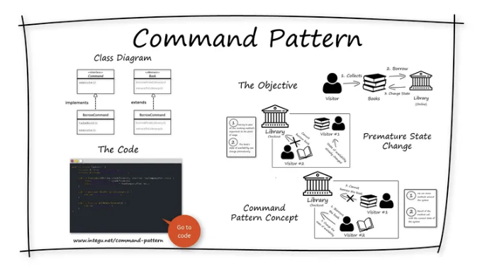

안녕하세요, 여러분, Diyorbek입니다. 깔끔하고 유지보수가 쉬운 코드를 작성하는 데 열정을 가진 프론트엔드 개발자입니다. 오늘은 최근에 배운 멋진 기술인 Command Pattern에 대해 함께 공유하고 싶습니다. 이 기술은 코드를 더 유연하고 관리하기 쉽게 만드는 데 큰 역할을 합니다. 온라인 음식 주문 시스템에서 실제 예시로 살펴보면 더욱 재미있을 거예요.

온라인 음식 주문 앱을 만든다고 가정해봅시다. 사용자는 주문을 생성하고 추적하며 마음이 바뀌면 취소할 수 있습니다. 처음에는 OrderManager 클래스를 만들어 이러한 모든 작업을 직접 처리했습니다. 잘 작동했지만 코드가 커지면서 조금 복잡해 보였습니다.

이럴 때 Command Pattern이 구조를 정리하는 데 도움이 되었습니다. OrderManager 클래스 내에 placeOrder, trackOrder, cancelOrder와 같은 별도의 메서드가 아닌 명령(command)을 사용하여 리팩토링하기로 결정했습니다. 각 명령은 특정 작업을 처리하는 논리를 포함한 작은 패키지처럼 작동합니다.

<!-- ui-log 수평형 -->
<ins class="adsbygoogle"
  style="display:block"
  data-ad-client="ca-pub-4877378276818686"
  data-ad-slot="9743150776"
  data-ad-format="auto"
  data-full-width-responsive="true"></ins>
<component is="script">
(adsbygoogle = window.adsbygoogle || []).push({});
</component>

여기에 저의 작업 내용이 있어요:

```js
class OrderManager {
  constructor() {
    this.orders = [];
  }

  execute(command, ...args) {
    return command.execute(this.orders, ...args);
  }
}

class Command {
  constructor(execute) {
    this.execute = execute;
  }
}

function PlaceOrderCommand(order, id) {
  return new Command((orders) => {
    orders.push({ id, order });
    console.log(`성공적으로 ${order} (${id})를 주문하셨습니다.`);
  });
}

function CancelOrderCommand(id) {
  return new Command((orders) => {
    orders = orders.filter((order) => order.id !== id);
    console.log(`${id} 주문이 취소되었습니다.`);
  });
}

function TrackOrderCommand(id) {
  return new Command(() => {
    console.log(`${id} 주문이 20분 내에 도착할 예정입니다.`);
  });
}

const manager = new OrderManager();

manager.execute(PlaceOrderCommand("피자", "1234"));
manager.execute(PlaceOrderCommand("버거", "5678"));
manager.execute(TrackOrderCommand("1234"));
manager.execute(CancelOrderCommand("5678"));
```

이 설정을 사용하면 OrderManager에서 메서드를 직접 호출하는 대신 명령을 실행하도록 요청합니다. 이것은 그저 레시피를 따르는 것과 같아요! 이 접근 방식을 통해 명령을 쉽게 바꾸거나 수정할 수 있어 코드가 유연해지게 됩니다. 

Command Pattern에는 여러 가지 이점이 있어요:

<!-- ui-log 수평형 -->
<ins class="adsbygoogle"
  style="display:block"
  data-ad-client="ca-pub-4877378276818686"
  data-ad-slot="9743150776"
  data-ad-format="auto"
  data-full-width-responsive="true"></ins>
<component is="script">
(adsbygoogle = window.adsbygoogle || []).push({});
</component>

- 격리: 각 명령은 고유한 개체 내에 캡슐화되어 있어서 테스트하고 유지하기 쉽습니다.
- 제어: 명령은 특정 시간에 대기열에 추가되거나 실행되어 작업 흐름을 더욱 제어할 수 있습니다.
- 유연성: 명령은 실행하는 개체와 분리되어 있어서 쉽게 변경하고 향상시킬 수 있습니다.

물론, 어떤 패턴이든 단점이 있습니다. 특히 간단한 프로젝트에서는 약간의 추가 코드를 도입할 수 있습니다. 그러나 코드 구성 및 유연성 측면에서 제공하는 이점은 복잡성을 훨씬 능가합니다.

요약하자면, 명령 패턴은 코드 유지보수 및 유연성을 향상시키는 강력한 도구입니다. 작업을 명령으로 캡슐화함으로써 코드를 더 모듈화하고, 테스트하기 쉽고, 확장하기 쉽게 만들 수 있습니다. 그러니 다음에 복잡한 코드와 씨름할 때는 명령 패턴을 시도해 보세요. 즐거운 코딩하세요!

이 글이 도움이 되었고 영감을 줬으면 좋겠습니다. 궁금한 점이나 생각이 있으시면 언제든 연락해 주세요. 다음에 또 만나요! 즐거운 코딩되세요!

<!-- ui-log 수평형 -->
<ins class="adsbygoogle"
  style="display:block"
  data-ad-client="ca-pub-4877378276818686"
  data-ad-slot="9743150776"
  data-ad-format="auto"
  data-full-width-responsive="true"></ins>
<component is="script">
(adsbygoogle = window.adsbygoogle || []).push({});
</component>

텔레그램 || 유튜브 || 깃허브 || 리트 코드 || 링크드인 || 트위터