리액트 앱을 배포하고 볼 수 있는 가장 빠른 방법 중 하나는 호스팅이나 도메인 이름에 돈을 지불하지 않고 AWS S3에 배포하는 것입니다.

이미지를 참조하세요: [HowToDeployAReactAppToAWSS3_0.png](./img/HowToDeployAReactAppToAWSS3_0.png)

AWS S3는 대량의 비구조화된 데이터를 저장할 수 있는 저장 서비스입니다. 일반적으로 S3에는 프로그래밍적으로 또는 수동으로 이미지, 비디오, 문서와 같은 모든 종류의 파일(이를 S3에서 오브젝트라고 함)을 저장할 수 있습니다.

테스트나 기타 목적으로 종종 우리는 리액트 앱을 구축하고 웹에서 액세스할 수 있는 곳에 앱을 호스팅하고자 합니다.

<!-- ui-log 수평형 -->
<ins class="adsbygoogle"
  style="display:block"
  data-ad-client="ca-pub-4877378276818686"
  data-ad-slot="9743150776"
  data-ad-format="auto"
  data-full-width-responsive="true"></ins>
<component is="script">
(adsbygoogle = window.adsbygoogle || []).push({});
</component>

이를 수행하는 인기있는 방법 중 하나는 CICD 파이프라인을 생성하고 프로젝트 파일의 변경 사항이 호스팅 제공업체에 배포되도록 트리거하고 앱의 최신 변경 사항을 프로덕션에 업데이트하는 것입니다.

나중에이 작업을 어떻게 수행할지에 대한 기사를 작성할 예정이지만, 이 기사에서는 리액트 JS 웹 앱을 Amazon S3에 빠르고 쉽게 배포하는 방법에 초점을 맞출 것입니다. 이렇게하면 돈을 쓰지 않고 즉시 확인할 수 있습니다.

# S3 버킷 설정

먼저 할 일은 리액트 앱을 호스팅할 S3 버킷을 생성하고 설정하는 것입니다.

<!-- ui-log 수평형 -->
<ins class="adsbygoogle"
  style="display:block"
  data-ad-client="ca-pub-4877378276818686"
  data-ad-slot="9743150776"
  data-ad-format="auto"
  data-full-width-responsive="true"></ins>
<component is="script">
(adsbygoogle = window.adsbygoogle || []).push({});
</component>

이를 위해서 S3 콘솔로 이동하세요. 새 버킷을 만들고 my-react-app 또는 비슷한 이름을 붙이세요.

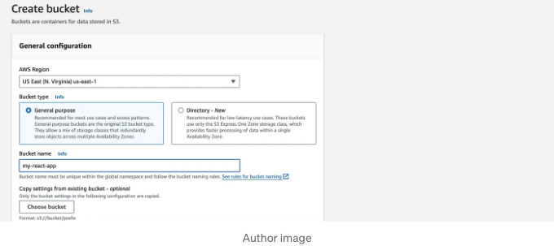

아래에서 Object Ownership 아래에 ACLs 활성화 옵션을 선택하세요.

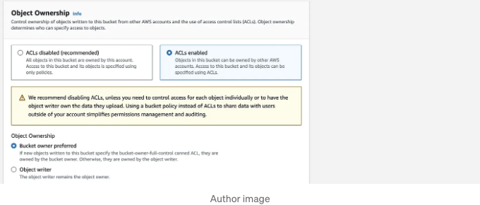

<!-- ui-log 수평형 -->
<ins class="adsbygoogle"
  style="display:block"
  data-ad-client="ca-pub-4877378276818686"
  data-ad-slot="9743150776"
  data-ad-format="auto"
  data-full-width-responsive="true"></ins>
<component is="script">
(adsbygoogle = window.adsbygoogle || []).push({});
</component>

다시 하단에 공개 액세스 설정의 모든 확인란을 해제해 주세요:

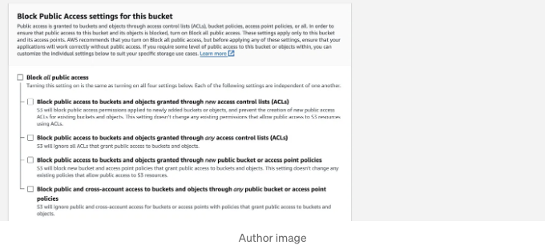

이제 '버킷 만들기' 아래의 주황색 버튼을 클릭하여 버킷을 생성할 수 있습니다.

생성한 버킷을 클릭하여 '권한' 탭으로 이동해 주세요.

<!-- ui-log 수평형 -->
<ins class="adsbygoogle"
  style="display:block"
  data-ad-client="ca-pub-4877378276818686"
  data-ad-slot="9743150776"
  data-ad-format="auto"
  data-full-width-responsive="true"></ins>
<component is="script">
(adsbygoogle = window.adsbygoogle || []).push({});
</component>

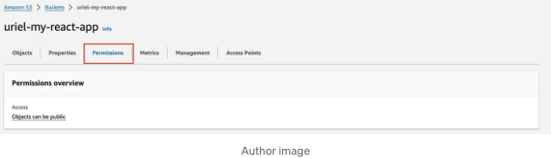

아래에서 "버킷 정책 편집"이라고 표시된 섹션을 볼 수 있습니다. 편집을 클릭하고 다음 정책을 추가하여 S3 버킷에 액세스할 수 있도록 설정하세요:

```js
{
    "Version": "2012-10-17",
    "Statement": [
        {
            "Sid": "PublicReadGetObject",
            "Effect": "Allow",
            "Principal": "*",
            "Action": "s3:GetObject",
            "Resource": "arn:aws:s3:::uriel-my-react-app/*"
        }
    ]
}
```

Resource의 값을 "uriel-my-react-app"처럼 제 이름이 아닌 자신의 버킷 이름으로 변경하는 것을 잊지 마세요.

<!-- ui-log 수평형 -->
<ins class="adsbygoogle"
  style="display:block"
  data-ad-client="ca-pub-4877378276818686"
  data-ad-slot="9743150776"
  data-ad-format="auto"
  data-full-width-responsive="true"></ins>
<component is="script">
(adsbygoogle = window.adsbygoogle || []).push({});
</component>

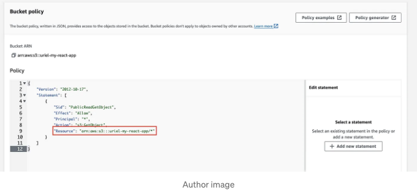

이제 필요한 권한을 설정했으므로 버킷을 정적 웹 사이트로 호스팅할 수 있습니다.

버킷 페이지로 돌아가서 속성 탭을 클릭합니다.

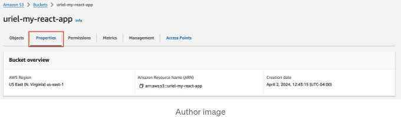

<!-- ui-log 수평형 -->
<ins class="adsbygoogle"
  style="display:block"
  data-ad-client="ca-pub-4877378276818686"
  data-ad-slot="9743150776"
  data-ad-format="auto"
  data-full-width-responsive="true"></ins>
<component is="script">
(adsbygoogle = window.adsbygoogle || []).push({});
</component>

맨 아래까지 스크롤하여 정적 웹사이트 호스팅 섹션을 찾아보세요.

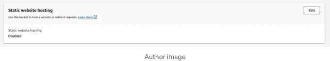

편집 버튼을 클릭하면 다른 페이지로 이동합니다.

여기서 enable을 선택한 후 다른 선택지는 기본 설정으로 남겨두시면 됩니다.

<!-- ui-log 수평형 -->
<ins class="adsbygoogle"
  style="display:block"
  data-ad-client="ca-pub-4877378276818686"
  data-ad-slot="9743150776"
  data-ad-format="auto"
  data-full-width-responsive="true"></ins>
<component is="script">
(adsbygoogle = window.adsbygoogle || []).push({});
</component>


아래와 같이 변경해주세요:

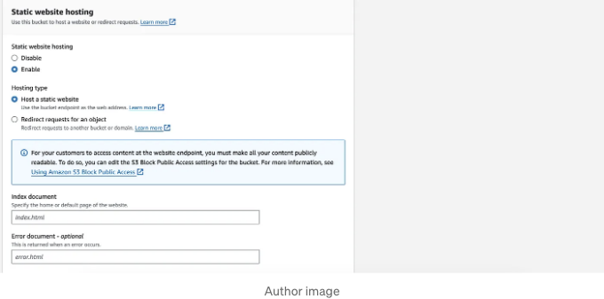

이제 인덱스 문서를 작성할 차례입니다. "index.html"을 입력하고 선택적인 오류 문서는 아무것도 작성하지 않습니다.

이제 변경 사항을 저장하시면 됩니다.

이제 여러분의 버킷은 정적 웹 사이트를 호스팅할 준비가 되었습니다.

<!-- ui-log 수평형 -->
<ins class="adsbygoogle"
  style="display:block"
  data-ad-client="ca-pub-4877378276818686"
  data-ad-slot="9743150776"
  data-ad-format="auto"
  data-full-width-responsive="true"></ins>
<component is="script">
(adsbygoogle = window.adsbygoogle || []).push({});
</component>

# 우리의 리액트 앱 만들기

원하는 IDE를 사용하여 리액트 앱 프로젝트를 찾아 열어봅니다. 저는 VSCode를 사용하고 있어요. 제 리액트 앱을 열어 빌드했습니다.

저는 Vite(리액트 번들러)를 사용하고 있으니, CLI에 다음 명령어를 입력했어요:

```js
vite run build
```

<!-- ui-log 수평형 -->
<ins class="adsbygoogle"
  style="display:block"
  data-ad-client="ca-pub-4877378276818686"
  data-ad-slot="9743150776"
  data-ad-format="auto"
  data-full-width-responsive="true"></ins>
<component is="script">
(adsbygoogle = window.adsbygoogle || []).push({});
</component>

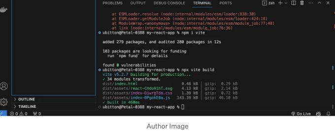

번들러는 빌드 파일을 dist 폴더에 출력합니다.

일반 React 또는 Next JS를 사용하는 경우, 앱을 빌드하는 빌드 명령어를 찾으세요. Create React App (CRA) 번들러를 사용하는 경우 명령어는 다음과 같습니다:

```js
npm run build
```

<!-- ui-log 수평형 -->
<ins class="adsbygoogle"
  style="display:block"
  data-ad-client="ca-pub-4877378276818686"
  data-ad-slot="9743150776"
  data-ad-format="auto"
  data-full-width-responsive="true"></ins>
<component is="script">
(adsbygoogle = window.adsbygoogle || []).push({});
</component>

앱을 빌드한 후 CRA를 사용했다면 빌드 폴더의 모든 파일을 가져와서 또는 Vite를 사용했다면 dist 폴더의 파일을 가져와서 S3 버킷에 업로드하세요.

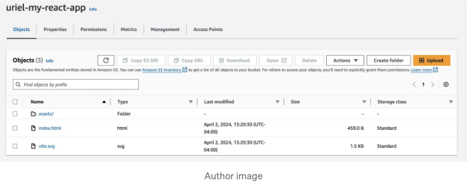

내 Vite 빌드 파일을 업로드했어요 — 거기에는 컴파일된 index.html 파일과 소스 코드가 포함된 assets 폴더가 있습니다.

이게 다에요!

<!-- ui-log 수평형 -->
<ins class="adsbygoogle"
  style="display:block"
  data-ad-client="ca-pub-4877378276818686"
  data-ad-slot="9743150776"
  data-ad-format="auto"
  data-full-width-responsive="true"></ins>
<component is="script">
(adsbygoogle = window.adsbygoogle || []).push({});
</component>

# React 앱 보기

마침내, 앱을 보려면 S3 버킷으로 돌아가서 정적 웹사이트 호스팅을 활성화한 속성 탭을 클릭하면 됩니다.

이 섹션에서는 이제 URL이 표시됩니다. 해당 URL을 클릭하면 React 웹 앱을 볼 수 있습니다.

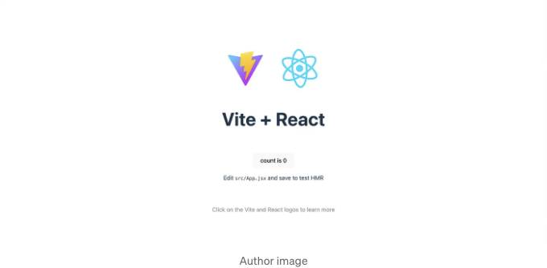

<!-- ui-log 수평형 -->
<ins class="adsbygoogle"
  style="display:block"
  data-ad-client="ca-pub-4877378276818686"
  data-ad-slot="9743150776"
  data-ad-format="auto"
  data-full-width-responsive="true"></ins>
<component is="script">
(adsbygoogle = window.adsbygoogle || []).push({});
</component>

다음 프로젝트에 유용하고 실용적인 것을 배웠으면 좋겠어요!

안부 인사를 남기고 👋, 저와 협력하고 제 소셜 미디어를 함께 살펴보세요:

- LinkedIn
- Twitter (X)
- Threads
- Instagram
- Facebook

좋아하셨다면 👏 눌러주시고 더 많은 내용을 보시려면 팔로우해주세요.

<!-- ui-log 수평형 -->
<ins class="adsbygoogle"
  style="display:block"
  data-ad-client="ca-pub-4877378276818686"
  data-ad-slot="9743150776"
  data-ad-format="auto"
  data-full-width-responsive="true"></ins>
<component is="script">
(adsbygoogle = window.adsbygoogle || []).push({});
</component>

Uriel