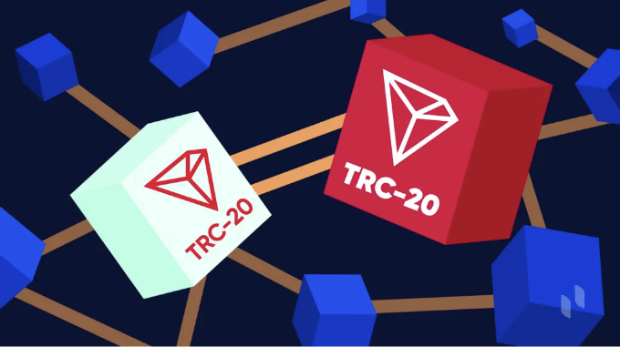

TRC20 토큰은 앞으로의 암호화폐 시장을 형성할 것이라고 예측된다. 그 이유는 그 신속성 때문인데, TRON 블록체인 위에서 구축되어 있기 때문에 비트코인이나 이더리움과 같은 전통적인 암호화폐보다 빠른 거래 속도를 제공합니다. TRON 네트워크는 높은 처리량 능력으로 유명하며, 이를 통해 TRC20 토큰이 신속하게 거래를 처리할 수 있어 금융, 게임, 탈중앙화 애플리케이션(dApps)과 같이 시간이 중요한 산업에서 이상적으로 활용될 수 있습니다.

특히 금융, 게임, dApps와 같이 시간이 중요한 산업에서 이 속도는 큰 변화를 가져옵니다. TRC20 토큰을 사용하면 사용자들은 거래 속도를 절대적으로 높일 수 있으며, 다른 암호화폐와 관련된 긴 대기 시간을 제거할 수 있습니다. 더 빠르고 확장 가능한 블록체인 솔루션에 대한 수요가 계속해서 증가함에 따라, TRC20 토큰은 암호화폐 거래에서 속도와 효율이 표준이 되는 미래로 나아가는 것을 주도할 준비가 되어 있습니다.

# TRC20 토큰이란 무엇인가요?

<!-- ui-log 수평형 -->
<ins class="adsbygoogle"
  style="display:block"
  data-ad-client="ca-pub-4877378276818686"
  data-ad-slot="9743150776"
  data-ad-format="auto"
  data-full-width-responsive="true"></ins>
<component is="script">
(adsbygoogle = window.adsbygoogle || []).push({});
</component>

TRC20 토큰은 TRON 블록체인 네트워크에서 운영되는 암호화폐 토큰의 한 유형입니다. 이들은 TRC20 토큰 표준을 기반으로 하며, 이는 TRON 네트워크에서 토큰이 어떻게 생성, 전송, 관리될지를 규정하는 규칙과 프로토콜을 정의합니다. TRC20 토큰은 TRON 네트워크와 완벽하게 호환되며, 모든 TRON 호환 지갑을 사용하여 저장하고 관리할 수 있습니다.

TRC20 토큰의 주요 기능 중 하나는 스마트 계약을 지원할 수 있는 능력입니다. 스마트 계약은 구매자와 판매자 간의 계약 조건이 직접 코드 줄에 작성되는 자가 실행 계약으로, 이 기능을 통해 개발자는 TRON 네트워크에서 실행할 수 있는 복잡한 탈중앙화 애플리케이션(dApp) 및 스마트 계약을 만들 수 있습니다. TRC20 토큰은 빠른 거래 속도와 낮은 수수료로 알려져 있어, 가치를 신속하게 비용 효율적으로 이체하고자 하는 사용자에게 매력적인 선택지가 됩니다.

## 왜 TRON 네트워크에서 암호화폐 토큰을 개발해야 할까요?

TRON 네트워크에서 암호화폐 토큰을 개발하면 여러 가지 이점이 있습니다:

<!-- ui-log 수평형 -->
<ins class="adsbygoogle"
  style="display:block"
  data-ad-client="ca-pub-4877378276818686"
  data-ad-slot="9743150776"
  data-ad-format="auto"
  data-full-width-responsive="true"></ins>
<component is="script">
(adsbygoogle = window.adsbygoogle || []).push({});
</component>

### 확장성
TRON은 초당 수천 건의 거래를 처리할 수 있는 높은 처리량을 자랑하며, 토큰 거래가 신속하고 효율적으로 처리됨을 보장합니다.

### 비용 효율성
TRON의 네트워크 수수료는 일반적으로 다른 블록체인 플랫폼과 비교했을 때 낮아 비용 효율적으로 토큰을 배포하고 관리할 수 있습니다.

### 사용자 친화성
TRON의 플랫폼은 사용자 친화적으로 설계되어 있으며, 개발자가 쉽게 토큰을 생성하고 관리할 수 있도록 도구와 문서가 잘 갖춰져 있습니다.

### 스마트 계약 지원
TRON은 스마트 계약을 지원하여 사용자가 맞춤형 토큰 기능 및 자동화 프로세스와 같은 고급 토큰 기능을 생성할 수 있게 합니다.

<!-- ui-log 수평형 -->
<ins class="adsbygoogle"
  style="display:block"
  data-ad-client="ca-pub-4877378276818686"
  data-ad-slot="9743150776"
  data-ad-format="auto"
  data-full-width-responsive="true"></ins>
<component is="script">
(adsbygoogle = window.adsbygoogle || []).push({});
</component>

↪ 커뮤니티 및 채택: TRON은 거대하고 활발한 커뮤니티를 보유하고 있어 귀하의 토큰이 TRON 생태계 내에서 시인성을 얻고 채택될 가능성이 높습니다.

↪ 상호 운용성: TRON은 다른 블록체인과 호환되도록 설계되어 기존 블록체인 프로젝트 및 네트워크와 쉽게 통합할 수 있습니다.

전반적으로, TRON 네트워크에서의 암호화 토큰 개발은 확장 가능하고 비용 효율적이며 사용자 친화적인 플랫폼을 제공하여 귀하의 토큰을 출시하고 관리할 수 있는 장점이 있으며, 더 많은 커뮤니티 채택과 상호 운용성의 가능성을 제공합니다.

## TRC-20 토큰의 주요 기능

<!-- ui-log 수평형 -->
<ins class="adsbygoogle"
  style="display:block"
  data-ad-client="ca-pub-4877378276818686"
  data-ad-slot="9743150776"
  data-ad-format="auto"
  data-full-width-responsive="true"></ins>
<component is="script">
(adsbygoogle = window.adsbygoogle || []).push({});
</component>

TRC-20 토큰의 한 가지 주요 특징은 TRON 블록체인과의 호환성입니다. TRC-20 토큰은 TRON 네트워크의 기술 표준에 기반하여 만들어졌기 때문에 TRON 생태계 내에서 쉽게 생성, 이체, 관리할 수 있습니다. 이러한 토큰들은 암호화폐, 스테이블코인, 유틸리티 토큰을 포함한 다양한 디지털 자산을 대표할 수 있습니다.

TRC-20 토큰은 이더리움 네트워크의 ERC-20 토큰과 유사하게 기능과 사용 사례 측면에서 동일합니다. 이들은 크라우드펀딩, 탈중앙화 애플리케이션(DApps) 개발, 탈중앙화 거래소(Dexs) 운영 등 다양한 목적으로 활용될 수 있습니다.

TRC-20 토큰의 주목할만한 특징 중 하나는 스마트 계약을 지원한다는 것입니다. 이를 통해 개발자들은 자동 거래, 토큰 소각, 토큰 동결과 같은 특정 기능을 토큰에 프로그래밍할 수 있습니다. 스마트 계약은 또한 TRC-20 토큰과 상호작용할 수 있는 복잡한 탈중앙화 애플리케이션을 만들 수 있도록 합니다.

전반적으로, TRC-20 토큰은 TRON 블록체인 상에서 디지털 자산과 탈중앙화 애플리케이션을 만드는 다목적이고 강력한 플랫폼을 제공합니다.

<!-- ui-log 수평형 -->
<ins class="adsbygoogle"
  style="display:block"
  data-ad-client="ca-pub-4877378276818686"
  data-ad-slot="9743150776"
  data-ad-format="auto"
  data-full-width-responsive="true"></ins>
<component is="script">
(adsbygoogle = window.adsbygoogle || []).push({});
</component>

## TRC-20 토큰의 혜택

TRON 블록체인에서 TRC-20 토큰을 사용하는 여러 가지 혜택이 있습니다:

➵ 상호 운용성:

- TRC-20 토큰은 TRON 블록체인과 호환되어 다른 TRON 기반 프로젝트 및 애플리케이션과의 원활한 통합을 허용합니다.

<!-- ui-log 수평형 -->
<ins class="adsbygoogle"
  style="display:block"
  data-ad-client="ca-pub-4877378276818686"
  data-ad-slot="9743150776"
  data-ad-format="auto"
  data-full-width-responsive="true"></ins>
<component is="script">
(adsbygoogle = window.adsbygoogle || []).push({});
</component>

➵ 수수료 낮음:

- TRON 네트워크는 일반적으로 다른 블록체인 네트워크에 비해 낮은 거래 수수료를 가지고 있어 TRC-20 토큰을 전송하는 데 비용 효율적입니다.

➵ 높은 확장성:

- TRON 네트워크는 높은 처리량을 처리할 수 있는 능력을 가지고 있어 TRC-20 토큰 전송을 신속하고 효율적으로 처리할 수 있습니다.

<!-- ui-log 수평형 -->
<ins class="adsbygoogle"
  style="display:block"
  data-ad-client="ca-pub-4877378276818686"
  data-ad-slot="9743150776"
  data-ad-format="auto"
  data-full-width-responsive="true"></ins>
<component is="script">
(adsbygoogle = window.adsbygoogle || []).push({});
</component>

➵ 스마트 계약 지원:

- TRC-20 토큰은 스마트 계약에 기반하며, 개발자들이 자동 이체 및 토큰 소각과 같은 특정 기능을 프로그래밍 할 수 있습니다.

➵ 탈중앙화:

- TRON은 탈중앙화된 블록체인 네트워크로, TRC-20 토큰은 어떤 단일 엔티티에도 제어되지 않아 보안과 신뢰성이 높아집니다.

<!-- ui-log 수평형 -->
<ins class="adsbygoogle"
  style="display:block"
  data-ad-client="ca-pub-4877378276818686"
  data-ad-slot="9743150776"
  data-ad-format="auto"
  data-full-width-responsive="true"></ins>
<component is="script">
(adsbygoogle = window.adsbygoogle || []).push({});
</component>

➵ 커뮤니티 및 채택:

- TRON은 크고 활발한 커뮤니티를 보유하고 있어, TRC-20 토큰의 채택 및 사용을 생태계 내에서 촉진하는 데 도움이 될 수 있습니다.

전반적으로, TRC-20 토큰은 상호 운용성, 낮은 거래 수수료, 확장성, 스마트 계약 지원, 탈중앙화 및 커뮤니티 채택과 같은 다양한 혜택을 제공하여, TRON 블록체인 상에서 디지털 자산을 만드는 인기 있는 선택지가 되었습니다.

## TRC20 토큰 개발: 어떤 단계가 있나요?

<!-- ui-log 수평형 -->
<ins class="adsbygoogle"
  style="display:block"
  data-ad-client="ca-pub-4877378276818686"
  data-ad-slot="9743150776"
  data-ad-format="auto"
  data-full-width-responsive="true"></ins>
<component is="script">
(adsbygoogle = window.adsbygoogle || []).push({});
</component>

TRC-20 토큰을 개발하려면 몇 가지 주요 단계를 거쳐야 합니다:

- 토큰 속성 정의: 토큰의 이름, 심볼, 총 공급량 및 소수 자리를 결정합니다.
- 지갑 선택: TRC-20 토큰을 지원하는 지갑을 선택하여 토큰을 보관하고 관리합니다.
- 개발 환경 설정: TRON 블록체인에 스마트 계약을 생성하고 배포하기 위해 TronBox 및 TronLink와 같은 필요한 개발 도구를 설치합니다.
- 스마트 계약 작성: TRC-20 표준을 준수하는 스마트 계약을 개발합니다. 이 계약에는 토큰 이체, 잔액 확인 등의 표준 ERC-20 기능이 포함되어야 합니다.
- 스마트 계약 테스트: 기능 및 보안을 확인하기 위해 테스트 네트워크 또는 로컬 블록체인을 사용하여 스마트 계약을 테스트합니다.
- 스마트 계약 배포: TronBox 또는 유사한 도구를 사용하여 스마트 계약을 TRON 메인넷 또는 테스트넷에 배포합니다.
- 계약 배포 검증: 스마트 계약이 성공적으로 배포되었고 의도한 대로 작동하는지 확인합니다.
- 토큰 배포: 스마트 계약의 전송 기능을 사용하여 사용자나 투자자에게 토큰을 분배합니다.
- 토큰 사용 모니터링: 프로젝트 목표를 달성하는지 확인하기 위해 토큰 사용량과 성능을 지속적으로 추적합니다.
- 유지보수 및 업데이트: 버그 수정, 새로운 기능 추가, 보안 향상을 위해 정기적으로 스마트 계약과 토큰을 유지보수하고 업데이트합니다.

이러한 단계를 따르면 TRON 블록체인에 성공적으로 TRC-20 토큰을 개발하고 배포할 수 있습니다.

<!-- ui-log 수평형 -->
<ins class="adsbygoogle"
  style="display:block"
  data-ad-client="ca-pub-4877378276818686"
  data-ad-slot="9743150776"
  data-ad-format="auto"
  data-full-width-responsive="true"></ins>
<component is="script">
(adsbygoogle = window.adsbygoogle || []).push({});
</component>

## TRC20 토큰을 생성하는 데 얼마나 비용이 드나요?

톤 블록체인에서 TRC20 토큰을 생성하는 비용은 여러 요소에 따라 달라질 수 있습니다. 비용에 영향을 주는 주요 요소 중 하나는 토큰 생성에 사용되는 플랫폼이나 서비스 제공 업체입니다. 일부 플랫폼은 토큰 생성 서비스를 무료로 제공할 수 있지만, 다른 플랫폼은 수수료를 부과할 수도 있습니다.

또한, 토큰 생성 프로세스의 복잡성과 토큰에 필요한 기능도 비용에 영향을 줄 수 있습니다. 예를 들어, 스마트 계약 기능이나 독특한 토큰 이코노믹스와 같은 고급 기능을 갖춘 토큰은 더 많은 시간과 자원이 필요할 수 있어 높은 비용으로 이어질 수 있습니다.

비용에 영향을 미칠 수 있는 다른 요소로는 TRON 블록체인의 현재 네트워크 혼잡 정도 및 토큰 생성 프로세스 중 필요한 추가 서비스 또는 지원이 있습니다. 가장 경제적인 TRC20 토큰을 생성하기 위한 옵션을 찾기 위해 다양한 플랫폼과 서비스 제공 업체를 조사하고 비교하는 것이 좋습니다.

<!-- ui-log 수평형 -->
<ins class="adsbygoogle"
  style="display:block"
  data-ad-client="ca-pub-4877378276818686"
  data-ad-slot="9743150776"
  data-ad-format="auto"
  data-full-width-responsive="true"></ins>
<component is="script">
(adsbygoogle = window.adsbygoogle || []).push({});
</component>

## TRC20 토큰의 사용 사례

TRON 블록체인의 TRC-20 토큰은 다양한 방법으로 사용할 수 있습니다.

- 크라우드펀딩: TRC-20 토큰은 자금 모금 목적으로 사용될 수 있으며, 프로젝트 창작자들이 자금을 얻기 위해 토큰을 발행하여 투자자에게 제공할 수 있습니다.
- 유틸리티 토큰: TRC-20 토큰은 TRON 네트워크의 탈중앙화 애플리케이션(DApps) 내에서 유틸리티 토큰으로 작용하여 사용자에게 특정 기능이나 서비스에 대한 액세스를 제공할 수 있습니다.
- 스테이블코인: TRC-20 토큰으로 발행된 거래 화폐로서, 피앗화폐나 다른 자산에 페그(peg)되어 안정적인 가치 보존과 TRON 생태계 내에서의 거래 매체를 제공할 수 있습니다.
- 게임: TRC-20 토큰은 블록체인 기반 게임 내의 인게임 화폐가 될 수 있으며, 플레이어들이 아이템을 구매하거나 기능을 잠금 해제하고 다른 플레이어들과 거래를 할 수 있게 합니다.
- 자산 토큰화: 부동산이나 상품 등 실제 자산을 TRC-20 토큰으로 토큰화하여 지분 소유 및 이전이 보다 쉽게 이루어질 수 있습니다.
- 보상 및 충성 프로그램: 기업은 TRC-20 토큰을 사용하여 보상 및 충성 프로그램을 만들어 제품이나 서비스와 관련된 고객들을 격려할 수 있습니다.
- 탈중앙화 거래소(DEXs): TRC-20 토큰은 탈중앙화 거래소에서 거래될 수 있어 사용자들이 중앙 중개인 없이 토큰을 교환할 수 있는 방법을 제공합니다.
- 국제 송금: TRC-20 토큰은 국경을 넘어 송금을 용이하게 해주어 사용자들이 빠르고 안전하게 국경을 넘나들며 자금을 송금하거나 수령할 수 있게 합니다.

이것은 TRON 블록체인에서 TRC-20 토큰의 다양한 사용 사례 중 일부에 불과합니다. 생태계가 계속 발전함에 따라 새로운 혁신적인 사용 사례가 나타날 것으로 예상됩니다.

<!-- ui-log 수평형 -->
<ins class="adsbygoogle"
  style="display:block"
  data-ad-client="ca-pub-4877378276818686"
  data-ad-slot="9743150776"
  data-ad-format="auto"
  data-full-width-responsive="true"></ins>
<component is="script">
(adsbygoogle = window.adsbygoogle || []).push({});
</component>

## TRC20 토큰의 미래 잠재력

TRC20 토큰은 암호화폐의 미래에 상당한 잠재력을 지니고 있습니다. 그들의 속도, 효율성 및 TRON 네트워크와의 호환성은 다양한 사례에 매력적인 선택지로 만듭니다. 블록체인 기술이 계속해서 발전하고 성숙해짐에 따라, TRC20 토큰은 새로운 탈중앙화 애플리케이션(dApp) 및 스마트 계약을 가능하게 함으로써 중요한 역할을 하게 될 것으로 예상됩니다. 스마트 계약을 지원하는 능력은 복잡하고 안전한 애플리케이션을 만들 수 있게 하며, 금융, 게임, 공급망 관리 등에서 혁신을 이끌 수 있도록 길을 열어줍니다.

게다가, TRC20 토큰과 관련된 낮은 거래 수수료는 전통적인 결제 시스템과 관련된 비용을 줄이려는 사용자 및 기업에게 매력적인 선택지로 작용합니다. 빠르고 효율적이며 비용 효과적인 블록체인 솔루션이 수요가 계속해서 증가함에 따라, TRC20 토큰은 이러한 요구를 충족시킬 수 있도록 잘 준비돼 있으며 암호화폐 공간에서 더 많은 채택과 혁신을 이끌 것으로 기대됩니다.

## 결론

<!-- ui-log 수평형 -->
<ins class="adsbygoogle"
  style="display:block"
  data-ad-client="ca-pub-4877378276818686"
  data-ad-slot="9743150776"
  data-ad-format="auto"
  data-full-width-responsive="true"></ins>
<component is="script">
(adsbygoogle = window.adsbygoogle || []).push({});
</component>

결론적으로, TRC20 토큰의 속도는 앞으로의 암호화폐에 큰 영향을 줄 것으로 예상됩니다. 이들이 거래를 신속하고 효율적으로 처리할 수 있는 능력은 오늘날 산업이 직면한 주요 과제 중 하나를 해결합니다. 더 많은 사용자와 기업이 거래를 위해 TRC20 토큰 개발을 채택함에 따라 암호화폐 생태계 전반의 효율성이 크게 향상될 것으로 기대됩니다. 이 속도는 개별 사용자에게만 유익한 것이 아니라 영세한 기업들이 운영을 간소화하고 비용을 절감할 수 있도록 도와줍니다.

또한, TRC20 토큰의 빠른 거래 속도는 미세 거래, 게임, 분산형 금융(DeFi)과 같이 빠르고 원활한 거래가 필요한 사용 사례에 대한 새로운 가능성을 열어줍니다. 전반적으로, TRC20 토큰은 암호화폐 거래가 빠르고 효율적이며 모든 이에게 접근 가능한 미래를 열어주고 있으며, 암호화폐 공간에서의 추가 혁신과 채택을 촉진하고 있습니다.