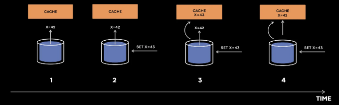
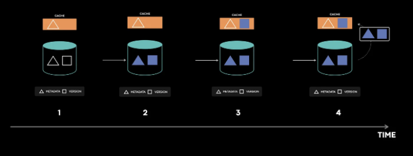

# 소개

캐싱은 컴퓨터 시스템의 다양한 측면, 하드웨어의 캐시부터 운영 체제, 웹 브라우저 및 특히 백엔드 개발에 사용되는 강력한 기술입니다. Meta와 같은 기업에게는 캐싱이 매우 중요한데, 이는 지연 시간을 줄이고 무거운 작업 부하를 확장하며 비용을 절약해주기 때문입니다. 그들의 사용 사례가 캐시를 많이 사용하는 만큼, 캐시 무효화라는 문제도 함께 발생합니다.

Meta는 지난 몇 년 동안 캐시 일관성 측정을 99.9999(6개의 9)부터 99.99999999(10개의 9)로 향상시켰으며, 이는 캐시 클러스터에서 100억 개의 캐시 쓰기 중 1개 이하가 일관성이 없을 것이라는 의미입니다.

이 블로그에서는 네 가지 주요 부분에 집중할 것입니다:

<!-- ui-log 수평형 -->
<ins class="adsbygoogle"
  style="display:block"
  data-ad-client="ca-pub-4877378276818686"
  data-ad-slot="9743150776"
  data-ad-format="auto"
  data-full-width-responsive="true"></ins>
<component is="script">
(adsbygoogle = window.adsbygoogle || []).push({});
</component>

캐시 무효화(cache invalidation)와 캐시 일관성(cache consistency)이 무엇인가요?
메타가 왜 캐시 일관성에 깊게 신경을 쓰며 6개의 9도 충분하지 않다고 생각하는 이유가 무엇인가요?
메타의 모니터링 시스템이 캐시 무효화와 캐시 일관성을 향상시키고 버그를 수정하는 데 어떻게 도움이 되었나요?

# 캐시 무효화와 캐시 일관성

정의 상, 캐시는 데이터의 참 소스를 보유하지 않으므로 참 소스의 데이터가 변경될 때 기존의 캐시 항목을 활성적으로 무효화해야 합니다. 그러나 무효화 프로세스 중에 무효화가 잘못 처리되면 캐시에 불일치하는 값이 영원히 남아 있을 수 있으며 이는 참 소스의 값과 다를 수 있습니다.

그렇다면 캐시를 어떻게 무효화할 수 있을까요?

<!-- ui-log 수평형 -->
<ins class="adsbygoogle"
  style="display:block"
  data-ad-client="ca-pub-4877378276818686"
  data-ad-slot="9743150776"
  data-ad-format="auto"
  data-full-width-responsive="true"></ins>
<component is="script">
(adsbygoogle = window.adsbygoogle || []).push({});
</component>

그러면 이제 친구의 적재는 그 싱선성을 유지하기 위해 TTL과 같은 것을 가질 수 있어서 다른 시스템에서의 캐시 무효화를 받지 않게 합니다. 그러나 이 블로그에서 우리는 메타의 캐시 일관성을 논할 때, 무효화 작업이 캐시 자체가 아닌 다른 요소에 의해 수행된다고 가정할 것입니다.

우선 어떻게 캐시 불일치가 발생하는지 살펴봅시다:



1, 2, 3, 4가 시간 순서로 증가하는 타임스탬프임을 가정해 주세요.

<!-- ui-log 수평형 -->
<ins class="adsbygoogle"
  style="display:block"
  data-ad-client="ca-pub-4877378276818686"
  data-ad-slot="9743150776"
  data-ad-format="auto"
  data-full-width-responsive="true"></ins>
<component is="script">
(adsbygoogle = window.adsbygoogle || []).push({});
</component>

- 캐시는 먼저 DB에서 값을 채우려고 시도합니다.
- 그러나 x=42 값이 캐시에 도달하기 전에 어떤 작업이 값을 x=43로 업데이트했습니다.
- DB는 x=43에 대한 캐시 무효화 이벤트를 보내고 x=42가 아닌 x=43이 캐시에 설정됩니다.
- 이제 이벤트 x=42가 캐시로 도착하고 캐시는 42로 설정되어 일관성이 깨집니다.

이 문제를 해결하기 위해 충돌 해결을 수행하기 위한 버전 필드를 사용하여 구 현과 현재 버전 갱신이 이전 버전을 덮어 씌우지 않도록 할 수 있습니다. 이 해결책은 인터넷에 있는 대부분의 기업에서 작동할 것으로 예상되지만 메타가 운영하는 규모 때문에 시스템의 복잡성 때문에 충분하지 않을 수 있습니다.

# 메타가 캐시 일관성에 대해 깊이 고민하는 이유

메타의 관점에서 캐시 불일치는 데이터 손실과 거의 같은 수준이며 사용자 관점에서는 매우 나쁜 사용자 경험으로 이어질 수 있습니다.

<!-- ui-log 수평형 -->
<ins class="adsbygoogle"
  style="display:block"
  data-ad-client="ca-pub-4877378276818686"
  data-ad-slot="9743150776"
  data-ad-format="auto"
  data-full-width-responsive="true"></ins>
<component is="script">
(adsbygoogle = window.adsbygoogle || []).push({});
</component>

인스타그램에서 사용자에게 DM을 보낼 때, 사용자와 해당 사용자의 기본 저장소를 매핑하는 것이 뒷받침됩니다. 여기에는 세 명의 사용자가 있습니다. Bob, Mary 및 Alice가 있습니다. 두 사용자가 Alice에게 메시지를 보냅니다. Bob은 미국에 있고 Alice는 유럽에 있으며 Mary는 일본에 있습니다. 따라서 시스템은 사용자가 사는 위치 가까운 근처 지역에서 메시지를 Alice의 데이터 저장소로 보내도록 쿼리합니다. 이 경우, TAO 복제본이 BOB과 Mary가 사는 지역을 쿼리했을 때 두 사용자의 일관되지 않은 데이터가 있었고, Alice의 메시지가 없는 지역으로 메시지를 보냈습니다.

위의 경우에는 메시지 손실과 나쁜 사용자 경험이 발생하므로 이것은 meta가 해결해야 할 최우선 문제 중 하나였습니다.

<!-- ui-log 수평형 -->
<ins class="adsbygoogle"
  style="display:block"
  data-ad-client="ca-pub-4877378276818686"
  data-ad-slot="9743150776"
  data-ad-format="auto"
  data-full-width-responsive="true"></ins>
<component is="script">
(adsbygoogle = window.adsbygoogle || []).push({});
</component>

# 모니터링

캐시 무효화와 일관성 문제를 해결하기 위한 첫 번째 단계는 측정입니다. 캐시 일관성을 정확히 측정하고 캐시에 일관되지 않은 항목이 있을 때 경보를 울리는 것입니다. Meta는 측정이 사실 긍정적인 결과를 포함하지 않도록하고, 당직 엔지니어가 그것을 무시하고 측정 기준을 신뢰하지 않게 만들지 않도록 확인했습니다.

Meta가 구현한 실제 솔루션에 자세히 들어가기 전에, 가장 쉬운 해결책은 상태별로 모든 캐시 변경 사항을 기록하고 추적하는 것이었습니다. 이 해결책은 소규모 작업 부하의 경우 실행 가능했을 것입니다만, Meta의 시스템은 하루에 10조 개 이상의 캐시 입력을 처리하고 있었습니다. 모든 캐시 상태를 기록하고 추적하는 것은 별로 부담되는 캐시 작업 부하를 굉장히 무거운 작업 부하로 만들었을 것이며, 더 나아가 이를 디버깅하는 것에 대해서는 무척이나 어려운 것을 생각할 수 있습니다.

# Polaris

<!-- ui-log 수평형 -->
<ins class="adsbygoogle"
  style="display:block"
  data-ad-client="ca-pub-4877378276818686"
  data-ad-slot="9743150776"
  data-ad-format="auto"
  data-full-width-responsive="true"></ins>
<component is="script">
(adsbygoogle = window.adsbygoogle || []).push({});
</component>

폴라리스는 매우 높은 수준에서 상태 유지 서비스와 상호 작용하여 클라이언트로서 서비스 내부에 대한 지식을 전혀 요구하지 않습니다. 폴라리스는 "캐시는 결국 데이터베이스와 일관되어야 한다"는 원칙에 따라 작동합니다. 폴라리스는 무효화 이벤트를 받은 후, 모든 레플리카를 쿼리하여 다른 위반 사항이 발생하는지 확인합니다. 예를 들어, 만약 폴라리스가 x=4 버전 4인 무효화 이벤트를 받으면, 클라이언트로 모든 캐시 레플리카를 확인하여 어떤 불변식 위반 사항이 있는지 확인합니다. 하나의 레플리카가 x=3 @ 버전 3을 반환하면, 폴라리스는 일관성이 없다고 플래그 처리하고 이후 동일한 대상 캐시 호스트에서 검사하기 위해 샘플을 재큐합니다. 폴라리스는 일정 시간 간격(예: 1분, 5분 또는 10분)으로 불일치 사항을 보고합니다.

![./img/Howmetaimprovedtheircacheconsistencyto9999999999_2.png]

이 다중 시간대 설계는 폴라리스가 효율적인 백오프 및 재시도를 구현하기 위해 내부에서 여러 큐를 가질 수 있을뿐만 아니라 허위 긍정을 방지하는 데 필수적입니다.

한 가지 예를 더 통해 살펴봅시다:

<!-- ui-log 수평형 -->
<ins class="adsbygoogle"
  style="display:block"
  data-ad-client="ca-pub-4877378276818686"
  data-ad-slot="9743150776"
  data-ad-format="auto"
  data-full-width-responsive="true"></ins>
<component is="script">
(adsbygoogle = window.adsbygoogle || []).push({});
</component>

폴라리스가 x = 4, 버전 4와 함께 무효화 메시지를 받았다고 가정해 봅시다. 그러나 폴라리스가 캐시를 확인할 때 x에 대한 항목을 찾을 수 없는 경우, 이를 불일치로 플래그 처리해야 합니다. 그런 경우에는 두 가지 가능성이 있습니다.

- x는 버전 3에서 보이지 않았지만, 버전 4의 쓰기가 키에 대해 최신 쓰기이며, 실제로 캐시 불일치가 발생합니다.
- 키 x를 삭제하는 버전 5의 쓰기가 있을 수 있으며, 아마도 폴라리스는 무효화 이벤트에 나타난 것보다 더 최근의 데이터를 볼 수 있는 것입니다.

이제 이 두 경우 중 어느 것이 올바른지 확인하는 방법은 무엇일까요?

검증하기 위해 2가지 경우 중에서 올바른 경우를 확인하려면, 폴라리스는 데이터베이스 쿼리를 통해 확인해야 합니다. 캐시를 우회하는 쿼리는 계산 집약적일 수 있고, 또한 데이터베이스를 위험에 노출시킬 수도 있습니다. 데이터베이스를 보호하고 읽기 중심의 워크로드를 확장하는 것은 캐시의 가장 일반적인 사용 사례 중 두 가지입니다. 따라서 시스템에 너무 많은 쿼리를 보내서는 안 됩니다.

<!-- ui-log 수평형 -->
<ins class="adsbygoogle"
  style="display:block"
  data-ad-client="ca-pub-4877378276818686"
  data-ad-slot="9743150776"
  data-ad-format="auto"
  data-full-width-responsive="true"></ins>
<component is="script">
(adsbygoogle = window.adsbygoogle || []).push({});
</component>

Polaris는 이 문제를 해결하기 위해 해당 검사를 지연시키고 불일치 샘플이 설정된 임계값(예: 1분 또는 5분)을 넘을 때 데이터베이스로의 요청을 수행합니다. Polaris는 “M 분 동안 N개의 캐시 쓰기가 일관성이 있는 메트릭”을 제공합니다. 현재 Polaris는 5분 범위에 대한 99.99999999% 캐시 일관성이 있는 메트릭을 제공합니다.

이제 Polaris가 메타가 어떻게 버그를 해결하는 데 도움이 되었는지 코딩 예제를 통해 캐시 불일치가 어떻게 발생할 수 있는지 살펴봅시다.

코딩 예제로 흐름을 이해해 봅시다:

키와 메타 데이터 매핑, 키와 버전 매핑을 유지하는 캐시가 있다고 가정해 봅시다.

<!-- ui-log 수평형 -->
<ins class="adsbygoogle"
  style="display:block"
  data-ad-client="ca-pub-4877378276818686"
  data-ad-slot="9743150776"
  data-ad-format="auto"
  data-full-width-responsive="true"></ins>
<component is="script">
(adsbygoogle = window.adsbygoogle || []).push({});
</component>

```md


```js
cache_data = {}
cache_version = {}
meta_data_table = {"1": 42}
version_table = {"1": 4}
```

- 읽기 요청이 올 때, 먼저 캐시에서 값이 있는지 확인하고, 캐시에 값이 없다면 데이터베이스에서 값을 반환합니다.

```js
def read_value(key):
    value = read_value_from_cache(key)
    if value is not None:
        return value
    else:
        return meta_data_table[key]
```

<!-- ui-log 수평형 -->
<ins class="adsbygoogle"
  style="display:block"
  data-ad-client="ca-pub-4877378276818686"
  data-ad-slot="9743150776"
  data-ad-format="auto"
  data-full-width-responsive="true"></ins>
<component is="script">
(adsbygoogle = window.adsbygoogle || []).push({});
</component>

```js
def read_value_from_cache(key):
    if key in cache_data:
        return cache_data[key]
    else:
        fill_cache_thread = threading.Thread(target=fill_cache(key))
        fill_cache_thread.start()
        return None
```

2. 캐시가 None 결과를 반환한 후 데이터베이스에서 캐시를 채우기 시작합니다. 여기서는 프로세스를 비동기적으로 만들기 위해 스레드를 사용했습니다.

```js
def fill_cache(key):
    fill_cache_metadata(key)
    fill_cache_version(key)

def fill_cache_metadata(key):
    meta_data = meta_data_table[key]
    print("메타 데이터 캐시 채우는 중...", meta_data)
    cache_data[key] = meta_data
    
def fill_cache_version(key):
    time.sleep(2)
    version = version_table[key]
    print("버전 데이터 캐시 채우는 중...", version)
    cache_version[key] = version    

def write_value(key, value):
    version = 1
    if key in version_table:
        version = version_table[key]
        version = version + 1    

    write_in_databse_transactionally(key, value, version)
    time.sleep(3)
    invalidate_cache(key, value, version)
    
def write_in_databse_transactionally(key, data, version):
    meta_data_table[key] = data
    version_table[key] = version
```

3. 캐시에 버전 데이터가 채워지는 동안 데이터베이스에는 메타 데이터 값 및 버전 값을 갱신하는 새로운 쓰기 요청이 있습니다. 이 시점에서 버그처럼 보일 수 있지만, 캐시 무효화를 통해 캐시를 데이터베이스와 일관된 상태로 되돌릴 것이므로 문제가 아닙니다. (참고로 캐시 및 데이터베이스 쓰기 기능에 time.sleep를 추가하여 문제를 재현했습니다).```

<!-- ui-log 수평형 -->
<ins class="adsbygoogle"
  style="display:block"
  data-ad-client="ca-pub-4877378276818686"
  data-ad-slot="9743150776"
  data-ad-format="auto"
  data-full-width-responsive="true"></ins>
<component is="script">
(adsbygoogle = window.adsbygoogle || []).push({});
</component>

```js
def invalidate_cache(key, metadata, version):
    try:
        cache_data = cache_data[key][value] ## To produce error
    except:
        drop_cache(key, version)
        
def drop_cache(key, version):
    cache_version_value = cache_version[key]
    if version > cache_version_value:
        cache_data.pop(key)
        cache_version.pop(key)
```
  
```js
read_thread = threading.Thread(target=read_value, args=("1"))
write_thread = threading.Thread(target=write_value, args=("1",43))
print_thread = threading.Thread(target=print_values)
```

나중에 캐시 무효화 중에 어떤 이유로 인해 무효화가 실패했고, 예외 처리기에 해당 경우 캐시를 삭제할 조건이 있었습니다.

- drop_cache 함수에는 최신 값이 cache_version_value보다 큰 경우 키를 삭제하는 로직이 있었지만, 우리 경우에는 그렇지 않습니다. 이로 인해 캐시에 오래된 메타데이터가 영원히 남아 있게 됩니다.

<!-- ui-log 수평형 -->
<ins class="adsbygoogle"
  style="display:block"
  data-ad-client="ca-pub-4877378276818686"
  data-ad-slot="9743150776"
  data-ad-format="auto"
  data-full-width-responsive="true"></ins>
<component is="script">
(adsbygoogle = window.adsbygoogle || []).push({});
</component>

위 내용은 버그가 발생한 간단한 예시일 뿐이에요. 실제 버그는 더 복잡해요. 데이터베이스 복제와 여러 지역 간 통신이 관련돼 있어 더욱 복잡할 수 있어요. 이 버그는 위 단계들이 모두 발생하고 특정한 순서대로 일어날 때만 발생해요. 이런 불일치는 매우 드물게 발생해요. 오류 처리 코드 내에서 교차작업과 일시적 오류로 인해 버그가 숨어 있어요.

# 일관성 추적

이제 Polaris에서의 캐시 불일치로 페이징되어 당번이 되었으니, 로그를 확인하고 문제가 어디에 있는지 찾아보는 것이 매우 중요해요. 이전에 토론한 대로 모든 캐시 데이터 변경을 로깅하는 것은 거의 불가능하지만, 변경에 영향을 줄 수 있는 변경 사항만 로깅한다면 어떨까요?


<!-- ui-log 수평형 -->
<ins class="adsbygoogle"
  style="display:block"
  data-ad-client="ca-pub-4877378276818686"
  data-ad-slot="9743150776"
  data-ad-format="auto"
  data-full-width-responsive="true"></ins>
<component is="script">
(adsbygoogle = window.adsbygoogle || []).push({});
</component>

만약 우리가 구현한 코드를 살펴본다면, 캐시가 무효화 이벤트를 받지 못했을 때나 무효화가 작동하지 않았을 때에 문제가 발생할 수 있습니다. 당직자의 관점에서 다음 사항을 확인해야 합니다:

- 캐시 서버가 무효화를 받았는가?
- 서버가 무효화를 제대로 처리했는가?
- 항목이 그 이후에 일치하지 않는 상태가 되었는가?

Meta는 작은 보라색 창에 캐시 변이를 기록하고 추적하는 상태 추적 라이브러리를 구축했습니다. 모든 흥미로운 하고 복잡한 상호 작용이 캐시 불일치로 이어지는 버그를 유발하는 창입니다.

# 결론

<!-- ui-log 수평형 -->
<ins class="adsbygoogle"
  style="display:block"
  data-ad-client="ca-pub-4877378276818686"
  data-ad-slot="9743150776"
  data-ad-format="auto"
  data-full-width-responsive="true"></ins>
<component is="script">
(adsbygoogle = window.adsbygoogle || []).push({});
</component>

분산 시스템의 경우 강력한 모니터링 및 로깅 시스템은 버그를 발견하고 발견한 버그의 근본 원인을 빠르게 찾아 문제를 해결할 수 있도록 하는 데 필수적입니다. 메타의 예시를 사용하면, 폴라리스는 비정상을 식별하고 즉시 알람을 발생시켰습니다. 일관성 추적 정보를 활용하여 당직 엔지니어들은 버그를 위치시키는 데 30분 미만이 걸렸습니다.

참고 자료: https://engineering.fb.com/2022/06/08/core-infra/cache-made-consistent/

버그 생성의 구현은 여기에서 확인할 수 있습니다 : https://github.com/Mayank-Sharma-27/meta-cache-made-consistent

Linkedin: https://www.linkedin.com/in/mayank-sharma-2002bb10b/