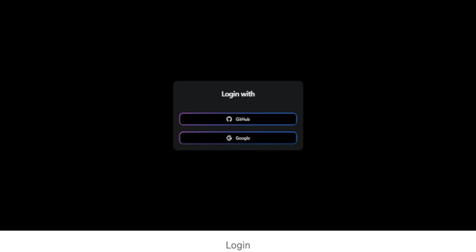
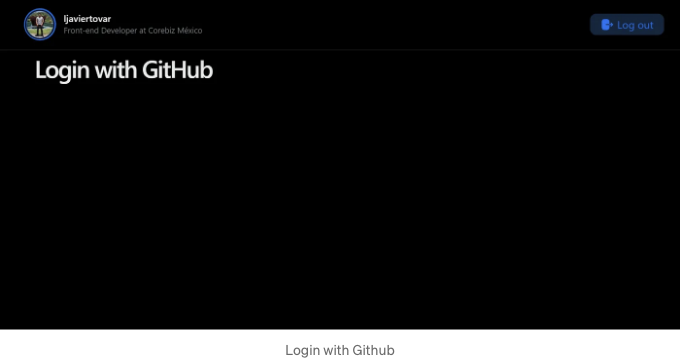
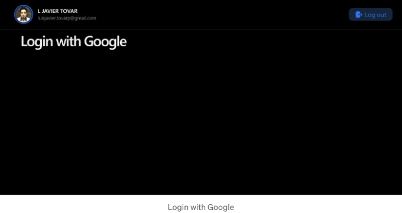

프로그래머로서, 우리는 언젠가는 소셜 미디어 로그인을 구현해야 한 적이 있을 것입니다. 오늘날의 애플리케이션 및 웹사이트에서 이 기능은 점점 더 흔해지고 있습니다.

소셜 로그인을 통해 사용자는 Facebook, Google, Twitter 등의 계정을 사용하여 애플리케이션이나 웹사이트에 로그인할 수 있습니다. 이를 통해 사용자는 추가 계정 및 비밀번호를 생성하지 않아도 되며 소셜 네트워크의 보안 조치를 활용할 수 있어 시간을 절약할 수 있습니다.

예를 들어, 사용자가 Google 계정에 두 단계 인증을 활성화했다면, 해당 보안 조치는 사용 중인 애플리케이션이나 웹사이트에도 적용됩니다.

<!-- ui-log 수평형 -->
<ins class="adsbygoogle"
  style="display:block"
  data-ad-client="ca-pub-4877378276818686"
  data-ad-slot="9743150776"
  data-ad-format="auto"
  data-full-width-responsive="true"></ins>
<component is="script">
(adsbygoogle = window.adsbygoogle || []).push({});
</component>

이 튜토리얼에서는 TypeScript로 React 애플리케이션에서 Github 및 Google 로그인을 구현할 것입니다. 우리는 애플리케이션을 만들기 위해 Vite를 사용하고 패키지 관리자로 pnpm을 사용할 것입니다.

# RRSS와 함께하는 로그인 첫 단계

우선, 어떤 플랫폼의 인증 서비스를 사용하려면 OAuth 애플리케이션을 생성하고 필요한 키를 얻어야 합니다.

Github의 경우 다음 단계를 따르세요.

<!-- ui-log 수평형 -->
<ins class="adsbygoogle"
  style="display:block"
  data-ad-client="ca-pub-4877378276818686"
  data-ad-slot="9743150776"
  data-ad-format="auto"
  data-full-width-responsive="true"></ins>
<component is="script">
(adsbygoogle = window.adsbygoogle || []).push({});
</component>

구글을 사용하려면 다음 단계를 따라주세요.

키를 안전한 장소에 보관하는 것이 중요합니다.

이제 우리 애플리케이션 개발을 시작할 차례입니다. 이 애플리케이션에서는 클라이언트 시크릿 키와 같은 민감하고 개인적인 데이터를 사용할 예정이므로, 보안상의 이유로 백엔드를 생성하고 서버 측에서 사용하는 것이 필요합니다.

아래 게시물에서 이에 대해 좀 더 설명하고 있습니다:

<!-- ui-log 수평형 -->
<ins class="adsbygoogle"
  style="display:block"
  data-ad-client="ca-pub-4877378276818686"
  data-ad-slot="9743150776"
  data-ad-format="auto"
  data-full-width-responsive="true"></ins>
<component is="script">
(adsbygoogle = window.adsbygoogle || []).push({});
</component>

두 개의 애플리케이션, 백엔드와 클라이언트를 디렉토리마다 나눠서 준비할 거예요.

# 백엔드 설정하기

다음 명령어로 애플리케이션을 생성해요:

```js
pnpm init -y
```

<!-- ui-log 수평형 -->
<ins class="adsbygoogle"
  style="display:block"
  data-ad-client="ca-pub-4877378276818686"
  data-ad-slot="9743150776"
  data-ad-format="auto"
  data-full-width-responsive="true"></ins>
<component is="script">
(adsbygoogle = window.adsbygoogle || []).push({});
</component>

프로젝트에 필요한 종속성을 설치해보세요:

```js
pnpm install express axios cors dotenv tsc ts-node
```

```js
pnpm install @types/cors @types/express @types/node ts-node-dev typescript -D
```

이후에는 다음과 같은 구조로 프로젝트를 생성하세요:

<!-- ui-log 수평형 -->
<ins class="adsbygoogle"
  style="display:block"
  data-ad-client="ca-pub-4877378276818686"
  data-ad-slot="9743150776"
  data-ad-format="auto"
  data-full-width-responsive="true"></ins>
<component is="script">
(adsbygoogle = window.adsbygoogle || []).push({});
</component>

```js
├── src/
│   ├── routes/
│   │   ├── github-routes.ts
│   │   └── google-routes.ts
│   ├── controllers/
│   │   ├── github-controller.ts
│   │   └── google-controller.ts
│   └── server.ts
├── .env
├── .env-example
```

# 클라이언트 설정하기

프로젝트에 필요한 종속성을 설치합니다:

```js
pnpm install @octokit/auth @react-oauth/google @nextui-org/react axios react-router-dom
```

<!-- ui-log 수평형 -->
<ins class="adsbygoogle"
  style="display:block"
  data-ad-client="ca-pub-4877378276818686"
  data-ad-slot="9743150776"
  data-ad-format="auto"
  data-full-width-responsive="true"></ins>
<component is="script">
(adsbygoogle = window.adsbygoogle || []).push({});
</component>

그 후, 프로젝트를 위한 다음 구조를 만들었습니다:

```js
├── src/
│   ├── assets/
│   │   ├── icons/
│   │   │   ├── Github.tsx
│   │   │   ├── Google.tsx
│   │   │   ├── Logout.tsx
│   │   │   └── index.ts
│   ├── pages/
│   │   ├── home/
│   │   │   ├── services/
│   │   │   │   └── home-services.ts
│   │   │   └── HomePage.tsx
│   │   └── login/
│   │       └── LoginPage.tsx
│   ├── index.tsx
│   ├── App.tsx
│   └── main.tsx
├── .env
├── .env-example
```

# GitHub 로그인

## 백엔드

<!-- ui-log 수평형 -->
<ins class="adsbygoogle"
  style="display:block"
  data-ad-client="ca-pub-4877378276818686"
  data-ad-slot="9743150776"
  data-ad-format="auto"
  data-full-width-responsive="true"></ins>
<component is="script">
(adsbygoogle = window.adsbygoogle || []).push({});
</component>

- 파일 server.ts:

```js
import express from 'express';
import cors from 'cors';

import githubRoutes from './routes/github-routes';
import googleRoutes from './routes/google-routes';

const PORT = process.env.PORT || 3001

const app = express();

app.use(
  cors({
    origin: ['http://localhost:5173'],
    methods: 'GET,POST',
  }),
);

app.use(express.json());

app.use('/api/github', githubRoutes);
app.use('/api/google', googleRoutes);

app.listen(PORT, () => console.log('Server on port', PORT));
```

이 코드는 Express로 서버 애플리케이션을 만듭니다. 이 애플리케이션은 CORS(교차 출처 리소스 공유)를 활성화하기 위해 cors 라이브러리를 사용하고 출처와 허용된 메서드를 설정합니다.

또한 이 애플리케이션은 요청에서 JSON 사용을 가능하게 하고 GitHub 서비스 및 Google 서비스에 대한 라우트를 정의하기 위해 app.use() 함수를 사용합니다.

<!-- ui-log 수평형 -->
<ins class="adsbygoogle"
  style="display:block"
  data-ad-client="ca-pub-4877378276818686"
  data-ad-slot="9743150776"
  data-ad-format="auto"
  data-full-width-responsive="true"></ins>
<component is="script">
(adsbygoogle = window.adsbygoogle || []).push({});
</component>

마지막으로, 응용 프로그램은 PORT 상수에 지정된 포트에서 청취하거나 포트가 지정되지 않은 경우 3001 포트에서 청취합니다.

- 파일 github-routes.ts:

```js
import express, { Request, Response, Router } from 'express';
import { getAccessToken, getUserData } from '../controllers/github-controller';

const router: Router = express.Router();

router.get('/accessToken', (req: Request, res: Response) => {
  const code = req.query.code;
  getAccessToken(code as string).then((resp) => res.json(resp));
});

router.get('/userData', (req: Request, res: Response) => {
  const accessToken = req.query.accessToken;
  getUserData(accessToken as string).then((resp) => res.json(resp));
});

export default router;
```

이 코드는 /accessToken과 /userData 두 경로를 정의하는 Express 라우터를 생성합니다.

<!-- ui-log 수평형 -->
<ins class="adsbygoogle"
  style="display:block"
  data-ad-client="ca-pub-4877378276818686"
  data-ad-slot="9743150776"
  data-ad-format="auto"
  data-full-width-responsive="true"></ins>
<component is="script">
(adsbygoogle = window.adsbygoogle || []).push({});
</component>

/accessToken 경로는 쿼리에서 code 매개변수를 가져와 GitHub 서비스의 getAccessToken 함수를 호출하는 GET 경로입니다.

/userData 경로는 쿼리에서 accessToken 매개변수를 가져와 GitHub 서비스의 getUserData 함수를 호출하는 GET 경로입니다.

- 파일 google-routes.ts:

```js
import express, { Request, Response, Router } from 'express';
import { getUserData } from '../controllers/google-controller';

const router: Router = express.Router();

router.get('/userData', (req: Request, res: Response) => {
  const accessToken = req.query.accessToken;
  getUserData(accessToken as string).then((resp) => res.json(resp));
});

export default router;
```

<!-- ui-log 수평형 -->
<ins class="adsbygoogle"
  style="display:block"
  data-ad-client="ca-pub-4877378276818686"
  data-ad-slot="9743150776"
  data-ad-format="auto"
  data-full-width-responsive="true"></ins>
<component is="script">
(adsbygoogle = window.adsbygoogle || []).push({});
</component>

이 코드는 Express 라우터를 생성하여 /userData라는 GET 경로를 정의합니다. 이 경로는 쿼리에서 accessToken 매개변수를 받아와 Google 서비스의 getUserData 함수를 호출합니다.

- 파일 github-controller.ts:

```js
import * as dotenv from 'dotenv';
import axios from 'axios';

dotenv.config();

type AccessTokenData = {
  access_token: string;
  token_type: string;
  scope: string;
} | null;

export const getAccessToken = async (
  code: string,
): Promise<AccessTokenData> => {
  try {
    const params = `?client_id=${process.env.GITHUB_CLIENT_ID}&client_secret=${process.env.GITHUB_CLIENT_SECRET}&code=${code}`;

    const { data } = await axios.post(
      `https://github.com/login/oauth/access_token${params}`,
      {},
      {
        headers: {
          Accept: 'application/json',
        },
      },
    );

    return data;
  } catch (error) {
    console.log(error);
    return null;
  }
};

export const getUserData = async (accessToken: string) => {
  try {
    const { data } = await axios.get('https://api.github.com/user', {
      headers: {
        Authorization: `Bearer ${accessToken}`,
      },
    });

    return data;
  } catch (error) {
    return null;
  }
};
```

getAccessToken 함수는 code 매개변수를 받아와 GitHub API에 POST 요청을 보내어 제공된 client_id, client_secret 및 code를 사용하여 액세스 토큰을 얻습니다.

<!-- ui-log 수평형 -->
<ins class="adsbygoogle"
  style="display:block"
  data-ad-client="ca-pub-4877378276818686"
  data-ad-slot="9743150776"
  data-ad-format="auto"
  data-full-width-responsive="true"></ins>
<component is="script">
(adsbygoogle = window.adsbygoogle || []).push({});
</component>

getUserData 함수는 accessToken 매개변수를 받아들이고 요청에서 제공된 액세스 토큰을 사용하여 GitHub API에서 사용자 정보를 반환합니다.

- File google-controller.ts:

```js
import axios from 'axios';

export const getUserData = async (accessToken: string) => {
  try {
    const { data } = await axios.get(
    'https://www.googleapis.com/oauth2/v3/userinfo',
      {
        headers: {
          Authorization: `Bearer ${accessToken}`,
        },
      },
    );

    return data;
  } catch (error) {
    return null;
  }
};
```

getUserData 함수는 accessToken 매개변수를 받아들이고, 요청의 권한 헤더에 제공된 액세스 토큰을 사용하여 Google OAuth 사용자 정보 API로 GET 요청을 수행하고 사용자 정보를 반환합니다.

<!-- ui-log 수평형 -->
<ins class="adsbygoogle"
  style="display:block"
  data-ad-client="ca-pub-4877378276818686"
  data-ad-slot="9743150776"
  data-ad-format="auto"
  data-full-width-responsive="true"></ins>
<component is="script">
(adsbygoogle = window.adsbygoogle || []).push({});
</component>

이제 이미 필요한 최소한의 백엔드가 생성되었습니다. 이제 프론트엔드로 진행해 봅시다.

## 클라이언트

- 파일 main.tsx:

```js
import { GoogleOAuthProvider } from "@react-oauth/google"

import ReactDOM from "react-dom/client"

import { NextUIProvider } from "@nextui-org/react"
import { darkTheme } from "./themes/darktheme"

const GOOGLE_CLIENT_ID = import.meta.env.VITE_GOOGLE_CLIENT_ID

import App from "./App"

ReactDOM.createRoot(document.getElementById("root") as HTMLElement).render(
 <NextUIProvider theme={darkTheme}>
  <GoogleOAuthProvider clientId={GOOGLE_CLIENT_ID}>
   <App />
  </GoogleOAuthProvider>
 </NextUIProvider>
)
```

<!-- ui-log 수평형 -->
<ins class="adsbygoogle"
  style="display:block"
  data-ad-client="ca-pub-4877378276818686"
  data-ad-slot="9743150776"
  data-ad-format="auto"
  data-full-width-responsive="true"></ins>
<component is="script">
(adsbygoogle = window.adsbygoogle || []).push({});
</component>

이 애플리케이션에서는 Next UI를 사용하여 스타일을 적용할 것입니다. 사용하고 싶은 UI 라이브러리를 자유롭게 선택할 수 있어요.

TheNextUIProvider 컴포넌트는 애플리케이션의 모든 컴포넌트에 다크 테마를 제공합니다. GoogleOAuthProvider 컴포넌트는 제공된 클라이언트 ID를 사용하여 애플리케이션에 Google 로그인을 제공합니다.

- Component App.tsx:

```js
import { BrowserRouter as Router, Route, Routes } from 'react-router-dom';
import { LoginPage, HomePage } from './pages';

const App = () => {
  return (
    <Router>
      <Routes>
        <Route path="/home" element={<HomePage />}></Route>
        <Route path="/" element={<LoginPage />}></Route>
      </Routes>
    </Router>
  );
};

export default App;
```

<!-- ui-log 수평형 -->
<ins class="adsbygoogle"
  style="display:block"
  data-ad-client="ca-pub-4877378276818686"
  data-ad-slot="9743150776"
  data-ad-format="auto"
  data-full-width-responsive="true"></ins>
<component is="script">
(adsbygoogle = window.adsbygoogle || []).push({});
</component>

App 컴포넌트에서는 사용할 페이지의 라우트를 생성하고 해당 컴포넌트를 할당할 것입니다.

- Component LoginPage.tsx

```js
import { useGoogleLogin } from "@react-oauth/google"
import { useNavigate } from "react-router-dom"

import { Card, Spacer, Button, Text, Container } from "@nextui-org/react"

import { IconGitHub, IconGoogle } from "../../assets/icons"

const GITHUB_CLIENT_ID = import.meta.env.VITE_GITHUB_CLIENT_ID

const LoginPage = () => {
 const navigate = useNavigate()

 const loginToGithub = () => {
  localStorage.setItem("loginWith", "GitHub")
  window.location.assign(`https://github.com/login/oauth/authorize?client_id=${GITHUB_CLIENT_ID}`)
 }

 const loginToGoogle = useGoogleLogin({
  onSuccess: tokenResponse => {
   localStorage.setItem("loginWith", "Google")
   localStorage.setItem("accessToken", tokenResponse.access_token)
   navigate("/home")
  },
 })

 return (
  <Container display='flex' alignItems='center' justify='center' css={ minHeight: "100vh" }>
   <Card css={ mw: "420px", p: "20px" }>
    <Text
     size={24}
     weight='bold'
     css={
      as: "center",
      mb: "20px",
     }
    >
     로그인하기
    </Text>
    <Spacer y={1} />
    <Button color='gradient' auto ghost onClick={() => loginToGithub()}>
     <IconGitHub />
     <Spacer x={0.5} />
     GitHub
    </Button>
    <Spacer y={1} />

    <Button color='gradient' auto ghost onClick={() => loginToGoogle()}>
     <IconGoogle />
     <Spacer x={0.5} />
     Google
    </Button>
   </Card>
  </Container>
 )
}

export default LoginPage
```

사용자가 GitHub 로그인 버튼을 클릭하면 사용자는 GitHub 로그인 페이지로 리디렉트되며 브라우저의 로컬 저장소에 사용자가 GitHub로 로그인 중임을 나타내는 키가 저장됩니다.

<!-- ui-log 수평형 -->
<ins class="adsbygoogle"
  style="display:block"
  data-ad-client="ca-pub-4877378276818686"
  data-ad-slot="9743150776"
  data-ad-format="auto"
  data-full-width-responsive="true"></ins>
<component is="script">
(adsbygoogle = window.adsbygoogle || []).push({});
</component>

사용자가 Google 로그인 버튼을 클릭하면 @react-oauth/google의 useGoogleLogin 기능을 사용하여 Google로 로그인합니다. 로그인이 성공하면 사용자가 Google로 로그인하고 있다는 것을 나타내는 키가 브라우저의 로컬 저장소에 저장됩니다.

- Component HomePage.tsx

```js
import { useEffect, useRef, useState } from "react"
import { useNavigate } from "react-router-dom"
import { Button, Col, Container, Navbar, Row, Text, User } from "@nextui-org/react"

import { getAccessTokenGithub, getUserDataGithub, getUserDataGoogle } from "./services/home-services"

import { LogOutIcon } from "../../assets/icons"

interface UserDataGithub {
  avatar_url: string
  login: string
  bio: string
}

interface UserdataGoogle {
  name: string
  picture: string
  email: string
}

const HomePage = () => {
  const [userDataGithub, setUserDataGithub] = useState<null | UserDataGithub>(null)
  const [userDataGoogle, setUserDataGoogle] = useState<null | UserdataGoogle>(null)

  const loginWith = useRef(localStorage.getItem("loginWith"))

  const navigate = useNavigate()

  useEffect(() => {
    const queryString = window.location.search
    const urlParams = new URLSearchParams(queryString)
    const codeParam = urlParams.get("code")

    const accessToken = localStorage.getItem("accessToken")

    if (codeParam && !accessToken && loginWith.current === "GitHub") {
      getAccessTokenGithub(codeParam).then(resp => {
        localStorage.setItem("accessToken", resp.access_token)
        getUserDataGithub(resp.access_token).then((resp: UserDataGithub) => {
          setUserDataGithub(resp)
        })
      })
    } else if (codeParam && accessToken && loginWith.current === "GitHub") {
      getUserDataGithub(accessToken).then((resp: UserDataGithub) => {
        localStorage.setItem("accessToken", accessToken)
        setUserDataGithub(resp)
      })
    }
  }, [loginWith])

  useEffect(() => {
    const accessToken = localStorage.getItem("accessToken")

    if (accessToken && loginWith.current === "Google") {
      getUserDataGoogle(accessToken).then(resp => {
        setUserDataGoogle(resp)
      })
    }
  }, [loginWith])

  const setLogOut = () => {
    localStorage.removeItem("accessToken")
    localStorage.removeItem("loginWith")
    navigate("/")
  }

  if (!userDataGithub && !userDataGoogle) return null

  return (
    <>
      <Navbar isBordered variant='sticky'>
        <Navbar.Brand>
          <User
            bordered
            color='primary'
            size='lg'
            src={loginWith.current === "GitHub" ? userDataGithub?.avatar_url : userDataGoogle?.picture}
            name={loginWith.current === "GitHub" ? userDataGithub?.login : userDataGoogle?.name}
            description={loginWith.current === "GitHub" ? userDataGithub?.bio : userDataGoogle?.email}
          />
        </Navbar.Brand>
        <Navbar.Content>
          <Navbar.Item>
            <Button
              auto
              flat
              size='sm'
              icon={<LogOutIcon fill='currentColor' />}
              color='primary'
              onClick={() => setLogOut()}
            >
              로그아웃
            </Button>
          </Navbar.Item>
        </Navbar.Content>
      </Navbar>
      <Container gap={0}>
        <Row gap={1}>
          <Col>
            <Text h2>{loginWith.current}로 로그인</Text>
          </Col>
        </Row>
      </Container>
    </>
  )
}

export default HomePage
```

사용자가 로그인하고 홈페이지로 리디렉션되면 useEffect 훅을 사용하여 페이지가 로드될 때 일련의 작업을 수행합니다.

<!-- ui-log 수평형 -->
<ins class="adsbygoogle"
  style="display:block"
  data-ad-client="ca-pub-4877378276818686"
  data-ad-slot="9743150776"
  data-ad-format="auto"
  data-full-width-responsive="true"></ins>
<component is="script">
(adsbygoogle = window.adsbygoogle || []).push({});
</component>

먼저 페이지 URL에서 권한 코드를 받아 사용자가 GitHub으로 로그인한 경우 액세스 토큰을 받고 그런 다음 GitHub에서 사용자 데이터를 가져옵니다. 사용자가 Google로 로그인 한 경우에는 Google 사용자 데이터를 간단히 가져옵니다.

게다가 "로그아웃" 버튼을 클릭하면 액세스 토큰을 제거하고 로컬 저장소에서 로그인 정보를 삭제한 후 사용자를 애플리케이션의 홈페이지로 리디렉션합니다.

그게 다에요!

이제 GitHub 또는 Google로 로그인할 수 있습니다. 다음 단계는 사용자를 등록하고 사용자 정보를 데이터베이스에 저장하거나 원하는 대로 처리하는 것입니다.

<!-- ui-log 수평형 -->
<ins class="adsbygoogle"
  style="display:block"
  data-ad-client="ca-pub-4877378276818686"
  data-ad-slot="9743150776"
  data-ad-format="auto"
  data-full-width-responsive="true"></ins>
<component is="script">
(adsbygoogle = window.adsbygoogle || []).push({});
</component>

애플리케이션은 다음과 같이 보입니다:







<!-- ui-log 수평형 -->
<ins class="adsbygoogle"
  style="display:block"
  data-ad-client="ca-pub-4877378276818686"
  data-ad-slot="9743150776"
  data-ad-format="auto"
  data-full-width-responsive="true"></ins>
<component is="script">
(adsbygoogle = window.adsbygoogle || []).push({});
</component>

🧑‍💻 위 저장소에서 확인하세요.

# 결론

소셜 로그인은 사용자와 개발자 모두에게 많은 이점을 제공하는 기능입니다. 통합하기 간단하고 응용 프로그램 또는 웹 사이트의 사용자 경험과 보안을 개선할 수 있습니다. 따라서 프로젝트에서 이를 사용하는 것을 고려하는 것이 좋습니다.

더 읽기:

<!-- ui-log 수평형 -->
<ins class="adsbygoogle"
  style="display:block"
  data-ad-client="ca-pub-4877378276818686"
  data-ad-slot="9743150776"
  data-ad-format="auto"
  data-full-width-responsive="true"></ins>
<component is="script">
(adsbygoogle = window.adsbygoogle || []).push({});
</component>

```markdown
작가와 소통하고 싶으신가요?
세계의 친구들과 트위터를 통해 소통하는 것을 즐기시나요.
```