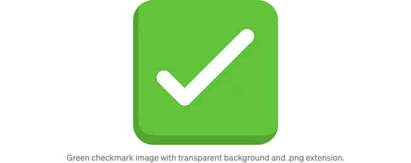

제 코딩 부트캠프 프로젝트를 형님이신 시니어 소프트웨어 엔지니어 형에게 보여줬는데, 형이 한 말이 "다음에 파비콘과 제목을 변경해야 해." 였어요.

... 파비콘? 나는 그게 무엇인지 몰랐어요. 빠른 구글 검색으로 알았는데, 브라우저 탭의 파비콘과 제목이 여기에 나타날 수 있다고 하더라구요:


<!-- ui-log 수평형 -->
<ins class="adsbygoogle"
  style="display:block"
  data-ad-client="ca-pub-4877378276818686"
  data-ad-slot="9743150776"
  data-ad-format="auto"
  data-full-width-responsive="true"></ins>
<component is="script">
(adsbygoogle = window.adsbygoogle || []).push({});
</component>

원래 제목을 편집하고 React 앱에 기본으로 제공되는 파비콘을 바꾸는 작업은 어렵게 느꼈어요... 하지만 약간의 구글링과 실험 끝에 5분 이내에 둘 다 변경하는 법을 알아내게 됐어요. 여기에 간단히 설명하겠습니다:

## 제목 변경하기

- 코드 에디터에서 index.html 파일 (public/index.html)을 엽니다:


<!-- ui-log 수평형 -->
<ins class="adsbygoogle"
  style="display:block"
  data-ad-client="ca-pub-4877378276818686"
  data-ad-slot="9743150776"
  data-ad-format="auto"
  data-full-width-responsive="true"></ins>
<component is="script">
(adsbygoogle = window.adsbygoogle || []).push({});
</component>

2. 헤드 태그 안에서 타이틀 태그를 찾아보세요… 다음과 같아야 합니다:

```js
 <title>React App</title>
```

3. 'React App'을 앱에 원하는 제목으로 바꿔주세요. 예를 들어 '할 일 목록'으로:

```js
<title>할 일 목록</title>
```

<!-- ui-log 수평형 -->
<ins class="adsbygoogle"
  style="display:block"
  data-ad-client="ca-pub-4877378276818686"
  data-ad-slot="9743150776"
  data-ad-format="auto"
  data-full-width-responsive="true"></ins>
<component is="script">
(adsbygoogle = window.adsbygoogle || []).push({});
</component>

4. 변경 사항을 코드 편집기에 저장하고 브라우저 탭을 새로고침하면 새 제목이 표시됩니다!:


## 파비콘 변경

- 코드 편집기에서 React 앱의 public 폴더에서 파비콘 파일을 찾아보세요... 이름은 'favicon.ico'입니다:

<!-- ui-log 수평형 -->
<ins class="adsbygoogle"
  style="display:block"
  data-ad-client="ca-pub-4877378276818686"
  data-ad-slot="9743150776"
  data-ad-format="auto"
  data-full-width-responsive="true"></ins>
<component is="script">
(adsbygoogle = window.adsbygoogle || []).push({});
</component>


2. 파비콘 파일 삭제하기: ‘favicon.ico’를 우클릭하고 ‘삭제’를 클릭합니다.

3. 기본 React 파비콘을 바꿀 새로운 파비콘 찾기. 아이콘/이모지를 구글 이미지 검색하여 마음에 드는 이미지를 컴퓨터 어딘가에 저장하세요. .png 형식이고 배경이 투명한 이미지를 찾는 것이 좋습니다. 이 ‘할 일 목록’ 예시에서는 녹색 체크 아이콘을 찾아 데스크탑에 저장했습니다.



<!-- ui-log 수평형 -->
<ins class="adsbygoogle"
  style="display:block"
  data-ad-client="ca-pub-4877378276818686"
  data-ad-slot="9743150776"
  data-ad-format="auto"
  data-full-width-responsive="true"></ins>
<component is="script">
(adsbygoogle = window.adsbygoogle || []).push({});
</component>

4. 저장된 이미지를 코드 편집기의 공용 폴더로 끌어다 놓으세요:


5. 방금 추가한 이미지 파일을 마우스 오른쪽 버튼으로 클릭한 다음 '이름 바꾸기'를 클릭하여 전체 파일 이름(.png 확장자 포함)을 'favicon.ico'로 바꿔주세요:


<!-- ui-log 수평형 -->
<ins class="adsbygoogle"
  style="display:block"
  data-ad-client="ca-pub-4877378276818686"
  data-ad-slot="9743150776"
  data-ad-format="auto"
  data-full-width-responsive="true"></ins>
<component is="script">
(adsbygoogle = window.adsbygoogle || []).push({});
</component>

6. 코드 편집기에서 변경 사항을 저장한 후 브라우저 탭을 새로고침하면 새 파비콘과 새 제목이 나타납니다!:

