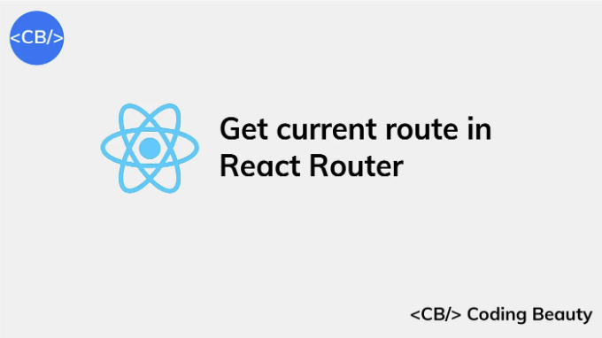

React Router에서 현재 경로를 가져오려면 useLocation() route를 사용합니다.

예를 들어:

JavaScript

<!-- ui-log 수평형 -->
<ins class="adsbygoogle"
  style="display:block"
  data-ad-client="ca-pub-4877378276818686"
  data-ad-slot="9743150776"
  data-ad-format="auto"
  data-full-width-responsive="true"></ins>
<component is="script">
(adsbygoogle = window.adsbygoogle || []).push({});
</component>

```js
import React from 'react';
import { Route, Link, Routes, useLocation } from 'react-router-dom';

function Home() {
  return <h2>Home</h2>;
}

function Products() {
  return <h2>About</h2>;
}

function Pricing() {
  return <h2>Pricing</h2>;
}

function Posts() {
  return <h2>Posts</h2>;
}

export default function App() {
  const location = useLocation();
  const { hash, pathname, search } = location;
  return (
    <div>
      <div>
        <Routes>
          <Route path="/products" element={<Products />} />
          <Route path="/" element={<Home />} />
          <Route path="/posts" element={<Posts />} />
          <Route path="/#pricing" element={<Pricing />} />
        </Routes>
        Pathname: <b>{pathname}</b><br />
        Search params: <b>{search}</b><br />
        Hash: <b>{hash}</b>
        <nav>
          <ul>
            <li>
              <Link to="/">Home</Link>
            </li>
            <li>
              <Link to="/products">Products</Link>
            </li>
            <li>
              <Link to="/posts?id=5">Posts</Link>
            </li>
            <li>
              <Link to="/#pricing">Pricing</Link>
            </li>
          </ul>
        </nav>
      </div>
    </div>
  );
}
```

`useLocation()` 함수는 현재 페이지 URL 정보를 담고 있는 객체를 반환합니다. 이 객체의 몇 가지 프로퍼티는 다음과 같습니다:

- pathname: 도메인 이름 뒤에 오는 부분, 예: /products.
- search: 쿼리 문자열, 예: ?id=5.
- hash: 해시, 예: #pricing.

참고

<!-- ui-log 수평형 -->
<ins class="adsbygoogle"
  style="display:block"
  data-ad-client="ca-pub-4877378276818686"
  data-ad-slot="9743150776"
  data-ad-format="auto"
  data-full-width-responsive="true"></ins>
<component is="script">
(adsbygoogle = window.adsbygoogle || []).push({});
</component>

풀 URL을 얻으려면 useLocation() 대신 location.href를 사용합니다.

JavaScript

```js
const url = window.location.href;
```

# React에서 현재 페이지 URL 가져오기

<!-- ui-log 수평형 -->
<ins class="adsbygoogle"
  style="display:block"
  data-ad-client="ca-pub-4877378276818686"
  data-ad-slot="9743150776"
  data-ad-format="auto"
  data-full-width-responsive="true"></ins>
<component is="script">
(adsbygoogle = window.adsbygoogle || []).push({});
</component>

리액트에서 현재 페이지 URL을 가져오고 싶다면 window.location.href를 사용할 수 있어요.

예를 들면:

자바스크립트

```js
import { useRef } from 'react';

export default function App() {
  const url = window.location.href;
  return (
    <div>
      현재 URL에 접속 중이세요.</b>
    </div>
  );
}
```

<!-- ui-log 수평형 -->
<ins class="adsbygoogle"
  style="display:block"
  data-ad-client="ca-pub-4877378276818686"
  data-ad-slot="9743150776"
  data-ad-format="auto"
  data-full-width-responsive="true"></ins>
<component is="script">
(adsbygoogle = window.adsbygoogle || []).push({});
</component>

window.location.href 속성은 전체 페이지 URL을 포함하는 문자열을 반환합니다.

window.location에는 URL에 대한 더 많은 정보를 제공하는 다른 속성도 있습니다. 일부 예시는 다음과 같습니다:

- pathname: 도메인 이름 뒤와 선택적 포트 번호 뒤의 URL 경로입니다.
- protocol: URL의 프로토콜 스키마입니다.
- hostname: URL의 호스트 이름 일부입니다.

다음은 이러한 속성을 사용하여 전체 URL 외에도 다양한 URL 속성을 가져오는 예시입니다.

<!-- ui-log 수평형 -->
<ins class="adsbygoogle"
  style="display:block"
  data-ad-client="ca-pub-4877378276818686"
  data-ad-slot="9743150776"
  data-ad-format="auto"
  data-full-width-responsive="true"></ins>
<component is="script">
(adsbygoogle = window.adsbygoogle || []).push({});
</component>

JavaScript

```js
export default function App() {
  const url = window.location.href;
  const pathname = window.location.pathname;
  const protocol = window.location.protocol;
  const hostname = window.location.hostname;

  return (
    <div>
      현재 접속 중인 주소는 <b>{url}</b>입니다.<br />
      경로: <b>{pathname}</b><br />
      프로토콜: <b>{protocol}</b><br />
      호스트명: <b>{hostname}</b>
    </div>
  );
}
```

# React Router에서 동적 라우트 변수 얻기

React Router에서 동적 라우트의 변수에 직접 액세스하려면 useParams() 훅을 사용합니다.

<!-- ui-log 수평형 -->
<ins class="adsbygoogle"
  style="display:block"
  data-ad-client="ca-pub-4877378276818686"
  data-ad-slot="9743150776"
  data-ad-format="auto"
  data-full-width-responsive="true"></ins>
<component is="script">
(adsbygoogle = window.adsbygoogle || []).push({});
</component>

예를 들어:

JavaScript

```js
import React from 'react';
import { Route, Routes, useParams } from 'react-router-dom';

function Posts() {
  const { id } = useParams();
  return <h2>게시물 설정 {id} </h2>;
}

export default function App() {
  return (
    <div>
      <div>
        <Routes>
          <Route path="/posts/:id" element={<Posts />} />
        </Routes>
      </div>
    </div>
  );
}
```

id 변수는 /posts/:id 경로의 자리 표시자 값과 일치합니다. 따라서 예제에서 보았듯이, 경로 /posts/5 는 id 값이 5가되도록 합니다.

<!-- ui-log 수평형 -->
<ins class="adsbygoogle"
  style="display:block"
  data-ad-client="ca-pub-4877378276818686"
  data-ad-slot="9743150776"
  data-ad-format="auto"
  data-full-width-responsive="true"></ins>
<component is="script">
(adsbygoogle = window.adsbygoogle || []).push({});
</component>

# Next.js 앱에서 현재 경로 가져오기

Next.js React 앱에서 현재 경로를 가져오려면 useRouter() 훅을 사용합니다:

useRouter() 함수가 반환하는 객체에는 Next.js 앱의 현재 경로인 asPath 속성이 포함되어 있습니다.

pages/posts.tsx

<!-- ui-log 수평형 -->
<ins class="adsbygoogle"
  style="display:block"
  data-ad-client="ca-pub-4877378276818686"
  data-ad-slot="9743150776"
  data-ad-format="auto"
  data-full-width-responsive="true"></ins>
<component is="script">
(adsbygoogle = window.adsbygoogle || []).push({});
</component>

```js
import Head from 'next/head';
import { useRouter } from 'next/router';

export default function Posts() {
  const posts = ['글1', '글2', '글3'];
  
  // 👇 경로 데이터 가져오기
  const { route } = useRouter();
  return (
    <>
      <Head>
        <title>Next.js - Coding Beauty</title>
        <meta name="description" content="create next app에서 생성됨" />
        <meta name="viewport" content="width=device-width, initial-scale=1" />
        <link rel="icon" href="/favicon.ico" />
      </Head>
      <main>
        경로: <b>{router}</b>
        <br />
        {posts.map((post) => (
          <p>{post}</p>
        ))}
      </main>
    </>
  );
}
```

`asPath`은 현재 렌더링 중인 경로/경로를 반환합니다.

쿼리 매개변수나 해시를 포함합니다.

현재 앱 경로와 관련된 데이터를 가져오고 조치를 취하기 위해 `useRouter()`를 사용합니다.

<!-- ui-log 수평형 -->
<ins class="adsbygoogle"
  style="display:block"
  data-ad-client="ca-pub-4877378276818686"
  data-ad-slot="9743150776"
  data-ad-format="auto"
  data-full-width-responsive="true"></ins>
<component is="script">
(adsbygoogle = window.adsbygoogle || []).push({});
</component>

# Next.js에서 현재 동적 경로 데이터 가져오기

동적 경로로 전달된 데이터를 가져오려면, useRouter() 객체의 query 속성을 사용합니다:

예를 들어, /posts/5에 해당하는 route가 있을 수 있는데, 이는 /posts/:id와 동적 경로로 매핑되며, 여기서 5는 id에 전달된 값입니다.

다음은 동적 경로로의 요청을 처리하는 Next.js 파일에서 어떻게 액세스하는지에 대한 예시입니다:

<!-- ui-log 수평형 -->
<ins class="adsbygoogle"
  style="display:block"
  data-ad-client="ca-pub-4877378276818686"
  data-ad-slot="9743150776"
  data-ad-format="auto"
  data-full-width-responsive="true"></ins>
<component is="script">
(adsbygoogle = window.adsbygoogle || []).push({});
</component>

pages/posts/[id].tsx

```js
import Head from 'next/head';
import { useRouter } from 'next/router';

export default function Posts() {
  const { query } = useRouter();
  
  // 👇 동적 경로에서 id 값을 가져옵니다
  const { id } = query;
  
  return (
    <>
      <Head>
        <title>Next.js - Coding Beauty</title>
        <meta name="description" content="Generated by create next app" />
        <meta name="viewport" content="width=device-width, initial-scale=1" />
        <link rel="icon" href="/favicon.ico" />
      </Head>
      <main>
        <h2>
          Post <b>{id}</b>
        </h2>
      </main>
    </>
  );
}
```

동적 경로가 작동하려면 페이지 폴더 내의 파일 구조가 다음과 같아야 합니다: /pages/[id].tsx. 우리는 쿼리에서 데이터에 액세스할 때 사용할 속성에 따라 파일 이름을 지정하고 이름을 대괄호로 둘러싸야 합니다.

현재 앱 루트에 대한 데이터를 가져오고 작업을 수행하기 위해 useRouter()를 사용합니다.

<!-- ui-log 수평형 -->
<ins class="adsbygoogle"
  style="display:block"
  data-ad-client="ca-pub-4877378276818686"
  data-ad-slot="9743150776"
  data-ad-format="auto"
  data-full-width-responsive="true"></ins>
<component is="script">
(adsbygoogle = window.adsbygoogle || []).push({});
</component>

# Next.js에서 쿼리 매개변수 데이터 가져오기

URL 쿼리 매개변수(예: ?key1=value1)에 접근하는 방법은 query 객체를 사용하는 것입니다:

JavaScript

```js
import Head from 'next/head';
import { useRouter } from 'next/router';

export default function Posts() {
  const { query } = useRouter();
  
  // 👇 쿼리 매개변수에서 소스 가져오기
  const { id, source } = query;
  return (
    <>
      <Head>
        <title>Next.js - Coding Beauty</title>
        <meta name="description" content="Generated by create next app" />
        <meta name="viewport" content="width=device-width, initial-scale=1" />
        <link rel="icon" href="/favicon.ico" />
      </Head>
      <main>
        <h2>
          Post <b>{id}</b>
        </h2>
        <h3>You came from {source}!</h3>
      </main>
    </>
  );
}
```

<!-- ui-log 수평형 -->
<ins class="adsbygoogle"
  style="display:block"
  data-ad-client="ca-pub-4877378276818686"
  data-ad-slot="9743150776"
  data-ad-format="auto"
  data-full-width-responsive="true"></ins>
<component is="script">
(adsbygoogle = window.adsbygoogle || []).push({});
</component>

# 주요 내용

- React Router에서 현재 경로를 가져오려면 useLocation() 훅을 사용하세요. 이 훅은 경로명, 검색 및 해시와 같은 속성이 포함된 객체를 반환합니다.
- React 앱에서 전체 URL을 가져오려면 window.location.href를 사용하세요.
- React Router에서 동적 경로 변수에 액세스하려면 useParams() 훅을 사용하세요.
- Next.js 앱에서 현재 경로를 가져오고 동적 경로 데이터에 액세스하려면 useRouter() 훅을 사용하세요.
- Next.js의 useRouter() 객체의 query 속성을 사용하면 URL 쿼리 매개변수에 액세스할 수 있습니다.

# ES13의 11가지 놀라운 새로운 JavaScript 기능

이 안내서는 ECMAScript 13에 추가된 모든 최신 기능에 대해 알려드립니다!

<!-- ui-log 수평형 -->
<ins class="adsbygoogle"
  style="display:block"
  data-ad-client="ca-pub-4877378276818686"
  data-ad-slot="9743150776"
  data-ad-format="auto"
  data-full-width-responsive="true"></ins>
<component is="script">
(adsbygoogle = window.adsbygoogle || []).push({});
</component>

이 강력한 새로운 기능들은 더 짧고 표현력이 풍부한 코드로 당신의 JavaScript를 현대화할 것입니다.


가입하고 즉시 무료 사본을 받아보세요.