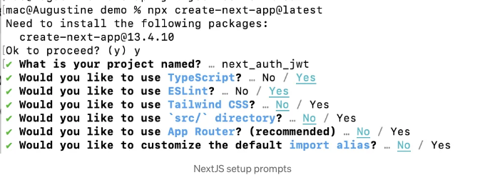

JSON Web Tokens (JWTs)은 사용자를 인증하고 권한을 부여하는 데 널리 사용되며 클라이언트와 서버 간의 안전한 통신을 보장하는 업계 표준이 되었습니다.

JWT는 토큰 자체에 사용자 정보를 저장함으로써 서버가 세션 상태를 유지할 필요를 없애줍니다.

NextJs 애플리케이션에서 인증을 처리할 때 가장 일반적으로 사용되는 기술 중 하나는 Next Auth입니다.

<!-- ui-log 수평형 -->
<ins class="adsbygoogle"
  style="display:block"
  data-ad-client="ca-pub-4877378276818686"
  data-ad-slot="9743150776"
  data-ad-format="auto"
  data-full-width-responsive="true"></ins>
<component is="script">
(adsbygoogle = window.adsbygoogle || []).push({});
</component>

기본적으로 Next Auth는 다양한 인증 제공자와 기술을 지원하지만 외부 JWT를 사용하지는 않습니다.

Next Auth는 쿠키에 세션 식별자를 저장하는 세션 기반 인증을 사용합니다. 이 방법은 많은 애플리케이션에 대해 더 쉽고 자주 충분합니다.

하지만 Next Auth를 설정하여 성공적인 인증 후에 JWT를 생성하고 이를 이후 요청에 활용할 수 있습니다.

이를 통해 JWT 기반 인증을 세션 기반 인증과 결합하거나 대신 사용할 수 있게 됩니다.

<!-- ui-log 수평형 -->
<ins class="adsbygoogle"
  style="display:block"
  data-ad-client="ca-pub-4877378276818686"
  data-ad-slot="9743150776"
  data-ad-format="auto"
  data-full-width-responsive="true"></ins>
<component is="script">
(adsbygoogle = window.adsbygoogle || []).push({});
</component>

그런데 NextJS 앱이 인가를 위해 옛날 방식인 이메일과 비밀번호로 저장된 외부 JWT에 의존하는 경우 어떻게 해야 할까요?

이것은 때때로 귀찮을 수 있습니다.

함께 단계를 분해해 봅시다.

# 단계 1: Next Js 앱 만들기:

<!-- ui-log 수평형 -->
<ins class="adsbygoogle"
  style="display:block"
  data-ad-client="ca-pub-4877378276818686"
  data-ad-slot="9743150776"
  data-ad-format="auto"
  data-full-width-responsive="true"></ins>
<component is="script">
(adsbygoogle = window.adsbygoogle || []).push({});
</component>

먼저 NextJS 앱을 만듭니다.

이 예시에서는 페이지 라우터를 사용하지만 NextJS 앱 라우터를 사용할 때도 동작합니다.

터미널에서 `npx create-next-app@latest` 명령을 실행하고 필요한 프롬프트에 답변하여 Next JS 앱을 만듭니다.



<!-- ui-log 수평형 -->
<ins class="adsbygoogle"
  style="display:block"
  data-ad-client="ca-pub-4877378276818686"
  data-ad-slot="9743150776"
  data-ad-format="auto"
  data-full-width-responsive="true"></ins>
<component is="script">
(adsbygoogle = window.adsbygoogle || []).push({});
</component>

# 단계 2: NextAuth 설치하기

터미널에서 `npm install next-auth` 명령어를 실행해주세요.

# 단계 3: 환경 변수 설정

NextAuth는 제대로 작동하려면 환경 변수 몇 가지가 필요합니다.

<!-- ui-log 수평형 -->
<ins class="adsbygoogle"
  style="display:block"
  data-ad-client="ca-pub-4877378276818686"
  data-ad-slot="9743150776"
  data-ad-format="auto"
  data-full-width-responsive="true"></ins>
<component is="script">
(adsbygoogle = window.adsbygoogle || []).push({});
</component>

시작하려면 프로젝트의 루트에 .env 파일을 생성하세요.

여기서 두 가지 필수 변수가 필요합니다.

NEXTAUTH_URL: 이것은 프로젝트의 기본 URL입니다.

NEXTAUTH_URL=”http://localhost:3000”

<!-- ui-log 수평형 -->
<ins class="adsbygoogle"
  style="display:block"
  data-ad-client="ca-pub-4877378276818686"
  data-ad-slot="9743150776"
  data-ad-format="auto"
  data-full-width-responsive="true"></ins>
<component is="script">
(adsbygoogle = window.adsbygoogle || []).push({});
</component>

로컬 환경에서 작업 중이니, 프로젝트의 기본 URL을 http://localhost:3000으로 설정할게요. 프로덕션 환경에서는 여러분의 도메인 이름이 될 거에요.

NEXTAUTH_SECRET: 이는 이메일 확인 토큰을 암호화하고 내부적으로 다른 암호화를 수행하기 위해 사용됩니다. 필수 항목이에요. NEXTAUTH_SECRET를 제공하지 않으면 프로덕션 환경에서 오류가 발생할 거에요.

터미널에서 이 openssl 명령어를 통해 빠르게 좋은 값을 생성할 수 있어요.

```js
openssl rand -base64 32
```

<!-- ui-log 수평형 -->
<ins class="adsbygoogle"
  style="display:block"
  data-ad-client="ca-pub-4877378276818686"
  data-ad-slot="9743150776"
  data-ad-format="auto"
  data-full-width-responsive="true"></ins>
<component is="script">
(adsbygoogle = window.adsbygoogle || []).push({});
</component>

터미널에서 명령을 실행했을 때의 결과 스크린샷이 아래에 있어요.


NEXTAUTH_SECRET=”tgY5i4Ea/GZIYMC3J76rANVMf/Cyj0410bSulEicArM=”

pages/_app.js 파일에서 앱을 Next auth 패키지의 SessionProvider로 감싸 주세요.

<!-- ui-log 수평형 -->
<ins class="adsbygoogle"
  style="display:block"
  data-ad-client="ca-pub-4877378276818686"
  data-ad-slot="9743150776"
  data-ad-format="auto"
  data-full-width-responsive="true"></ins>
<component is="script">
(adsbygoogle = window.adsbygoogle || []).push({});
</component>

```js
import { AppProps } from "next/app";
import { SessionProvider } from "next-auth/react";

export default function App({
  Component,
  pageProps: { session, ...pageProps },
}: AppProps) {
  return (
    <SessionProvider session={session}>
      <Component {...pageProps} />
    </SessionProvider>
  );
}
```

# 단계 5: NextAuth API 라우트 추가하기

pages/api/auth 디렉토리에 […nextauth].js라는 파일을 생성하세요. 이 파일은 Next Auth의 동적 라우트 핸들러를 포함하며 전역 NextAuth.js 구성을 모두 포함할 것입니다.

이 예제에서는 백엔드가 인증에 이메일과 비밀번호를 요구하기 때문에 자격 증명 제공자(Credentials provider)를 사용할 것입니다.```

<!-- ui-log 수평형 -->
<ins class="adsbygoogle"
  style="display:block"
  data-ad-client="ca-pub-4877378276818686"
  data-ad-slot="9743150776"
  data-ad-format="auto"
  data-full-width-responsive="true"></ins>
<component is="script">
(adsbygoogle = window.adsbygoogle || []).push({});
</component>

```js
import NextAuth from "next-auth"

export const authOptions = {
  // 하나 이상의 인증 제공자 구성
  providers: [
  ],
}
export default NextAuth(authOptions)
```

# 단계 6: 자격 증명 제공자 추가

이제 사용자로부터 이메일과 비밀번호를 받을 수 있도록 자격 증명 제공자를 추가해야합니다.

pages/api/auth 경로의 [...nextauth].js 파일에서. 

<!-- ui-log 수평형 -->
<ins class="adsbygoogle"
  style="display:block"
  data-ad-client="ca-pub-4877378276818686"
  data-ad-slot="9743150776"
  data-ad-format="auto"
  data-full-width-responsive="true"></ins>
<component is="script">
(adsbygoogle = window.adsbygoogle || []).push({});
</component>

아래와 같이 authOptions 변수를 업데이트 해주세요.

```js
import CredentialsProvider from "next-auth/providers/credentials";

export const authOptions = {
  // 하나 이상의 인증 제공자를 구성합니다
  providers: [
    CredentialsProvider({
      // 로그인 폼에 표시할 이름 (예: '...로 로그인')
      name: "Credentials",
      // 자격 증명은 로그인 페이지에 적합한 양식을 생성하는 데 사용됩니다.
      // 제출되기를 기대하는 필드를 지정할 수 있습니다.
      // 예: 도메인, 사용자 이름, 비밀번호, 2단계 인증 토큰 등
      // 객체를 통해 <input> 태그에 모든 HTML 속성을 전달할 수 있습니다.
      credentials: {
        email: {
          label: "이메일",
          type: "email",
          placeholder: "johndoe@email.com",
        },
        password: { label: "비밀번호", type: "password" },
      },
      async authorize(credentials, req) {
        // 여기에 자격 증명을 가져와
        // 백엔드 서버로 제출한 다음, 사용자를 나타내는 객체 또는 값
        // 또는 자격 증명이 잘못된 경우 false/null을 반환하는 로직을 작성합니다.
        // e.g. return { id: 1, name: 'J Smith', email: 'jsmith@example.com' }
      }
    }),
  ],
};

export default NextAuth(authOptions);
```

위 작업을 완료하면 Next Auth는 로그인 및 가입 페이지와 같은 기본 인증 페이지를 제공합니다.

/api/auth/signin으로 이동하면 아래 이미지에 나온 것과 같이 로그인 화면이 표시됩니다.

<!-- ui-log 수평형 -->
<ins class="adsbygoogle"
  style="display:block"
  data-ad-client="ca-pub-4877378276818686"
  data-ad-slot="9743150776"
  data-ad-format="auto"
  data-full-width-responsive="true"></ins>
<component is="script">
(adsbygoogle = window.adsbygoogle || []).push({});
</component>


위 코드에서 authorize 함수는 제출된 데이터를 백엔드로 보내고 JWT를 받아오는 논리를 작성하는 곳입니다.

백엔드에 대해, 프로세스를 설명하기 위해 NodeJS를 사용하여 가짜 API JWT json-server를 설정했습니다.

여기 github 저장소 링크입니다: [https://github.com/Chinedu19/fake-api-jwt-json-server](https://github.com/Chinedu19/fake-api-jwt-json-server)

<!-- ui-log 수평형 -->
<ins class="adsbygoogle"
  style="display:block"
  data-ad-client="ca-pub-4877378276818686"
  data-ad-slot="9743150776"
  data-ad-format="auto"
  data-full-width-responsive="true"></ins>
<component is="script">
(adsbygoogle = window.adsbygoogle || []).push({});
</component>

위의 저장소에는 보호된 루트 네 개와 보호되지 않은 루트 둘을 제공합니다.

# 사용자 인증 및 JWT 검색

## 세션 확인

Next auth에서 제공하는 useSession 훅을 통해 클라이언트에서 세션을 확인할 수 있습니다.

<!-- ui-log 수평형 -->
<ins class="adsbygoogle"
  style="display:block"
  data-ad-client="ca-pub-4877378276818686"
  data-ad-slot="9743150776"
  data-ad-format="auto"
  data-full-width-responsive="true"></ins>
<component is="script">
(adsbygoogle = window.adsbygoogle || []).push({});
</component>

```js
…
export default function Home() {
  const { data: session } = useSession();
  console.log(session);
… // return 문은 포함되어 있습니다.
}
```

현재 사용자가 로그인되어 있지 않으므로 null이 반환됩니다.

일단 홈페이지에 있는 console.log를 남겨둬서, 성공적으로 로그인했을 때 세션을 확인하는 데 사용할 수 있습니다.

사용자 정보와 JWT를 가져오는 데 집중해 봅시다.

<!-- ui-log 수평형 -->
<ins class="adsbygoogle"
  style="display:block"
  data-ad-client="ca-pub-4877378276818686"
  data-ad-slot="9743150776"
  data-ad-format="auto"
  data-full-width-responsive="true"></ins>
<component is="script">
(adsbygoogle = window.adsbygoogle || []).push({});
</component>

# JWT 가져오기

위의 단계 6에서 authorize 함수에서는 백엔드에 자격 증명 세부 정보를 보내고 JWT를 받아와야 합니다.

저는 JavaScript Fetch API를 사용하여 백엔드에 요청을 보내는 것을 할 것입니다

```js
const authOptions = {
...,
  async authorize(credentials, req) {
        
        try {
          const res = await fetch("http://localhost:8000/auth/login", {
            method: "POST",
            body: JSON.stringify({
              email: credentials.email,
              password: credentials.password,
            }),
            headers: { "Content-Type": "application/json" },
          });

          if (!res.ok) {
            // credentials are invalid
            return null;
          }

          const parsedResponse = await res.json();

          // accessing the jwt returned by server
          const jwt = parsedResponse.access_token;

// You can make more request to get other information about the user eg. Profile details

         // return user credentials together with jwt
          return {
            ...credentials,
            jwt,
          };
        } catch (e) {
          return null;
        }
      },
...
}
```

<!-- ui-log 수평형 -->
<ins class="adsbygoogle"
  style="display:block"
  data-ad-client="ca-pub-4877378276818686"
  data-ad-slot="9743150776"
  data-ad-format="auto"
  data-full-width-responsive="true"></ins>
<component is="script">
(adsbygoogle = window.adsbygoogle || []).push({});
</component>

위 코드는 백엔드에 POST 요청을 보내고 JWT를 검색한 다음 반환합니다.

이 작업이 잘 되는지 테스트하려면 사용자 자격 증명으로 로그인해 보세요.

가짜 API JWT json-server를 사용하는 경우 users.json 파일에서 사용자를 선택하여 사용자 정보를 얻을 수 있습니다.

성공적인 로그인은 사용자를 홈페이지로 리디렉션합니다.

<!-- ui-log 수평형 -->
<ins class="adsbygoogle"
  style="display:block"
  data-ad-client="ca-pub-4877378276818686"
  data-ad-slot="9743150776"
  data-ad-format="auto"
  data-full-width-responsive="true"></ins>
<component is="script">
(adsbygoogle = window.adsbygoogle || []).push({});
</component>

홈페이지에 useSession 훅을 사용하여 현재 세션을 로그할 때, 객체가 반환됩니다.


하지만 이메일만 표시되었네요. 전달한 JWT 및 다른 값들은 어디에 있나요?

이유가 뭘까요?

<!-- ui-log 수평형 -->
<ins class="adsbygoogle"
  style="display:block"
  data-ad-client="ca-pub-4877378276818686"
  data-ad-slot="9743150776"
  data-ad-format="auto"
  data-full-width-responsive="true"></ins>
<component is="script">
(adsbygoogle = window.adsbygoogle || []).push({});
</component>

기본 설정으로 NextAuth는 보안을 강화하기 위해 토큰의 일부만을 반환합니다. 사용자 ID 및 비밀번호와 같은 정보는 무시됩니다.

JWT가 전달되도록 하는 방법은 `[...nextauth].js` 파일의 `authOptions` 변수에 Callbacks를 전달해야 합니다.

# 콜백이란?

콜백은 특정 작업이 수행될 때 어떤 일이 발생하는지 제어할 수 있는 비동기 함수입니다.

<!-- ui-log 수평형 -->
<ins class="adsbygoogle"
  style="display:block"
  data-ad-client="ca-pub-4877378276818686"
  data-ad-slot="9743150776"
  data-ad-format="auto"
  data-full-width-responsive="true"></ins>
<component is="script">
(adsbygoogle = window.adsbygoogle || []).push({});
</component>

콜백은 특히 JSON Web 토큰이 관련된 시나리오에서 매우 강력합니다. 이들은 API와 통합할 수 있도록 해줍니다.

사용자가 성공적으로 인증된 이후에는 두 개의 콜백이 이루어집니다.

- JWT 콜백: 이 콜백은 JWT가 생성될 때(즉, 로그인 시) 호출되거나 업데이트될 때(즉, 클라이언트에서 useSession 후 세션이 액세스될 때) 호출됩니다.
- 세션 콜백: 세션 콜백은 세션이 확인될 때 호출됩니다. JWT 객체가 세션 함수로 전달되어 세션에 포함될 수 있습니다. 기본적으로 보안을 강화하기 위해 토큰의 일부만 반환됩니다.

authorize 함수에 의해 반환되는 사용자 객체은 사용자가 첫 번째로 로그인할 때 JWT 콜백으로 전달됩니다. 그 이후 호출에서는 보안 상의 이유로 객체의 일부만 사용할 수 있습니다.

<!-- ui-log 수평형 -->
<ins class="adsbygoogle"
  style="display:block"
  data-ad-client="ca-pub-4877378276818686"
  data-ad-slot="9743150776"
  data-ad-format="auto"
  data-full-width-responsive="true"></ins>
<component is="script">
(adsbygoogle = window.adsbygoogle || []).push({});
</component>


세션 객체에 JWT가 포함되어 있는지 확인하려면 세션의 JWT를 명시적으로 추가해야 합니다.

```js
export const authOptions = {
providers:[...],
callbacks: {
    jwt: async ({ token, user }) => {
     // user is only available the first time a user signs in authorized
      if (user) {
        return {
          ...token,
          jwt: user.jwt,
        };
      }
      return token;
    },
    session: async ({ session, token }) => {
      if (token) {
        session.jwt = token.jwt;
      }
      return session;
    },
  },
}
```

위의 jwt 콜백에서 볼 수 있듯이, 사용자 객체가 존재할 때 (사용자가 성공적으로 로그인한 경우), JWT가 반환된 토큰에 추가됩니다.

<!-- ui-log 수평형 -->
<ins class="adsbygoogle"
  style="display:block"
  data-ad-client="ca-pub-4877378276818686"
  data-ad-slot="9743150776"
  data-ad-format="auto"
  data-full-width-responsive="true"></ins>
<component is="script">
(adsbygoogle = window.adsbygoogle || []).push({});
</component>

세션 콜백에서 JWT는 토큰 객체에서 가져와 세션 객체에 추가됩니다.

프론트엔드에서 세션 객체를 확인하면 JWT가 세션 객체에 사용 가능하게 됩니다


# 각 요청에 JWT 동적으로 첨부하기(fetch API 사용)

<!-- ui-log 수평형 -->
<ins class="adsbygoogle"
  style="display:block"
  data-ad-client="ca-pub-4877378276818686"
  data-ad-slot="9743150776"
  data-ad-format="auto"
  data-full-width-responsive="true"></ins>
<component is="script">
(adsbygoogle = window.adsbygoogle || []).push({});
</component>

각 요청과 함께 사용자의 JWT가 전송되도록 하려면 세션에서 JWT를 가져와야 합니다.

Next auth는 클라이언트가 세션에 액세스해야 할 때 getSession 함수를 제공합니다.

첫 번째 단계는 모든 요청을 처리하고 세션이 있는지 확인하는 함수를 만드는 것입니다.

세션이 있는 경우 해당 함수는 JWT를 Authorization 헤더에 추가합니다.

<!-- ui-log 수평형 -->
<ins class="adsbygoogle"
  style="display:block"
  data-ad-client="ca-pub-4877378276818686"
  data-ad-slot="9743150776"
  data-ad-format="auto"
  data-full-width-responsive="true"></ins>
<component is="script">
(adsbygoogle = window.adsbygoogle || []).push({});
</component>

```js
import { getSession } from "next-auth/react";

const fetchClient = async (url, options) => {
  const session = await getSession();

  return fetch(url, {
    ...options,
    headers: {
      ...options?.headers,
      ...(session && { Authorization: `Bearer ${session.jwt}` }),
    },
  });
};
```

위의 fetchClient 함수는 getSession() 함수로 세션을 가져옵니다.

옵션 매개변수를 사용하여 사용자 지정 헤더를 허용하며 전개 연산자를 사용하여 세션 객체를 사용할 수 있는 경우에만 JWT를 첨부할 수 있습니다.

# 각 요청에 JWT 동적으로 첨부하기 (Axios 사용)

<!-- ui-log 수평형 -->
<ins class="adsbygoogle"
  style="display:block"
  data-ad-client="ca-pub-4877378276818686"
  data-ad-slot="9743150776"
  data-ad-format="auto"
  data-full-width-responsive="true"></ins>
<component is="script">
(adsbygoogle = window.adsbygoogle || []).push({});
</component>

Axios 인터셉터는 요청을 보내기 전에 요청에 더 많은 항목을 추가하는 훌륭한 방법입니다.

Axios 인터셉터를 생성하기 위해 다음을 수행해야 합니다:

- Axios 인스턴스를 생성합니다
- JWT를 보낼 때마다 요청에 첨부할 인터셉터를 생성합니다

```js
import axios from "axios";
import { getSession } from "next-auth/react";

// 새로운 Axios 인스턴스 생성
const axiosInstance = axios.create({
  baseURL: "http://localhost:8000/", // 백엔드 서버의 기본 URL로 대체하세요
});

// 인터셉터 생성
axiosInstance.interceptors.request.use(async (request) => {
  // 세션을 가져옵니다
  const session = await getSession();

  // 요청 헤더에 원하는 세션 값을 추가합니다
  if (session) {
    request.headers = {
      ...request.headers,
      Authorization: `Bearer ${session.jwt}`,
    };
  }

  return request;
});

export const BackendInstance = axiosInstance;
```

<!-- ui-log 수평형 -->
<ins class="adsbygoogle"
  style="display:block"
  data-ad-client="ca-pub-4877378276818686"
  data-ad-slot="9743150776"
  data-ad-format="auto"
  data-full-width-responsive="true"></ins>
<component is="script">
(adsbygoogle = window.adsbygoogle || []).push({});
</component>

# 작동하는지 확인해 봤어요?

저는 이미 NextJs에서 제품 페이지 경로를 만들어서 이를 확인했습니다.

```js
import React, { useEffect, useState } from "react";
import fetchClient from "@/fetchClient";
import Link from "next/link";

const Products = () => {
  const [products, setProducts] = useState([]);
  const [error, setError] = useState("");
  const getProducts = async () => {
    const res = await fetchClient("http://localhost:8000/products", {
      headers: { "Content-Type": "application/json" },
    });

    console.log(res);

    const products = await res.json();
    if (!res.ok) {
      setError(res.statusText);
    }

    res.ok && setProducts(products);
  };
  useEffect(() => {
    getProducts();
  }, []);

  return (
    <div>
      <h1>제품</h1>

      {error && <p>{error}</p>}

      {products.map((item, index) => (
        <p key={index}>{JSON.stringify(item)}</p>
      ))}
    </div>
  );
};

export default Products;
```

이 페이지는 "/products" 보호된 엔드포인트를 호출합니다.

<!-- ui-log 수평형 -->
<ins class="adsbygoogle"
  style="display:block"
  data-ad-client="ca-pub-4877378276818686"
  data-ad-slot="9743150776"
  data-ad-format="auto"
  data-full-width-responsive="true"></ins>
<component is="script">
(adsbygoogle = window.adsbygoogle || []).push({});
</component>

JWT가 없는 경우 "Unauthorized"를 반환하고 오류 상태를 설정합니다.

이용 가능한 경우 제품 목록을 반환합니다.

아래는 결과입니다:

## 사용자가 로그인됨

<!-- ui-log 수평형 -->
<ins class="adsbygoogle"
  style="display:block"
  data-ad-client="ca-pub-4877378276818686"
  data-ad-slot="9743150776"
  data-ad-format="auto"
  data-full-width-responsive="true"></ins>
<component is="script">
(adsbygoogle = window.adsbygoogle || []).push({});
</component>


## 로그인되지 않음


다른 보안된 경로에서도 시도할 수 있어요.

<!-- ui-log 수평형 -->
<ins class="adsbygoogle"
  style="display:block"
  data-ad-client="ca-pub-4877378276818686"
  data-ad-slot="9743150776"
  data-ad-format="auto"
  data-full-width-responsive="true"></ins>
<component is="script">
(adsbygoogle = window.adsbygoogle || []).push({});
</component>

# 결론

Next Auth는 외부 JWT를 기본적으로 구현하지는 않지만, 커스텀 구성 및 콜백을 통해 JWT 기반 인증을 유연하게 통합할 수 있는 기능을 제공합니다. 이러한 적응성 덕분에 개발자들은 NextAuth.js와 JWT를 원활하게 통합하거나 특정 애플리케이션 요구 사항에 맞게 대체 인증 방법을 사용할 수 있습니다.

웹 애플리케이션이 계속 발전함에 따라, JSON Web Tokens는 의심할 여지 없이 클라이언트와 서버 간 통신을 안전하고 최적화하는 데 중요한 구성 요소로 남을 것입니다. 다양한 플랫폼에서의 널리 통용되는 지원으로, 보안, 확장성 및 사용자와의 원활한 상호 작용에 중점을 둔 현대적이고 분산된 시스템을 구축하는 데 필수적인 도구로 자리 잡고 있습니다.

# 크레딧

<!-- ui-log 수평형 -->
<ins class="adsbygoogle"
  style="display:block"
  data-ad-client="ca-pub-4877378276818686"
  data-ad-slot="9743150776"
  data-ad-format="auto"
  data-full-width-responsive="true"></ins>
<component is="script">
(adsbygoogle = window.adsbygoogle || []).push({});
</component>

**techiediaries**님께 특별한 감사를 전합니다. fake API JWT json-server 설정에 도움을 주셔서 감사합니다.

더 많은 콘텐츠를 확인하려면 PlainEnglish.io를 방문해주세요.

우리의 무료 주간 뉴스레터에 가입하세요. 트위터, 링크드인, 유튜브, 디스코드에서도 팔로우하세요.