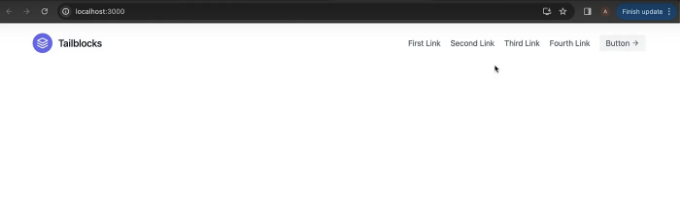
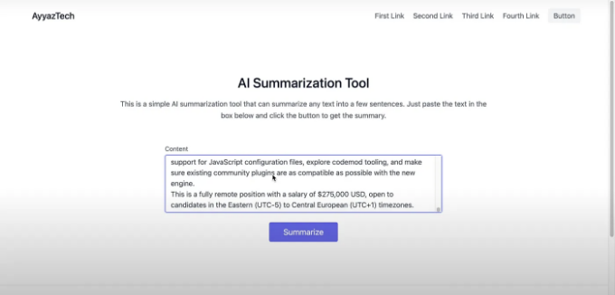
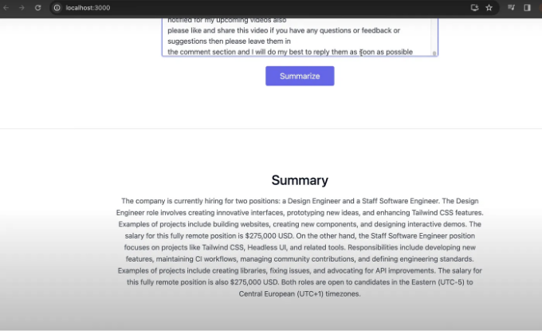

# 소개:

이 튜토리얼에서는 ReactJS를 사용하여 OpenAI의 API의 기능을 활용하여 텍스트 압축 도구를 만드는 방법을 배워보겠습니다. 이 안내서를 마치면 긴 텍스트를 간결한 요약으로 요약할 수있는 완전히 기능이 작동하는 응용 프로그램을 갖게 될 것입니다. 우리는 Tailwind CSS를 활용하여 응용 프로그램을 스타일링하고 시각적으로 매력적으로 만들 것입니다. 그러니 함께 시작해 봅시다! 

# 준비 사항:

<!-- ui-log 수평형 -->
<ins class="adsbygoogle"
  style="display:block"
  data-ad-client="ca-pub-4877378276818686"
  data-ad-slot="9743150776"
  data-ad-format="auto"
  data-full-width-responsive="true"></ins>
<component is="script">
(adsbygoogle = window.adsbygoogle || []).push({});
</component>

- ReactJS에 대한 기본 지식
- HTML 및 CSS에 익숙함
- OpenAI API 키 (여기에서 어떻게 얻는지 알아보세요: https://www.youtube.com/watch?v=bPG5d0o4BhU)

단계 1: React 프로젝트 설정하기 먼저 터미널을 열고 프로젝트를 만들 디렉토리로 이동하세요. 다음 명령어를 실행하여 Tailwind CSS로 새 React 프로젝트를 만듭니다:

```js
npx create-react-app my-app
cd my-app
```

단계 2: Tailwind CSS 설치 및 구성하기 이제 Tailwind CSS를 개발 의존성으로 설치해 보겠습니다. 터미널에서 다음을 실행하세요:

<!-- ui-log 수평형 -->
<ins class="adsbygoogle"
  style="display:block"
  data-ad-client="ca-pub-4877378276818686"
  data-ad-slot="9743150776"
  data-ad-format="auto"
  data-full-width-responsive="true"></ins>
<component is="script">
(adsbygoogle = window.adsbygoogle || []).push({});
</component>

```js
npm install -D tailwindcss postcss autoprefixer
npx tailwindcss init -p
```

다음으로, tailwind.config.js 파일의 내용을 다음과 같이 교체해주세요:

```js
module.exports = {
  content: [
    "./src/**/*.{js,jsx,ts,tsx}",
  ],
  theme: {
    extend: {},
  },
  plugins: [],
}
```

src/index.css 파일을 열어 내용을 다음과 같이 교체해주세요:```

<!-- ui-log 수평형 -->
<ins class="adsbygoogle"
  style="display:block"
  data-ad-client="ca-pub-4877378276818686"
  data-ad-slot="9743150776"
  data-ad-format="auto"
  data-full-width-responsive="true"></ins>
<component is="script">
(adsbygoogle = window.adsbygoogle || []).push({});
</component>

```js
@tailwind 기본 설정;
@tailwind 구성요소;
@tailwind 유틸리티;
```

3단계: 사용자 인터페이스 만들기 애플리케이션의 사용자 인터페이스를 만들어 봅시다. Tailwind CSS의 미리 만들어진 구성요소를 사용하여 프로세스를 가속화할 것입니다.



src/App.js 파일의 내용을 다음 코드로 교체하십시오:```

<!-- ui-log 수평형 -->
<ins class="adsbygoogle"
  style="display:block"
  data-ad-client="ca-pub-4877378276818686"
  data-ad-slot="9743150776"
  data-ad-format="auto"
  data-full-width-responsive="true"></ins>
<component is="script">
(adsbygoogle = window.adsbygoogle || []).push({});
</component>

```js
import React, { useState } from 'react'

export default function App() {
  const [content, setContent] = useState('')
  const [summary, setSummary] = useState('')

  const summarize = async () => {
    const apiUrl = 'https://api.openai.com/v1/chat/completions'
    const apiKey = 'YOUR_API_KEY'
    const headers = {
      'Content-Type': 'application/json',
      'Authorization': `Bearer ${apiKey}`
    }
    const data = {
      model: 'gpt-3.5-turbo',
      messages: [
        { role: 'system', content: 'You are a helpful assistant. and you have to summarize the text provided by the user.' },
        { role: 'user', content }
      ]
    }
    const response = await fetch(apiUrl, {
      method: 'POST',
      headers,
      body: JSON.stringify(data)
    })
    const result = await response.json()
    const summary = result.choices[0].message.content
    setSummary(summary)
  }
  return (
    <>
      <header className="text-gray-600 body-font">
        <div className="container mx-auto flex flex-wrap p-5 flex-col md:flex-row items-center">
          <a href="/" className="flex title-font font-medium items-center text-gray-900 mb-4 md:mb-0">
            <span className="ml-3 text-xl">AyyazTech</span>
          </a>
          <nav className="md:ml-auto flex flex-wrap items-center text-base justify-center">
            <a href="/" className="mr-5 hover:text-gray-900">첫 번째 링크</a>
            <a href="/" className="mr-5 hover:text-gray-900">두 번째 링크</a>
            <a href="/" className="mr-5 hover:text-gray-900">세 번째 링크</a>
            <a href="/" className="mr-5 hover:text-gray-900">네 번째 링크</a>
          </nav>
          <button className="inline-flex items-center bg-gray-100 border-0 py-1 px-3 focus:outline-none hover:bg-gray-200 rounded text-base mt-4 md:mt-0">버튼</button>
        </div>
      </header>

      <section className="text-gray-600 body-font relative">
        <div className="container px-5 py-24 mx-auto">
          <div className="flex flex-col text-center w-full mb-12">
            <h1 className="sm:text-3xl text-2xl font-medium title-font mb-4 text-gray-900">AI 요약 도구</h1>
            <p className="lg:w-2/3 mx-auto leading-relaxed text-base">
              이것은 어떤 텍스트든 몇 문장으로 요약할 수 있는 간단한 AI 요약 도구입니다. 아래 상자에 텍스트를 붙여넣고 요약을 받으려면 버튼을 클릭하십시오.
            </p>
          </div>
          <div className="lg:w-1/2 md:w-2/3 mx-auto">
            <div className="flex flex-wrap -m-2">
              <div className="p-2 w-full">
                <div className="relative">
                  <label htmlFor="message" className="leading-7 text-sm text-gray-600">내용</label>
                  <textarea
                    value={content}
                    onChange={e => setContent(e.target.value)}
                    id="message" name="message" className="w-full bg-gray-100 bg-opacity-50 rounded border border-gray-300 focus:border-indigo-500 focus:bg-white focus:ring-2 focus:ring-indigo-200 h-32 text-base outline-none text-gray-700 py-1 px-3 resize-none leading-6 transition-colors duration-200 ease-in-out"></textarea>
                </div>
              </div>
              <div className="p-2 w-full">
                <button onClick={summarize} className="flex mx-auto text-white bg-indigo-500 border-0 py-2 px-8 focus:outline-none hover:bg-indigo-600 rounded text-lg">요약</button>
              </div>
            </div>
          </div>
        </div>
      </section>

      {/* Summary */}
      <hr />
      <section className="text-gray-600 body-font">
        <div className="container px-5 py-24 mx-auto">
          <div className="flex flex-col text-center w-full mb-20">
            <h1 className="sm:text-3xl text-2xl font-medium title-font mb-4 text-gray-900">요약</h1>
            <p className="lg:w-2/3 mx-auto leading-relaxed text-base">
              {summary}
            </p>
          </div>
        </div>
      </section>
    </>
  )
}
``` 

Step 4: OpenAI API와 연동하기 이제 애플리케이션을 OpenAI API와 연결하여 요약을 생성해보겠습니다. 아래 코드를 handleSummarize 함수 안에 추가하세요:

```js
const apiKey = 'YOUR_API_KEY';
const url = 'https://api.openai.com/v1/chat/completions';

const headers = {
  'Content-Type': 'application/json',
  'Authorization': `Bearer ${apiKey}`,
};
const data = {
  model: 'gpt-3.5-turbo',
  messages: [
    { role: 'system', content: 'You are a helpful assistant that summarizes text.' },
    { role: 'user', content: content },
  ],
};
fetch(url, {
  method: 'POST',
  headers: headers,
  body: JSON.stringify(data),
})
  .then((response) => response.json())
  .then((data) => {
    const summary = data.choices[0].message.content;
    setSummary(summary);
  })
  .catch((error) => {
    console.error('Error:', error);
});
``` 

`YOUR_API_KEY`를 실제 OpenAI API 키로 대체하십시오.```

<!-- ui-log 수평형 -->
<ins class="adsbygoogle"
  style="display:block"
  data-ad-client="ca-pub-4877378276818686"
  data-ad-slot="9743150776"
  data-ad-format="auto"
  data-full-width-responsive="true"></ins>
<component is="script">
(adsbygoogle = window.adsbygoogle || []).push({});
</component>



단계 5: 요약 도구 테스트  
터미널에서 npm start를 실행하여 React 애플리케이션을 시작하십시오. 브라우저를 열고 http://localhost:3000 으로 이동하십시오. 그러면 요약 도구가 제대로 작동하는 것을 확인할 수 있습니다!

텍스트 영역에 긴 단락을 붙여넣고 "Summarize" 버튼을 클릭해보세요. OpenAI API가 텍스트를 처리하고 간결한 요약을 생성한 다음 아래에 표시될 것입니다.



<!-- ui-log 수평형 -->
<ins class="adsbygoogle"
  style="display:block"
  data-ad-client="ca-pub-4877378276818686"
  data-ad-slot="9743150776"
  data-ad-format="auto"
  data-full-width-responsive="true"></ins>
<component is="script">
(adsbygoogle = window.adsbygoogle || []).push({});
</component>


결론: 축하드립니다! ReactJS와 OpenAI API를 사용하여 텍스트 요약 도구를 성공적으로 만들었습니다. 이 강좌는 인공 지능과 웹 개발을 결합하여 유용한 애플리케이션을 만드는 능력을 보여줍니다.

이 튜토리얼이 도움이 되었다면, 더 흥미로운 콘텐츨르 제공하는 제 YouTube 채널을 구독해 보시기 바랍니다. 댓글을 남겨주시고 향후 영상에 대한 생각이나 제안을 공유해 주세요.

좋은 코딩 되세요!

관련 동영상:

<!-- ui-log 수평형 -->
<ins class="adsbygoogle"
  style="display:block"
  data-ad-client="ca-pub-4877378276818686"
  data-ad-slot="9743150776"
  data-ad-format="auto"
  data-full-width-responsive="true"></ins>
<component is="script">
(adsbygoogle = window.adsbygoogle || []).push({});
</component>

- 코더들을 위한 창조자들: ChatGPT 4 Vision의 반드시 볼 가치 있는 9가지 활용법! (https://www.youtube.com/watch?v=qN9CiYmfQIM)
- React & Tailwind CSS: ChatGPT 4에 안내받은 퀴즈 앱 만들기 (https://www.youtube.com/watch?v=-Y_khYHLTr4)
- React & Tailwind CSS: ChatGPT에 의해 안내받는 빠른 이미지 편집기 만들기 (https://www.youtube.com/watch?v=14-Bkt17i1M)

GITHUB 저장소: https://github.com/ayyazzafar/reactjs_17_tutorials_code