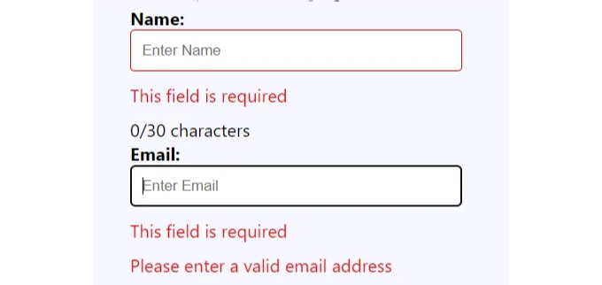
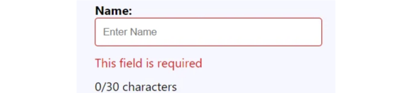
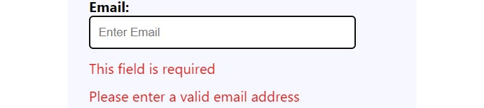

여기 약 3분 동안 이렇게 어떻게 만들 수 있는지에 대한 정보입니다



<!-- ui-log 수평형 -->
<ins class="adsbygoogle"
  style="display:block"
  data-ad-client="ca-pub-4877378276818686"
  data-ad-slot="9743150776"
  data-ad-format="auto"
  data-full-width-responsive="true"></ins>
<component is="script">
(adsbygoogle = window.adsbygoogle || []).push({});
</component>

가정적으로, 이미 React 앱을 만드는 방법을 알고 계시다고 가정하겠습니다.

여러분께서는 코드만 필요할 거에요. 여기에 설명이 있습니다.

하지만 어쨌든 터미널에 다음을 작성해보실 수 있어요:

```js
npx create-expo-app StickerSmash
```

<!-- ui-log 수평형 -->
<ins class="adsbygoogle"
  style="display:block"
  data-ad-client="ca-pub-4877378276818686"
  data-ad-slot="9743150776"
  data-ad-format="auto"
  data-full-width-responsive="true"></ins>
<component is="script">
(adsbygoogle = window.adsbygoogle || []).push({});
</component>

그리고 이것은 엑스포를 사용한 것이야.

그리고 빠른 팁, 웹에서도 사용할 수 있어.

여기 시작과 끝이야:

```js
import React, { useState } from "react";
import "./css/TextInputWithValidation.css"; // 스타일을 입히기 위해 CSS 파일을 가져와요 (제공된 스타일로 이 파일을 만들어주세요)

const TextInputWithValidation = ({
  label,
  placeholder,
  maxLength,
  onValueChange,
  type = "text", // 기본값이 "text"인 타입 속성을 추가했어
}) => {
  const [isInputEmpty, setIsInputEmpty] = useState(false);
  const [isValidEmail, setIsValidEmail] = useState(true); // 이메일 유효성을 추적하는 상태를 추가했어
  const [text, setText] = useState("");

  const handleTextChange = (newText) => {
    setText(newText);

    // 입력이 비어 있는지 확인해요
    setIsInputEmpty(newText.trim() === "");

    // 입력 타입이 "email"인 경우 이메일 유효성을 확인해요
    if (type === "email") {
      setIsValidEmail(newText.includes("@")); // "@" 기호 유무를 간단히 확인해요
    }

    // 제공된 경우 onValueChange 콜백을 호출해요
    if (onValueChange) {
      onValueChange(newText);
    }
  };

  return (
    <div>
      <div>
        <label className="label">{label}</label>
        <input
          type={type} // 입력 타입 설정
          value={text}
          onChange={(e) => handleTextChange(e.target.value)}
          placeholder={placeholder}
          onBlur={() => setIsInputEmpty(text.trim() === "")}
          className={`textInput ${
            isInputEmpty || !isValidEmail ? "errorInput" : ""
          }`} // 유효하지 않은 이메일을 위해 오류 클래스 추가
          maxLength={maxLength}
        />
        {/* 빈 입력에 대한 오류 메시지 표시 */}
        {isInputEmpty && <p className="errorText">이 입력란은 필수입니다</p>}
        {/* 유효하지 않은 이메일에 대한 오류 메시지 표시 */}
        {!isValidEmail && (
          <p className="errorText">유효한 이메일 주소를 입력해주세요</p>
        )}
        <p>
          {text.length}/{maxLength} 글자
        </p>
      </div>
    </div>
  );
};

export default TextInputWithValidation;
```

<!-- ui-log 수평형 -->
<ins class="adsbygoogle"
  style="display:block"
  data-ad-client="ca-pub-4877378276818686"
  data-ad-slot="9743150776"
  data-ad-format="auto"
  data-full-width-responsive="true"></ins>
<component is="script">
(adsbygoogle = window.adsbygoogle || []).push({});
</component>

여기 CSS 코드입니다.

```css
.label {
    flex: 2;
    font-weight: bold;
    width: 150px;
}

.textInput {
    width: 100%;
    border-color: gray;
    padding: 10px;
    margin-bottom: 10px;
    border: 1px solid #ccc; /* 별 아이콘을 위한 공간 추가 */
    border-radius: 4px;
}

.errorInput {
    border-color: red; /* 오류를 나타내는 테두리 색상 적용 */
}

.errorText {
    color: red;
    margin-bottom: 10px;
}
```

잊지 마세요. 언제든지 구성 요소에 더 나은 이름을 선택할 수 있어요.

그리고 제 개인적으로는 컬러링과 꾸미기 부분을 처리하기 위해 JavaScript 객체인 styles를 사용하는 것을 선호해요. 하지만, 초심자와 숙련자 모두에게 CSS를 사용하는 것도 좋습니다.

<!-- ui-log 수평형 -->
<ins class="adsbygoogle"
  style="display:block"
  data-ad-client="ca-pub-4877378276818686"
  data-ad-slot="9743150776"
  data-ad-format="auto"
  data-full-width-responsive="true"></ins>
<component is="script">
(adsbygoogle = window.adsbygoogle || []).push({});
</component>

이제 한 조각씩 움직이겠습니다,

그리고 명확하게 하기 위해 우리는 새로운 input 태그를 만드는 중이에요!

그래서 우리만의 속성도 만들 거예요

```js
import React, { useState } from "react";
import "./css/TextInputWithValidation.css"; // 스타일링을 위해 CSS 파일을 가져오세요 (제공된 스타일로 이 파일을 생성하세요)

const TextInputWithValidation = ({
  label,
  placeholder,
  maxLength,
  onValueChange,
  type = "text", // 기본값이 "text"인 type 속성을 추가했어요
}) => {
```

<!-- ui-log 수평형 -->
<ins class="adsbygoogle"
  style="display:block"
  data-ad-client="ca-pub-4877378276818686"
  data-ad-slot="9743150776"
  data-ad-format="auto"
  data-full-width-responsive="true"></ins>
<component is="script">
(adsbygoogle = window.adsbygoogle || []).push({});
</component>

수입 후, 기능 컴포넌트를 만들 것입니다. 시작하기 위해 다음을 작성하십시오.

```js
const TextInputWithValidation = ({
```

이렇게 해서 기능 컴포넌트를 작성했습니다. 이제 JSX 요소로 사용할 수 있습니다. 

파라미터 또는 프로퍼티는 다음과 같습니다.

<!-- ui-log 수평형 -->
<ins class="adsbygoogle"
  style="display:block"
  data-ad-client="ca-pub-4877378276818686"
  data-ad-slot="9743150776"
  data-ad-format="auto"
  data-full-width-responsive="true"></ins>
<component is="script">
(adsbygoogle = window.adsbygoogle || []).push({});
</component>

```js
라벨,
  플레이스홀더,
  최대길이,
  값 변경 시,
  타입 = "텍스트", // 기본값이 "텍스트"인 타입 속성 추가
```

그리고 타입 값은 이메일 여부를 결정하기 위한 것입니다. 나중에 숫자를 추가할 수도 있어요!

지금은 "텍스트"로 기본 설정돼 있어요.

표시할 라벨과 이 플레이스홀더야.

<!-- ui-log 수평형 -->
<ins class="adsbygoogle"
  style="display:block"
  data-ad-client="ca-pub-4877378276818686"
  data-ad-slot="9743150776"
  data-ad-format="auto"
  data-full-width-responsive="true"></ins>
<component is="script">
(adsbygoogle = window.adsbygoogle || []).push({});
</component>


원하는 경우 maxLength를 제거하거나 사용자에게 표시하지 않을 수 있지만, 대규모로 확장할 경우 필요할 수 있습니다.

--- --- --- --- --- --- --- --- --- --- --- --- --- --- --- --- --- --- --- ---

```js
const [isInputEmpty, setIsInputEmpty] = useState(false);
const [isValidEmail, setIsValidEmail] = useState(true); // 이메일 유효성을 추적하는 상태 추가
const [text, setText] = useState("");
```

<!-- ui-log 수평형 -->
<ins class="adsbygoogle"
  style="display:block"
  data-ad-client="ca-pub-4877378276818686"
  data-ad-slot="9743150776"
  data-ad-format="auto"
  data-full-width-responsive="true"></ins>
<component is="script">
(adsbygoogle = window.adsbygoogle || []).push({});
</component>

여기서는 useState를 사용하고 있어요. React에서 중요한 개념 중 하나에요.

React에서 state는 컴포넌트에 특정한 데이터를 나타내는 내장 기능입니다. 이는 시간이 지남에 따라 변경될 수 있는 값을 보유하는 JavaScript 객체이며, 컴포넌트의 렌더링 및 동작에 영향을 줄 수 있어요. 예를 들어, 카운터

useState는 React에서 함수형 컴포넌트에서 상태를 관리할 수 있게 하는 내장 훅이에요. 상태는 React 컴포넌트에서 시간이 지남에 따라 변경될 수 있는 데이터를 나타내며, useState는 상태 변수를 선언하고 업데이트하는 방법을 제공해요.

이것은 초심자들을 위한 자세한 설명이었어요.

<!-- ui-log 수평형 -->
<ins class="adsbygoogle"
  style="display:block"
  data-ad-client="ca-pub-4877378276818686"
  data-ad-slot="9743150776"
  data-ad-format="auto"
  data-full-width-responsive="true"></ins>
<component is="script">
(adsbygoogle = window.adsbygoogle || []).push({});
</component>

위에 있는 것은 속성들을 동적으로 설정하는 작업을 다루는 것입니다.

우리는 입력이 비어 있는지 확인합니다.

그리고 만약 타입이 "email"인 경우 체크하고 조치를 취합니다.

<!-- ui-log 수평형 -->
<ins class="adsbygoogle"
  style="display:block"
  data-ad-client="ca-pub-4877378276818686"
  data-ad-slot="9743150776"
  data-ad-format="auto"
  data-full-width-responsive="true"></ins>
<component is="script">
(adsbygoogle = window.adsbygoogle || []).push({});
</component>

아래의 표 형식을 마크다운 형식으로 변경합니다.

| 함수명          | 설명                                                              |
|----------------|---------------------------------------------------------------|
| isValidEmail() | 이메일 형식이 올바른지 확인합니다.                              |
| setIsValidEmail() | 이메일 형식이 올바르면 'true'를 반환합니다.               |

```js
if (onValueChange) {
  onValueChange(newText);
}
```

<!-- ui-log 수평형 -->
<ins class="adsbygoogle"
  style="display:block"
  data-ad-client="ca-pub-4877378276818686"
  data-ad-slot="9743150776"
  data-ad-format="auto"
  data-full-width-responsive="true"></ins>
<component is="script">
(adsbygoogle = window.adsbygoogle || []).push({});
</component>

사용자가 입력한 값으로 업데이트하도록 하고,

기능 컴포넌트를 반환할 때, 매우 일반적인 HTML을 작성할 수 있습니다.

예를 들어, 컨테이너 `div`

이런 식으로요

<!-- ui-log 수평형 -->
<ins class="adsbygoogle"
  style="display:block"
  data-ad-client="ca-pub-4877378276818686"
  data-ad-slot="9743150776"
  data-ad-format="auto"
  data-full-width-responsive="true"></ins>
<component is="script">
(adsbygoogle = window.adsbygoogle || []).push({});
</component>

```js
return (
    <div>
      <div>
        <label className="label">{label}</label>
        <input
          type={type} // 입력 유형 설정
          value={text}
          onChange={(e) => handleTextChange(e.target.value)}
          placeholder={placeholder}
          onBlur={() => setIsInputEmpty(text.trim() === "")}
          className={`textInput ${
            isInputEmpty || !isValidEmail ? "errorInput" : ""
          }`} // 잘못된 이메일에 대한 오류 클래스 추가
          maxLength={maxLength}
        />
``` 

위 링크에서 입력 attributes에 대해 읽을 수 있습니다.

이것은 backticks ()로 표시된 템플릿 리터럴입니다. 템플릿 리터럴 내부에서는 `${}`를 사용하여 식을 삽입합니다. 이 경우에는 조건식의 결과가 삽입되었습니다.
```

<!-- ui-log 수평형 -->
<ins class="adsbygoogle"
  style="display:block"
  data-ad-client="ca-pub-4877378276818686"
  data-ad-slot="9743150776"
  data-ad-format="auto"
  data-full-width-responsive="true"></ins>
<component is="script">
(adsbygoogle = window.adsbygoogle || []).push({});
</component>

테이블 태그를 마크다운 형식으로 변경해주세요.

```markdown
textInput: 요소에 대한 기본 CSS 클래스 이름입니다.
${isInputEmpty || !isValidEmail ? “errorInput” : “”}: 이는 조건식입니다. 조건에 따라, isInputEmpty가 true거나 isValidEmail이 false인 경우 "errorInput" 문자열이 클래스 목록에 추가됩니다. 그렇지 않으면 빈 문자열이 추가됩니다.

```js
export default TextInputWithValidation;
```

이제 다른 클래스가 사용할 수 있도록 내보내세요.

CSS 부분은 그냥 복사하여 붙여넣으면 상관없습니다.
```

<!-- ui-log 수평형 -->
<ins class="adsbygoogle"
  style="display:block"
  data-ad-client="ca-pub-4877378276818686"
  data-ad-slot="9743150776"
  data-ad-format="auto"
  data-full-width-responsive="true"></ins>
<component is="script">
(adsbygoogle = window.adsbygoogle || []).push({});
</component>

다음과 같이 올바르게 가져오는 것을 잊지 마세요\

```js
import "./css/TextInputWithValidation.css"; // 스타일링을 위해 CSS 파일을 가져옵니다 (제공된 스타일을 사용하여 이 파일을 생성하세요)
```

썸업과 박수를 보내요!